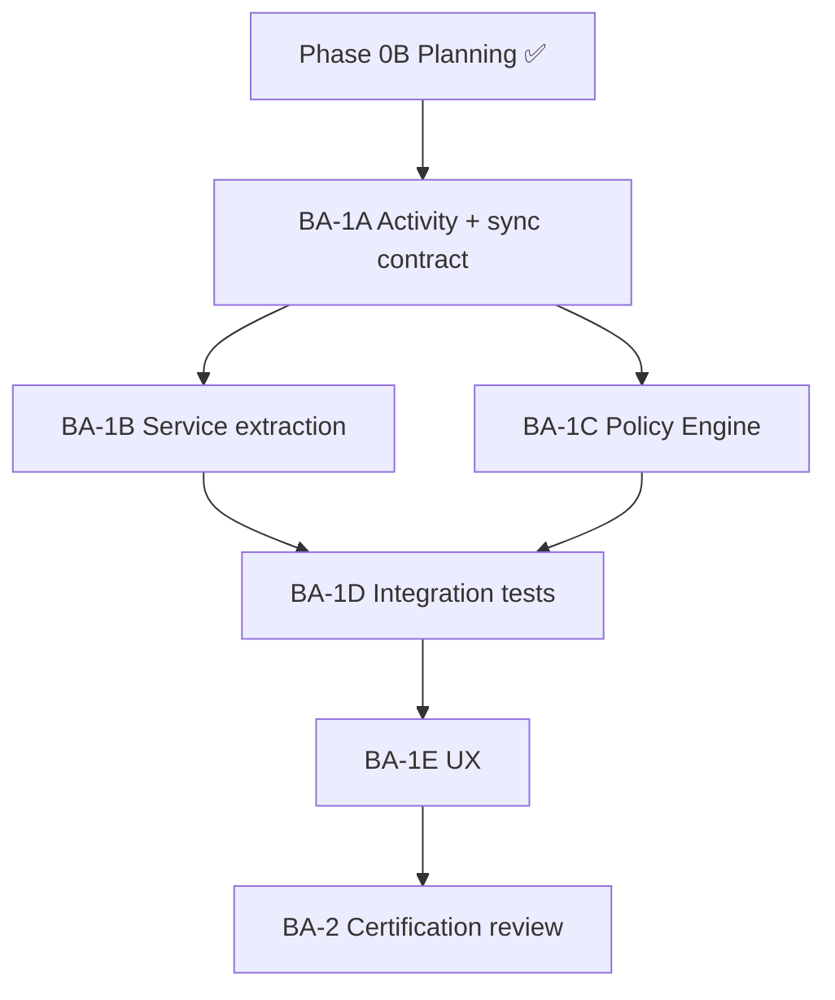

# Business Administration Modernization Roadmap

**Program:** Business Administration Phase 0B — Modernization Planning  
**Date:** 2026-06-18  
**Status:** Planning sequence only — **no implementation in Phase 0B**  
**Constraint:** No code changes; no ledger updates

**Inputs:** Phase 0A assessment + Phase 0B findings register, service blueprint, UX audit, certification framework.

---

## 1. Roadmap purpose

Define the **phased execution sequence** to move Business Administration from **NOT READY (48%)** to **certification review (~93%)**, using Admin Portal and Business Operations program patterns.

**This document authorizes package charters — not implementation.**

---

## 2. Current position

| Milestone | Status |
|-----------|--------|
| Phase 0A — Reality assessment | **Complete** |
| Phase 0B — Certification planning | **Complete** (this program) |
| BA-1 modernization | **Not started** |
| Certification review | **NOT READY** |

### 2.1 Dependency on other programs

| Program | Relationship |
|---------|--------------|
| Business Operations BO-1A | **Soft dependency** — org-chart identity stable today; BA can parallel but BO benefits from BA activity on employee assign |
| Admin Portal | **Complete** — UX patterns to reuse |
| File Hub | **Reference** — service + activity patterns |

**Answer:** Business Operations is **not blocked** by BA modernization start, but **benefits materially** from BA stabilization (activity on `EmployeePosition` changes, permission PE, config sync).

---

## 3. Modernization packages

### BA-1A — Architecture & Activity Foundation

**Goal:** Close BA-F-001 (blocking); establish BA-F-006 server contract.

| Workstream | Deliverable |
|------------|-------------|
| Activity services | `businessActivityService`, `orgChartActivityService` (design → implement) |
| Domain events | `businessDomainEventService`, registry entries `business.*`, `orgchart.*` |
| Taxonomy doc | Activity + notification type catalog |
| Config sync contract | Server WebSocket room `business_{businessId}_config` in `chatSocketService` |
| Wire points | Document hook points in `orgChartService`, `employeeManagementService`, `permissionService` |

**Exit criteria:**
- All BA write paths have activity hook calls in services
- Domain events emitted on structure mutations
- Config broadcast received by `BusinessConfigurationContext` (verified in BA-1D)

**Findings closed:** BA-F-001 (blocking), BA-F-006 (partial)

**Blocks:** BA-1B (activity must exist before extraction moves Prisma)

---

### BA-1B — Service Extraction

**Goal:** Close BA-F-002 (blocking).

| Workstream | Deliverable |
|------------|-------------|
| `businessProfileService` | Read/update/setup |
| `businessBrandingService` | Logo/branding |
| `businessMemberService` | Invite/accept/update/remove |
| `businessBootstrapService` | Create side effects |
| `businessAnalyticsService` | Analytics reads |
| `businessConfigurationService` | JSON config fields |
| Controller thin | `businessController` → 0 Prisma |

**Sequence:** B1→B3→B4→B5→B7 per [SERVICE_DECOMPOSITION_BLUEPRINT](./BUSINESS_ADMINISTRATION_SERVICE_DECOMPOSITION_BLUEPRINT.md) §4.

**Exit criteria:** G3 score 3/3; unit tests per service.

**Can parallel:** Late BA-1C after B3 stable.

---

### BA-1C — Policy Engine Completion

**Goal:** Close BA-F-003 (major).

| Workstream | Deliverable |
|------------|-------------|
| New actions | `orgchart:*`, `business:frontpage.write`, `business:module.install`, `business:webhook.write`, `business:sso.write`, `business:ai.config.write` |
| Middleware | `checkOrgChartPolicy`, route-level `checkBusinessPolicy` |
| Dual adapters | `orgChartPolicyDual.ts`, extend business duals |
| Bootstrap waiver | Document `createBusiness` exception (BA-F-015) |

**Exit criteria:** 100% BA mutation routes have PE dual or documented waiver; G1 score 3/3.

---

### BA-1D — Integration Testing

**Goal:** Close BA-F-004, complete BA-F-006 verification.

| Workstream | Deliverable |
|------------|-------------|
| `business-tenant-scope.integration.test.ts` | Profile/member mutations |
| `business-bootstrap.integration.test.ts` | Create business side effects |
| `business-config-sync.integration.test.ts` | WebSocket config broadcast |
| Extend `org-chart.integration.test.ts` | Permission set + employee assign activity assertions |
| Cross-module contract test | `orgchart.employee.assigned` → HR/scheduling cache doc |

**Exit criteria:** G6 score 3/3; CI green on BA test suite.

---

### BA-1E — UX Modernization

**Goal:** Close BA-F-007; advisory UX (BA-F-013, BA-F-014).

| Workstream | Deliverable |
|------------|-------------|
| `useConfirm` + `ConfirmModal` | 11 native dialog sites |
| `BusinessAdminEmptyState` | 6+ surfaces |
| Token wave 1 | org-chart components |
| Token wave 2 | business config components |
| Settings tab errors | Per-tab isolation |

**Reference:** Admin Portal Stage 1A patterns.

**Exit criteria:** G9 score 3/3; zero native confirm in BA tree.

---

### BA-2 — Certification Review

**Goal:** Formal subdomain L3 review.

| Prerequisite | Status |
|--------------|--------|
| BA-1A–1E complete | Required |
| Findings register | ≤3 open majors or waived |
| Operation matrix in audits/ | BA-F-011 |
| BA-F-005 | Waiver **or** `businessApprovalService` MVP |

**Outcomes:**
- **L3 WITH FINDINGS** (BA-F-005 deferred) — **most likely**
- **L3 CERTIFIED** (approval hierarchy shipped)
- **REFERENCE CANDIDATE** vote — Org Chart + Permissions

---

## 4. Critical path

| Path | Duration class | Blocker |
|------|----------------|---------|
| A → B → D | **Critical** | Activity before extraction |
| C | Parallel after A | Independent of B5 |
| E | After D | Tests guard UX regressions |
| BA-F-005 | **Off critical path** | BA-2 waiver acceptable |

---

## 5. Risk register

| Risk | Likelihood | Impact | Mitigation |
|------|------------|--------|------------|
| `createBusiness` regression | Medium | High | BA-1D bootstrap tests before B7 |
| Org-chart activity volume | Low | Medium | Batch events on bulk import only |
| PE migration breaks legacy middleware | Medium | High | Dual-run period — PE + legacy both pass |
| Config WebSocket scope creep | Medium | Low | Narrow room to config events only |
| BO parallel changes to org-chart | Medium | Medium | Contract tests in BA-1D |

---

## 6. What is explicitly deferred

| Item | Defer to |
|------|----------|
| 7-mount API consolidation | Post BA-2 |
| Global Trash for org entities | BA-2 or BA-3 |
| `businessApprovalService` implementation | BA-2+ |
| Stations editor relocation | BO-1B |
| Analytics module integration | Platform Analytics program |
| Ledger row creation | Council after BA-2 pass |

---

## 7. Recommended first implementation package

# BA-1A — Architecture & Activity Foundation

**Rationale:**
1. Closes **blocking** BA-F-001 — highest certification impact (G2 FAIL → PASS)
2. Unblocks BA-1B service extraction (activity hooks must exist in target services)
3. Establishes config sync contract for BA-F-006
4. Lowest user-visible risk — backend-only foundation
5. Aligns with BO/Scheduling remediation pattern (activity before controller extraction)

**Not first:** BA-1B (depends on A), BA-1E (UX without activity = incomplete constitutional story).

---

## Related documents

- [BUSINESS_ADMINISTRATION_IMPLEMENTATION_SEQUENCE.md](./BUSINESS_ADMINISTRATION_IMPLEMENTATION_SEQUENCE.md)
- [BUSINESS_ADMINISTRATION_EXECUTIVE_SUMMARY_PHASE_0B.md](./BUSINESS_ADMINISTRATION_EXECUTIVE_SUMMARY_PHASE_0B.md)
