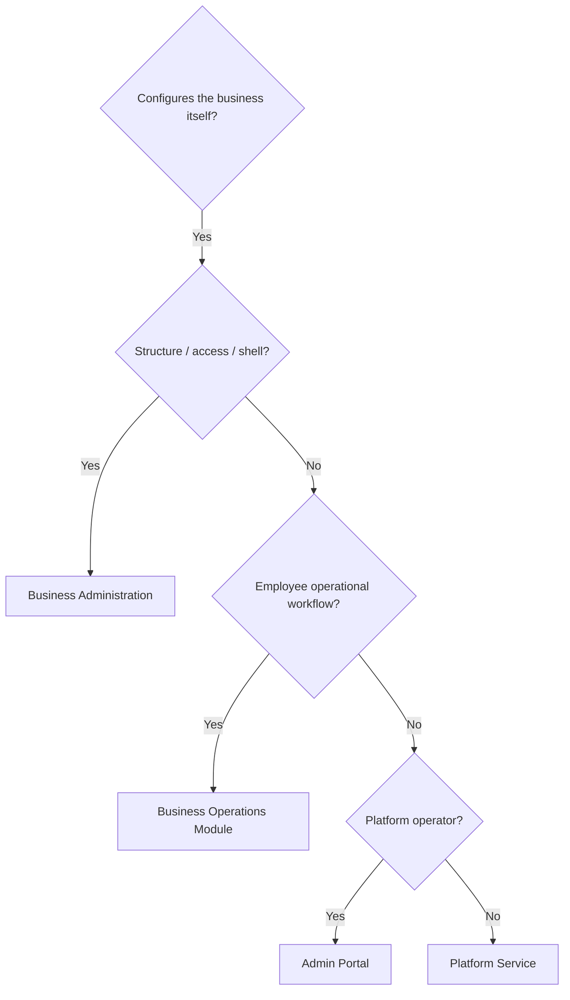

# Business Administration Ownership Model

**Program:** Business Administration Discovery — Phase 0A  
**Date:** 2026-06-18  
**Authority:** Domain ownership for tenant business configuration  
**Constraint:** Planning only — no code changes

**Parent:** [BUSINESS_ADMINISTRATION_REALITY_ASSESSMENT.md](./BUSINESS_ADMINISTRATION_REALITY_ASSESSMENT.md)

---

## 1. Domain definition

**Business Administration** owns **how a business is configured** — identity, structure, access, branding, workspace shell, integrations, and tenant-level AI policy — scoped by `businessId`.

It does **not** own **how employees operate** (shift planning, PTO, broadcasts) — that is [Business Operations](../business-operations/BUSINESS_OPERATIONS_OWNERSHIP_MODEL.md).

It does **not** own **platform operator tooling** — that is Admin Portal.

### 1.1 Runtime identifier

| Concept | Code id | Exists? |
|---------|---------|---------|
| Business Administration domain | — | Documentation/program only |
| Org chart platform | `/api/org-chart` | Yes — primary BA backend |
| Business platform | `/api/business` | Yes |
| Business-front platform | `/api/business-front` | Yes |

---

## 2. Capability ownership matrix

| Capability | Owner | Implementation | Dependencies | Overlap |
|------------|-------|----------------|--------------|---------|
| **Business Profile Management** | **Platform (BA)** | `businessController`, `Business` model | `dashboardService`, auth | Admin Portal views aggregate stats only |
| **Organization Structure** | **Platform (BA)** | `orgChartService`, `org-chart.ts` | `EmployeePosition` identity anchor | HR + Scheduling consume |
| **Departments** | **Platform (BA)** | `Department` model, org-chart routes | Position hierarchy | Scheduling `departmentId` reads |
| **Locations (stations/job sites)** | **Scheduling (BO)** | `schedulingStationService`, `schedulingJobLocationService` | Org chart `Position` station fields | UI in `StationsAndPositionsEditor` under business components |
| **Roles & Permissions** | **Platform (BA)** | `permissionService`, `PermissionSet`, `BusinessMember` roles | Policy Engine partial | Module permissions via `/api/modules` |
| **Labor Rules** | **Split** | `schedulingPhilosophyService` + `AttendancePolicy` | Business `schedulingConfig` JSON | No unified owner |
| **Business Settings** | **Platform (BA)** + modules | `business.ts` update, `workspace/settings` | SSO, webhooks, modules | HR/scheduling tabs in settings UI |
| **Operational Policies** | **HR (BO)** | `HRModuleSettings`, attendance policies | Org chart managers | BA settings UI exposes HR config |
| **Approval Chains** | **HR (intended)** | `ManagerApprovalHierarchy` model only | — | **Unowned in runtime** |
| **Business Templates** | **Split** | Shift/schedule templates (Scheduling); onboarding templates (HR) | — | BO modules |
| **Business Workspace Configuration** | **Platform (BA)** | `businessFrontPageService`, `BusinessConfigurationContext` | Module registry, dashboard | Product modules supply content |
| **Business Analytics** | **Platform (BA)** aggregate + modules | `businessController` analytics; HR/scheduling dashboards | — | Analytics module not started |
| **Business AI Controls** | **Enterprise AI (BA tenant)** | `business-ai` routes, `BusinessAIDigitalTwin` | Admin Portal global AI admin | `/api/admin/business-ai` is AP |
| **Company-Level Preferences** | **Distributed** | `Business.branding`, `aiSettings`, webhooks, front-page customization | — | Platform governance routes separate |

---

## 3. Overlap analysis

### 3.1 vs Admin Portal

| Surface | Admin Portal | Business Administration | Rule |
|---------|--------------|-------------------------|------|
| Business AI global dashboard | `/api/admin/business-ai` | — | AP operates; BA configures per-tenant |
| User impersonation | AP users tool | — | AP only |
| Module marketplace review | AP governance | BA installs approved modules | AP approves; BA consumes |
| Business profile | AP may view aggregates | BA owns CRUD | Tenant admin only |
| Emergency HR ops | `/api/admin/fix-hr` | — | Ops debris — not BA |

**Boundary:** Admin Portal governs the **platform**; Business Administration governs **a tenant business**.

### 3.2 vs Business Operations — HR

| Capability | BA | HR (BO) |
|------------|-----|---------|
| Employee identity anchor | Org chart `EmployeePosition` | `EmployeeHRProfile` extends position |
| Employee HR records | — | HR admin employees API |
| Attendance policies | Settings UI exposure | HR owns data + API |
| HR module settings | — | `GET|PUT /api/hr/admin/settings` |
| Onboarding templates | — | HR owns |
| Manager approval hierarchy | Model in HR schema | **Unwired** — should be HR or BA policy engine |

### 3.3 vs Business Operations — Scheduling

| Capability | BA | Scheduling (BO) |
|------------|-----|-----------------|
| Org positions / departments | BA owns structure | Scheduling reads for assignment |
| Stations / job locations | UI in business components | Scheduling owns API + models |
| Scheduling mode/strategy | `Business.scheduling*` fields updated via business API | `schedulingPhilosophyService` interprets |
| Shift/schedule templates | — | Scheduling owns |
| Labor analytics | Business aggregate analytics page | Scheduling 501 stubs |

### 3.4 vs Business Operations — Workforce Communications

| Capability | BA | WC (BO) |
|------------|-----|---------|
| Front-page announcements | Legacy `companyAnnouncements` + front-page widgets | WC migration target |
| Audience targeting | Permission sets + departments | WC `workforceAudienceService` |
| Broadcast content | Front-page editor | WC owns operational comms |

**Rule:** BA configures **structure and shell**; WC operates **workforce messaging**.

---

## 4. Shared services

| Service | Class | Consumers |
|---------|-------|-----------|
| `orgChartService` | **BA platform** | HR, Scheduling, WC audience, permissions |
| `permissionService` | **BA platform** | All business modules |
| `employeeManagementService` | **BA platform** | HR onboarding, scheduling assignment |
| `hrScheduleService` | **Shared bridge** | Scheduling + Calendar (named HR — shared) |
| `businessFrontPageService` | **BA platform** | Workspace hub |
| `dashboardService` | **Platform** | Business + personal contexts |
| `BusinessConfigurationContext` | **BA frontend aggregator** | Work tab sync (planned) |

---

## 5. Enforcement model (current vs target)

| Layer | Current | Target (planning) |
|-------|---------|-------------------|
| Tenant scope | `businessId` on all routes | Maintain |
| Auth | JWT + `BusinessMember` roles + org-chart middleware | Maintain |
| Policy Engine | `BUSINESS_UPDATE`, `BUSINESS_MEMBER_*` on some paths; org-chart uses custom middleware | Full PE dual on org-chart writes |
| Service boundaries | Org-chart thin; business fat | Extract `businessProfileService`, `businessMemberService`, `businessAnalyticsService` |
| Activity | None for BA mutations | `orgChartActivityService`, `businessActivityService` |
| Global Trash | Hard delete positions/departments | `trashedAt` + handlers |
| Manifest | None | Platform subdomain descriptor (not marketplace module) |

### 5.1 Ownership decision tree

---

## 6. Ownership violations (current)

| Violation | Severity | Evidence |
|-----------|----------|----------|
| Stations/locations UI under `components/business/` but API owned by Scheduling | Advisory | `StationsAndPositionsEditor.tsx` → scheduling API |
| Scheduling config on `Business` model updated via `businessController` | Advisory | Cross-domain field ownership |
| `ManagerApprovalHierarchy` in HR schema with no owner runtime | Major | Zero server references |
| Front-page announcements parallel to WC | Advisory | Migration in progress |
| Business analytics conflated with module analytics | Advisory | Single page, multiple backends |

---

## 7. Related documents

- [BUSINESS_ADMINISTRATION_BOUNDARY_ANALYSIS.md](./BUSINESS_ADMINISTRATION_BOUNDARY_ANALYSIS.md)
- [BUSINESS_OPERATIONS_OWNERSHIP_MODEL.md](../business-operations/BUSINESS_OPERATIONS_OWNERSHIP_MODEL.md)
- [ADMIN_PORTAL_OWNERSHIP_BOUNDARY_ANALYSIS.md](../architecture/audits/ADMIN_PORTAL_OWNERSHIP_BOUNDARY_ANALYSIS.md)
