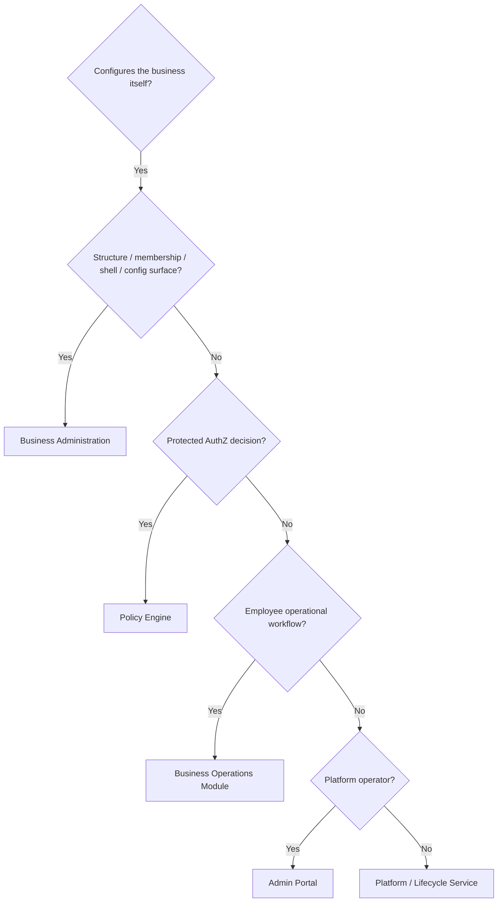

# Business Administration Ownership Model

**Program:** Business Administration  
**Authority:** Domain ownership for tenant business configuration  
**Status:** Living ownership model  
**Last updated:** 2026-09-08 (Phase 2 — business participant authority reconciliation)

**Parent / status:** [BUSINESS_ADMINISTRATION_REFERENCE_STATUS_RECORD.md](./BUSINESS_ADMINISTRATION_REFERENCE_STATUS_RECORD.md)  
**Participant composition:** [`../architecture/BUSINESS_PARTICIPANT_COMPOSITION.md`](../architecture/BUSINESS_PARTICIPANT_COMPOSITION.md)  
**AuthZ:** [`../architecture/POLICY_ENGINE.md`](../architecture/POLICY_ENGINE.md)

---

## 1. Domain definition

**Business Administration** owns **how a business is configured** — identity/profile, organizational structure, membership administration (where established), branding, workspace shell, integrations, and tenant-level configuration surfaces — scoped by `businessId`.

It does **not** own **how employees operate day-to-day** (shift planning, PTO, broadcasts) — that is [Business Operations](../business-operations/BUSINESS_OPERATIONS_OWNERSHIP_MODEL.md).

It does **not** own **platform operator tooling** — that is Admin Portal.

It does **not** own **protected authorization decisions** — that is the [Policy Engine](../architecture/POLICY_ENGINE.md) (canonical AuthZ direction). BA may expose **configuration surfaces** for access/policy without becoming a parallel authorization engine.

### 1.1 Runtime identifier

| Concept | Code id | Exists? |
|---------|---------|---------|
| Business Administration domain | — | Documentation/program |
| Org chart platform | `/api/org-chart` | Yes — primary BA structure backend |
| Business platform | `/api/business` | Yes |
| Business-front platform | `/api/business-front` | Yes |

---

## 2. What BA owns vs does not own

### Owns

| Capability | Notes |
|------------|-------|
| Business profile / branding / tenant identity metadata | Internal business identity |
| Organizational structure | `OrganizationalTier`, `Department`, `Position`, reporting (`reportsTo`) |
| Workforce placement assignment | `EmployeePosition` writes via `employeeManagementService` |
| Business membership administration | Where current ownership establishes invite/update/remove (Members boundary) |
| Workspace shell / front-page configuration | Presentation shell for the business |
| Access/policy **configuration surfaces** | UI for tenant admins; end-state AuthZ remains PE |

### Does not own

| Concern | Owner |
|---------|-------|
| Platform identity (`User`) | Auth / Account |
| HR employment truth | HR (`EmployeeHRProfile`, PTO, attendance, onboarding) |
| Domain operational records | Owning applications (Scheduling, WC, Drive, …) |
| Application installation lifecycle | [`APPLICATION_LIFECYCLE.md`](../architecture/APPLICATION_LIFECYCLE.md) |
| Protected AuthZ decisions | Policy Engine |
| Role-aware experience / Dashboard personalization product logic | Future product/UX work; presentation consumers only |
| Stations / job locations (ops sites) | Scheduling (BA UI may host editors) |

---

## 3. Capability ownership matrix

| Capability | Owner | Implementation | Dependencies | Overlap / notes |
|------------|-------|----------------|--------------|-----------------|
| **Business Profile Management** | **BA** | `businessController`, `Business` model | Auth, dashboards | Admin Portal aggregates only |
| **Organization Structure** | **BA** | `orgChartService`, `/api/org-chart` | `EmployeePosition` as placement anchor | HR + Scheduling + WC consume |
| **Departments** | **BA** | `Department` model, org-chart routes | Position hierarchy | Scheduling may read department ids |
| **Workforce placement** | **BA** (writes) | `employeeManagementService` | Membership recommended; not required for all participants | HR extends with profile |
| **Locations (stations/job sites)** | **Scheduling (BO)** | scheduling location/station services | Position station fields | UI may live under business components |
| **Business membership / BusinessRole** | **BA / Members** | `BusinessMember`, member APIs | PE for protected member actions | Coarse role ≠ org position |
| **Access configuration surface** | **BA (surface)** | PermissionManager / related UI | — | Must not permanently own parallel AuthZ |
| **Org JSON / permissionService RBAC** | **Transitional** | `permissionService`, Position/Tier/Department JSON | Documented deprecation toward PE | Not competing permanent AuthZ |
| **Labor Rules** | **Split** | scheduling philosophy + attendance policies | Business scheduling config | No unified BA owner |
| **Business Settings** | **BA** + modules | business update, workspace settings | SSO, webhooks, modules | Module tabs may embed ops config |
| **Operational Policies** | **HR / Scheduling (BO)** | module settings/policies | Org managers as consumers | BA settings may expose links |
| **Approval Chains** | **BA API surface + HR schema** | `ManagerApprovalHierarchy`, `approvalHierarchyService`, `/api/org-chart/approval-hierarchy/*` | PE dual on writes | **API implemented; no dedicated admin UI** (see §6) |
| **Business Templates** | **Split** | Scheduling / HR templates | — | BO modules |
| **Business Workspace Configuration** | **BA** | front-page service, `BusinessConfigurationContext` | Module registry | BCC maps are **presentation**, not AuthZ |
| **Business Analytics** | **BA aggregate** + modules | business analytics surfaces | Module dashboards | Analytics capability separate |
| **Business AI Controls** | **BA tenant** | business-ai routes | Admin Portal global AI | AP vs BA boundary |
| **Application install** | **Application lifecycle** | `BusinessModuleInstallation` | PE for install/uninstall | Org `assignedModules` ≠ install authority |

---

## 4. Overlap analysis

### 4.1 vs Admin Portal

| Surface | Admin Portal | Business Administration | Rule |
|---------|--------------|-------------------------|------|
| Business AI global dashboard | `/api/admin/business-ai` | — | AP operates; BA configures per-tenant |
| User impersonation | AP users tool | — | AP only |
| Module marketplace review | AP governance | BA installs approved modules | AP approves; BA consumes |
| Business profile | AP may view aggregates | BA owns CRUD | Tenant admin only |

**Boundary:** Admin Portal governs the **platform**; Business Administration governs **a tenant business**.

### 4.2 vs Business Operations — HR

| Capability | BA | HR (BO) |
|------------|-----|---------|
| Workforce placement anchor | Org chart `EmployeePosition` | Consumes; does not own EP writes |
| Employee HR records | — | `EmployeeHRProfile` + HR APIs |
| Attendance / PTO / onboarding | Settings exposure only | HR owns |
| Approval hierarchy persistence | Org-chart API host | Model in HR schema; workflows may consume |

**Membership without placement is valid** for Business participants. HR/Scheduling “employee” features that require placement remain placement-gated. See [`BUSINESS_PARTICIPANT_COMPOSITION.md`](../architecture/BUSINESS_PARTICIPANT_COMPOSITION.md).

### 4.3 vs Business Operations — Scheduling

| Capability | BA | Scheduling (BO) |
|------------|-----|-----------------|
| Org positions / departments | BA owns structure | Reads for assignment |
| Stations / job locations | Optional UI host | Owns API + models |
| Scheduling mode/strategy | Fields on `Business` via business API | Interprets operationally |

### 4.4 vs Business Operations — Workforce Communications

| Capability | BA | WC (BO) |
|------------|-----|---------|
| Front-page shell | BA | — |
| Audience targeting | Consumes org facts | `workforceAudienceService` owns targeting |
| Broadcast content | — | WC owns operational comms |

**Rule:** BA configures **structure and shell**; WC operates **workforce messaging**.

### 4.5 vs Policy Engine

| Concern | BA | PE |
|---------|----|----|
| Structure / membership facts | Owns configuration & persistence | May **consume** as explicit policy inputs |
| Org JSON permission inheritance | Transitional parallel path | Must not remain permanent competitor |
| Protected decisions | Configuration surface only | Canonical AuthZ owner |

---

## 5. Shared services

| Service | Class | Consumers |
|---------|-------|-----------|
| `orgChartService` | **BA platform** | HR, Scheduling, WC audience, front-page |
| `employeeManagementService` | **BA platform** (EP write authority) | HR onboarding, scheduling assignment |
| `permissionService` | **Transitional BA RBAC** | Org-chart routes, front-page `requiredPermission` — migrate toward PE |
| `approvalHierarchyService` | **BA-hosted API** | Approval resolve/validate consumers |
| `businessFrontPageService` | **BA platform** | Workspace hub |
| `businessMemberService` / member controllers | **BA / Members** | Membership lifecycle |
| `BusinessConfigurationContext` | **BA frontend aggregator** | Presentation / workspace chrome — **not** AuthZ |
| `dashboardService` | **Platform** | Business + personal contexts |

---

## 6. Approval hierarchy (corrected)

**Prior planning text claimed approval hierarchy was unwired / unowned.** Implementation and tests supersede that claim.

| Layer | Status |
|-------|--------|
| Persistence | `ManagerApprovalHierarchy` in HR schema |
| Service / routes | `approvalHierarchyService` + `/api/org-chart/approval-hierarchy/*` |
| AuthZ | PE dual for approval-hierarchy actions (membership/role — not hierarchy edges as PE facts) |
| Admin UI | **Not present** — API-only configuration today |

Approval authority answers **“who approves this workflow?”** — not automatically “who is the people manager?” or “who administers the business.” See participant composition manager table.

---

## 7. Enforcement model (current vs target)

| Layer | Current | Target |
|-------|---------|--------|
| Tenant scope | `businessId` on routes | Maintain |
| Membership / structure AuthZ | Legacy middleware + PE dual | PE primary; remove dual when parity proven |
| Org JSON RBAC (`permissionService`) | Parallel / transitional | Deprecate as AuthZ; PE or domain policies |
| Presentation maps (BCC) | Empty/partial UI maps | Remain presentation-only |
| Activity / domain events | Org-chart activity + domain events | Maintain |
| Global Trash | Hard delete for many org entities | Soft-delete where platform requires |

### 7.1 Ownership decision tree

---

## 8. Known ownership / presentation issues (documentation)

| Issue | Severity | Notes |
|-------|----------|-------|
| Stations/locations UI under business components; API owned by Scheduling | Advisory | Host surface ≠ domain owner |
| Dual member API surfaces (`/api/business/.../members`, `/api/member`) | Transitional | Same membership concept |
| Org Admin UI↔API field mismatches (assignment/reporting) | Implementation gap | Documented in Phase 1 audit — fix outside ownership docs |
| `permissionService` as parallel AuthZ | Transitional | Do not expand |
| Hard delete of org structure entities | Debt | Global Trash alignment |

---

## 9. Product intent — business identity & branding

- BA owns **internal tenant business identity**: name, description, contact/metadata, branding.  
- **Members** owns participation roster semantics (who belongs). Membership ≠ employment ≠ org placement.  
- **Place** owns public publisher / listing surfaces — not internal tenant identity SoT.  
- Platform Admin may view aggregates; it does not replace tenant BA profile ownership.

Historical Memory Bank body (non-authoritative): [`../archive/session-summaries/businessProfileManagement-archive-2026-09.md`](../archive/session-summaries/businessProfileManagement-archive-2026-09.md)

---

## 10. Related documents

- [`BUSINESS_PARTICIPANT_COMPOSITION.md`](../architecture/BUSINESS_PARTICIPANT_COMPOSITION.md)
- [BUSINESS_ADMINISTRATION_BOUNDARY_ANALYSIS.md](./BUSINESS_ADMINISTRATION_BOUNDARY_ANALYSIS.md)
- [BUSINESS_OPERATIONS_OWNERSHIP_MODEL.md](../business-operations/BUSINESS_OPERATIONS_OWNERSHIP_MODEL.md)
- [HR_ORG_CHART_BOUNDARY_ANALYSIS.md](../business-operations/HR_ORG_CHART_BOUNDARY_ANALYSIS.md)
- [WORKFORCE_IDENTITY_ARCHITECTURE.md](../business-operations/WORKFORCE_IDENTITY_ARCHITECTURE.md)
- [`POLICY_ENGINE.md`](../architecture/POLICY_ENGINE.md)
- [`APPLICATION_LIFECYCLE.md`](../architecture/APPLICATION_LIFECYCLE.md)
