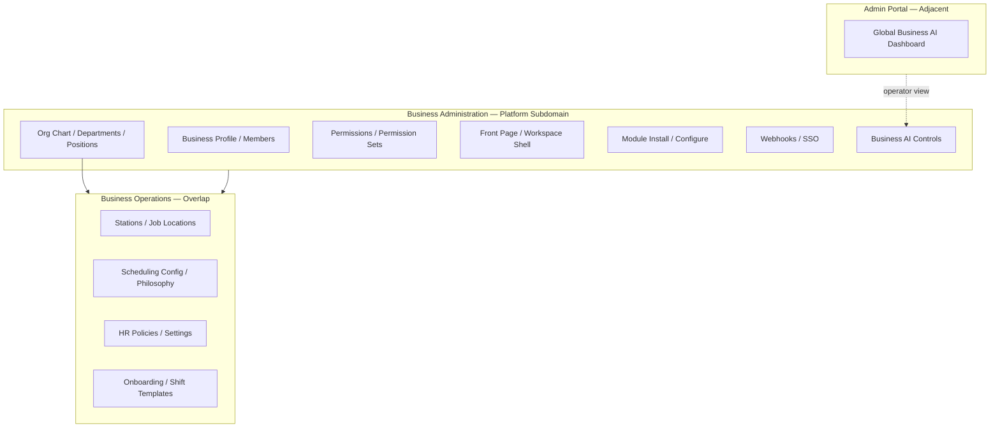

# Business Administration Reality Assessment

**Program:** Business Administration Discovery — Phase 0A  
**Status:** Complete — discovery and assessment only  
**Date:** 2026-06-18  
**Constraint:** No code changes. No modernization plans. No certification award. No ledger updates.

**Related completed programs:** Admin Portal (control plane), Business Operations (`scheduling`, `hr`, `workforce_comms`).

---

## Required answers

| # | Question | Answer |
|---|----------|--------|
| 1 | Does Business Administration exist as a distinct domain? | **Yes — as an emerging platform subdomain**, not a runtime module. See §2. |
| 2 | Part of Admin Portal? | **No** — tenant-scoped business workspace; different auth and mount tree. |
| 3 | Part of Business Operations? | **Partial overlap** — stations, scheduling config, HR policies live in BO modules. |
| 4 | Standalone platform domain? | **Partial** — core cluster exists (org-chart, business profile, permissions, front-page) but incomplete. |
| 5 | Merely scattered settings? | **Partial** — workspace settings UI aggregates many sources without unified backend domain. |
| 6 | Is it modernized? | **No** — functional but pre-File-Hub patterns on business controller; no domain certification. |
| 7 | Requires own modernization program? | **Yes** — after BO program; highest gaps on service boundaries, PE coverage, documentation, UX. |
| 8 | Certification candidate? | **Conditional** — platform subdomain certification, not module L3. **NOT READY** today. |

---

## 0. Scope and method

### 0.1 Investigated

- Backend: `business.ts`, `org-chart.ts`, `businessAI.ts`, `businessFrontPage.ts`, `module.ts`, `webhookSubscriptions.ts`, `sso.ts`, `member.ts`, `adminBusinessAI.ts`
- Services: `orgChartService`, `permissionService`, `employeeManagementService`, `businessFrontPageService`, `businessWorkspaceSeeder`, `BusinessAIDigitalTwinService`
- Controllers: `businessController.ts`, inline org-chart route handlers
- Prisma: `prisma/modules/business/*`, `prisma/modules/ai/enterprise-ai.prisma`
- Frontend: `web/src/app/business/[id]/**`, `web/src/components/business/**`, `web/src/components/org-chart/**`, `BusinessConfigurationContext.tsx`
- Cross-reference: Admin Portal boundary docs, Business Operations ownership model

### 0.2 Explicitly out of scope (owned elsewhere)

| Surface | Owner |
|---------|-------|
| `/api/scheduling/admin/*` stations, job locations, templates | Business Operations — Scheduling |
| `/api/hr/admin/*` settings, attendance policies, onboarding templates | Business Operations — HR |
| `/api/admin-portal/*`, `/api/admin/business-ai/*` | Admin Portal — platform operator |
| Module workspace interiors (`/workspace/drive`, `chat`, etc.) | Product modules |

### 0.3 Evidence confidence

| Label | Meaning |
|-------|---------|
| **Confirmed** | Direct route/file evidence |
| **Inferred** | Structural conclusion |
| **UNKNOWN** | Requires runtime verification |

---

## 1. What Business Administration is today

Business Administration is the **tenant-scoped configuration plane** for how a business is structured, branded, permissioned, and equipped — distinct from **how employees operate** (Business Operations) and **how platform operators govern** (Admin Portal).

It is implemented as a **platform subdomain cluster** without a `business_administration` module id, manifest, or workspace landing.

### 1.1 Core cluster (Business Administration-owned)

| Subdomain | API mount | Primary UI |
|-----------|-----------|------------|
| Business profile & members | `/api/business` | `/business/[id]/profile`, `workspace/members` |
| Organization structure | `/api/org-chart` | `/business/[id]/org-chart` |
| Permissions & roles | `/api/org-chart` (permissions) + `/api/member` | `PermissionManager.tsx` |
| Front page / workspace shell | `/api/business-front` | `BusinessFrontPage.tsx`, layout designer |
| Module install/configure | `/api/modules` | `workspace/modules`, `workspace/settings` |
| Webhooks & SSO | `/api/business` + `/api/sso` | `workspace/settings/webhooks` |
| Business AI controls | `/api/business-ai` | `BusinessAIControlCenter.tsx`, `workspace/ai` |
| Branding | `/api/business` (update/logo) | `/branding`, `GlobalBrandingEditor.tsx` |

### 1.2 Scale (re-verified 2026-06-18)

| Layer | Core BA | Notes |
|-------|---------|-------|
| Express route handlers (core) | **109** | See §3 breakdown |
| Adjacent handlers (member social, admin business-ai) | **27** | Partially BA-overlapping |
| Services (direct) | **8** | Plus `dashboardService`, AI enterprise layer |
| Controllers | **1 fat** + **inline org-chart routes** | No `orgChartController` |
| Prisma models (business module folder) | **~35** | Across 7 prisma module files |
| Frontend pages (`/business/[id]/`) | **41** total; **~14 config/admin** | Remainder are module workspace |
| Components | **22** business + **5** org-chart | |
| Hooks / context | **2** + `BusinessConfigurationContext` | ~1,050 LOC context |
| API client exports | **~70+** | `orgChart.ts` (35), `business.ts` (18), modules, webhooks, SSO, workspaceAI |

---

## 2. Domain boundary verdict

### 2.1 Option evaluation

| Option | Verdict | Evidence |
|--------|---------|----------|
| **A. Part of Admin Portal** | **Rejected** | Admin Portal boundary doc: "Business admin — No" at `/business/[id]/admin/*`. Platform operator uses `/api/admin/business-ai`; tenant uses `/api/business-ai`. |
| **B. Part of Business Operations** | **Partial only** | BO owns employee operations. Overlap: `StationsAndPositionsEditor`, `SchedulingConfiguration`, HR attendance policies, onboarding templates — configuration bleed, not BO core. |
| **C. Standalone platform domain** | **Selected (emerging)** | Coherent API cluster: business + org-chart + front-page + modules + business-ai. No module wrapper. |
| **D. Scattered settings screens** | **Also true** | `workspace/settings/page.tsx` tabs aggregate profile, billing, scheduling, notifications from multiple backends. |

### 2.2 Classification

**Business Administration = Emerging Platform Domain (Type C) with Scattered Settings UX (Type D)**

**Not a product module:** No entry in `registerBuiltInModules.ts`; no `emitModuleActivityEvent` for org-chart mutations; no Global Trash handlers for `Position`/`Department`.

---

## 3. Route inventory

### 3.1 Core Business Administration routes

| Mount | File | Handlers | Owner class |
|-------|------|----------|-------------|
| `/api/business` | `business.ts` | **19** | Platform — business profile |
| `/api/org-chart` | `org-chart.ts` | **38** | Platform — org structure |
| `/api/business-front` | `businessFrontPage.ts` | **14** | Platform — workspace shell |
| `/api/business-ai` | `businessAI.ts` | **9** | Enterprise AI — tenant controls |
| `/api/modules` | `module.ts` | **17** | Platform — module lifecycle |
| `/api/business` (webhooks) | `webhookSubscriptions.ts` | **5** | Platform — integrations |
| `/api/sso` | `sso.ts` | **7** | Platform — enterprise SSO |
| **Subtotal** | | **109** | |

### 3.2 Partially overlapping routes

| Mount | Handlers | BA relevance |
|-------|----------|--------------|
| `/api/member` | **22** | ~10 for business member roles/invites; remainder social graph |
| `/api/admin/business-ai` | **5** | **Admin Portal** — not BA |

### 3.3 Capability mapping (candidate responsibilities)

| Capability | Routes | Status |
|------------|--------|--------|
| Business Profile Management | `business.ts` CRUD, logo, members, analytics | **Implemented** |
| Organization Structure | `org-chart.ts` tiers, positions, employees | **Implemented** |
| Departments | `org-chart.ts` department CRUD | **Implemented** |
| Locations | `scheduling.ts` stations/job-locations | **BO overlap** — Scheduling-owned |
| Roles & Permissions | org-chart permissions + `member.ts` roles | **Implemented** |
| Labor Rules | `schedulingPhilosophyService`, HR attendance policies | **Split** — no unified labor-rules API |
| Business Settings | `business.ts` update + workspace settings UI | **Partial** — aggregated UI |
| Operational Policies | HR `admin/settings`, attendance policies | **BO overlap** |
| Approval Chains | — | **NOT PRESENT** — model only (`ManagerApprovalHierarchy` — zero server refs) |
| Business Templates | Scheduling + HR onboarding templates | **BO overlap** |
| Business Workspace Configuration | `business-front`, `BusinessConfigurationContext` | **Implemented** — sync incomplete |
| Business Analytics | `business.ts` analytics + workspace analytics page | **Partial** |
| Business AI Controls | `business-ai` + `BusinessAIControlCenter` | **Implemented** |
| Company-Level Preferences | Business JSON fields, front-page customization, webhooks | **Distributed** |

---

## 4. Service and controller inventory

### 4.1 Services

| Service | LOC class | Prisma | Pattern |
|---------|-----------|--------|---------|
| `orgChartService.ts` | Large | Yes | Entity service |
| `employeeManagementService.ts` | Large | Yes | Workflow service |
| `permissionService.ts` | Medium | Yes | Catalog service |
| `businessFrontPageService.ts` | Medium | Yes | Config service |
| `businessWorkspaceSeeder.ts` | Small | Yes | Bootstrap |
| `dashboardService.ts` | Medium | Yes | Platform context |
| `BusinessAIDigitalTwinService.ts` | Large | Yes | Enterprise AI |
| `schedulingStationService.ts` | — | Yes | **BO** — not BA |

### 4.2 Controllers / route handlers

| Surface | Pattern | Prisma in handler layer | Verdict |
|---------|---------|-------------------------|---------|
| `org-chart.ts` | Inline routes → services | **0** | **Thin routes** (File Hub-adjacent) |
| `businessController.ts` | 18 handlers | **56 calls** | **Fat controller** |
| `businessAI.ts` | Route → service | Low | Acceptable |
| `businessFrontPage.ts` | Route → service | Low | Acceptable |

---

## 5. Frontend inventory

### 5.1 Configuration pages (BA-primary)

| Path | Purpose |
|------|---------|
| `/business/[id]/profile` | Profile, members, analytics |
| `/business/[id]/branding` | Global branding |
| `/business/[id]/org-chart` | Org structure builder |
| `/business/[id]/workspace/settings` | Multi-tab settings hub |
| `/business/[id]/workspace/settings/webhooks` | Webhook management |
| `/business/[id]/workspace/members` | Member management |
| `/business/[id]/workspace/modules` | Module install |
| `/business/[id]/workspace/analytics` | Business analytics |
| `/business/[id]/ai` | Business AI (legacy path) |
| `/business/[id]/workspace/ai` | AI workspace landing |
| `/business/create` | Business creation |

### 5.2 Legacy `/admin/**` subtree (thin — 7 pages)

Mostly **Business Operations** HR admin; scheduling redirects to workspace. Not the primary BA surface.

### 5.3 Key components

| Component | Capability |
|-----------|------------|
| `OrgChartBuilder.tsx`, `EmployeeManager.tsx` | Organization structure |
| `PermissionManager.tsx` | Roles & permissions |
| `BusinessFrontPage.tsx`, `FrontPageLayoutDesigner.tsx` | Workspace configuration |
| `GlobalBrandingEditor.tsx` | Branding |
| `SchedulingConfiguration.tsx`, `StationsAndPositionsEditor.tsx` | **BO overlap** |
| `BusinessAIControlCenter.tsx` | Business AI controls |
| `BusinessConfigurationContext.tsx` | Aggregated config state |

### 5.4 Hooks and API clients

| Asset | Exports / role |
|-------|----------------|
| `useBusinessConfiguration` | Central config context |
| `useEnsureBusinessDashboard.ts` | Dashboard bootstrap |
| `api/orgChart.ts` | **35** functions |
| `api/business.ts` | **18** functions |
| `api/modules.ts`, `webhookSubscriptions.ts`, `sso.ts`, `workspaceAI.ts` | Integration clients |

---

## 6. AI integrations

| Surface | Type | Owner |
|---------|------|-------|
| `POST/GET /api/business-ai/:businessId/*` | Config, interact, learning events, analytics | Tenant BA |
| `GET /api/admin/business-ai/*` | Global patterns, enable/disable learning | **Admin Portal** |
| `BusinessAIControlCenter.tsx` | Business admin UI | BA |
| `BusinessAIGlobalDashboard.tsx` | Platform operator UI | Admin Portal |
| Module AI context (HR, scheduling) | Read providers | Business Operations |
| `workspaceAIPolicyDigest.ts`, `businessWorkspaceBoundaries.ts` | AI governance helpers | Enterprise AI layer |

**No unified BA AI control plane** — tenant business-ai is separate from Admin Portal AI Pipeline (correct boundary).

---

## 7. Maturity summary

| Layer | Maturity | Headline |
|-------|----------|----------|
| Operational | **MEDIUM** | Org chart, permissions, profile, front-page, module install work |
| Architectural | **LOW–MEDIUM** | Fat `businessController`; fragmented mounts; no BA activity/trash |
| UX | **LOW–MEDIUM** | Functional admin UIs; native confirm; settings aggregation |
| Integration | **MEDIUM** | `BusinessConfigurationContext` exists; real-time sync **incomplete** per memory-bank |
| Test evidence | **LOW** | 1 org-chart integration test; no business route tests |
| Documentation | **LOW** | No BA operation matrix; partial memory-bank only |

---

## 8. Gaps (confirmed)

| Gap | Evidence |
|-----|----------|
| No runtime module id / manifest | `registerBuiltInModules.ts` — no BA entry |
| Approval chains unwired | `ManagerApprovalHierarchy` in Prisma; **0** server references |
| Labor rules fragmented | No `LaborRule` model; scheduling philosophy + HR policies separate |
| Fat business controller | 56 `prisma.` calls |
| No normalized activity for org-chart mutations | No `orgChartActivityService` |
| No Global Trash for org entities | Hard deletes on positions/departments |
| Config real-time sync incomplete | Known issue (historical product note archived: `docs/archive/session-summaries/business-workspace/businessWorkspaceArchitecture.md`); current owners: `APPLICATION_LIFECYCLE.md`, `WORKSPACE_ROUTING_CONTRACT.md` |
| `/admin/**` vs `/workspace/**` split | Confusing IA; HR admin under legacy path |

---

## 9. Related documents

| Document | Role |
|----------|------|
| [BUSINESS_ADMINISTRATION_OWNERSHIP_MODEL.md](./BUSINESS_ADMINISTRATION_OWNERSHIP_MODEL.md) | Ownership enforcement |
| [BUSINESS_ADMINISTRATION_BOUNDARY_ANALYSIS.md](./BUSINESS_ADMINISTRATION_BOUNDARY_ANALYSIS.md) | Cross-program boundaries |
| [BUSINESS_ADMINISTRATION_OPERATION_MATRIX.md](./BUSINESS_ADMINISTRATION_OPERATION_MATRIX.md) | Operation-level evidence |
| [BUSINESS_ADMINISTRATION_CERTIFICATION_READINESS.md](./BUSINESS_ADMINISTRATION_CERTIFICATION_READINESS.md) | G1–G9 scoring |
| [BUSINESS_ADMINISTRATION_EXECUTIVE_SUMMARY.md](./BUSINESS_ADMINISTRATION_EXECUTIVE_SUMMARY.md) | Executive entry |

---

**Phase 0A complete.** Recommended next program: **Business Administration Phase 0B — Certification Planning & Modernization Prerequisites** (assessment only until authorized).
