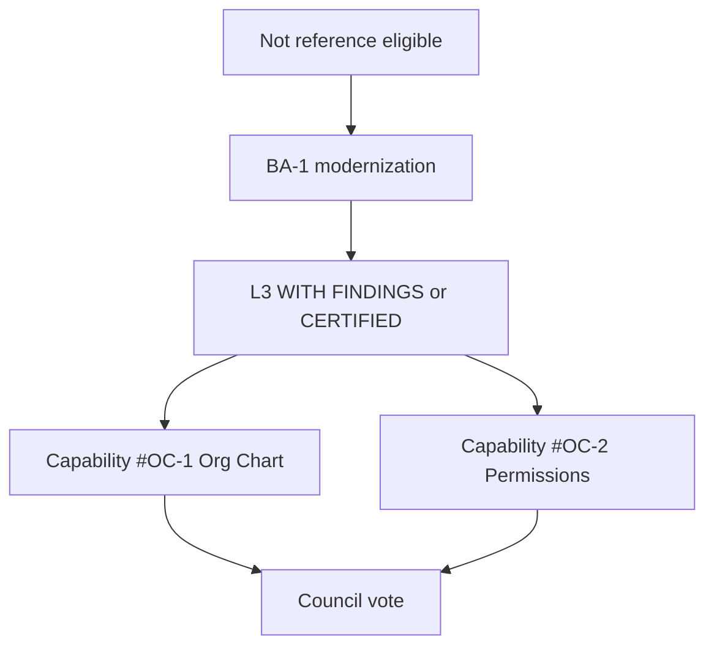

# Business Administration Reference Assessment

**Program:** Business Administration Phase 0B — Reference Candidacy  
**Date:** 2026-06-18  
**Constraint:** Assessment only — no designation awarded

**Parent:** [BUSINESS_ADMINISTRATION_REALITY_ASSESSMENT.md](./BUSINESS_ADMINISTRATION_REALITY_ASSESSMENT.md)

---

## 1. Reference taxonomy

| Designation | BA eligibility today | Post BA-1 |
|-------------|---------------------|-----------|
| **Reference Implementation (L4)** | **No** | **No** — File Hub only |
| **Reference Module** | **No** — not a module | **No** |
| **Reference Platform Capability** | **Candidate** — Org Chart + Permissions | **Strong candidate** |
| **Reference Domain** | **No** | **No** — BO is domain reference candidate |
| **REFERENCE CANDIDATE (subset)** | **Conditional** | **Yes** — council vote after L3 |

---

## 2. Subdomain reference evaluation

### 2.1 Org Chart (structure + identity)

| Criterion | Today | Post BA-1 |
|-----------|-------|-----------|
| Teaching value | **High** — workforce identity anchor for entire platform | **Higher** with activity + events |
| Service boundaries | **Good** — thin routes, named services | **Excellent** |
| Constitutional compliance | **Low** — no activity, no PE, no trash | **L3 bar** |
| Test evidence | **Partial** — 1 integration file | **Strong** |
| UX reference | **Low** — token + confirm debt | **Medium** |

**Verdict:** **Strongest BA reference candidate.** Teaches: multi-module identity hub, `EmployeePosition` as extension point, tier/department/position hierarchy.

**Reference label (proposed):** **Reference Platform Capability #OC-1 — Workforce Identity & Structure**

---

### 2.2 Permissions (catalog + permission sets)

| Criterion | Today | Post BA-1 |
|-----------|-------|-----------|
| Teaching value | **High** — module access gating across platform | **Higher** with PE |
| Implementation | `permissionService` + `PermissionManager.tsx` | + activity on set changes |
| Overlap with Policy Engine | Partial — catalog vs PE actions | Clear dual layer post BA-1C |
| UX | **Low** — native confirm on delete | **Medium** post BA-1E |

**Verdict:** **Reference Platform Capability candidate #OC-2 — Business Permission Sets**

Pairs with Org Chart — not standalone module reference.

---

### 2.3 Approval Hierarchy

| Criterion | Today | Post BA-1 |
|-----------|-------|-----------|
| Model | Exists in Prisma | Unchanged if deferred |
| Runtime | **None** | MVP in BA-2 optional |
| Teaching value | **High potential** — cross-module approval | **Blocked** until wired |

**Verdict:** **Not a reference candidate until implemented.** Do not market as BA capability in certification materials until BA-F-005 closed.

---

### 2.4 Business Configuration (profile, branding, workspace shell)

| Criterion | Today | Post BA-1 |
|-----------|-------|-----------|
| Cohesion | **Low** — fat controller, scattered settings | **Medium** post extraction |
| `BusinessConfigurationContext` | **Innovative** — cross-surface sync intent | **Complete** post sync |
| Front page | Functional designer | + activity + UX |
| Reference value | **Medium** — workspace bootstrap pattern | **High** post BA-1 |

**Verdict:** **Supporting reference material** for Business Workspace program — not independent reference capability.

**Reference label (proposed):** **WS-L1 annex — Business Configuration Shell** (documentation cross-link, not new ledger row in BA-1).

---

## 3. Comparison to certified peers

| Capability | File Hub | Admin Portal | Business Operations | Business Administration |
|------------|----------|--------------|---------------------|-------------------------|
| Service decomposition | Canonical | Post-1A remediated | WC strong; scheduling remediated | **Org-chart good; business fat** |
| Activity layer | Yes | N/A (control plane) | Yes (3 modules) | **No** |
| PE dual | Yes | Partial → PASS | Partial | **Partial org-chart only** |
| Operation matrix | audits/ | audits/ | business-ops/ | **business-admin/** only |
| UX reference | UX #1 | Post-1A PASS | FAIL (scheduling) | **FAIL** |
| Identity teaching | Files | Platform ops | Workforce ops | **Structure/permissions** |

**Unique BA teaching value:** How to be the **platform identity and access layer** that product modules extend — distinct from BO operations and AP control plane.

---

## 4. Reference path

| Stage | Reference outcome |
|-------|-------------------|
| Today | **Not eligible** |
| Post BA-1 + L3 WITH FINDINGS | **Eligible for Reference Platform Capability vote** (Org Chart + Permissions) |
| Post BA-2 + approval hierarchy | Add **#OC-3 Approval Boundaries** candidate |
| Reference Domain | **Denied** — belongs to BO program scope |
| Reference Implementation | **Denied** permanently for BA subdomain |

---

## 5. Explicit non-candidates

| Surface | Reason |
|---------|--------|
| Business AI twin | Enterprise AI program — separate from BA subdomain cert |
| Social follow | Peripheral — not enterprise admin |
| Stations/locations editor | Scheduling BO ownership |
| HR settings tabs | BO ownership |
| Admin Portal business AI global | AP control plane |

---

## 6. Council recommendation (planning)

After BA-2 certification pass, recommend council consider:

1. **Reference Platform Capability #OC-1** — Org Chart Identity & Structure
2. **Reference Platform Capability #OC-2** — Permission Sets & Module Access

**Not concurrently:** Reference Domain (reserve for Business Operations trilogy).

---

## Related documents

- [BUSINESS_ADMINISTRATION_CERTIFICATION_FRAMEWORK.md](./BUSINESS_ADMINISTRATION_CERTIFICATION_FRAMEWORK.md)
- [BUSINESS_OPERATIONS_REFERENCE_ASSESSMENT.md](../business-operations/BUSINESS_OPERATIONS_REFERENCE_ASSESSMENT.md)
