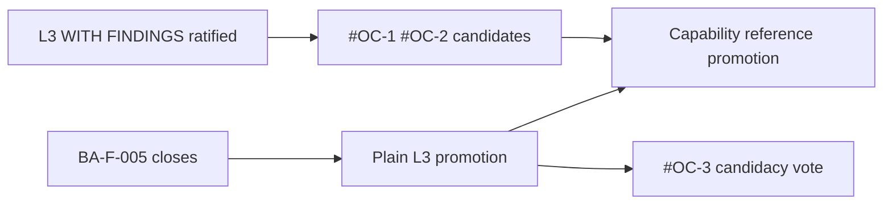

# Business Administration — Reference Candidate Decision

**Program:** BA-3 — Certification Council Ratification  
**Date:** 2026-06-18  
**Authority:** Architecture Council — reference designation vote  
**Status:** **RATIFIED** — candidates approved; **not promoted** to full reference capability in ledger catalog until optional follow-on vote

**Parent:** [BUSINESS_ADMINISTRATION_REFERENCE_REVIEW.md](./BUSINESS_ADMINISTRATION_REFERENCE_REVIEW.md)  
**Ratification:** [BUSINESS_ADMINISTRATION_COUNCIL_RATIFICATION.md](./BUSINESS_ADMINISTRATION_COUNCIL_RATIFICATION.md) — RD-BA-003

---

## Decision summary

| Capability | Council decision | Effective status |
|------------|------------------|------------------|
| **#OC-1** Org Chart Identity & Structure | **APPROVED** — Reference Platform Capability Candidate | **Ratified** |
| **#OC-2** Permission Sets & Module Access | **APPROVED** — Reference Platform Capability Candidate | **Ratified** |
| **#OC-3** Approval Boundaries | **DEFERRED** | Not a candidate until BA-F-005 closes |
| **Reference Domain (whole BA)** | **DENIED** | BO program scope |
| **Reference Implementation (L4)** | **DENIED** | File Hub only |

---

## #OC-1 — Org Chart Identity & Structure

### Ratification record (RD-BA-003)

| Field | Value |
|-------|-------|
| **Ratified?** | **YES** |
| **Designation** | Reference Platform Capability Candidate #OC-1 |
| **Teaching domain** | Workforce identity hub; tier/department/position hierarchy; `EmployeePosition` extension point |
| **Evidence** | [BA_1A](./BA_1A_IMPLEMENTATION_REPORT.md), [BA_1C](./BA_1C_IMPLEMENTATION_REPORT.md), [BA_1D](./BA_1D_CERTIFICATION_EVIDENCE.md) |
| **Conditions** | BA-F-005 waiver active; cite with WITH FINDINGS notation until plain L3 |

### What #OC-1 teaches

| Pattern | Copy target |
|---------|-------------|
| Org-chart service decomposition | Thin routes + named services |
| PE dual on structure mutations | `orgChartPolicyDual.ts` |
| Activity + domain events on writes | `businessAdminActivityService` / org-chart emitters |
| Identity as platform extension | Other modules attach via `EmployeePosition` |

### What #OC-1 is not

- Not a Reference Module integer (#1–#5 architecture slots)
- Not Reference Domain
- Not approval-chain reference (#OC-3 deferred)

---

## #OC-2 — Permission Sets & Module Access

### Ratification record (RD-BA-003)

| Field | Value |
|-------|-------|
| **Ratified?** | **YES** |
| **Designation** | Reference Platform Capability Candidate #OC-2 |
| **Teaching domain** | Business-scoped permission sets; module access gating; catalog vs Policy Engine dual layer |
| **Evidence** | [BA_1C](./BA_1C_IMPLEMENTATION_REPORT.md), `permissionService`, `PermissionManager.tsx` |
| **Conditions** | Pairs with #OC-1 — not cited standalone without org-chart context |

### What #OC-2 teaches

| Pattern | Copy target |
|---------|-------------|
| Permission catalog + sets | `permissionService` |
| PE on permission mutations | `businessAdminPolicyDual.ts` |
| Module access gating | Manifest + runtime alignment |
| Activity on set changes | BA-1A wiring |

---

## #OC-3 — Approval Boundaries (deferred)

| Field | Value |
|-------|-------|
| **Ratified?** | **NO** — deferred |
| **Blocking finding** | BA-F-005 — `ManagerApprovalHierarchy` schema-only |
| **Revisit trigger** | BA-F-005 closure + plain L3 promotion vote |

**Council rule:** Do not list #OC-3 in reference marketing, pattern guides, or ledger status strings until runtime exists.

---

## Explicit non-candidates (affirmed)

| Surface | Reason |
|---------|--------|
| Business Configuration shell | WS-L1 annex material only — not independent capability reference |
| Business AI twin | Enterprise AI program |
| Integration mounts (SSO, webhooks) | AP / platform integration |
| Stations/locations editor | BO ownership (BA-F-009) |
| `/admin/hr` legacy IA | BO ownership (BA-F-010) |

---

## Registry placement

| Registry | Action | Owner | Timing |
|----------|--------|-------|--------|
| `CERTIFICATION_LEDGER.md` | Status string includes #OC-1, #OC-2 candidates | Platform Engineering | Ledger PR (G-BA-1) |
| `REFERENCE_MODULE_CATALOG.md` | Add **Business Administration Platform Capabilities** annex | Architecture Governance | With ledger PR (G-BA-5) |
| `docs/architecture/audits/` | Operation matrix copy (BA-F-011) | BA Program Steward | 30 days |

### Proposed catalog annex (for REFERENCE_MODULE_CATALOG.md)

```markdown
## Business Administration — Platform Capabilities (2026-06-18)

**Not** Reference Module #N integers. Subdomain capability references under L3 WITH FINDINGS.

| # | Capability | Status | Primary audit |
|---|------------|--------|---------------|
| **OC-1** | Org Chart Identity & Structure | **Candidate** (ratified 2026-06-18) | BUSINESS_ADMINISTRATION_CERTIFICATION_EVALUATION.md |
| **OC-2** | Permission Sets & Module Access | **Candidate** (ratified 2026-06-18) | BA_1C_IMPLEMENTATION_REPORT.md |
| **OC-3** | Approval Boundaries | **Deferred** — BA-F-005 | — |
```

---

## Promotion path



| Stage | #OC-1 / #OC-2 | #OC-3 |
|-------|---------------|-------|
| BA-3 ratification | **Candidate — ratified** | **Deferred** |
| Plain L3 promotion | Eligible for pattern-guide promotion | Eligible for **candidacy** vote |
| BA-F-005 + runtime | Full teaching value unlocked for approval patterns | **Candidate vote** |

---

## Comparison to BO reference candidates

| Program | Reference type | At ratification |
|---------|----------------|-----------------|
| HR | Reference Candidate #1 — Workforce Lifecycle | L3 WITH FINDINGS; 3 open majors |
| Scheduling | Reference Candidate #6 — Planning | L3 WITH FINDINGS; 4 open majors |
| WC | Reference Candidate #7 — Broadcast | L3 Certified; 0 majors |
| **BA #OC-1** | Platform Capability — Org Chart | L3 WITH FINDINGS; 1 open major |
| **BA #OC-2** | Platform Capability — Permissions | L3 WITH FINDINGS; paired with #OC-1 |

BA uses **Platform Capability** taxonomy (subdomain slices), not BO **Reference Candidate #N** module integers — avoids catalog collision with HR #1.

---

## Related

- [BUSINESS_ADMINISTRATION_REFERENCE_ASSESSMENT.md](./BUSINESS_ADMINISTRATION_REFERENCE_ASSESSMENT.md)
- [BUSINESS_ADMINISTRATION_LEDGER_RECOMMENDATION.md](./BUSINESS_ADMINISTRATION_LEDGER_RECOMMENDATION.md)
- [BUSINESS_ADMINISTRATION_POST_RATIFICATION_ROADMAP.md](./BUSINESS_ADMINISTRATION_POST_RATIFICATION_ROADMAP.md)
