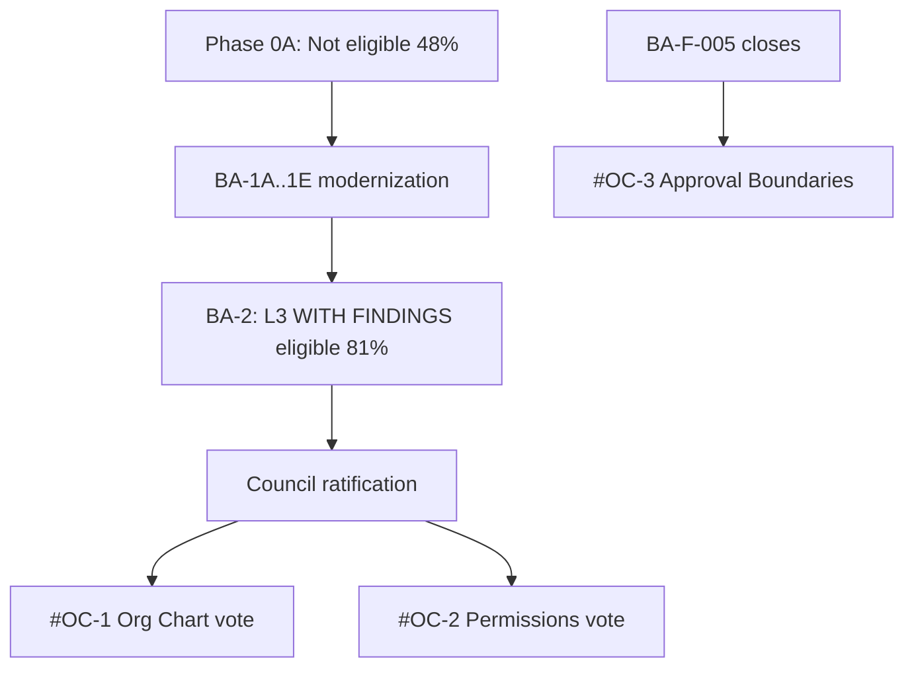

# Business Administration Reference Review

**Program:** BA-2 — Certification Review  
**Date:** 2026-06-18  
**Constraint:** Assessment only — no reference designation awarded  
**Parent:** [BUSINESS_ADMINISTRATION_REFERENCE_ASSESSMENT.md](./BUSINESS_ADMINISTRATION_REFERENCE_ASSESSMENT.md) (Phase 0B, updated post BA-1)

---

## 1. Reference determination

| Designation | BA-2 recommendation | Rationale |
|-------------|---------------------|-----------|
| **Not a reference** | **Reject** for whole subdomain | Org Chart + Permissions have teaching value post BA-1 |
| **Reference Candidate** | **Recommend** | L3 WITH FINDINGS eligible; constitutional gates pass on core surfaces |
| **Reference Platform Capability** | **Recommend for council vote** (subset) | #OC-1 Org Chart; #OC-2 Permissions — not awarded in BA-2 |
| **Reference Domain** | **Reject** | Business Operations owns workforce operations domain reference |
| **Reference Implementation (L4)** | **Reject** | File Hub only per platform ledger |

**Net recommendation:** Business Administration is a **Reference Candidate** for **two Reference Platform Capabilities** — not a Reference Domain and not a monolithic reference implementation.

---

## 2. Subdomain reference evaluation (post BA-1)

### 2.1 Org Chart — #OC-1 Workforce Identity & Structure

| Criterion | Phase 0B | Post BA-1 (BA-2) | Reference bar |
|-----------|----------|------------------|---------------|
| Teaching value | High | **Higher** — activity + events + PE | **Met** |
| Service boundaries | Good | **Excellent** — thin routes, named services | **Met** |
| Constitutional compliance | Low | **L3 bar** — G2/G3/G6 PASS | **Met** |
| Test evidence | Partial | **Strong** — integration + PE + activity | **Met** |
| UX reference | Low | **Medium** — EmptyState, no native dialogs | **Met for capability reference** |

**Verdict:** **Eligible for Reference Platform Capability #OC-1** pending council vote after L3 WITH FINDINGS ratification.

**Teaches:** Multi-module identity hub; `EmployeePosition` extension point; tier/department/position hierarchy; org-chart PE + activity patterns.

---

### 2.2 Permissions — #OC-2 Business Permission Sets & Module Access

| Criterion | Phase 0B | Post BA-1 (BA-2) | Reference bar |
|-----------|----------|------------------|---------------|
| Teaching value | High | **Higher** — PE dual on permission mutations | **Met** |
| Implementation | `permissionService` + UI | + activity on set changes | **Met** |
| PE / catalog clarity | Partial overlap | Clear dual layer post BA-1C | **Met** |
| UX | Low | **Medium** — confirm debt closed | **Met for capability reference** |

**Verdict:** **Eligible for Reference Platform Capability #OC-2** — pairs with #OC-1; not standalone module reference.

**Teaches:** Module access gating; permission catalog vs Policy Engine actions; business-scoped permission sets.

---

### 2.3 Approval Hierarchy — #OC-3 (deferred)

| Criterion | Phase 0B | Post BA-1 (BA-2) | Reference bar |
|-----------|----------|------------------|---------------|
| Model | Prisma exists | Unchanged | **Not met** |
| Runtime | None | **None** — BA-F-005 open | **Not met** |
| Teaching value | High potential | **Blocked** | **Not met** |

**Verdict:** **Not a reference candidate until BA-F-005 closed.** Do not include in certification or reference marketing materials.

---

### 2.4 Business Configuration — supporting material only

| Criterion | Post BA-1 (BA-2) |
|-----------|------------------|
| Cohesion | **Medium** — extraction + realtime sync |
| `BusinessConfigurationContext` | **Complete** — BA-F-006 closed |
| Reference value | **Supporting** — workspace bootstrap pattern |

**Verdict:** **WS-L1 annex material** — cross-link from Business Workspace program documentation; **not** an independent ledger reference capability in BA-2.

---

## 3. Explicit non-candidates (unchanged)

| Surface | Owner / reason |
|---------|----------------|
| Business AI twin | Enterprise AI program |
| Social follow | Peripheral — not enterprise admin |
| Stations/locations editor | Scheduling — BO ownership (BA-F-009) |
| HR settings tabs (`/admin/hr`) | BO ownership (BA-F-010) |
| Admin Portal business AI global | AP control plane |
| Integration mounts (SSO, webhooks) | AP / platform integration — not BA teaching core |

---

## 4. Peer comparison (post BA-1)

| Capability | File Hub | Admin Portal | Business Operations | **Business Administration** |
|------------|----------|--------------|---------------------|----------------------------|
| Service decomposition | Canonical L4 | Post-1A remediated | WC strong | **Org-chart excellent; business extracted** |
| Activity layer | Yes | N/A (control plane) | Yes (3 modules) | **Yes (26 mutations)** |
| PE dual | Yes | Partial → PASS | Partial | **Core PASS; integration partial** |
| Operation matrix | audits/ | audits/ | business-ops/ | **business-admin/ only** (BA-F-011) |
| UX reference | UX #1 | Post-1A PASS | FAIL (scheduling) | **PASS (BA-1E)** |
| Identity teaching | Files | Platform ops | Workforce ops | **Structure/permissions** |

**Unique BA teaching value:** Platform **identity and access layer** that product modules extend — distinct from BO operations and AP control plane.

---

## 5. Reference path (updated)

| Stage | Reference outcome |
|-------|-------------------|
| Phase 0A | Not eligible |
| Post BA-1 + BA-2 L3 WITH FINDINGS | **Eligible for #OC-1 + #OC-2 council vote** |
| Post BA-F-005 | Add **#OC-3 Approval Boundaries** candidate |
| Reference Domain | **Denied** — BO program |
| Reference Implementation | **Denied** — File Hub only |

---

## 6. Council recommendation (BA-2)

After L3 WITH FINDINGS ratification, recommend council consider:

1. **Reference Platform Capability #OC-1** — Org Chart Identity & Structure  
2. **Reference Platform Capability #OC-2** — Permission Sets & Module Access  

**Defer:** #OC-3 until BA-F-005 implementation.  
**Do not concurrently designate:** Reference Domain (reserve for Business Operations trilogy).

**Preconditions for reference vote:**

- L3 WITH FINDINGS ratified (not plain L3 required for capability reference — WITH FINDINGS acceptable per Admin Portal precedent)
- BA-F-005 waiver documented (no false marketing on approval chains)
- BA-F-011 resolved (operation matrix in audits path) — recommended before vote, not blocking

---

## 7. Reference status decision table

| Question | Answer |
|----------|--------|
| Should BA become Reference Domain? | **No** |
| Should BA become Reference Platform Capability (whole)? | **No** — subset only |
| Should Org Chart become Reference Platform Capability? | **Yes — candidate #OC-1** |
| Should Permissions become Reference Platform Capability? | **Yes — candidate #OC-2** |
| Should BA remain not a reference? | **No** — too much teaching value post BA-1 |
| Award reference in BA-2? | **No** — council vote only |

---

## Related

- [BUSINESS_ADMINISTRATION_CERTIFICATION_EVALUATION.md](./BUSINESS_ADMINISTRATION_CERTIFICATION_EVALUATION.md)
- [BUSINESS_ADMINISTRATION_CERTIFICATION_EXECUTIVE_SUMMARY.md](./BUSINESS_ADMINISTRATION_CERTIFICATION_EXECUTIVE_SUMMARY.md)
