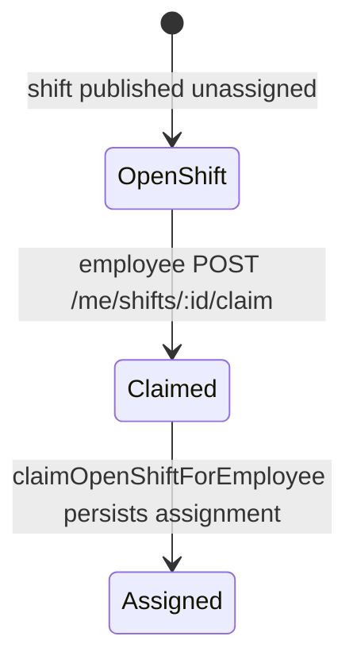

# BO-1A Activity and Event Model

**Program:** Business Operations BO-1A  
**Date:** 2026-06-19

---

## Claim lifecycle (F-SCH-006 / F-SCH-007)

### State flow

### Side-effect order (constitutional)

`authorize → execute → emit activity → domain event → notify`

Implemented in `schedulingShiftService.claimOpenShiftForEmployee`:

1. **Execute** — assign shift to claiming employee (existing Prisma path)
2. **Activity** — `recordOpenShiftClaimed` → action `scheduling_open_shift_claimed`
3. **Domain event** — `recordSchedulingOpenShiftClaimedDomainEvent` → `scheduling:shift.claim`
4. **Notification** — `notifyShiftAssigned` (existing)

### Governance (F-SCH-006)

| Control | Implementation |
|---------|----------------|
| Route auth | Employee access + self-access middleware |
| Policy Engine | `scheduling:shift.claim` (member action) |
| Service ownership | `schedulingShiftService` — no controller Prisma |
| Audit path | Claim row documented in [SCHEDULING_OPERATION_MATRIX.md](../architecture/audits/SCHEDULING_OPERATION_MATRIX.md) |

---

## Activity actions added (BO-1A)

| Action | Module | Trigger |
|--------|--------|---------|
| `scheduling_open_shift_claimed` | scheduling | Open shift claim success |

---

## Domain events added (BO-1A)

| Event | Module | Emitter |
|-------|--------|---------|
| `scheduling:shift.claim` | scheduling | `schedulingDomainEventService.recordSchedulingOpenShiftClaimedDomainEvent` |

Policy action registered: `POLICY_ACTIONS.SCHEDULING_SHIFT_CLAIM` in `policyActions.ts`; member authorization in `policyEngine.ts`.

---

## HR ↔ WC bridge events

Bridge handlers in `workforceBridgeService` emit WC-side drafts; HR integration service does not duplicate HR module activity (HR admin action logged via existing HR settings/admin paths when applicable).

---

## Disposition

| Finding | Status |
|---------|--------|
| F-SCH-006 | **Closed** — claim route PE + matrix publication + service-owned lifecycle |
| F-SCH-007 | **Closed** — activity + domain event on successful claim |
