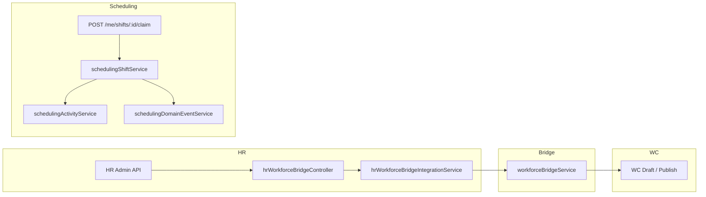

# BO-1A Domain Integration Architecture

**Program:** Business Operations BO-1A  
**Date:** 2026-06-19  
**Scope:** Scheduling · HR · Workforce Communications (Platform Domain)

---

## Integration principles

1. **No direct module coupling** — cross-module flows use domain integration services and existing bridge infrastructure.
2. **HR remains source of truth** for policy/announcement content; Workforce Communications owns broadcast delivery.
3. **Scheduling owns shift lifecycle** including open-shift claims; activity and domain events fan out from constitutional services.
4. **AI consumes context** via thin HTTP controllers; **services own Prisma**.

---

## Integration topology

---

## HR ↔ Workforce Communications bridge

| Surface | Route | Service | Bridge handler |
|---------|-------|---------|----------------|
| Policy broadcast | `POST /api/hr/admin/workforce-bridge/policy-broadcast` | `hrWorkforceBridgeIntegrationService.requestHrPolicyWorkforceBroadcast` | `onHrPolicyBroadcastRequested` |
| Announcement broadcast | `POST /api/hr/admin/workforce-bridge/announcement-broadcast` | `hrWorkforceBridgeIntegrationService.requestHrAnnouncementWorkforceBroadcast` | `onHrAnnouncementBroadcastRequested` |

**AuthZ stack:** `authenticateJWT` → tier/module gates → `checkHRAdmin` → `checkHRPolicy(HR_SETTINGS_WRITE)`.

**Design note:** Explicit admin bridge endpoints avoid tight coupling from HR controllers to WC internals. Future HR policy/announcement entities can call the integration service without importing WC modules.

---

## Scheduling claim lifecycle

| Stage | Owner | Governance |
|-------|-------|------------|
| Open shift published | `schedulingShiftService` | Admin/manager publish paths (existing) |
| Employee claim | `claimOpenShiftForEmployee` | `checkSchedulingEmployeeAccess` + `checkSchedulingSelfAccess` + `checkSchedulingPolicy(SCHEDULING_SHIFT_CLAIM)` |
| Post-claim side effects | Constitutional services | Activity → domain event → notification |

---

## Shared platform services (unchanged)

| Service | Role |
|---------|------|
| `hrScheduleService` | HR ↔ Calendar ↔ Scheduling bridge (documented advisory BO-F-D04) |
| `workforceBridgeService` | WC-side bridge handlers (onboarding already wired) |

---

## Files created (BO-1A)

- `server/src/services/hrWorkforceBridgeIntegrationService.ts`
- `server/src/controllers/hrWorkforceBridgeController.ts`
- `server/src/services/schedulingAiContextService.ts`
- `server/src/services/hrAiContextService.ts`
