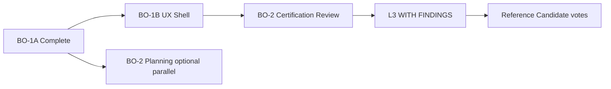

# BO-1A Executive Summary — Council Checkpoint

**Date:** 2026-06-19  
**Audience:** Product, engineering leadership, architecture council  
**Type:** Governance reassessment (no implementation)

---

## Bottom line

Business Operations improved from **~63% to ~81%** domain readiness after BO-1A. All **10 major findings** are closed. The domain is **conditionally ready** but **not ready for domain certification review** because **G9 UX consistency remains a FAIL**.

### Council recommendation

**Proceed to BO-1B UX Shell Alignment** — do not begin domain certification review until G9 reaches ≥2.

Parallel **BO-2 planning** (charters, checklists) is permitted; **review execution** should follow BO-1B.

---

## What BO-1A achieved

- Published operation matrices to audit path
- Wired HR→Workforce Communications broadcast bridge
- Aligned scheduling AI manifest (8/8 actions)
- Extracted AI context services (scheduling + HR)
- Completed claim lifecycle (activity + domain events + PE)
- Expanded Policy Engine (HR ~98%; scheduling aux routes)

---

## What remains

| Category | Count | Impact |
|----------|-------|--------|
| Open findings | **18 advisory** | Do not block L3 WITH FINDINGS |
| G9 UX | **FAIL** | **Blocks domain review** |
| Scheduling native dialogs | **9+ sites** | Primary BO-1B target |

---

## Readiness at a glance

| Entity | Score / posture |
|--------|-----------------|
| **Domain** | ~81% — CONDITIONALLY READY |
| **Scheduling** | ~75% — L3 WITH FINDINGS candidate (UX blocked) |
| **HR** | ~85% — strongest backend |
| **Workforce Comms** | ~90% — L3 candidate |

---

## Answers to required questions

1. **Open findings:** 18 (all advisory)  
2. **Blocking:** 0  
3. **Major:** 0  
4. **Advisory:** 18  
5. **Previous readiness:** ~63%  
6. **Current readiness:** ~81%  
7. **Scheduling:** ~75% — backend ready; UX not  
8. **HR:** ~85% — review-eligible after BO-1B or with advisory plan  
9. **Workforce Comms:** ~90% — review-eligible  
10. **Domain:** CONDITIONALLY READY — not READY FOR REVIEW (G9)  
11. **BO-1B required?** **Yes** (domain review)  
12. **Next package:** **BO-1B UX Shell Alignment**  
13. **Earliest certification:** **L3 WITH FINDINGS in ~4–6 weeks** (BO-1B + BO-2)  
14. **Reference candidates:** HR #1 ✓ · Scheduling #6 (UX conditional) · WC #7 ✓  

---

## Path forward

---

## Related documents

- [BO_1A_COUNCIL_CHECKPOINT.md](./BO_1A_COUNCIL_CHECKPOINT.md)
- [BO_1A_READINESS_REASSESSMENT.md](./BO_1A_READINESS_REASSESSMENT.md)
- [BO_1A_G1_G9_SCORECARD.md](./BO_1A_G1_G9_SCORECARD.md)
- [BO_1A_MODULE_READINESS_REVIEW.md](./BO_1A_MODULE_READINESS_REVIEW.md)
- [BO_1A_IMPLEMENTATION_REPORT.md](./BO_1A_IMPLEMENTATION_REPORT.md)
