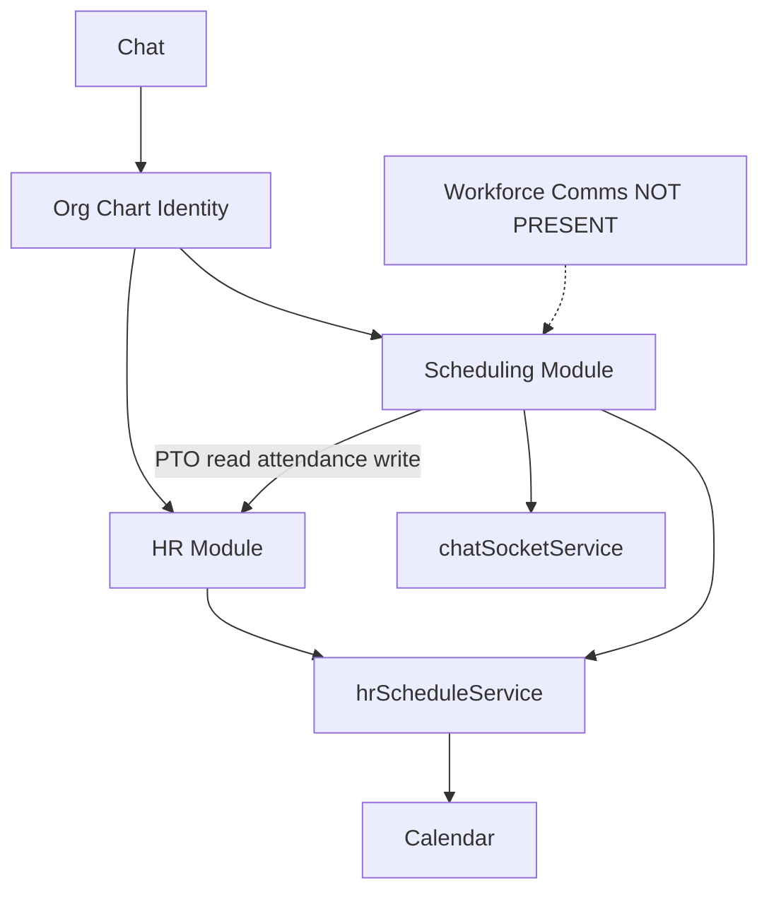

# Business Operations Capability Map

**Phase:** Business Operations Phase 0A — Executive synthesis  
**Audience:** Stakeholders (5–10 minute read)  
**Last updated:** 2026-06-14  
**Status:** Discovery synthesis — not certification  
**Drill-down:** See linked audit documents; this file does not introduce conclusions beyond their evidence.

| Document | Answers |
|----------|---------|
| [SCHEDULING_OPERATION_MATRIX.md](./SCHEDULING_OPERATION_MATRIX.md) | Per-operation detail |
| [SCHEDULING_ARCHITECTURE_AUDIT.md](./SCHEDULING_ARCHITECTURE_AUDIT.md) | Architectural gates |
| [SCHEDULING_UX_AUDIT.md](./SCHEDULING_UX_AUDIT.md) | UX categories |
| [SCHEDULING_STRATEGIC_POSITIONING.md](./SCHEDULING_STRATEGIC_POSITIONING.md) | Scheduling future vision |
| [WORKFORCE_DOMAIN_BOUNDARY_ANALYSIS.md](./WORKFORCE_DOMAIN_BOUNDARY_ANALYSIS.md) | Per-capability ownership |
| [BUSINESS_OPERATIONS_PHASE_0A_CLOSEOUT.md](./BUSINESS_OPERATIONS_PHASE_0A_CLOSEOUT.md) | Phase closeout |

---

# Executive Summary

## Scheduling current maturity

**Operational: MEDIUM.** Core admin and employee scheduling workflows exist — schedule builder, publish, availability, swaps, open-shift claim, AI generation. Manager team routes and several admin endpoints are stubs (501 or empty responses).

**Architectural: LOW–MEDIUM.** Standalone module with full schema and API, but lacks Policy Engine, normalized activity, notifications, V_Link, and Global Trash. Controllers contain heavy inline Prisma.

**UX: LOW–MEDIUM.** Functional multi-role UI with strong schedule-grid density. Fails reference standards on native `confirm()`/`prompt()` and design token compliance.

## HR current maturity

**Operational: MEDIUM.** Employee profiles, PTO, attendance, onboarding, and analytics frameworks exist. Enterprise stubs (payroll, recruitment, performance, benefits) return placeholder responses. Full HR audit deferred to Phase 0B.

**Architectural: LOW–MEDIUM.** Standalone `hr` module; owns `hrScheduleService` calendar bridge used by scheduling. Similar constitutional gaps to scheduling on activity and platform alignment.

## Workforce Communications current maturity

**NOT PRESENT.** No workforce communications module. Business front page supports static `companyAnnouncements` only. Chat provides team/DM messaging but not workforce-scoped operational broadcasts, emergency alerts, or read receipts.

## Major ownership findings

- **Org chart** is the shared identity hub (`EmployeePosition`, `Department`).
- **Scheduling** owns future shift planning; **HR** owns past attendance and PTO.
- **`hrScheduleService`** is a shared bridge (HR package name) for calendar sync of PTO and published shifts.
- **Workforce Communications** has no owner module today.

## Major architectural findings

- Scheduling is a **standalone built-in module**, not an HR or Calendar extension.
- **Hybrid pattern** in repo: separate modules connected by shared integration layer.
- Platform constitutional gaps affect scheduling (and HR): activity, notifications, trash, PE, V_Link.
- Scheduling realtime (WebSocket) is **UI synchronization**, not workforce messaging.

## Key gaps

- Workforce broadcasts and emergency alerts
- Manager scheduling workflows (501 APIs)
- Shift bidding and coverage request workflows
- Server-side labor/coverage analytics (501)
- Notification and activity integration for scheduling
- V_Link and Global Trash for scheduling entities

---

# Business Operations Capability Inventory

**Maturity scale:** HIGH · MEDIUM · LOW · NOT PRESENT · UNKNOWN

| Capability | Current State | Current Owner | Maturity | Notes |
|------------|---------------|---------------|----------|-------|
| **Scheduling** | | | | |
| Schedule creation | Admin CRUD + visual builder | Scheduling | MEDIUM | Core path works |
| Shift assignment | Admin create/update with PTO conflict check | Scheduling | MEDIUM | Inline Prisma |
| Availability | Employee CRUD; admin update 501 | Scheduling | MEDIUM | Partial |
| Open shifts | `isOpenShift`; employee claim | Scheduling | MEDIUM | Manager list 501 |
| Shift swaps | Request + manager approve; admin list stub | Scheduling | MEDIUM | Admin inbox broken |
| Coverage management | AI context only | Scheduling | LOW | No workflow |
| Schedule publishing | Admin publish + HR/calendar side effects | Scheduling | MEDIUM | Manager publish 501 |
| **HR** | | | | |
| Employee profiles | `EmployeeHRProfile` extends org chart | HR | MEDIUM | 0B deep dive |
| Org hierarchy | Tiers, positions, departments | Platform (org chart) | MEDIUM | Shared identity |
| PTO | Requests, approvals, calendar sync | HR | MEDIUM | Scheduling reads for conflicts |
| Attendance | Clock-in/out, records, policies | HR | MEDIUM | Stubs from scheduling publish |
| Time management | PTO + attendance; timecards unknown | HR | MEDIUM | Unknown sub-capabilities |
| Employee records | HR admin employees API | HR | MEDIUM | |
| **Workforce Communications** | | | | |
| Department broadcasts | NOT PRESENT | — | NOT PRESENT | Front page CMS only |
| Workforce announcements | Front-page static JSON | Unknown | LOW | Not workforce-scoped |
| Emergency alerts | NOT PRESENT | — | NOT PRESENT | |
| Shift messaging | Socket UI sync only | Shared | LOW | Not comms product |
| Read receipts | NOT PRESENT (workforce) | — | NOT PRESENT | Chat has DM read state |
| Operational messaging | NOT PRESENT | — | NOT PRESENT | |
| **AI** | | | | |
| Schedule generation | `generate_schedule` action | Scheduling | MEDIUM | |
| Workforce recommendations | Mode/strategy recommendations | Scheduling | LOW | Config not people |
| Conflict detection | PTO check on shift assign | Shared | MEDIUM | |
| Forecasting | Analytics 501 | Scheduling | LOW | Stub |
| **Analytics** | | | | |
| Labor analytics | Server 501; UI computed stats | Scheduling | LOW | Misleading UI maturity |
| Workforce analytics | HR dashboards | HR | MEDIUM | Overlap with scheduling UI |
| Staffing analytics | AI coverage context; no reports | Scheduling | LOW | |
| **Platform Features** | | | | |
| Notifications | HR partial; scheduling none | Platform (gap) | LOW | Scheduling icon only |
| Activity logging | Not emitted by scheduling/hr | Platform (gap) | NOT PRESENT | |
| Realtime | Schedule room broadcasts | Platform + Scheduling | MEDIUM | Membership checked |
| Domain events | Not emitted by scheduling | Platform (gap) | NOT PRESENT | |
| V-Link | Not integrated for hr/scheduling | Platform (gap) | NOT PRESENT | Per `V_LINK.md` |
| Global Trash | Hard delete scheduling entities | Platform (gap) | NOT PRESENT | |

---

# Current Architecture Map

Repository reality (not aspirational):

```
Org Chart (Platform — shared identity)
├── EmployeePosition, Department, Position
├── HR Module ──────────────┐
│   ├── EmployeeHRProfile   │
│   ├── PTO (TimeOffRequest)│
│   ├── Attendance          │
│   └── hrScheduleService ──┼──► Calendar Module (event sync)
│                           │
└── Scheduling Module ◄─────┘
    ├── Schedule / ScheduleShift
    ├── Availability / Swaps
    ├── AI planning actions
    └── Realtime ──► chatSocketService (UI sync)

Calendar Module
├── Events, recurrence, reminders
└── Receives published shifts + PTO via hrScheduleService

Chat Module
└── Team/DM messaging (not workforce-scoped ops comms)

Workforce Communications
└── NOT PRESENT

Business Front Page
└── Static companyAnnouncements (not dept-targeted)
```



---

# Emerging Architecture Pattern

| Model | Description | Evidence strength |
|-------|-------------|-------------------|
| **A — Independent modules** | Scheduling, HR, Workforce Comms separate | Strong for Scheduling + HR today |
| **B — Workforce Operations Platform** | Composed domains under one program | Partial — integrations exist; Comms missing |
| **C — Hybrid** | Independent modules + shared integration layer | **Strongest fit for current repo** |

**Assessment:** Repository aligns with **C (Hybrid)**. Scheduling and HR are separate modules with isolated schemas. Workforce Communications does not exist. Shared bridges (`EmployeePosition`, `hrScheduleService`, platform realtime/notifications infrastructure) connect domains without code merge.

**Open:** Whether product evolves toward B depends on Phase 0C and program-level architecture decisions. **Not forced in Phase 0A.**

---

# Capability Ownership Summary

From [WORKFORCE_DOMAIN_BOUNDARY_ANALYSIS.md](./WORKFORCE_DOMAIN_BOUNDARY_ANALYSIS.md):

| Owner | Representative capabilities |
|-------|----------------------------|
| **Scheduling-owned** | Schedule creation, shift assignment, availability, swaps, open-shift claim, AI schedule generation |
| **HR-owned** | Employee profiles, PTO, attendance, clock-in/out, leave management |
| **Calendar-owned** | Event storage, recurrence, reminders |
| **Shared** | Published shift calendar sync, PTO conflict detection, org hierarchy consumption, publish→attendance stubs |
| **Platform-owned** | Notification infrastructure, activity envelope, Global Trash API, org chart identity, realtime transport |
| **Unknown** | Shift bidding, coverage requests, call-offs, timecards, overtime, skills, certifications |
| **NOT PRESENT** | Workforce broadcasts, emergency alerts, operational messaging, workforce read receipts |

### Major ownership collisions

| Collision | Parties | Notes |
|-----------|---------|-------|
| PTO interactions | HR + Scheduling | HR owns data; scheduling enforces on assign |
| Attendance interactions | HR + Scheduling | HR owns records; scheduling writes stubs on publish |
| Calendar sync | HR service + Scheduling trigger + Calendar storage | `hrScheduleService` naming implies HR ownership of bridge |
| Org hierarchy | Platform + HR + Scheduling | Org chart primary; modules consume |
| Shift communications | Scheduling realtime + future Comms | Today: UI sync only; not messaging product |

---

# Critical Gaps

Confirmed in Phase 0A audits only:

| Gap | Evidence |
|-----|----------|
| Workforce broadcasts | No module/routes |
| Emergency alerts | No implementation |
| Coverage request workflow | AI context only |
| Shift bidding | No models/routes |
| Labor forecasting (server) | 501 analytics endpoints |
| Manager team scheduling | 501: publish, assign, open shifts, team availability |
| Shift template CRUD | 501 / empty list |
| Admin swap listing | Returns `{ swaps: [] }` stub |
| Activity history (scheduling) | No `emitModuleActivityEvent` |
| Notification integration (scheduling) | No `scheduling_*` types |
| V-Link integration | `V_LINK.md`: not integrated |
| Global Trash (scheduling) | Hard delete; no `trashedAt` |
| Policy Engine (scheduling) | Custom middleware only |

---

# Strategic Implications

## Phase 0B — HR Assessment

- Use boundary doc **HR-owned** and **Shared** rows as scope boundary.
- Deep-audit PTO, attendance, profiles, `hrScheduleService`, HR constitutional compliance.
- Resolve Unknown time-management capabilities (call-offs, timecards, overtime).
- Address `AttendanceShiftTemplate` vs `ShiftTemplate` collision.
- Do not re-audit scheduling planning surfaces.

## Phase 0C — Workforce Communications Assessment

- Own all Communications capabilities marked NOT PRESENT.
- Decide module model: new module vs Chat extension vs notifications fan-out.
- Clarify scheduling realtime ≠ workforce comms.
- Assess front-page announcements vs workforce broadcast requirements.
- Define department targeting and integration with schedule publish events.

## Future Business Operations Strategic Architecture Program

- Synthesize 0A + 0B + 0C using this Capability Map and boundary doc as canonical references.
- Formalize integration contracts (calendar bridge, PTO conflict, publish side effects).
- Resolve hybrid (C) vs platform (B) direction after 0C completes.

**No implementation recommendations. No modernization waves. Discovery findings only.**

---

## Readiness and next step

| Item | Status |
|------|--------|
| Phase 0A complete | Yes — 7 documents |
| Scheduling understood | Yes |
| Ownership mapped | Yes — boundary doc canonical |
| Ready for implementation | No — discovery only |
| Ready for modernization planning | Yes — with stub/constitutional caveats |

**Recommended next step:** **Phase 0B — HR Module Reality Assessment**, scoped by [WORKFORCE_DOMAIN_BOUNDARY_ANALYSIS.md](./WORKFORCE_DOMAIN_BOUNDARY_ANALYSIS.md).
