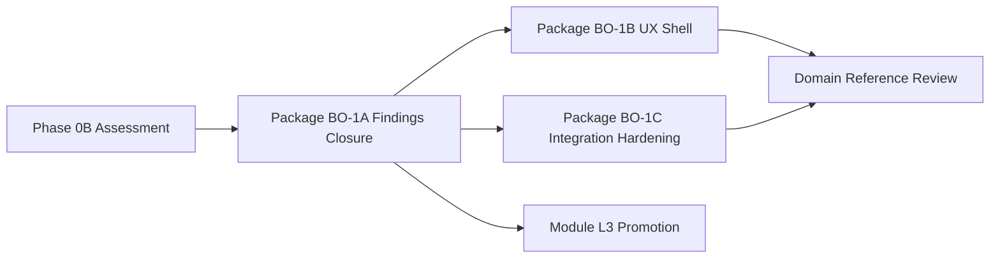

# Business Operations Certification Framework

**Program:** Business Operations Phase 0B — Domain Certification Planning  
**Date:** 2026-06-18  
**Authority:** Adapted from Admin Portal G1–G9 framework + module L3 constitutional gates  
**Constraint:** Assessment only — no certification awarded; no ledger updates

**Reference frameworks:**

- Admin Portal: [`ADMIN_PORTAL_CERTIFICATION_READINESS.md`](../architecture/audits/ADMIN_PORTAL_CERTIFICATION_READINESS.md)
- Module L3: [`CERTIFICATION_LEDGER.md`](../architecture/CERTIFICATION_LEDGER.md)
- File Hub patterns: [`FILE_HUB_REFERENCE_IMPLEMENTATION_REVIEW.md`](../architecture/audits/FILE_HUB_REFERENCE_IMPLEMENTATION_REVIEW.md)

---

## 1. Framework selection

Business Operations is evaluated at **two levels**:

| Level | Framework | Applies when |
|-------|-----------|--------------|
| **Module** | Standard L3 15-item gate + File Hub patterns | Per-module certification (`scheduling`, `hr`, `workforce_comms`) |
| **Domain** | Adapted G1–G9 (this document) | Cross-module governance, integration, and reference domain candidacy |

Phase 0B establishes the **domain framework**. Module certifications remain authoritative at module scope.

---

## 2. Domain gates (G1–G9)

| # | Gate | Rationale for BO domain |
|---|------|-------------------------|
| **G1** | Authorization depth | Every privileged route consistently tenant-scoped + role/PE gated across three modules |
| **G2** | Auditability | Immutable audit for workforce mutations; activity envelope on all write paths |
| **G3** | Service boundaries | Named domain services; no Prisma in controllers/AI context |
| **G4** | API coherence | Consistent mount strategy; integration contracts documented |
| **G5** | Ownership clarity | Module vs shared vs platform surfaces bounded and enforced |
| **G6** | Test evidence | Integration tests for cross-module and HTTP mutation paths |
| **G7** | Documentation | Domain + module operation matrices in audit trail path |
| **G8** | Production safety | No 501 stubs exposed as live features; no AI placeholder writes without manifest truth |
| **G9** | UX consistency | Shared workspace shell; ConfirmModal/EmptyState; token compliance |

### 2.1 Gates marked N/A at domain level

| Gate | N/A rationale |
|------|---------------|
| Platform-global operator auth | BO is tenant-scoped business workspace — uses business member roles |
| Single module manifest | Domain spans three manifests |
| Admin control-plane patterns | Not a control plane |

---

## 3. Gate scoring (2026-06-18)

| Gate | Status | Score | Max | Evidence |
|------|--------|-------|-----|----------|
| **G1 Authorization** | **PARTIAL** | 2 | 3 | WC 32/32 PE; Scheduling 27/60 PE; HR ~25/59 PE. Destructive paths gated. Read/auxiliary gaps (F-SCH-005, F-HR-001). |
| **G2 Auditability** | **PARTIAL** | 2 | 3 | Activity services wired for scheduling/HR/WC. F-SCH-007 claim gap. HR partial audit (`logEmployeeAudit` only). No scheduling audit service (F-SCH-011 advisory). |
| **G3 Service boundaries** | **PASS WITH FINDINGS** | 2 | 3 | 54 primary services; AdminTools extraction closed. AI context controllers still hold Prisma (F-SCH-004, F-HR-003). Dashboard reads (F-SCH-008). |
| **G4 API coherence** | **PASS WITH FINDINGS** | 2 | 3 | Three canonical mounts (`/api/scheduling`, `/api/hr`, `/api/workforce-comms`). HR↔WC bridge unwired (BO-F-D02). `hrScheduleService` cross-package bridge. |
| **G5 Ownership** | **PASS** | 3 | 3 | [WORKFORCE_DOMAIN_BOUNDARY_ANALYSIS.md](./WORKFORCE_DOMAIN_BOUNDARY_ANALYSIS.md) + [BUSINESS_OPERATIONS_OWNERSHIP_MODEL.md](./BUSINESS_OPERATIONS_OWNERSHIP_MODEL.md). Communications module now present. |
| **G6 Test evidence** | **PARTIAL** | 2 | 3 | 32+ service tests; WC strong. Scheduling HTTP integration thin (1 route file). No cross-module integration test suite. |
| **G7 Documentation** | **PARTIAL** | 2 | 3 | Module matrices exist; not in `docs/architecture/audits/` (BO-F-D01). Phase 0B domain docs created. |
| **G8 Production safety** | **PARTIAL** | 1 | 3 | Analytics 501 trio (F-SCH-009). AI placeholders (BO-F-D03). No mock fallbacks masking failures (unlike pre-0E Admin Portal). |
| **G9 UX consistency** | **FAIL** | 1 | 3 | Native `confirm()`/`prompt()` in scheduling (9+ sites). Partial ConfirmModal in WC. Token drift in scheduling builder. |
| **Total** | | **17** | **27** | **~63%** |

### 3.1 Scoring legend

| Score | Meaning |
|-------|---------|
| 3 / PASS | Meets gate with high-confidence evidence |
| 2 / PARTIAL or PASS WITH FINDINGS | Substantial progress; tracked findings |
| 1 / FAIL | Material violation |
| 0 | Critical failure / P0 |

### 3.2 Review thresholds (planning)

| Threshold | Requirement |
|-----------|-------------|
| **NOT READY** | &lt;70% OR any blocking finding OR G8/G9 FAIL |
| **CONDITIONALLY READY** | ≥70%, zero blocking, ≤3 domain majors open |
| **READY FOR DOMAIN REVIEW** | ≥85%, zero blocking, G9 ≥2 |
| **Domain Reference Candidate** | ≥85%, zero domain majors, council vote |

**Current outcome: NOT READY** (~63%; G9 FAIL; 3 domain majors).

---

## 4. Module-level certification snapshot (informational)

Phase 0B does not re-score modules. Inherited posture from module audits:

| Module | Ledger posture (informational) | Open majors | UX |
|--------|-------------------------------|-------------|-----|
| `scheduling` | L3 WITH FINDINGS | 4 | Below UX-L1 (native confirm) |
| `hr` | L3 WITH FINDINGS | 3 | Below UX-L1 (partial) |
| `workforce_comms` | L3 Certified | 0 | MEDIUM — partial ConfirmModal |

**Domain certification is not the sum of module certs** — integration gates (G4, G6, G7) require cross-module evidence.

---

## 5. AI assessment and control plane recommendation

### 5.1 Current AI inventory

| Surface | Scheduling | HR | Workforce Comms |
|---------|------------|-----|-----------------|
| Context providers | 3 (overview, coverage, conflicts) | 3+ | 2 (overview, reach) |
| HTTP AI routes | 2 write assist | varies | 0 write |
| ActionExecutor | 2 live / 6 placeholder | partial | 0 (read-only OK) |
| In-module AI UI | `SchedulingAIAssistant.tsx` | HR dashboards | `WorkforceCommsAiContextPanel.tsx` |
| Recommendations | `schedulingRecommendationService`, philosophy engine | analytics | reach estimates |

### 5.2 Dedicated AI control plane?

| Option | Assessment |
|--------|------------|
| **Admin Portal-style AI Pipeline control plane** | **Not recommended** for BO — tenant-scoped modules, not platform-operator surface |
| **Module-local AI surfaces (current)** | **Recommended baseline** — each module owns context providers + governed write executors |
| **Domain AI orchestration layer (future)** | **Conditional** — only if product requires cross-module planning (e.g., schedule publish → WC audience → HR PTO) as single AI workflow |

**Recommendation:** Maintain **module-scoped AI** with:

1. Manifest truthfulness (BO-F-D03)
2. AI context service extraction per Calendar pattern (F-SCH-004, F-HR-003)
3. Optional **domain AI context aggregator** (read-only) in a future package — not a control plane

### 5.3 AI gate mapping

| AI requirement | Gate | Status |
|----------------|------|--------|
| Context providers auth'd + bounded | G1, G3 | PASS WITH FINDINGS |
| Write actions via canonical services | G3, G8 | PARTIAL (placeholders) |
| Manifest accuracy | G8 | FAIL (BO-F-D03) |
| Diagnostics | G7 | PARTIAL — no domain AI diagnostics doc |

---

## 6. Preliminary certification path

| Stage | Target | Gate focus |
|-------|--------|------------|
| **Now** | Phase 0B complete | Baseline scoring |
| **BO-1A** | Close domain + module majors | G2, G3, G8, G4 |
| **BO-1B** | UX shell alignment | G9 |
| **BO-1C** | Cross-module tests + bridge wiring | G4, G6 |
| **Domain review** | Reference Domain candidacy | G1–G9 ≥85% |

**Analytics (Stage 4):** Explicitly deferred — does not block BO-1A.

---

## 7. Allowed outcomes (Phase 0B)

| Outcome | Applies? |
|---------|----------|
| **NOT READY** (domain) | **Yes** |
| CONDITIONALLY READY FOR DOMAIN REVIEW | No |
| READY FOR DOMAIN REVIEW | No |
| Domain Reference designation | No |
| Ledger update | **Prohibited** in Phase 0B |

---

## Related documents

- [BUSINESS_OPERATIONS_FINDINGS_REGISTER.md](./BUSINESS_OPERATIONS_FINDINGS_REGISTER.md)
- [BUSINESS_OPERATIONS_REFERENCE_ASSESSMENT.md](./BUSINESS_OPERATIONS_REFERENCE_ASSESSMENT.md)
- [BUSINESS_OPERATIONS_MODERNIZATION_ROADMAP.md](./BUSINESS_OPERATIONS_MODERNIZATION_ROADMAP.md)
