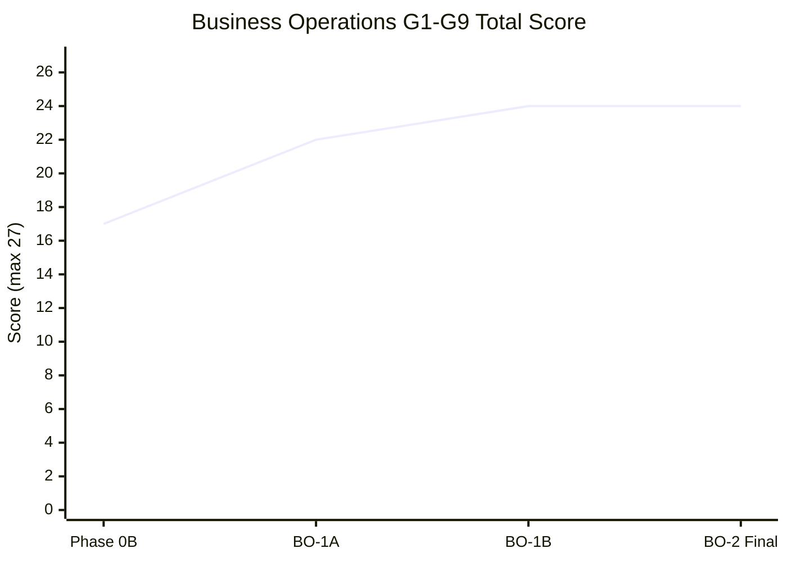

# Business Operations Certification Scorecard (BO-2)

**Program:** Business Operations BO-2 — Certification Evaluation  
**Date:** 2026-06-19  
**Framework:** [BUSINESS_OPERATIONS_CERTIFICATION_FRAMEWORK.md](./BUSINESS_OPERATIONS_CERTIFICATION_FRAMEWORK.md)  
**Baseline comparison:** Phase 0B (17/27) → BO-1A (22/27) → BO-1B (24/27) → **BO-2 final (24/27)**

---

## Final G1–G9 scorecard

| Gate | Score | Max | Status | Justification |
|------|-------|-----|--------|---------------|
| **G1 Authorization** | 2 | 3 | **PARTIAL** | HR ~98% PE; WC 32/32; scheduling critical/aux + claim gated (BO-1A). Team/employee read routes still legacy-middleware-heavy (~40% without PE). No security P0. |
| **G2 Auditability** | 3 | 3 | **PASS** | Activity services on scheduling/HR/WC write paths; claim lifecycle emits activity + domain event (BO-1A). Advisories: F-SCH-011, F-HR-008 — do not block primary mutation audit envelope. |
| **G3 Service boundaries** | 3 | 3 | **PASS** | Constitutional services own mutations; AI context extracted (BO-1A). Advisory: F-SCH-008 dashboard reads (3 Prisma). |
| **G4 API coherence** | 3 | 3 | **PASS** | Canonical mounts; HR↔WC bridge integration service + routes (BO-1A); domain integration architecture documented. |
| **G5 Ownership** | 3 | 3 | **PASS** | Three-module platform domain; boundary docs; integration contracts. Advisory: BO-F-D04 shared bridge naming. |
| **G6 Test evidence** | 2 | 3 | **PARTIAL** | 32+ service tests; BO-1B UX contract (7); BO-1A scheduling tests (19). Thin cross-module HTTP integration suite; no dedicated HR↔WC bridge E2E. |
| **G7 Documentation** | 3 | 3 | **PASS** | Operation matrices + annex in `docs/architecture/audits/`; BO-1A/BO-1B deliverable sets. Advisory: BO-F-D06 identity doc scatter. |
| **G8 Production safety** | 2 | 3 | **PARTIAL** | AI manifest truthful (8/8 scheduling actions); no placeholder executor lies. Analytics 501 trio + enterprise HR stubs remain tier-gated/deferred (F-SCH-009, F-HR-009, BO-F-D07). |
| **G9 UX consistency** | 3 | 3 | **PASS** | BO-1B: zero native dialogs; ConfirmModal/useConfirm; EmptyState bar; v-* token dominance; UX contract tests. |
| **TOTAL** | **24** | **27** | **~89%** | **READY FOR L3 WITH FINDINGS** |

---

## Score trajectory

*BO-2 confirms BO-1B scores; no regression.*

---

## Threshold evaluation

| Threshold | Requirement | BO-2 result |
|-----------|-------------|-------------|
| NOT READY | &lt;70% OR blocking OR G8/G9 FAIL | **Not met** — passes |
| CONDITIONALLY READY | ≥70%, zero blocking/major | **Met** |
| READY FOR DOMAIN REVIEW | ≥85%, G9≥2 | **Met** (89%, G9=3) |
| Plain L3 (domain) | All gates ≥2, zero FAIL, minimal advisories | **Not met** — G1/G6/G8 partial + 17 advisories |
| L3 WITH FINDINGS | Constitutional core + tracked advisories | **Met** |

---

## Gate status legend

| Status | Gates |
|--------|-------|
| **PASS (3)** | G2, G3, G4, G5, G7, G9 |
| **PARTIAL (2)** | G1, G6, G8 |
| **FAIL (≤1)** | None |

---

## Evidence index

| Gate | Primary BO-2 evidence |
|------|----------------------|
| G1 | [BO_1A_POLICY_ENGINE_COVERAGE_REPORT.md](./BO_1A_POLICY_ENGINE_COVERAGE_REPORT.md) |
| G2 | [BO_1A_ACTIVITY_AND_EVENT_MODEL.md](./BO_1A_ACTIVITY_AND_EVENT_MODEL.md) |
| G3 | [BO_1A_AI_OWNERSHIP_ALIGNMENT.md](./BO_1A_AI_OWNERSHIP_ALIGNMENT.md) |
| G4 | [BO_1A_DOMAIN_INTEGRATION_ARCHITECTURE.md](./BO_1A_DOMAIN_INTEGRATION_ARCHITECTURE.md) |
| G5 | [BUSINESS_OPERATIONS_OWNERSHIP_MODEL.md](./BUSINESS_OPERATIONS_OWNERSHIP_MODEL.md) |
| G6 | Module test inventory; `businessOperationsUxShell.test.ts` |
| G7 | Audits-path matrices; BO program doc set |
| G8 | AI manifest closure; 501/stub register in findings review |
| G9 | [BO_1B_G9_EVALUATION.md](./BO_1B_G9_EVALUATION.md) |
