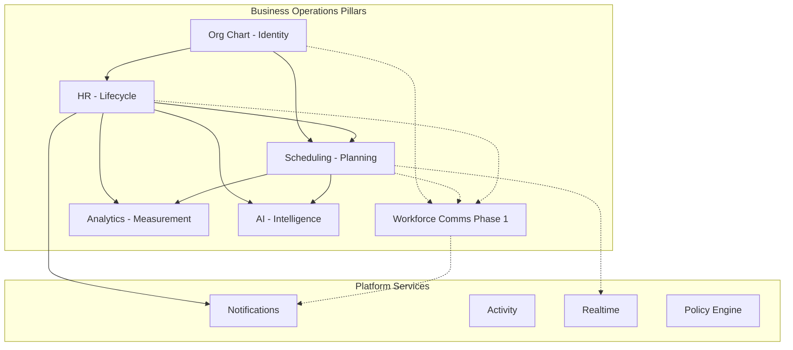

# Business Operations Domain Model

**Phase:** Business Operations Phase 0D — Strategic Architecture Program  
**Last updated:** 2026-06-14  
**Amended:** 2026-06-14 — WC Phase 1 maturity ([WORKFORCE_COMMUNICATIONS_CONSTITUTIONAL_CLARIFICATION.md](./WORKFORCE_COMMUNICATIONS_CONSTITUTIONAL_CLARIFICATION.md))  
**Constitution:** [BUSINESS_OPERATIONS_STRATEGIC_ARCHITECTURE.md](./BUSINESS_OPERATIONS_STRATEGIC_ARCHITECTURE.md)  
**Ownership authority:** [WORKFORCE_DOMAIN_BOUNDARY_ANALYSIS.md](./WORKFORCE_DOMAIN_BOUNDARY_ANALYSIS.md)  
**Identity authority:** [WORKFORCE_IDENTITY_ARCHITECTURE.md](./WORKFORCE_IDENTITY_ARCHITECTURE.md)

---

## Overview

Six Business Operations pillars under Model C. Each domain has a **purpose**, **owner**, **responsibilities**, **dependencies**, **non-responsibilities**, **current state**, and **target state**.

**Maturity scale:** HIGH · MEDIUM · LOW · NOT PRESENT · UNKNOWN

---

## 1. Org Chart — Workforce Identity

### Purpose

Define organizational structure and **authoritative workforce placement** — who holds which position in the business.

### Owner

**Org chart (platform / business module)** — routes, services, and schema under `org-chart.prisma`, `/api/org-chart`.

### Responsibilities

| Responsibility | Evidence |
|----------------|----------|
| Organizational tiers, departments, positions | Phase 0B identity doc |
| `EmployeePosition` assignment, transfer, removal | `employeeManagementService` |
| Reporting hierarchy (`reportsToId`) | Org chart schema |
| Primary answer to "who is an employee?" | `EmployeePosition` anchor |
| Permission defaults from tier | Org chart UI |

### Dependencies

| Upstream | Relationship |
|----------|--------------|
| Platform `User` | EP links to user |
| Business `BusinessMember` | Assignment requires membership |
| Business `Business` | Tenant scope |

### Non-responsibilities

- PTO, attendance, employment HR metadata (**HR**)
- Shift planning and availability (**Scheduling**)
- Operational broadcasts (**Workforce Communications**)
- Calendar event storage (**Calendar**)
- Notification delivery (**Platform**)

### Current state

| Attribute | Value |
|-----------|-------|
| Maturity | **MEDIUM** |
| Identity anchor | **Established** — `EmployeePosition` validated |
| Risks | CSV import bypass (HR path); terminate vs remove asymmetry; legacy `BusinessMember.department` string |
| Consumers | HR, Scheduling, Calendar sync, AI, Analytics |

### Target state

- Single authoritative write path for placement (org-chart API)
- Lifecycle symmetry documented and enforced with HR terminate flows
- All BO domains consume EP + Department without parallel rosters
- Department-scoped audience resolution available for Workforce Communications

---

## 2. HR — Workforce Lifecycle

### Purpose

Track **time-and-people** and **employment lifecycle metadata** on top of org-chart placement.

### Owner

**HR module** (`hr`) — `/api/hr`, `prisma/modules/hr/`.

### Responsibilities

| Responsibility | Evidence |
|----------------|----------|
| `EmployeeHRProfile` (1:1 extension of EP) | Phase 0B |
| PTO requests, approvals, balances | HR operation matrix |
| Attendance policies, records, exceptions, punch | HR operation matrix |
| Onboarding journeys and templates | HR operation matrix |
| HR analytics dashboards | `hrAnalyticsService` |
| HR workflow notifications (`hr_*` emitters) | 8 types sent |
| `hrScheduleService` calendar bridge (shared) | Phase 0A/0B |

### Dependencies

| Upstream | Relationship |
|----------|--------------|
| Org chart `EmployeePosition` | Required FK for HR profile |
| Calendar | Sync target via `hrScheduleService` |
| Platform Notifications | Delivery for workflow alerts |
| Scheduling | Reads PTO; writes attendance stubs on publish (shared) |

### Non-responsibilities

- Org structure CRUD (**Org chart**)
- Primary employee assignment (**Org chart**)
- Shift planning (**Scheduling**)
- Workforce operational campaigns (**Workforce Communications**)
- Chat messaging (**Chat**)
- User accounts (**Platform**)

### Current state

| Attribute | Value |
|-----------|-------|
| Maturity | **MEDIUM** operational; **LOW–MEDIUM** architectural |
| Constitutional gaps | No activity, PE, V_Link, Global Trash; manifest notification gap |
| Risks | Monolithic controller; CSV import bypass; enterprise stubs |
| Identity role | **Extends** org chart — does not own placement |

### Target state

- Service-layer extraction; thin controllers
- Constitutional alignment (activity, PE, trash, manifest)
- Import path uses org-chart API or documented reconciliation
- Workflow notifications complete (3 attendance types emitted)
- Enterprise stubs either implemented or clearly gated off-product

---

## 3. Scheduling — Workforce Planning

### Purpose

Define **when people should work** — schedules, shifts, availability, swaps, and planning intelligence.

### Owner

**Scheduling module** (`scheduling`) — `/api/scheduling`, `prisma/modules/scheduling/`.

### Responsibilities

| Responsibility | Evidence |
|----------------|----------|
| Schedules, shifts, templates, stations | Phase 0A |
| Employee availability CRUD | Phase 0A |
| Shift swaps, open-shift claim | Phase 0A |
| Schedule publish with HR/calendar side effects | Phase 0A |
| Planning AI (generate, suggest, coverage context) | Phase 0A |
| Scheduling socket events (UI sync) | `chatSocketService` |

### Dependencies

| Upstream | Relationship |
|----------|--------------|
| Org chart `EmployeePosition`, `Department` | Shift assignment |
| HR `TimeOffRequest` | Conflict read (shared) |
| HR attendance | Stub write on publish (shared) |
| `hrScheduleService` | Calendar projection (shared) |
| Platform Realtime | Socket transport |

### Non-responsibilities

- PTO policy and balances (**HR**)
- Clock-in/out and attendance records (**HR**)
- Calendar recurrence/reminders (**Calendar**)
- Workforce broadcasts and emergency alerts (**Workforce Communications**)
- Shift **operational messaging** content (**Workforce Communications** — sockets are sync only)
- Org structure (**Org chart**)

### Current state

| Attribute | Value |
|-----------|-------|
| Maturity | **MEDIUM** operational; **LOW–MEDIUM** architectural |
| Stubs | Manager routes 501; admin swap list empty; analytics 501 |
| Constitutional gaps | No activity, PE, notifications (`scheduling_*`), V_Link, trash |
| False positive | Socket "broadcast" mistaken for comms |

### Target state

- Manager/admin API completion
- `scheduling_*` notification emitters for meaningful planning events
- Constitutional alignment with platform contract
- Clear contract: publish events may **feed** Workforce Communications — not replace it
- Server-side labor/coverage analytics or explicit Analytics ownership

---

## 4. Workforce Communications — Workforce Coordination

### Purpose

**Operational workforce messaging** — broadcasts, emergency alerts, compliance acknowledgements, and schedule-related **communication campaigns** with org-chart audiences.

### Owner

| Axis | Status |
|------|--------|
| **Domain (intent)** | Workforce Communications — **PARTIALLY PRESENT (Phase 1)** |
| **Dedicated module** | **NOT PRESENT** — target: standalone Workforce Communications domain |
| **Phase 1 implementation host** | Business front-page CMS (`companyAnnouncements`) |

### Responsibilities (target)

| Responsibility | Status today |
|----------------|--------------|
| Campaign authoring | **Partial (Phase 1)** — front-page announcements only |
| Audience resolution (EP, Dept, hierarchy) | NOT PRESENT — architecture defined in 0C |
| Broadcasts (business-wide) | **Partial (Phase 1)** — implicit business-wide announcements |
| Emergency alerts | NOT PRESENT |
| Operational acknowledgements | NOT PRESENT |
| Campaign audit trail | NOT PRESENT |
| Emit to Notifications for delivery | NOT PRESENT |
| Subscribe to scheduling/HR events for operational messages | NOT PRESENT |

### Dependencies (target)

| Upstream | Relationship |
|----------|--------------|
| Org chart | Audience SoT — read only |
| Platform Notifications | Delivery |
| Platform Realtime | Optional push |
| Scheduling | Event source (publish, coverage) |
| HR | Event source (onboarding milestones) — not workflow notif ownership |

### Non-responsibilities

- Chat DMs and threads (**Chat**)
- Notification transport (**Platform**)
- Identity CRUD (**Org chart**)
- PTO/shift data ownership (**HR** / **Scheduling**)
- Branding-only content separate from operational messaging (**Business module** — where not broadcast)

### Current state

| Attribute | Value |
|-----------|-------|
| **Domain maturity** | **PARTIALLY PRESENT (Phase 1)** |
| **Module maturity** | **NOT PRESENT** |
| **Phase 1 implementation** | Business Front Page `companyAnnouncements` |
| **Maturity** | **LOW** |
| **Other surfaces (not WC)** | Chat (collaboration), HR workflow notifs, scheduling sockets — per FALSE POSITIVE GOVERNANCE |
| **Boundaries** | [CHAT_COMMUNICATIONS_BOUNDARY_ANALYSIS.md](./CHAT_COMMUNICATIONS_BOUNDARY_ANALYSIS.md) |
| **Audience** | [WORKFORCE_AUDIENCE_ARCHITECTURE.md](./WORKFORCE_AUDIENCE_ARCHITECTURE.md) — no resolver on announcement content yet |

### Target state

- Registered built-in module with workspace hub
- Audience resolver consuming EP + Department
- Full lifecycle: author → audience → delivery → read → ack → audit
- `workforce_*` or `comms_*` notification types in manifest
- FALSE POSITIVE GOVERNANCE compliance
- Hybrid with platform Notifier — not Chat extension

---

## 5. Analytics — Workforce Measurement

### Purpose

**Derived measurement** of workforce operations — headcount, time-off, attendance, labor, coverage — without owning source domain data.

### Owner

**Split today:** HR module analytics services + Scheduling UI-computed stats + platform `analytics` pseudo-module. **Target: clarified split or platform workforce analytics layer** (Phase 0D does not mandate merge).

### Responsibilities

| Responsibility | Current owner |
|----------------|---------------|
| HR onboarding/attendance/time-off dashboards | HR |
| Labor/coverage server analytics | Scheduling — **501 stub** |
| Cross-module workforce KPIs | **UNKNOWN** — overlap risk |
| Activity-derived aggregates | NOT PRESENT — no normalized activity |

### Dependencies

| Upstream | Relationship |
|----------|--------------|
| HR, Scheduling, Org chart | Source data readers |
| Platform Activity (future) | Event-derived metrics |

### Non-responsibilities

- Owning PTO, shifts, or messages (**HR**, **Scheduling**, **Comms**)
- Authoring operational content
- Identity placement (**Org chart**)

### Current state

| Attribute | Value |
|-----------|-------|
| Maturity | **LOW–MEDIUM** |
| Risk | Triple overlap (HR dashboards, scheduling UI stats, 501 server APIs) |
| Gap | No unified workforce analytics owner |

### Target state

- Clear ownership: module analytics vs platform workforce analytics
- Server-side scheduling labor metrics implemented or explicitly deferred
- Consumes normalized activity when available
- Does not duplicate HR/Scheduling SoR

---

## 6. AI — Workforce Intelligence

### Purpose

**Module-scoped intelligence** — context providers, recommendations, and authorized actions within each BO domain.

### Owner

**Per-module AI registration** + **platform AI infrastructure** (routing, `ActionExecutor`, context registry).

### Responsibilities

| Module | AI surface (current) |
|--------|---------------------|
| Scheduling | `scheduling_overview`, `coverage_status`, `scheduling_conflicts`; generate/suggest actions |
| HR | 3 context providers; time-off and punch actions |
| Workforce Communications | NOT PRESENT |
| Cross-BO orchestration | NOT PRESENT |

### Dependencies

| Upstream | Relationship |
|----------|--------------|
| Org chart | EP resolution in actions |
| Domain modules | Context providers per module |
| Platform AI infra | Registration, executor, policy (future PE) |

### Non-responsibilities

- Owning domain data or writes outside registered actions
- Replacing Workforce Communications campaigns
- Autonomous cross-domain mutations without authorization

### Current state

| Attribute | Value |
|-----------|-------|
| Maturity | **MEDIUM** per module |
| Gap | No BO-wide AI orchestration; comms AI absent |

### Target state

- Each BO pillar registers `ModuleAIContext` when module exists
- Actions respect Policy Engine when adopted
- Comms module exposes bounded context providers (read-only, fast)
- AI suggests; domains authorize and execute

---

## Domain relationship diagram

---

## Document authority

Per-domain discovery detail remains in phase audit documents. This domain model is the **0D strategic synthesis**. Ownership rows remain authoritative in [WORKFORCE_DOMAIN_BOUNDARY_ANALYSIS.md](./WORKFORCE_DOMAIN_BOUNDARY_ANALYSIS.md).
