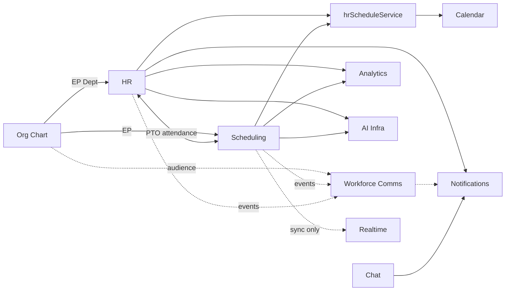

# Business Operations Integration Architecture

**Phase:** Business Operations Phase 0D — Strategic Architecture Program  
**Last updated:** 2026-06-14  
**Constitution:** [BUSINESS_OPERATIONS_STRATEGIC_ARCHITECTURE.md](./BUSINESS_OPERATIONS_STRATEGIC_ARCHITECTURE.md)  
**Ownership:** [WORKFORCE_DOMAIN_BOUNDARY_ANALYSIS.md](./WORKFORCE_DOMAIN_BOUNDARY_ANALYSIS.md)

---

## Integration principles (summary)

1. Name **direction**, **source of truth**, and **owner** for every cross-domain edge
2. **Shared** integrations are contracts — not ownership mergers
3. Apply **FALSE POSITIVE GOVERNANCE** — sockets and workflow notifs are not Workforce Communications
4. Calendar and Chat are **adjacent** — integrated but not BO pillars

---

## Integration map overview

---

## Domain integrations

### Org Chart ↔ HR

| Aspect | Value |
|--------|-------|
| **Direction** | Org chart → HR (identity); HR → org chart (terminate deactivates EP) |
| **Source of truth** | `EmployeePosition`, `Department`, `Position` — **org chart**; `EmployeeHRProfile` — **HR** |
| **Ownership** | Org chart owns placement; HR owns employment metadata |
| **Transport** | FK `employeePositionId`; org-chart API; HR `createEmployee` requires EP |
| **Risks** | HR CSV import bypasses org-chart API (**High**); terminate vs `removeEmployeeFromPosition` asymmetry (**Medium**); legacy `BusinessMember.department` (**Medium**) |
| **Evidence** | [WORKFORCE_IDENTITY_ARCHITECTURE.md](./WORKFORCE_IDENTITY_ARCHITECTURE.md), [HR_ORG_CHART_BOUNDARY_ANALYSIS.md](./HR_ORG_CHART_BOUNDARY_ANALYSIS.md) |

---

### Org Chart ↔ Scheduling

| Aspect | Value |
|--------|-------|
| **Direction** | Org chart → Scheduling (read); Scheduling does not write org structure |
| **Source of truth** | `EmployeePosition`, `Department`, `Position` — org chart |
| **Ownership** | Scheduling consumes identity for shift assignment |
| **Transport** | `employeePositionId`, `departmentId` on shifts |
| **Risks** | Scheduling fields on `Position` (station, job function) blur org design vs planning (**Low**) |
| **Evidence** | Phase 0A boundary doc; [WORKFORCE_DOMAIN_BOUNDARY_ANALYSIS.md](./WORKFORCE_DOMAIN_BOUNDARY_ANALYSIS.md) |

---

### Org Chart ↔ Workforce Communications (target)

| Aspect | Value |
|--------|-------|
| **Direction** | Org chart → Workforce Communications (read-only audience resolution) |
| **Source of truth** | EP, Department, hierarchy — org chart |
| **Ownership** | Comms owns campaign; org chart owns identity |
| **Transport** | Future audience resolver queries — **NOT PRESENT** |
| **Risks** | Parallel roster in Chat or CMS if resolver skipped (**High**) |
| **Evidence** | [WORKFORCE_AUDIENCE_ARCHITECTURE.md](./WORKFORCE_AUDIENCE_ARCHITECTURE.md) |

---

### HR ↔ Scheduling

| Aspect | Value |
|--------|-------|
| **Direction** | Bidirectional integration — HR data read by Scheduling; Scheduling writes attendance stubs on publish |
| **Source of truth** | PTO/attendance — **HR**; shifts/schedules — **Scheduling** |
| **Ownership** | **Shared contract** — neither module owns the other's primary entities |
| **Transport** | Scheduling reads `TimeOffRequest` on assign; publish creates `AttendanceRecord` stubs; PTO conflict check |
| **Risks** | `AttendanceShiftTemplate` vs `ShiftTemplate` naming collision (**Medium**); policy for conflict rules unsettled (**Open**) |
| **Evidence** | Phase 0A/0B; [HR_SCHEDULING_BOUNDARY_REVIEW.md](./HR_SCHEDULING_BOUNDARY_REVIEW.md) |

---

### HR ↔ Calendar

| Aspect | Value |
|--------|-------|
| **Direction** | HR → Calendar (projection); Calendar does not own PTO/shift source data |
| **Source of truth** | PTO requests, published shifts — HR/Scheduling origin; **Calendar Event** — calendar module |
| **Ownership** | **Shared bridge** — `hrScheduleService` (HR package name) |
| **Transport** | `syncTimeOffRequestCalendar`, `syncScheduleShiftsToCalendar`, `scheduleCalendarId` in HR settings |
| **Risks** | Bridge ownership ambiguity — HR-named, multi-consumer (**Medium**) |
| **Evidence** | Phase 0A boundary; Phase 0B HR operation matrix |

---

### Scheduling ↔ Calendar

| Aspect | Value |
|--------|-------|
| **Direction** | Scheduling → Calendar on publish (via bridge) |
| **Source of truth** | Shifts — Scheduling; calendar events — Calendar |
| **Ownership** | Shared via `hrScheduleService` |
| **Transport** | `publishSchedule` → `syncScheduleShiftsToCalendar` |
| **Risks** | Same bridge ownership ambiguity; recurrence/reminder ownership stays Calendar |
| **Evidence** | Phase 0A scheduling operation matrix |

---

### Scheduling ↔ Workforce Communications (target)

| Aspect | Value |
|--------|-------|
| **Direction** | Scheduling → Workforce Communications (event source); Comms → Notifications (delivery) |
| **Source of truth** | Shift/schedule facts — Scheduling; message content — Comms |
| **Ownership** | Scheduling owns planning events; Comms owns operational messages |
| **Transport** | Today: `schedule:*` sockets (**UI sync only** — false positive); Target: domain events + optional `workforce_*` notifications |
| **Risks** | Socket sync mistaken for shift messaging (**High** — FALSE POSITIVE GOVERNANCE) |
| **Evidence** | [CHAT_COMMUNICATIONS_BOUNDARY_ANALYSIS.md](./CHAT_COMMUNICATIONS_BOUNDARY_ANALYSIS.md) |

---

### HR ↔ Workforce Communications (target)

| Aspect | Value |
|--------|-------|
| **Direction** | HR → Comms (lifecycle event hooks); HR → Notifications (workflow — separate path) |
| **Source of truth** | Employment facts — HR; operational campaigns — Comms |
| **Ownership** | `hr_*` workflow notifications remain HR; onboarding **campaigns** (if any) — Comms |
| **Transport** | Today: `hr_*` via `NotificationService`; `OnboardingChatIntegration` → Chat (collaboration) |
| **Risks** | Workflow notifs mistaken for workforce comms (**Medium**) |
| **Evidence** | Phase 0C boundary analysis |

---

## Platform integrations

### Notifications ↔ All domains

| Aspect | Value |
|--------|-------|
| **Direction** | Domains → Notifications (emit); Notifications → users (deliver) |
| **Source of truth** | Event/message content — **domain**; notification row — **platform** |
| **Ownership** | **Platform** — C2 Notifier per [AUTOMATION_CONSUMER_BOUNDARY.md](../architecture/AUTOMATION_CONSUMER_BOUNDARY.md) |
| **Current emitters** | Chat (`chat_*`), HR (`hr_*` × 8); Scheduling (**none**); Comms (**none**) |
| **Risks** | Notifications mistaken for comms product; manifest gaps for hr/scheduling; mark-as-read ≠ compliance ack |
| **Governance** | FALSE POSITIVE GOVERNANCE — Notifications ≠ Workforce Communications |

---

### Analytics ↔ All domains

| Aspect | Value |
|--------|-------|
| **Direction** | Domains → Analytics (read aggregates) |
| **Source of truth** | Domain entities — respective modules; aggregates — analytics layer |
| **Ownership** | HR analytics in HR module today; scheduling server analytics 501; platform analytics partial |
| **Risks** | Triple overlap; UI-computed scheduling stats imply server maturity (**Medium**) |
| **Target** | Clarify module vs platform analytics; consume Activity when available |

---

### AI ↔ All domains

| Aspect | Value |
|--------|-------|
| **Direction** | Domains register context/actions → platform AI infra |
| **Source of truth** | Domain data — modules; AI routing — platform |
| **Ownership** | Per-module `ModuleAIContext`; platform `ActionExecutor` |
| **Current** | Scheduling + HR registered; Comms absent |
| **Risks** | Actions without Policy Engine; cross-domain autonomy undefined |
| **Target** | PE-gated actions; comms context when module exists |

---

## Adjacent domain integrations (non-pillars)

### Chat ↔ Business Operations

| Aspect | Value |
|--------|-------|
| **Direction** | HR onboarding → Chat deep-link; otherwise independent |
| **Source of truth** | Messages — Chat |
| **Ownership** | **Chat** — collaboration only |
| **Risks** | CHANNEL false positive; Chat mistaken for workforce comms (**High**) |

### Calendar ↔ Business Operations

| Aspect | Value |
|--------|-------|
| **Direction** | HR/Scheduling → Calendar via bridge |
| **Source of truth** | Events — Calendar; PTO/shift sources — HR/Scheduling |
| **Ownership** | Calendar owns recurrence and reminders |
| **Risks** | Bridge naming implies HR-only ownership |

### Business front-page CMS ↔ Business Operations

| Aspect | Value |
|--------|-------|
| **Direction** | CMS → employee view (render only) |
| **Source of truth** | `companyAnnouncements` JSON — business config |
| **Ownership** | Business branding — **not** Workforce Communications |
| **Risks** | Surrogate mistaken for broadcast product; `urgent` priority ≠ emergency system |

---

## Shared bridge registry

| Bridge | Package location | Consumers | Ownership status |
|--------|------------------|-----------|------------------|
| `hrScheduleService` | HR services | HR, Scheduling, Calendar | **Ambiguous** — prerequisite to formalize |
| `EmployeePosition` stack | Org chart | HR, Scheduling, Analytics, AI, future Comms | **Settled** — org chart SoT |
| `chatSocketService` | Platform | Chat, Scheduling, Drive, Calendar, Place, Todo | **Platform transport** — not Chat domain for scheduling events |

---

## Integration risk summary

| Risk | Severity | Mitigation |
|------|----------|------------|
| FALSE POSITIVE — sockets as comms | High | FALSE POSITIVE GOVERNANCE |
| Identity import bypass | High | Prerequisite: identity cleanup |
| `hrScheduleService` ambiguity | Medium | Prerequisite: bridge contract |
| Dual shift-template naming | Medium | Prerequisite: collision resolution |
| No scheduling notifications | Medium | Prerequisite: notification standardization |
| Analytics overlap | Medium | Target state ownership clarity |
| Comms absent | High | Prerequisite: domain establishment |

---

## Document authority

Integration facts derive from Phases 0A–0C discovery documents. This map is the **0D strategic synthesis**. Do not re-open ownership without program revision.
