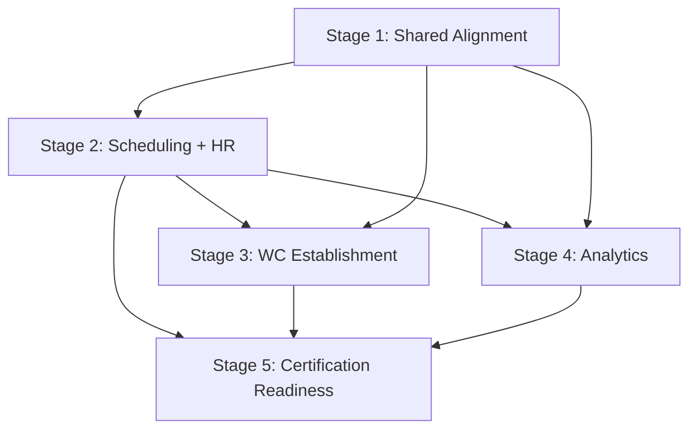

# Business Operations Modernization Master Plan

**Program:** Business Operations Modernization Planning Program  
**Status:** Planning documentation — no implementation, no certification  
**Last updated:** 2026-06-14  
**Constitution:** [BUSINESS_OPERATIONS_STRATEGIC_ARCHITECTURE.md](./BUSINESS_OPERATIONS_STRATEGIC_ARCHITECTURE.md)  
**Alignment input:** [BUSINESS_OPERATIONS_CONSTITUTIONAL_ALIGNMENT.md](./BUSINESS_OPERATIONS_CONSTITUTIONAL_ALIGNMENT.md)  
**Sequence:** [BUSINESS_OPERATIONS_MODERNIZATION_SEQUENCE.md](./BUSINESS_OPERATIONS_MODERNIZATION_SEQUENCE.md)

---

## Executive summary

Business Operations will modernize as **Model C — independent domains consuming shared platform services** — in a **five-stage, convergence-first sequence**. Stage 1 establishes shared constitutional alignment (governance, identity, Activity, Notifications, Policy Engine, Global Trash, bridge contracts). Stages 2–5 modernize Scheduling and HR, establish Workforce Communications, mature analytics, and reach certification readiness. Domains **inherit** platform standards; they do not invent parallel constitutional patterns.

**This document defines strategy only.** No code, schema changes, implementation waves, or certification awards.

---

## Current state

| Pillar | Posture | Constitutional debt |
|--------|---------|---------------------|
| **Scheduling** | Operational built-in module; WS-L1 hub | Activity, Notifications, PE, Trash, V-Link absent; manager 501 stubs; fat controllers |
| **HR** | Operational built-in module; extends org chart | Activity, PE, Trash, V-Link absent; Notifications partial; monolithic controller; CSV identity bypass |
| **Workforce Communications** | Domain **PARTIALLY PRESENT (Phase 1)**; module **NOT PRESENT** | Front-page announcements only; no audience, ack, audit, or fan-out |
| **Org Chart** | Identity anchor | Consumed by BO; HR import bypass is structural risk |
| **Platform services** | Available but not adopted by BO modules | Activity, PE, Global Trash, V-Link gaps across Scheduling and HR |

**18 constitutional gaps (G01–G18)** and **12 convergence opportunities (CO-01–CO-12)** are final inputs per [BUSINESS_OPERATIONS_ALIGNMENT_PRIORITY_MATRIX.md](./BUSINESS_OPERATIONS_ALIGNMENT_PRIORITY_MATRIX.md).

---

## Modernization philosophy

### 1. Model C — hybrid workforce operations

Business Operations is a **program constitution** over independent modules plus platform services — not a codebase merge. Scheduling, HR, and future Workforce Communications remain separate domains with explicit integration contracts.

**Source:** [BUSINESS_OPERATIONS_STRATEGIC_ARCHITECTURE.md](./BUSINESS_OPERATIONS_STRATEGIC_ARCHITECTURE.md)

### 2. Platform-first

Shared platform alignment **precedes** domain-specific modernization. Activity, Notifications, Policy Engine, and Global Trash are built or adopted **once** at the BO shared layer; domains consume.

### 3. Convergence-first

CO-01 through CO-12 resolve gaps across multiple domains simultaneously. Prefer convergence initiatives over three independent domain programs for constitutional services.

**Source:** [BUSINESS_OPERATIONS_CONVERGENCE_PROGRAM.md](./BUSINESS_OPERATIONS_CONVERGENCE_PROGRAM.md)

### 4. Evolution, not greenfield

Workforce Communications evolves from Business Front Page Phase 1 — not assumed as greenfield-only. Scheduling and HR modernize in place — not replaced.

**Source:** [WORKFORCE_COMMUNICATIONS_CONSTITUTIONAL_CLARIFICATION.md](./WORKFORCE_COMMUNICATIONS_CONSTITUTIONAL_CLARIFICATION.md)

### 5. Boundary invariants (non-negotiable)

No modernization plan may violate:

| Invariant | Meaning |
|-----------|---------|
| Chat ≠ Workforce Communications | Collaboration ≠ broadcast |
| Notifications ≠ Workforce Communications | Delivery ≠ content authoring |
| Realtime ≠ Workforce Communications | Transport/sync ≠ campaign lifecycle |
| Workflow Notifications ≠ Workforce Communications | HR workflow alerts ≠ org broadcasts |

**Source:** [CHAT_COMMUNICATIONS_BOUNDARY_ANALYSIS.md](./CHAT_COMMUNICATIONS_BOUNDARY_ANALYSIS.md)

### 6. Honest capability posture

Surrogates and false positives remain labeled. Phase 1 front page is broadcast seed — not complete WC. Sockets remain UI sync — not operational messaging.

---

## Overall strategy — five stages

```
Stage 1: Shared Constitutional Alignment
         CO-06, CO-05, CO-01, CO-02, CO-03, CO-04, CO-07
              ↓
Stage 2: Scheduling + HR Modernization
         CO-08, CO-09, CO-10, G09
              ↓
Stage 3: Workforce Communications Establishment
         CO-11
              ↓
Stage 4: Business Operations Analytics Maturation
         CO-12 / G18
              ↓
Stage 5: Certification Readiness
         CO-12 / G17
```

| Stage | Name | Primary COs / gaps | Domains |
|-------|------|-------------------|---------|
| **1** | Shared Constitutional Alignment | CO-06, CO-05, CO-01–04, CO-07; G01–G07 | All BO |
| **2** | Scheduling + HR Modernization | CO-08, CO-09, CO-10, G09; G08, G10–G13 | Scheduling, HR |
| **3** | Workforce Communications Establishment | CO-11; G14–G16 | WC |
| **4** | Analytics Maturation | CO-12; G18 | Scheduling, HR, Analytics |
| **5** | Certification Readiness | CO-12; G17 | Scheduling, HR |

**Detail:** [SHARED_ALIGNMENT_MODERNIZATION_PLAN.md](./SHARED_ALIGNMENT_MODERNIZATION_PLAN.md) (Stage 1) · [BUSINESS_OPERATIONS_MODERNIZATION_SEQUENCE.md](./BUSINESS_OPERATIONS_MODERNIZATION_SEQUENCE.md) (full sequence)

---

## Dependency model

### Gap priority as governing logic

| Priority | Gaps | Modernization role |
|----------|------|-------------------|
| **P0** | G01, G02 | Stage 1 entry — governance and identity trust |
| **P1** | G03–G07 | Stage 1 body — shared platform contract |
| **P2** | G08–G13, G09 | Stage 2 — domain parity |
| **P3** | G14–G18 | Stages 3–5 — WC, analytics, certification |

### Dependency graph (simplified)



### Gap-to-convergence mapping

| Gap | CO | Stage |
|-----|-----|-------|
| G01 | CO-06 | 1 |
| G02 | CO-05 | 1 |
| G03 | CO-01 | 1 |
| G04 | CO-02 | 1 |
| G05 | CO-03 | 1 |
| G06 | CO-04 | 1 |
| G07 | CO-07 | 1 |
| G08 | CO-08 | 2 |
| G09 | Scheduling-specific | 2 |
| G10, G11 | CO-10 | 2 |
| G12 | CO-02 (Stage 1 pattern; HR completion Stage 2) | 1–2 |
| G13 | CO-09 | 2 |
| G14–G16 | CO-11 | 3 |
| G18 | CO-12 | 4 |
| G17 | CO-12 | 5 |

---

## Sequencing logic

### Why Stage 1 first

Without G01 (governance) and G02 (identity), domain modernization risks wrong architecture absorption and corrupt audience resolution. Without G03–G07, Scheduling and HR cannot inherit a trustworthy platform contract — each would invent parallel Activity, Notification, PE, and Trash patterns.

### Why Stage 2 before Stage 3

Workforce Communications requires trustworthy identity (G02), platform services (G03–G06), and reliable Scheduling publish hooks (G09). Manager 501 stubs and bridge ambiguity (G07, G08) undermine operational messaging integration.

### Why Stages 4–5 last

Analytics (G18) requires Activity foundation (G03). Certification readiness (G17) requires constitutional alignment across Stages 1–3 and honest measurement posture from Stage 4.

### Parallelization within stages

| Stage | May parallelize |
|-------|-----------------|
| 1 | CO-06 + CO-05 (P0); CO-01–04 after G02; CO-07 after G02 |
| 2 | Scheduling and HR domain work (CO-10, G09, G11); CO-08 early in stage |
| 3 | CO-11 internal themes (audience → module → ack) — sequential planning labels |
| 4–5 | Analytics decision (G18) before test foundation (G17) |

**Sequencing is architectural planning gates — not sprints or implementation waves.**

---

## What modernization is NOT

| Excluded | Rationale |
|----------|-----------|
| Single Workforce Operations monolith | Model C validated — domains stay independent |
| Chat extension for broadcasts | Chat ≠ WC — boundary invariant |
| Notification Center as comms product | Notifications = delivery only |
| Socket expansion as workforce messaging | Realtime = sync infrastructure |
| Greenfield-only WC | Phase 1 front page evolves — clarification binding |
| Certification awards in this program | Stage 5 is readiness — not awards |
| Implementation waves or sprints | Separate future implementation programs |
| Re-opening ownership, identity, boundaries | Final inputs — not negotiable |

---

## Success criteria per stage

| Stage | Exit criteria (constitutional posture) |
|-------|----------------------------------------|
| **1** | G01–G07 resolved; FALSE POSITIVE adopted; identity trusted; BO Activity/Notification/PE/Trash patterns defined; `hrScheduleService` contract documented |
| **2** | G08–G13 addressed; manager Scheduling paths complete; thin controllers/services; V-Link registered; HR notifications complete |
| **3** | G14–G16 addressed; WC module registered; audience resolver consumes org chart; ack/audit lifecycle defined; front page evolution path committed |
| **4** | G18 resolved; analytics ownership decision recorded; activity-derived measurement posture |
| **5** | G17 addressed; tenant + critical path test strategy defined; module interoperability checklist honest per domain |

---

## Domain modernization plans

| Domain | Document | Stage |
|--------|----------|-------|
| Shared alignment (first initiative) | [SHARED_ALIGNMENT_MODERNIZATION_PLAN.md](./SHARED_ALIGNMENT_MODERNIZATION_PLAN.md) | 1 |
| Scheduling | [SCHEDULING_MODERNIZATION_PLAN.md](./SCHEDULING_MODERNIZATION_PLAN.md) | 2 |
| HR | [HR_MODERNIZATION_PLAN.md](./HR_MODERNIZATION_PLAN.md) | 2 |
| Workforce Communications | [WORKFORCE_COMMUNICATIONS_ESTABLISHMENT_PLAN.md](./WORKFORCE_COMMUNICATIONS_ESTABLISHMENT_PLAN.md) | 3 |

---

## Document map

| # | Document | Role |
|---|----------|------|
| 1 | **This document** | Master strategy |
| 2 | [BUSINESS_OPERATIONS_CONVERGENCE_PROGRAM.md](./BUSINESS_OPERATIONS_CONVERGENCE_PROGRAM.md) | CO-01–CO-12 programs |
| 3 | [SHARED_ALIGNMENT_MODERNIZATION_PLAN.md](./SHARED_ALIGNMENT_MODERNIZATION_PLAN.md) | Stage 1 first initiative |
| 4 | [SCHEDULING_MODERNIZATION_PLAN.md](./SCHEDULING_MODERNIZATION_PLAN.md) | Scheduling strategy |
| 5 | [HR_MODERNIZATION_PLAN.md](./HR_MODERNIZATION_PLAN.md) | HR strategy |
| 6 | [WORKFORCE_COMMUNICATIONS_ESTABLISHMENT_PLAN.md](./WORKFORCE_COMMUNICATIONS_ESTABLISHMENT_PLAN.md) | WC evolution |
| 7 | [BUSINESS_OPERATIONS_MODERNIZATION_SEQUENCE.md](./BUSINESS_OPERATIONS_MODERNIZATION_SEQUENCE.md) | Executive sequence |
| 8 | [BUSINESS_OPERATIONS_MODERNIZATION_EXECUTIVE_SUMMARY.md](./BUSINESS_OPERATIONS_MODERNIZATION_EXECUTIVE_SUMMARY.md) | 5-min entry |

---

## Relationship to prior programs

| Program | Relationship |
|---------|--------------|
| Phase 0A–0C Discovery | Evidence — unchanged |
| Phase 0D Strategic Architecture | Constitution — unchanged |
| Constitutional Clarification | WC Phase 1 — unchanged |
| Constitutional Alignment | **Input** — G01–G18, CO-01–CO-12 |
| Modernization Prerequisites P1–P12 | Operationalized as gaps and COs |
| **This program** | Strategy layer for future implementation |
| Future implementation | Must follow five-stage sequence |

---

## Certification statement

**No certification awarded.** Master plan is modernization strategy only. Stage 5 names certification **readiness** — not implementation authorization or awards.
