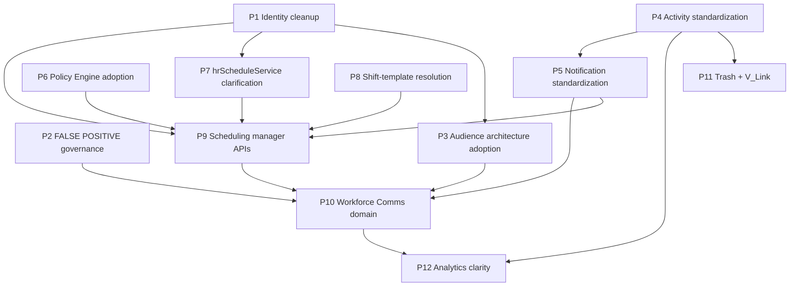

# Business Operations Modernization Prerequisites

**Phase:** Business Operations Phase 0D — Strategic Architecture Program  
**Last updated:** 2026-06-14  
**Amended:** 2026-06-14 — P10 evolve from front page ([WORKFORCE_COMMUNICATIONS_CONSTITUTIONAL_CLARIFICATION.md](./WORKFORCE_COMMUNICATIONS_CONSTITUTIONAL_CLARIFICATION.md))  
**Constitution:** [BUSINESS_OPERATIONS_STRATEGIC_ARCHITECTURE.md](./BUSINESS_OPERATIONS_STRATEGIC_ARCHITECTURE.md)  
**Capability targets:** [BUSINESS_OPERATIONS_CAPABILITY_TARGET_STATE.md](./BUSINESS_OPERATIONS_CAPABILITY_TARGET_STATE.md)

---

## Purpose

Document **architectural prerequisites** and **dependency order** for future Business Operations modernization. **This is not an implementation plan.** No waves, sprints, or delivery timelines are defined here.

---

## Prerequisite categories

| ID | Prerequisite | Rationale | Blocks |
|----|--------------|-----------|--------|
| P1 | **Identity cleanup** | CSV import bypass, terminate/remove asymmetry, legacy member fields undermine audience and lifecycle integrity | HR, Scheduling, Comms, all integrations |
| P2 | **FALSE POSITIVE governance adoption** | Prevents wrong ownership during modernization (Chat/sockets/notifs as comms) | Comms, Scheduling integration, UX |
| P3 | **Audience architecture adoption** | Comms must consume EP + Department — architecture exists (0C) but no implementation | Workforce Communications |
| P4 | **Activity standardization** | Constitutional contract for all BO modules | Certification, Analytics, Audit |
| P5 | **Notification standardization** | Manifest metadata, `scheduling_*`, complete `hr_*`, future `workforce_*` | HR, Scheduling, Comms |
| P6 | **Policy Engine adoption** | Replace ad-hoc middleware for manager/admin writes | HR, Scheduling |
| P7 | **`hrScheduleService` ownership clarification** | Shared bridge ambiguity risks calendar integration drift | HR, Scheduling, Calendar |
| P8 | **Shift-template collision resolution** | `AttendanceShiftTemplate` vs `ShiftTemplate` naming confusion | HR, Scheduling |
| P9 | **Scheduling manager API completion** | 501 manager routes block planning workflows and Comms hooks | Scheduling, manager UX |
| P10 | **Workforce Communications domain establishment** | Phase 1 (front page) exists; full domain missing — evolve front page into standalone module per clarification | Broadcasts, emergency, ack |
| P11 | **Global Trash + V_Link alignment** | Platform constitutional gaps in HR and Scheduling | All BO modules |
| P12 | **Analytics ownership clarity** | Triple overlap (HR, scheduling UI, 501 server) | Labor forecasting, workforce KPIs |

---

## Dependency order

Prerequisites form a **directed acyclic** order. Later items assume earlier gates unless explicitly parallelized.

### Tier 0 — Governance (parallel)

| Prerequisite | Action |
|--------------|--------|
| **P2 FALSE POSITIVE governance** | Adopt [BUSINESS_OPERATIONS_STRATEGIC_ARCHITECTURE.md](./BUSINESS_OPERATIONS_STRATEGIC_ARCHITECTURE.md) § FALSE POSITIVE GOVERNANCE in all BO design reviews |

### Tier 1 — Foundation

| Order | Prerequisite | Depends on |
|-------|--------------|------------|
| 1 | **P1 Identity cleanup** | — |
| 2 | **P7 hrScheduleService clarification** | P1 (identity/stack stable) |
| 3 | **P8 Shift-template collision resolution** | — (can parallel with P7) |

### Tier 2 — Platform constitutional alignment

| Order | Prerequisite | Depends on |
|-------|--------------|------------|
| 4 | **P4 Activity standardization** | P1 |
| 5 | **P5 Notification standardization** | P4 (emit after authorized success) |
| 6 | **P6 Policy Engine adoption** | P1 (identity for authZ subjects) |
| 7 | **P11 Global Trash + V_Link** | P4 |

### Tier 3 — Domain completion (existing modules)

| Order | Prerequisite | Depends on |
|-------|--------------|------------|
| 8 | **P9 Scheduling manager API completion** | P5, P6, P7, P8 |
| 9 | **HR constitutional alignment** | P4, P5, P6, P11 (subset of HR modernization — not waves here) |

### Tier 4 — New pillar

| Order | Prerequisite | Depends on |
|-------|--------------|------------|
| 10 | **P3 Audience architecture adoption** | P1 |
| 11 | **P10 Workforce Communications domain establishment** | P2, P3, P5, P1 |

### Tier 5 — Measurement

| Order | Prerequisite | Depends on |
|-------|--------------|------------|
| 12 | **P12 Analytics ownership clarity** | P4, P9, P10 (optional P10 for comms metrics) |

---

## Prerequisite detail

### P1 — Identity cleanup

**Issues (0B):** HR CSV import bypasses org-chart API; terminate vs remove asymmetry; legacy `BusinessMember.department`/`title`.

**Gate:** All workforce modules must trust single EP write path before audience resolver or cross-module lifecycle automation.

**Source:** [WORKFORCE_IDENTITY_ARCHITECTURE.md](./WORKFORCE_IDENTITY_ARCHITECTURE.md)

---

### P2 — FALSE POSITIVE governance

**Issues (0C):** Chat CHANNEL, scheduling sockets, Notification Center, HR notifs mistaken for **full** Workforce Communications domain. Front-page Phase 1 is broadcast seed — not Chat (per [WORKFORCE_COMMUNICATIONS_CONSTITUTIONAL_CLARIFICATION.md](./WORKFORCE_COMMUNICATIONS_CONSTITUTIONAL_CLARIFICATION.md)).

**Gate:** No BO feature labeled "full workforce comms" without complete lifecycle. Phase 1 front page does not satisfy emergency, ack, or dept broadcast requirements.

**Source:** [CHAT_COMMUNICATIONS_BOUNDARY_ANALYSIS.md](./CHAT_COMMUNICATIONS_BOUNDARY_ANALYSIS.md)

---

### P3 — Audience architecture adoption

**Issues:** Architecture documented; zero consumers.

**Gate:** Comms implementation must use resolver taxonomy from [WORKFORCE_AUDIENCE_ARCHITECTURE.md](./WORKFORCE_AUDIENCE_ARCHITECTURE.md) — no parallel roster.

---

### P4 — Activity standardization

**Issues:** HR and Scheduling lack `emitModuleActivityEvent`.

**Gate:** Module interoperability contract before trustworthy audit/analytics.

**Source:** Platform standards; Phase 0A/0B architecture audits.

---

### P5 — Notification standardization

**Issues:** No `scheduling_*`; HR manifest gap; 3 HR attendance types not emitted.

**Gate:** Manifest metadata + emitters before user-facing notification UX for BO events.

**Source:** [BUSINESS_OPERATIONS_PLATFORM_SERVICES.md](./BUSINESS_OPERATIONS_PLATFORM_SERVICES.md)

---

### P6 — Policy Engine adoption

**Issues:** Custom middleware only in HR and Scheduling.

**Gate:** Manager/admin write paths (swaps, publish, approve) should use PE before scaling automation.

---

### P7 — hrScheduleService ownership clarification

**Issues:** HR-named service consumed by Scheduling and Calendar.

**Gate:** Document neutral contract (owner, versioning, breaking-change policy) — may remain in HR package with shared API surface.

**Source:** [HR_SCHEDULING_BOUNDARY_REVIEW.md](./HR_SCHEDULING_BOUNDARY_REVIEW.md)

---

### P8 — Shift-template collision resolution

**Issues:** `AttendanceShiftTemplate` (HR) vs `ShiftTemplate` (Scheduling).

**Gate:** Naming and conceptual alignment before manager tooling and cross-module UX.

**Source:** Phase 0A/0B boundary docs.

---

### P9 — Scheduling manager API completion

**Issues:** Manager team routes 501; admin swap list empty stub.

**Gate:** Planning workflows before operational messaging hooks (publish events need reliable manager paths).

**Source:** Phase 0A closeout.

---

### P10 — Workforce Communications domain establishment

**Issues:** Domain **PARTIALLY PRESENT (Phase 1)** via Business Front Page; dedicated module **NOT PRESENT**; full broadcast lifecycle incomplete.

**Gate:** **Evolve** Phase 1 front-page implementation into full Workforce Communications domain — standalone module (not Chat extension) with hub, manifest, org-chart audience resolver, notification emitters, ack, and audit.

**Source:** [WORKFORCE_COMMUNICATIONS_STRATEGIC_POSITIONING.md](./WORKFORCE_COMMUNICATIONS_STRATEGIC_POSITIONING.md), [WORKFORCE_COMMUNICATIONS_CONSTITUTIONAL_CLARIFICATION.md](./WORKFORCE_COMMUNICATIONS_CONSTITUTIONAL_CLARIFICATION.md)

---

### P11 — Global Trash + V-Link alignment

**Issues:** Local soft delete and hard delete; no V_Link.

**Gate:** Platform constitutional completeness for BO modules.

---

### P12 — Analytics ownership clarity

**Issues:** HR dashboards + scheduling UI stats + 501 server APIs.

**Gate:** Decision record: module analytics vs platform workforce analytics before labor forecasting investment.

---

## Blocking issues (cannot skip)

| Issue | Why blocking |
|-------|--------------|
| Identity import bypass | Corrupts audience resolution and org trust |
| FALSE POSITIVE absorption of comms into Chat | Wrong architecture for emergency and compliance |
| Manager 501 APIs | Planning pillar incomplete — blocks reliable publish hooks |
| Comms domain incomplete | Phase 1 only — full domain and dedicated module still required |
| Activity absent | Cannot certify or measure BO operations honestly |

---

## What this document does not define

- Sprint or wave schedules
- Team assignments
- Schema migration steps
- Certification criteria or awards
- Budget or timeline

Those belong to **future implementation programs** that must align with [BUSINESS_OPERATIONS_STRATEGIC_ARCHITECTURE.md](./BUSINESS_OPERATIONS_STRATEGIC_ARCHITECTURE.md).

---

## Recommended program sequence (post-0D)

| Step | Program | Prerequisites |
|------|---------|---------------|
| 1 | Platform constitutional alignment (HR + Scheduling) | P4, P5, P6, P11 |
| 2 | Identity and bridge hardening | P1, P7, P8 |
| 3 | Scheduling manager completion | P9 |
| 4 | Workforce Communications evolution (Phase 1 → full domain) | P2, P3, P10 |
| 5 | Analytics and labor forecasting clarity | P12 |

**Note:** Order is architectural — not a committed roadmap.

---

## Document authority

Prerequisites synthesize Phase 0A–0C gaps. Update when implementation evidence changes posture — via explicit program revision, not silent drift.
