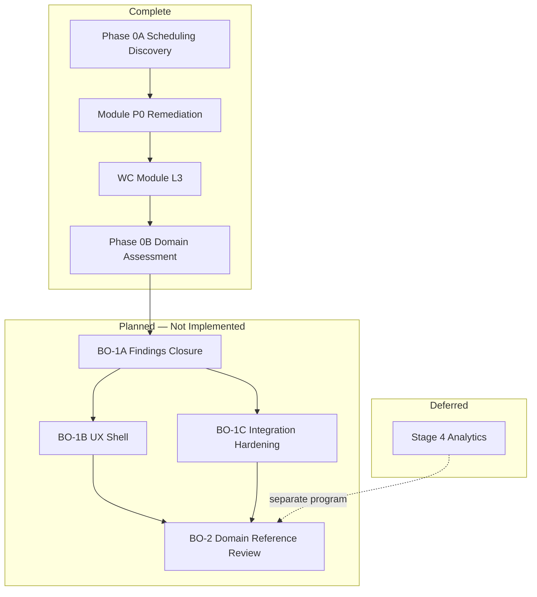

# Business Operations Modernization Roadmap

**Program:** Business Operations Phase 0B — Certification Planning  
**Date:** 2026-06-18  
**Status:** Planning sequence only — **no implementation packages created**  
**Constraint:** No code changes; no ledger updates

**Inputs:**

- [BUSINESS_OPERATIONS_REALITY_ASSESSMENT.md](./BUSINESS_OPERATIONS_REALITY_ASSESSMENT.md)
- [BUSINESS_OPERATIONS_FINDINGS_REGISTER.md](./BUSINESS_OPERATIONS_FINDINGS_REGISTER.md)
- [BUSINESS_OPERATIONS_CERTIFICATION_FRAMEWORK.md](./BUSINESS_OPERATIONS_CERTIFICATION_FRAMEWORK.md)
- Phase 0A closeout (not repeated)
- [BUSINESS_OPERATIONS_MODERNIZATION_SEQUENCE.md](./BUSINESS_OPERATIONS_MODERNIZATION_SEQUENCE.md) (prior planning — reconciled below)

---

## 1. Roadmap purpose

Define the **modernization and certification path** for Business Operations at **domain level**, using Admin Portal program rigor:

1. Close open findings with highest gate impact
2. Harden cross-module integration contracts
3. Align UX shell across three modules
4. Achieve domain reference review readiness

**This document is a sequence plan, not an implementation package catalog.**

---

## 2. Current position

| Milestone | Status |
|-----------|--------|
| Phase 0A (Scheduling discovery) | **Complete** |
| Module remediation (Scheduling P0, WC Phases A–G) | **Complete** |
| Phase 0B (Domain reality + certification planning) | **Complete** (this program) |
| Domain certification review | **NOT READY** (~63% G1–G9) |
| Domain reference designation | **NOT READY** |

### 2.1 Reconciliation with prior modernization sequence

Prior [BUSINESS_OPERATIONS_MODERNIZATION_SEQUENCE.md](./BUSINESS_OPERATIONS_MODERNIZATION_SEQUENCE.md) defined Stages 1–5 (constitutional alignment → scheduling/HR → WC → UX → analytics). Repository evidence shows **Stages 1–2 largely executed** at module level:

| Prior stage | Planned | Current evidence |
|-------------|---------|------------------|
| Stage 1 Constitutional | PE, activity, trash, V_Link | **Shipped** for scheduling/HR/WC services |
| Stage 2 Scheduling + HR | Service extraction, G09 | **AdminTools extracted**; manager routes live |
| Stage 3 Workforce Comms | New module | **Shipped** — 32 routes, L3 |
| Stage 4 Analytics | Labor analytics | **Not started** — 501 stubs remain |
| Stage 5 UX | ConfirmModal, tokens | **Not started** — G9 FAIL |

**Phase 0B roadmap focuses on remaining debt**, not repeating Stages 1–3.

---

## 3. Modernization sequence (domain-level)

### Phase 0B — Reality Assessment & Certification Planning ✅

**Deliverables:** Eight domain assessment documents (this program).  
**Outcome:** Baseline G1–G9 scoring; consolidated findings; recommended next package.

---

### Package BO-1A — Domain Findings Closure & Integration Contracts (NEXT)

**Goal:** Raise domain score from ~63% to ≥70%; close all domain majors and module majors on critical write paths.

| Workstream | Findings | Gates |
|------------|----------|-------|
| AI truthfulness | BO-F-D03 | G8 |
| AI context extraction | F-SCH-004, F-HR-003 | G3 |
| Claim lifecycle | F-SCH-007 | G2 |
| PE completion | F-SCH-005, F-HR-001 | G1 |
| HR↔WC bridge | BO-F-D02 | G4, G5 |
| Documentation placement | BO-F-D01 | G7 |

**Exit criteria:**

- Zero domain majors open
- Module majors on write/AI paths closed or formally waived
- Domain integration contract doc for bridges published

**Blocking rule:** BO-1B and BO-1C should not start until BO-1A majors are closed or waived by Architecture Council.

---

### Package BO-1B — UX Shell Alignment

**Goal:** G9 from FAIL (1/3) to PASS (≥2/3).

| Workstream | Scope | Gates |
|------------|-------|-------|
| ConfirmModal migration | Scheduling 9+ native confirm/prompt sites | G9 |
| EmptyState adoption | Admin list empty paths across 3 modules | G9 |
| Token compliance | Scheduling builder token drift | G9 |
| Workspace landing naming | Align `*WorkspaceLanding` convention | G9 |

**Exit criteria:**

- No native `confirm()`/`prompt()` in BO module components
- UX audit re-run — scheduling ≥ PASS WITH FINDINGS on reference compliance

**Dependency:** Can parallel partial work with BO-1A advisory items; certification G9 gate requires completion.

---

### Package BO-1C — Cross-Module Integration Hardening

**Goal:** G4 + G6 to PASS; domain reference prerequisites.

| Workstream | Scope | Gates |
|------------|-------|-------|
| Cross-module integration tests | Publish → calendar + WC bridge; audience resolution | G6 |
| HTTP integration tests | Scheduling team publish, claim, swap approve | G6 |
| Front-page deprecation | Complete WC migration path | G5 |
| `hrScheduleService` contract | Published integration contract doc | G4, G5 |
| Shift-template decision | Execute CO-08 decision | G5 |

**Exit criteria:**

- Cross-module test suite in CI
- Bridge contracts documented and wired (or deferred with council waiver)

---

### Package BO-2 — Domain Reference Review (gate only)

**Goal:** Council review for Reference Domain designation.

**Prerequisites:**

- G1–G9 ≥85%
- Zero domain majors
- ≤5 advisory findings with tracking plan
- Operation matrices in `docs/architecture/audits/`

**Outcomes:** Reference Domain YES/NO; module reference promotions (#1, #6, #7).

---

### Deferred — Stage 4 Analytics (explicit OUT OF SCOPE)

| Item | Status | Rule |
|------|--------|------|
| Labor cost analytics | 501 | Do not implement in BO-1A–1C |
| Coverage analytics | 501 | Await Analytics module program |
| Compliance reports | 501 | F-SCH-009 remains advisory |

---

## 4. Certification path summary

| Certification target | Timeline class | Dependencies |
|---------------------|----------------|--------------|
| Module L3 unconditional | Post BO-1A | F-SCH-004..007, F-HR-001..003 |
| Domain L3 WITH FINDINGS review | Post BO-1A + BO-1B | G9 ≥2 |
| Reference Domain | Post BO-2 | G1–G9 ≥85% |
| Reference Implementation | **Not planned** | File Hub retains L4 |

---

## 5. Risk register (roadmap)

| Risk | Likelihood | Impact | Mitigation |
|------|------------|--------|------------|
| AI placeholder users hit dead ends | Medium | High | BO-1A P0 — manifest alignment |
| HR→WC bridge never wired | Medium | Medium | BO-1A contract + BO-1C test |
| UX debt blocks domain reference | High | Medium | BO-1B dedicated package |
| Analytics pressure on 501 stubs | Medium | Low | Explicit deferral in roadmap |
| Duplicate planning with prior closeout docs | Low | Low | Phase 0B supersedes for assessment authority |

---

## 6. Recommended next package

# Package BO-1A — Domain Findings Closure & Integration Contracts

**Rationale:**

1. Highest gate impact — closes G8 (AI truthfulness), G3 (AI context), G2 (claim lifecycle), G1 (PE)
2. Unblocks parallel BO-1B/BO-1C
3. Aligns with Admin Portal pattern: compliance/findings before UX shell and reference review
4. Does not require Analytics or new services beyond extraction/wiring

**Charter outline (planning only):**

| # | Deliverable class | Findings |
|---|-------------------|----------|
| 1 | AI manifest + executor alignment | BO-F-D03 |
| 2 | `schedulingAiContextService` extraction | F-SCH-004 |
| 3 | `hrAiContextService` extraction | F-HR-003 |
| 4 | Claim path activity + events | F-SCH-007 |
| 5 | PE route expansion | F-SCH-005, F-HR-001 |
| 6 | HR→WC bridge wiring or waiver doc | BO-F-D02 |
| 7 | Audit-path matrix publication | BO-F-D01 |

**Not in BO-1A:** UX ConfirmModal, analytics 501, new module creation, ledger updates.

---

## Related documents

- [BUSINESS_OPERATIONS_EXECUTIVE_SUMMARY.md](./BUSINESS_OPERATIONS_EXECUTIVE_SUMMARY.md)
- [BUSINESS_OPERATIONS_FINDINGS_REGISTER.md](./BUSINESS_OPERATIONS_FINDINGS_REGISTER.md)
- [BUSINESS_OPERATIONS_MODERNIZATION_MASTER_PLAN.md](./BUSINESS_OPERATIONS_MODERNIZATION_MASTER_PLAN.md)
