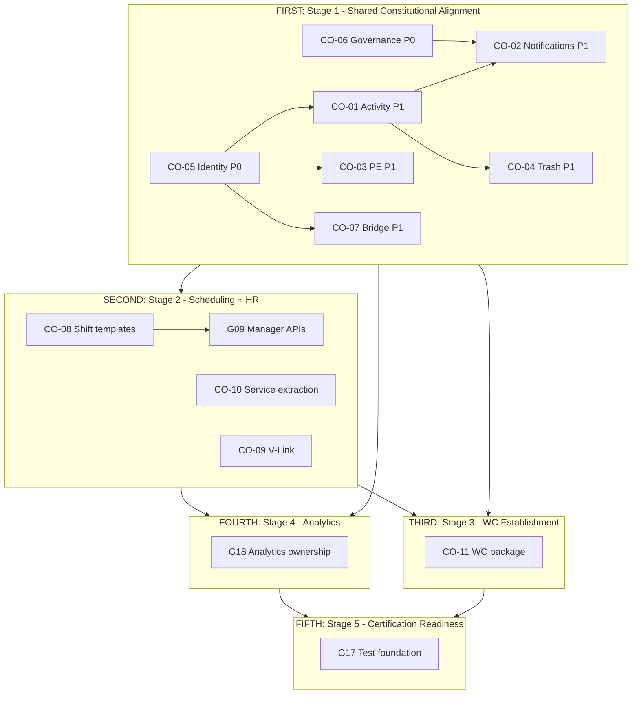

# Business Operations Modernization Sequence

**Program:** Business Operations Modernization Planning Program  
**Status:** **Executive modernization sequence** — first through fifth  
**Last updated:** 2026-06-14  
**Governing logic:** P0 → P1 → P2 → P3 alignment priorities  
**Master plan:** [BUSINESS_OPERATIONS_MODERNIZATION_MASTER_PLAN.md](./BUSINESS_OPERATIONS_MODERNIZATION_MASTER_PLAN.md)

---

## Purpose

Answer the executive question: **What should happen first, second, third, fourth, and fifth?**

This document defines the **five-stage modernization sequence** with rationale, gates, and blocking rules. Sequencing is **architectural planning** — not sprints, waves, or implementation schedules.

**No implementation. No certifications.**

---

## The sequence

### First — Stage 1: Shared Constitutional Alignment

**Programs:** CO-06, CO-05, CO-01, CO-02, CO-03, CO-04, CO-07  
**Gaps:** G01–G07  
**Priority:** P0 (G01, G02) then P1 (G03–G07)

**Rationale:**

| Reason | Detail |
|--------|--------|
| **Planning credibility** | Without P0 governance and identity, domain work risks wrong architecture and corrupt audiences |
| **Platform contract first** | Activity, Notifications, PE, Trash must be defined once — domains inherit in Stage 2 |
| **Convergence economics** | CO-01–04 resolve gaps across Scheduling, HR, and WC simultaneously |
| **Bridge stability** | CO-07 prevents calendar/scheduling drift before manager workflows |

**Document:** [SHARED_ALIGNMENT_MODERNIZATION_PLAN.md](./SHARED_ALIGNMENT_MODERNIZATION_PLAN.md)

---

### Second — Stage 2: Scheduling + HR Modernization

**Programs:** CO-08, CO-09, CO-10, G09  
**Gaps:** G08–G13, G09, G10, G11, G12  
**Priority:** P2

**Rationale:**

| Reason | Detail |
|--------|--------|
| **Foundation required** | Domain parity work depends on Stage 1 patterns — not independent constitutional invention |
| **Parallel domains** | Scheduling and HR modernize in parallel under Model C — separate modules, shared platform consumption |
| **Manager completeness** | G09 Scheduling manager 501 stubs block planning pillar and WC publish hooks |
| **Service boundaries** | CO-10 enables Drive L4 parity before certification readiness |
| **V-Link** | CO-09 requires CO-04 trash lifecycle — Stage 1 dependency |

**Documents:** [SCHEDULING_MODERNIZATION_PLAN.md](./SCHEDULING_MODERNIZATION_PLAN.md) · [HR_MODERNIZATION_PLAN.md](./HR_MODERNIZATION_PLAN.md)

---

### Third — Stage 3: Workforce Communications Establishment

**Program:** CO-11  
**Gaps:** G14, G15, G16  
**Priority:** P3

**Rationale:**

| Reason | Detail |
|--------|--------|
| **Identity dependency** | Audience resolver (G14) requires G02 identity trust from Stage 1 |
| **Platform dependency** | WC emits Activity, Notifications, PE, Trash — all Stage 1 patterns |
| **Scheduling dependency** | Operational messaging hooks require G09 publish reliability from Stage 2 |
| **Evolution not greenfield** | Phase 1 front page evolves — Stage 3 builds on existing broadcast seed |
| **Boundary protection** | Stage 1 CO-06 governance prevents Chat/socket absorption during WC establishment |

**Document:** [WORKFORCE_COMMUNICATIONS_ESTABLISHMENT_PLAN.md](./WORKFORCE_COMMUNICATIONS_ESTABLISHMENT_PLAN.md)

---

### Fourth — Stage 4: Business Operations Analytics Maturation

**Program:** CO-12 (analytics dimension)  
**Gap:** G18  
**Priority:** P3

**Rationale:**

| Reason | Detail |
|--------|--------|
| **Activity foundation** | G03 / CO-01 required — analytics must be activity-derived, not conflated |
| **Honest measurement** | Triple overlap (HR dashboards + scheduling UI stats + 501 server) must be resolved before labor forecasting investment |
| **Ownership clarity** | Decision record: module analytics vs platform workforce analytics |
| **Post-domain posture** | Analytics maturation after Scheduling, HR, and WC constitutional alignment — measurement reflects real operations |

**Does not include:** Labor forecasting implementation; 501 analytics endpoint build-out in this planning stage.

---

### Fifth — Stage 5: Certification Readiness

**Program:** CO-12 (test dimension)  
**Gap:** G17  
**Priority:** P3

**Rationale:**

| Reason | Detail |
|--------|--------|
| **Constitutional completeness** | Certification requires honest module interoperability checklist — Stages 1–3 must complete first |
| **Test foundation** | Tenant isolation + critical paths (swap, publish, PTO, onboarding) need defined strategy |
| **Not certification awards** | Stage 5 is **readiness** — awards are separate future program |
| **Analytics prerequisite** | Stage 4 ownership clarity informs what certification claims are honest |

**Does not include:** Certification awards; L3/L4 certification pursuit authorization.

---

## Sequence diagram

---

## P0–P3 governing logic

| Priority | Gaps | Stage | Governing rule |
|----------|------|-------|----------------|
| **P0** | G01, G02 | 1 (first) | Must resolve before any domain modernization — credibility and identity |
| **P1** | G03–G07 | 1 (body) | Shared platform contract — blocks first-class status for any BO module |
| **P2** | G08–G13, G09 | 2 | Domain parity — Scheduling + HR after shared foundation |
| **P3** | G14–G18 | 3–5 | WC establishment, analytics, certification readiness |

**Alignment source:** [BUSINESS_OPERATIONS_ALIGNMENT_PRIORITY_MATRIX.md](./BUSINESS_OPERATIONS_ALIGNMENT_PRIORITY_MATRIX.md) — rankings final, not re-opened.

---

## Stage gates

### Stage 1 — entry / exit

| | Criteria |
|---|----------|
| **Entry** | Alignment program complete; G01–G18 and CO-01–CO-12 defined |
| **Exit** | G01–G07 resolved at constitutional level (see [SHARED_ALIGNMENT_MODERNIZATION_PLAN.md](./SHARED_ALIGNMENT_MODERNIZATION_PLAN.md) § Exit criteria) |

### Stage 2 — entry / exit

| | Criteria |
|---|----------|
| **Entry** | Stage 1 exit met |
| **Exit** | G08–G13 addressed; G09 manager paths complete; CO-10 service extraction defined; G12 HR notifications complete |

### Stage 3 — entry / exit

| | Criteria |
|---|----------|
| **Entry** | Stage 1 + Stage 2 exit met |
| **Exit** | G14–G16 addressed; WC module registration + hub + audience + ack/audit defined |

### Stage 4 — entry / exit

| | Criteria |
|---|----------|
| **Entry** | Stage 1 exit met (G03 activity); Stage 2 progress recommended |
| **Exit** | G18 analytics ownership decision recorded |

### Stage 5 — entry / exit

| | Criteria |
|---|----------|
| **Entry** | Stages 1–4 exit met |
| **Exit** | G17 test strategy defined; module interoperability checklist honest per domain |

---

## Parallelization rules

| Within stage | May parallelize |
|--------------|-----------------|
| **Stage 1** | CO-06 + CO-05; CO-02 + CO-03 + CO-04 + CO-07 after CO-01 and CO-05 |
| **Stage 2** | Scheduling CO-10 + G09 parallel with HR CO-10 + G12; CO-08 early |
| **Stage 3** | CO-11 internal milestones sequential (audience → module → ack) |
| **Stage 4–5** | G18 before G17 — analytics ownership informs certification claims |

---

## Blocking rules

| Blocked until prior stage exits | Item |
|--------------------------------|------|
| Stage 1 incomplete | Scheduling manager APIs (G09), service extraction (CO-10), WC establishment (CO-11) |
| Stage 1 incomplete | Any domain-specific Activity/Notification/PE/Trash pattern invention |
| Stage 2 incomplete | WC operational hooks depending on Scheduling publish (G09) |
| Stage 1 incomplete | Audience resolver (G14) |
| Stages 1–3 incomplete | Honest certification readiness (G17) |
| G03 unresolved | Analytics maturation (G18) |

---

## Risk of sequence violation

| Violation | Consequence |
|-----------|-------------|
| Stage 2 before Stage 1 | Three parallel constitutional patterns; certification impossible |
| Stage 3 before Stage 1 | WC built on untrusted identity and missing platform services |
| Stage 3 before Stage 2 | Unreliable Scheduling publish hooks; operational messaging incomplete |
| Certification before Stage 4 | Dishonest measurement claims; triple analytics overlap persists |
| Skip CO-06 | Chat/sockets absorbed as WC during Stages 2–3 |

---

## Handoff artifacts between stages

| Transition | Handoff |
|------------|---------|
| Stage 1 → 2 | BO Activity/Notification/PE/Trash patterns; identity trust; bridge contract |
| Stage 2 → 3 | Manager publish reliability; service boundaries; V-Link entity types |
| Stage 3 → 4 | WC campaign activity events; comms metrics scope |
| Stage 4 → 5 | Analytics ownership decision; activity-derived measurement posture |
| Stage 5 → future implementation | Full modernization strategy package; certification readiness — not awards |

---

## Quick reference

| Order | Stage | COs / Gaps | Priority |
|-------|-------|------------|----------|
| **First** | Shared Constitutional Alignment | CO-06, CO-05, CO-01–04, CO-07; G01–G07 | P0, P1 |
| **Second** | Scheduling + HR Modernization | CO-08, CO-09, CO-10, G09; G08–G13 | P2 |
| **Third** | WC Establishment | CO-11; G14–G16 | P3 |
| **Fourth** | Analytics Maturation | CO-12; G18 | P3 |
| **Fifth** | Certification Readiness | CO-12; G17 | P3 |

---

## Certification statement

**No certification awarded.** Sequence is planning gates only. Stage 5 names readiness — not implementation authorization or certification awards.
