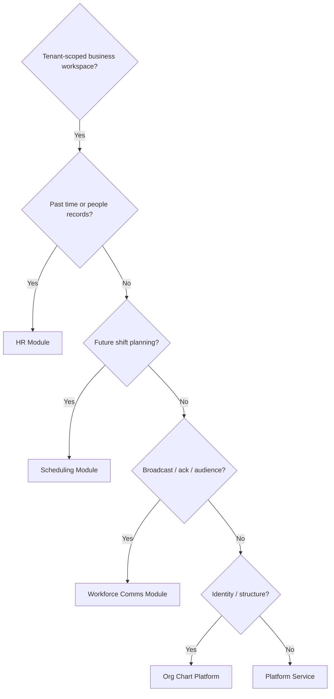

# Business Operations Ownership Model

**Program:** Business Operations Phase 0B — Domain Governance  
**Date:** 2026-06-18  
**Authority:** Extends [WORKFORCE_DOMAIN_BOUNDARY_ANALYSIS.md](./WORKFORCE_DOMAIN_BOUNDARY_ANALYSIS.md) with enforcement model  
**Constraint:** Planning only — no code changes

**Supersedes for executive authority:** Boundary analysis Communications rows marked NOT PRESENT — updated to `workforce_comms` module ownership.

---

## 1. What Business Operations owns

Business Operations is a **platform domain** — a product and governance boundary — not a runtime module id. Runtime ownership is **per module** with shared integration services.

### 1.1 Domain vs module

| Concept | Owner | Code identifier |
|---------|-------|-----------------|
| Business Operations (domain) | Architecture / Product program | None — documentation + ledger rows |
| Scheduling | `scheduling` module | `scheduling` |
| HR / workforce lifecycle | `hr` module | `hr` |
| Workforce Communications | `workforce_comms` module | `workforce_comms` |
| Workforce identity | Platform org chart | `org-chart` routes + `EmployeePosition` |

---

## 2. Capability ownership matrix

| Capability | Owner | Implementation | Enforcement |
|------------|-------|----------------|-------------|
| Schedule / shift planning | **Scheduling** | `Schedule`, `ScheduleShift`, builder, publish | `checkSchedulingModuleInstalled`, PE actions `scheduling:*` |
| Availability | **Scheduling** | `EmployeeAvailability`, `/me/availability` | Employee self + manager read |
| Open shifts / claim | **Scheduling** | `isOpenShift`, claim routes | PE `scheduling:shift.assign` |
| Shift swaps | **Scheduling** | `ShiftSwapRequest` | PE `scheduling:swap.*` |
| Labor philosophy / AI planning | **Scheduling** | `schedulingPhilosophyService`, AI routes | Manifest + ActionExecutor |
| Labor analytics (server) | **Scheduling** (deferred) | 501 stubs | Out of scope until Analytics module |
| Employee HR profiles | **HR** | `EmployeeHRProfile` | PE `hr:employee.*` |
| PTO / time off | **HR** | `TimeOffRequest` | Scheduling reads for conflict only |
| Attendance / clock | **HR** | `AttendanceRecord` | Scheduling writes stubs on publish (shared) |
| Onboarding | **HR** | onboarding models + UI | Integrations to scheduling/calendar/chat |
| Operational broadcasts | **Workforce Comms** | `WorkforceCommunication`, campaigns | PE `workforce:communication.*` |
| Audience targeting | **Workforce Comms** | `WorkforceAudience`, resolution service | Must not duplicate HR roster logic |
| Acknowledgements / read receipts | **Workforce Comms** | `WorkforceAcknowledgement`, `WorkforceReadReceipt` | WC-owned; Chat read state separate |
| Schedule-published notices | **Shared** | `workforceBridgeService` SCHEDULE_PUBLISHED | Bridge ref + optional WC comm |
| Org hierarchy / positions | **Platform (org chart)** | `EmployeePosition`, `Department` | HR and scheduling consume |
| Calendar event storage | **Calendar** | Events via `hrScheduleService` sync | Shared bridge |
| Realtime UI sync (shifts) | **Platform transport + Scheduling** | `chatSocketService` schedule rooms | Not workforce messaging |
| Notifications infrastructure | **Platform** | `NotificationService` | Module-specific types |
| Activity envelope | **Platform** | `emitModuleActivityEvent` | Per-module activity services |
| Global Trash | **Platform API + module handlers** | `trashController` + `*TrashService` | Per-entity handlers |

---

## 3. Shared integration layer

### 3.1 `hrScheduleService` (Shared Bridge)

| Attribute | Value |
|-----------|-------|
| Package location | `server/src/services/hrScheduleService.ts` |
| Consumers | Scheduling publish, HR PTO, Calendar |
| Ownership class | **Shared Platform Integration Service** |
| Naming debt | HR prefix implies HR ownership — document as shared |
| Contract | Published shifts → calendar events; PTO → conflict reads |

**Rule:** Neither Scheduling nor HR may embed calendar Prisma writes outside this bridge without architecture approval.

### 3.2 `workforceBridgeService` (Shared Bridge)

| Bridge kind | Producer | Consumer | Status |
|-------------|----------|----------|--------|
| `SCHEDULE_PUBLISHED` | Scheduling publish | WC optional comm | **Wired** |
| HR policy broadcast | HR (intended) | WC | **Unwired** (BO-F-D02) |
| HR announcement | HR (intended) | WC | **Unwired** (BO-F-D02) |

### 3.3 Org chart identity

```
Platform Org Chart
├── EmployeePosition (identity anchor)
├── Department, Position, OrganizationalTier
├── Consumed by: HR (profiles), Scheduling (assignment), WC (audience)
└── Rule: No module duplicates employee identity records
```

---

## 4. Ownership violations (current)

| Violation | Severity | Evidence | Remediation owner |
|-----------|----------|----------|-------------------|
| Scheduling reads HR PTO without shared policy service | Advisory | Inline conflict check in shift service | Extract shared `workforceConflictService` or document as approved read |
| Dual shift-template models | Major (documented) | `ShiftTemplate` vs `AttendanceShiftTemplate` | [SHIFT_TEMPLATE_DOMAIN_DECISION.md](./SHIFT_TEMPLATE_DOMAIN_DECISION.md) |
| Front-page announcements parallel path | Advisory | `BusinessFrontPage` + WC migration | Complete WC migration; deprecate front-page JSON |
| AI context Prisma in controllers | Major | F-SCH-004, F-HR-003 | Module teams |
| Scheduling manifest AI actions vs executor | Major | BO-F-D03 | Scheduling + platform AI |

**No ownership violation** on tenant scoping — all three modules scope by `businessId` (confirmed in integration tests).

---

## 5. Enforcement model (target state)

Adapted from Admin Portal ownership enforcement:

| Layer | Enforcement mechanism | Current state |
|-------|----------------------|---------------|
| Route mount | Single prefix per module | **Met** |
| Module install gate | `check*ModuleInstalled` middleware | **Met** |
| Authorization | RBAC + Policy Engine dual | **Partial** — PE gaps on reads/aux |
| Data writes | Service-only Prisma | **Mostly met** — AI context exception |
| Cross-module calls | Named bridge services only | **Partial** — HR→WC unwired |
| Activity | `*ActivityService` after success | **Partial** — claim gap |
| Notifications | `*NotificationService` after success | **Met** at service layer |
| Manifest truth | `builtInModuleManifests.ts` | **Partial** — AI actions |
| Documentation | Operation matrix per module | **Met** — wrong path (BO-F-D01) |

### 5.1 Ownership decision tree



---

## 6. Adjacent module boundaries (must not absorb)

| Adjacent module | BO must not |
|-----------------|-------------|
| **Chat** | Duplicate DM/team messaging as workforce ops |
| **Calendar** | Own recurrence/reminder logic in scheduling |
| **Notifications** | Store workforce analytics as activity substitute |
| **Analytics** | Implement labor cost server reports inside scheduling (501 is correct deferral) |
| **Admin Portal** | Conflate platform operator tools with business scheduling |

---

## 7. Recommended ownership actions (planning)

| Priority | Action | Package |
|----------|--------|---------|
| P1 | Reclassify `hrScheduleService` as Shared in boundary doc | BO-1A |
| P1 | Wire or formally defer HR→WC bridge with contract doc | BO-1A |
| P2 | Resolve shift-template dual model per CO-08 decision | BO-1A |
| P2 | Extract AI context to visibility services | BO-1A |
| P3 | Deprecate front-page announcements path | BO-1C |

---

## Related documents

- [WORKFORCE_DOMAIN_BOUNDARY_ANALYSIS.md](./WORKFORCE_DOMAIN_BOUNDARY_ANALYSIS.md) — per-capability detail
- [WORKFORCE_IDENTITY_ARCHITECTURE.md](./WORKFORCE_IDENTITY_ARCHITECTURE.md) — identity stack
- [HR_ORG_CHART_BOUNDARY_ANALYSIS.md](./HR_ORG_CHART_BOUNDARY_ANALYSIS.md) — HR ↔ org chart
- [BUSINESS_OPERATIONS_SERVICE_BOUNDARY_ANALYSIS.md](./BUSINESS_OPERATIONS_SERVICE_BOUNDARY_ANALYSIS.md) — code-layer enforcement
- [BUSINESS_OPERATIONS_FINDINGS_REGISTER.md](./BUSINESS_OPERATIONS_FINDINGS_REGISTER.md)
