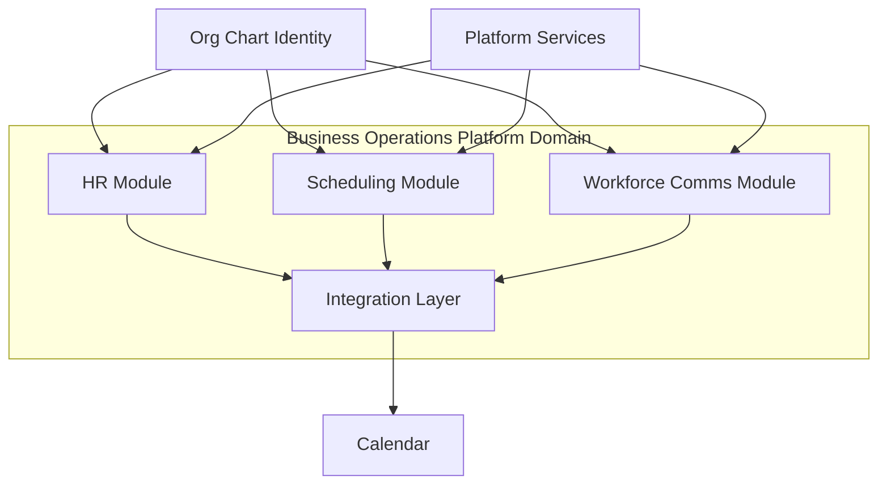

# Business Operations Reality Assessment

**Program:** Business Operations Phase 0B — Domain Reality Assessment & Certification Planning  
**Status:** Complete — discovery and assessment only  
**Date:** 2026-06-18  
**Constraint:** No code changes. No modernization packages. No certification award. No ledger updates.

**Source material (not re-audited):** [BUSINESS_OPERATIONS_PHASE_0A_CLOSEOUT.md](./BUSINESS_OPERATIONS_PHASE_0A_CLOSEOUT.md), [BUSINESS_OPERATIONS_CAPABILITY_MAP.md](./BUSINESS_OPERATIONS_CAPABILITY_MAP.md), [WORKFORCE_DOMAIN_BOUNDARY_ANALYSIS.md](./WORKFORCE_DOMAIN_BOUNDARY_ANALYSIS.md), module-level operation matrices and findings registers.

**Method:** Phase 0A conclusions accepted as scheduling interior baseline; repository re-verified 2026-06-18 for deltas (Workforce Communications module, scheduling remediation, Policy Engine adoption, domain events).

---

## Required answers

| # | Question | Answer |
|---|----------|--------|
| 1 | What is Business Operations today? | A **platform enterprise domain** composed of three built-in modules (`scheduling`, `hr`, `workforce_comms`) plus shared org-chart identity and integration bridges. See §1. |
| 2 | One module, multiple modules, or platform domain? | **Platform domain (hybrid model C)** — multiple modules + shared integration layer. See §2. |
| 3 | Ready for domain certification review? | **NOT READY** at domain level; module-level certifications exist with open findings. See §7. |
| 4 | Blocking domain findings | **0** at domain gate; **3 module majors** and **domain integration gaps** block domain reference designation. See [BUSINESS_OPERATIONS_FINDINGS_REGISTER.md](./BUSINESS_OPERATIONS_FINDINGS_REGISTER.md). |
| 5 | Highest-risk areas | AI action placeholders masking incomplete write paths; scheduling analytics 501 stubs; HR↔WC broadcast bridge unwired; native `confirm()`/`prompt()` UX blockers; partial Policy Engine on read/auxiliary routes. |
| 6 | Remediation sequence | Domain findings closure → cross-module bridge hardening → UX shell alignment → analytics deferral gate. See [BUSINESS_OPERATIONS_MODERNIZATION_ROADMAP.md](./BUSINESS_OPERATIONS_MODERNIZATION_ROADMAP.md). |
| 7 | Future reference pattern? | **Reference Domain** candidate (not Reference Implementation). Scheduling #6, HR #1, WC #7 as module reference candidates. See [BUSINESS_OPERATIONS_REFERENCE_ASSESSMENT.md](./BUSINESS_OPERATIONS_REFERENCE_ASSESSMENT.md). |
| 8 | Next program step | **Package BO-1A — Domain Findings Closure & Integration Contracts** (planning authority only; no implementation in Phase 0B). |

---

## 0. Scope and method

### 0.1 Investigated (repository evidence)

| Layer | Scope | Evidence |
|-------|-------|----------|
| Backend routes | `scheduling.ts` (60), `workforceComms.ts` (32), `hr.ts` (59) | Route handler counts via `router.(get\|post\|put\|patch\|delete)` |
| Services | `scheduling*` (21), `workforce*` (18), `hr*` (15 primary) | `server/src/services/` |
| Controllers | Scheduling (8 files), WC (5), HR (monolithic + AI context) | `server/src/controllers/` |
| Schemas | `prisma/modules/scheduling/core.prisma`, `workforce_comms/core.prisma`, HR modules | 8 + 9 + HR attendance/onboarding models |
| WebSocket | Scheduling only | `chatSocketService.ts`, `useSchedulingWebSocket.ts` |
| AI | Context providers, `ActionExecutor`, module manifests | `registerBuiltInModules.ts`, `ActionExecutor.ts` |
| Frontend | 18 scheduling + 18 WC + 25 HR components | `web/src/components/` |
| Tests | 7 scheduling service + 15 workforce service + HR service tests; 3 route integration files | `server/src/**/__tests__/` |
| Docs | Phase 0A artifacts, module certification audits, post-remediation registers | `docs/business-operations/` |

### 0.2 Not done

- Runtime browser smoke tests across all three modules
- Certification scoring or ledger updates
- Implementation, schema, or service creation
- Re-audit of scheduling interior beyond Phase 0A + delta verification

### 0.3 Evidence confidence

| Label | Meaning |
|-------|---------|
| **Confirmed** | Direct file/route/mount evidence |
| **Inferred** | Structural conclusion from multiple artifacts |
| **UNKNOWN** | Requires runtime verification |

### 0.4 Deltas since Phase 0A (2026-06-14)

| Phase 0A claim | Current reality (2026-06-18) | Impact |
|----------------|-------------------------------|--------|
| Workforce Communications NOT PRESENT | **Module `workforce_comms` shipped** — 32 routes, 18 services, 9 models | Domain boundary doc §Communications rows superseded for implementation presence |
| Scheduling lacks PE, activity, notifications, V_Link, trash | **Services exist and wired** — `schedulingActivityService`, `schedulingNotificationService`, `schedulingTrashService`, `schedulingVlink*`, `schedulingPolicyDual` on 27/60 routes | Constitutional debt largely remediated at service layer |
| Manager team routes 501 | **Team controller has no 501 stubs** — manager publish/assign paths implemented via `schedulingManagerService` | Phase 0A operational gap partially closed |
| No domain events | **20 `scheduling.*` + 18 `workforce.*` types** in `domainEventRegistry.ts` | F-SCH-003 closed per post-remediation register |
| AdminTools controller Prisma | **0 `prisma.` in `schedulingAdminToolsController.ts`** | F-SCH-001 closed |
| Native confirm/prompt UX failures | **Still present** — 9+ `confirm()`/`prompt()` calls in scheduling components | UX finding unchanged |

---

## 1. What Business Operations is today

Business Operations is Vssyl's **workforce operations enterprise domain** — the product surface where businesses plan labor, manage people data, and distribute operational communications. It is **not** a single code module; it is a **governed composition** of three built-in modules mounted in the business workspace.

### 1.1 Scale (re-verified 2026-06-18)

| Layer | Scheduling | Workforce Comms | HR | Domain total |
|-------|------------|-----------------|-----|--------------|
| Express route handlers | **60** | **32** | **59** | **151** |
| Service files (primary) | **21** | **18** | **15** | **54** |
| Controller files | **8** | **5** | **2** (+ monolith) | **15** |
| Prisma models (module-owned) | **8** | **9** | **12+** (core + attendance + onboarding) | **29+** |
| Frontend components | **18** | **18** | **25** | **61** |
| App route pages | **4** | **3** | **9** | **16** |
| API client functions | **~45** | **~25** | **2 clients** (partial consolidation) | **~72** |
| Service-layer tests | **7** | **15** | **10+** | **32+** |
| Route integration tests | **1** | **2** | **partial** | **3+** |

### 1.2 Module identity

| Module id | API mount | Workspace entry | Role in domain |
|-----------|-----------|-----------------|----------------|
| `scheduling` | `/api/scheduling` | `/business/[id]/workspace/scheduling` | Future planning — shifts, availability, swaps, publish |
| `workforce_comms` | `/api/workforce-comms` | `/business/[id]/workspace/workforce-comms` | Operational broadcast, audience, acknowledgement |
| `hr` | `/api/hr` | `/business/[id]/workspace/hr` | Past time — PTO, attendance, onboarding, profiles |

**Shared anchors:** Org chart (`EmployeePosition`, `Department`, `Position`), `hrScheduleService` calendar bridge, platform notification/activity/trash infrastructure.

### 1.3 Adjacent surfaces (not BO-owned)

| Surface | Relationship |
|---------|--------------|
| Org chart | Platform identity hub — BO modules consume |
| Calendar | Event storage; receives PTO + published shifts via `hrScheduleService` |
| Chat | Team/DM messaging — not workforce-scoped operational comms |
| Business front page | Legacy `companyAnnouncements`; WC migration path exists |
| Analytics module | Not started; scheduling labor analytics remain 501 stubs |

---

## 2. Strategic classification

### 2.1 Option evaluation

| Option | Assessment | Key evidence |
|--------|------------|--------------|
| **A. Single module** | **Rejected** | Three distinct module ids, schemas, manifests, workspace landings |
| **B. Multiple independent modules** | **Partial fit** | True at code level; insufficient for product domain governance |
| **C. Platform domain (hybrid)** | **Selected** | Phase 0A model C — separate modules + shared integration layer |
| **D. Control plane** | **Rejected** | Tenant-scoped business workspace modules, not platform-operator surface |
| **E. Reference Implementation** | **Rejected** | File Hub remains sole L4; BO modules are L3 WITH FINDINGS or L3 |

### 2.2 Domain decomposition

### 2.3 Subdomain ownership (summary)

| Subdomain | Owner module | Maturity | Notes |
|-----------|--------------|----------|-------|
| Scheduling (core) | `scheduling` | **MEDIUM–HIGH** | Builder, publish, availability, swaps, claims operational |
| Workforce Communications | `workforce_comms` | **MEDIUM–HIGH** | Full broadcast lifecycle; 4 advisory findings |
| Availability | `scheduling` | **MEDIUM** | Employee CRUD; admin update implemented |
| Shift Marketplace | `scheduling` | **MEDIUM** | Open shifts + claim + swap; claim activity gap (F-SCH-007) |
| Labor Planning | `scheduling` | **LOW–MEDIUM** | Philosophy + AI; server analytics **501** |
| Team Management | `scheduling` + org chart | **MEDIUM** | Manager routes implemented; roster from org chart |
| HR lifecycle | `hr` | **MEDIUM** | PTO, attendance, onboarding; enterprise stubs remain |
| Operations Planning | `scheduling` + AI | **LOW–MEDIUM** | 2/8 AI write actions implemented |

---

## 3. Surface area inventory

### 3.1 Scheduling builder and publish flow

| Surface | Location | Status |
|---------|----------|--------|
| Visual builder | `ScheduleBuilderVisual.tsx` | **Implemented** — DnD grid, WebSocket sync |
| Publish (admin) | `POST /admin/schedules/:id/publish` → `schedulingPublishService` | **Implemented** — HR attendance stubs + calendar sync + socket `schedule:published` |
| Publish (manager) | `POST /team/schedules/:id/publish` → `schedulingManagerService` | **Implemented** (delta since 0A) |
| Templates | `schedulingTemplateService`, `TemplateBuilderVisual.tsx` | **Implemented** |
| Stations / job locations | `schedulingStationService`, `schedulingJobLocationService` | **Implemented** |

### 3.2 Employee availability

| Operation | Route | Service | Status |
|-----------|-------|---------|--------|
| Self CRUD | `/me/availability` | `schedulingAvailabilityService` | **C** |
| Admin view/update | `/admin/availability` | same | **C** |
| Team view | `/team/availability` | `schedulingManagerService` | **C** |
| UI | `AvailabilityManagement.tsx` | — | **C** — native `confirm()` on delete |

### 3.3 Shift claims and swaps

| Operation | Route | Status | Gap |
|-----------|-------|--------|-----|
| Open shift list (employee) | `GET /me/open-shifts` | **C** | — |
| Claim shift | `POST /me/shifts/:id/claim` | **P** | Missing activity + domain event on claim (F-SCH-007) |
| Swap request/cancel | `/me/shifts/:id/swap/request` | **C** | Native `prompt()` for notes |
| Manager approve/deny | `/team/swaps/pending` | **C** | — |
| Admin swap list | `GET /admin/swaps` | **C** | Re-verified — no longer empty stub |

### 3.4 Manager operations

| Operation | Route | Controller | Status |
|-----------|-------|------------|--------|
| Team schedules | `GET /team/schedules` | `schedulingTeamController` | **C** |
| Team publish | `POST /team/schedules/:id/publish` | same | **C** |
| Assign open shift | `POST /team/shifts/:id/assign` | same | **C** |
| Team availability | `GET /team/availability` | same | **C** |
| Pending swaps | `GET /team/swaps/pending` | same | **C** |

### 3.5 WebSocket (scheduling only)

| Event | Room | Consumer |
|-------|------|----------|
| `schedule:shift:created/updated/deleted` | `schedule_{id}` | `ScheduleBuilderVisual` |
| `schedule:published` | `business_{id}` | Builder refresh |

Workforce Communications uses **notifications + feed polling**, not dedicated socket rooms.

### 3.6 Permissions

| Module | Policy actions | Route PE coverage | Legacy middleware |
|--------|----------------|-------------------|-------------------|
| Scheduling | 11 actions | **27/60** routes with `checkSchedulingPolicy` | `schedulingPermissions.ts` dual |
| Workforce Comms | 7 actions | **32/32** routes gated | Full PE coverage |
| HR | 12+ actions | **~25/59** routes with `checkHRPolicy` | Legacy on read/analytics paths |

### 3.7 AI integrations

| Module | Context providers | HTTP AI routes | ActionExecutor writes | Placeholders |
|--------|-------------------|----------------|----------------------|--------------|
| Scheduling | 3 | 2 (`generate-schedule`, `suggest-assignments`) | 2 implemented | 6 manifest actions return placeholders |
| Workforce Comms | 2 | 0 write routes | 0 | Read-only by design |
| HR | 3+ | varies | partial | Enterprise stubs |

**Domain AI posture:** No unified Business Operations AI control plane. Scheduling AI is module-local (compare Admin Portal AI Pipeline subdomain pattern). Recommendation: **module-scoped AI surfaces** unless cross-module planning orchestration is product-required — see [BUSINESS_OPERATIONS_CERTIFICATION_FRAMEWORK.md](./BUSINESS_OPERATIONS_CERTIFICATION_FRAMEWORK.md) §6.

### 3.8 Analytics stubs (scheduling)

Three endpoints return **501** in `schedulingAdminController.ts` L751–759:

- `getLaborCostAnalytics`
- `getCoverageAnalytics`
- `getComplianceReports`

UI may compute client-side stats — misleading maturity signal (F-SCH-009 advisory).

---

## 4. Domain model assessment

Business Operations is a **platform domain** hosting **three modules** with explicit boundaries:

| Evaluated area | Classification | Recommended boundary |
|----------------|----------------|---------------------|
| Scheduling | Module-owned | Keep `scheduling` — planning domain |
| Workforce Management | Split | HR (past time) + org chart (identity) + scheduling (future shifts) |
| Availability | Module-owned | `scheduling` — not HR |
| Shift Marketplace | Module-owned | `scheduling` — claim/swap; bidding remains **Unknown** |
| Labor Planning | Module-owned (partial) | `scheduling` philosophy + deferred analytics platform |
| Team Management | Shared | Org chart roster + scheduling manager scope |
| Operations Planning | Emerging | Scheduling AI + WC broadcast on publish (bridge exists) |

**Canonical ownership reference:** [WORKFORCE_DOMAIN_BOUNDARY_ANALYSIS.md](./WORKFORCE_DOMAIN_BOUNDARY_ANALYSIS.md) — update Communications rows to reflect `workforce_comms` module presence.

---

## 5. Maturity by layer

| Layer | Scheduling | HR | Workforce Comms | Domain |
|-------|------------|-----|-----------------|--------|
| Operational | MEDIUM–HIGH | MEDIUM | MEDIUM–HIGH | MEDIUM–HIGH |
| Architectural | MEDIUM | MEDIUM | MEDIUM–HIGH | MEDIUM |
| UX | LOW–MEDIUM | LOW–MEDIUM | MEDIUM | LOW–MEDIUM |
| Integration | MEDIUM | MEDIUM | MEDIUM | MEDIUM |
| Test evidence | MEDIUM | MEDIUM | HIGH | MEDIUM |
| Documentation | MEDIUM | MEDIUM | MEDIUM | MEDIUM |

---

## 6. Certification posture (domain-level preview)

| Question | Answer |
|----------|--------|
| Current maturity | **Level 2–3 transition** — modules individually certifiable; domain integration incomplete |
| Likely certification level | **Domain: L3 WITH FINDINGS** if modules ratified; not L4 Reference Domain until cross-module contracts hardened |
| Blockers at domain level | 0 constitutional blockers; 7 tracked module majors + 4 domain integration findings |
| Ready for formal domain review? | **NOT READY** — see certification framework |

Full gate scoring: [BUSINESS_OPERATIONS_CERTIFICATION_FRAMEWORK.md](./BUSINESS_OPERATIONS_CERTIFICATION_FRAMEWORK.md).

---

## 7. Related documents

| Document | Role |
|----------|------|
| [BUSINESS_OPERATIONS_FINDINGS_REGISTER.md](./BUSINESS_OPERATIONS_FINDINGS_REGISTER.md) | Consolidated findings |
| [BUSINESS_OPERATIONS_OWNERSHIP_MODEL.md](./BUSINESS_OPERATIONS_OWNERSHIP_MODEL.md) | Ownership enforcement model |
| [BUSINESS_OPERATIONS_SERVICE_BOUNDARY_ANALYSIS.md](./BUSINESS_OPERATIONS_SERVICE_BOUNDARY_ANALYSIS.md) | Controller/service governance |
| [BUSINESS_OPERATIONS_REFERENCE_ASSESSMENT.md](./BUSINESS_OPERATIONS_REFERENCE_ASSESSMENT.md) | Reference candidacy |
| [BUSINESS_OPERATIONS_MODERNIZATION_ROADMAP.md](./BUSINESS_OPERATIONS_MODERNIZATION_ROADMAP.md) | Planned sequence |
| [BUSINESS_OPERATIONS_EXECUTIVE_SUMMARY.md](./BUSINESS_OPERATIONS_EXECUTIVE_SUMMARY.md) | Executive entry point |

---

**Phase 0B complete.** Recommended next step: **Package BO-1A — Domain Findings Closure & Integration Contracts** (planning only).
