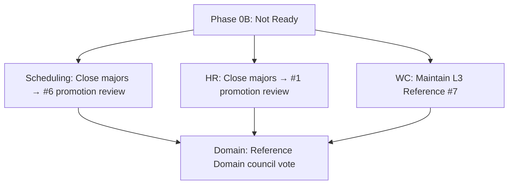

# Business Operations Reference Assessment

**Program:** Business Operations Phase 0B — Reference Candidacy  
**Date:** 2026-06-18  
**Constraint:** Assessment only — no ledger updates; no reference designation awarded

**Parent:** [BUSINESS_OPERATIONS_REALITY_ASSESSMENT.md](./BUSINESS_OPERATIONS_REALITY_ASSESSMENT.md)

---

## 1. Reference taxonomy

| Designation | Definition | BO eligibility |
|-------------|------------|----------------|
| **Reference Implementation (L4)** | Platform constitution in code — single module | **No** — File Hub only |
| **Reference Module (L3+)** | Module teaches a specific platform pattern | **Yes** — per submodule |
| **Reference Domain** | Multi-module domain teaches integration patterns | **Candidate** — conditional |
| **Reference Platform Capability** | Cross-cutting capability (e.g., AI Pipeline admin) | **No** — not a capability plane |

---

## 2. Comparison matrix

| Criterion | File Hub | Chat | Calendar | Place | Admin Portal | Business Operations |
|-----------|----------|------|----------|-------|--------------|---------------------|
| **Maturity score** | 87/100 L4 | L3 | L3 + UX | L3 UX-L3 | L3 CP Reference | **L3 WITH FINDINGS (modules)** |
| **Service decomposition** | Canonical | Strong | Strong | Strong | Remediated post-monolith | **Strong WC; Scheduling remediated; HR large controller** |
| **Thin controllers** | Yes | Yes | Yes | Yes | Improving | **Partial** — AI context fat |
| **Policy Engine** | Dual | Dual | Dual | Dual | Role gate | **Partial** — WC full; Sched/HR gaps |
| **Activity + domain events** | Yes | Yes | Yes | Yes | N/A (control plane) | **Yes** — HR events advisory gap |
| **Global Trash** | Yes | Yes | Yes | Yes | N/A | **Yes** — all three modules |
| **V_Link** | Yes | Yes | Yes | Yes | AI subdomain | **Yes** — all three modules |
| **Operation matrix in audits/** | Yes | Yes | Yes | Yes | Yes | **No** — BO-F-D01 |
| **UX Reference** | UX #1 | — | UX #5 | UX-L3 | Adapted G9 | **FAIL G9** — native confirm |
| **WebSocket realtime** | N/A | Yes | Partial | N/A | N/A | Scheduling UI sync only |
| **AI context providers** | Yes | Yes | Yes | Yes | AI Pipeline | **Yes** — 8 total |
| **AI write executors** | Yes | Yes | Partial | Partial | Governed | **2/8 scheduling live** |
| **Cross-module integration** | Moderate | High | High | Moderate | High (platform) | **High** — bridges |
| **Test HTTP coverage** | Strong | Strong | Strong | Moderate | Improving | **Weak scheduling HTTP** |

---

## 3. Submodule reference candidacy

### 3.1 Scheduling (`scheduling`) — Reference Candidate #6 (Planning)

| Teaches | Evidence | Blockers |
|---------|----------|----------|
| Planning domain split from HR | Standalone schema + publish facade | AI placeholders (BO-F-D03) |
| Publish side-effect orchestration | `schedulingPublishService` + bridge + socket | Claim activity gap (F-SCH-007) |
| Domain events at scale | 20 `scheduling.*` types | — |
| Visual builder + WebSocket | `ScheduleBuilderVisual` | UX token + confirm debt |

**Verdict:** **Reference Module candidate — WITH FINDINGS**. Not promoted until F-SCH-004..007 closed and G9 addressed.

### 3.2 HR (`hr`) — Reference Candidate #1 (Workforce Lifecycle)

| Teaches | Evidence | Blockers |
|---------|----------|----------|
| Org-chart extension pattern | `EmployeeHRProfile` → `EmployeePosition` | PE read coverage (F-HR-001) |
| Multi-entity lifecycle | PTO, attendance, onboarding | AI context fat (F-HR-003) |
| HR↔Scheduling bridge consumer | `hrScheduleService` | Bridge ownership ambiguity |
| V_Link + trash + activity | Services present | Domain events advisory (F-HR-007) |

**Verdict:** **Reference Module candidate — WITH FINDINGS**. Strongest lifecycle teaching value in domain.

### 3.3 Workforce Communications (`workforce_comms`) — Reference Candidate #7 (Broadcast & Acknowledgement)

| Teaches | Evidence | Blockers |
|---------|----------|----------|
| Full PE coverage | 32/32 routes | — |
| Audience resolution | `workforceAudienceService` | — |
| Ack compliance workflow | Ack + read receipt services | Ack reminder deferred (F-WC-008) |
| Service-boundary exemplar | AI context in service layer | 4 advisory hygiene items |
| Cross-module bridge | Schedule published wired | HR bridge unwired |

**Verdict:** **Strongest reference module in domain** — L3 Certified; advisory-only open findings.

---

## 4. Domain-level reference candidacy

### 4.1 Reference Domain evaluation

| Requirement | Status | Notes |
|-------------|--------|-------|
| Multi-module coherent product story | **PASS** | Plan → communicate → track time |
| Documented ownership | **PASS** | Boundary + ownership model |
| Integration contracts | **PARTIAL** | HR→WC unwired |
| Unified documentation trail | **FAIL** | Matrices not in audits/ |
| Cross-module test evidence | **FAIL** | No dedicated suite |
| UX coherence across modules | **FAIL** | G9 domain fail |

**Verdict:** **Reference Domain — NOT READY**. Candidate after BO-1A + BO-1B close domain majors and G9 ≥2.

### 4.2 Reference Platform Capability

| Capability | BO provides? | Better reference |
|------------|-------------|------------------|
| AI control plane | No — module-local AI | Admin Portal AI Pipeline |
| Policy Engine | Partial dual adoption | File Hub / WC |
| Workforce identity | Via org chart | Org chart platform |
| Broadcast infrastructure | Yes — WC | WC module |

**Verdict:** Business Operations should **not** pursue a dedicated AI control plane. WC is the broadcast capability reference.

---

## 5. What BO teaches (when remediated)

| Pattern | Best teacher module |
|---------|---------------------|
| Hybrid domain composition | Domain program (documentation) |
| Publish → calendar + attendance + comms | Scheduling + bridges |
| Audience targeting for workforce | Workforce Comms |
| Org-chart-extended HR lifecycle | HR |
| PE-complete module greenfield | Workforce Comms |
| AI context service layer | Workforce Comms (positive); Scheduling/HR (negative example until fixed) |

---

## 6. Comparison to Phase 0A expectations

| Phase 0A state | Current | Reference impact |
|----------------|---------|------------------|
| WC NOT PRESENT | WC L3 Certified | Domain reference possible |
| Scheduling constitutional gaps | Largely remediated | Stronger #6 candidacy |
| Scheduling manager 501 | Implemented | Operational reference improved |
| UX native confirm | Unchanged | Still blocks UX reference |

---

## 7. Recommended reference path

| Stage | Action |
|-------|--------|
| **Immediate** | Acknowledge WC as domain's strongest reference module |
| **BO-1A** | Close module majors for Scheduling + HR |
| **BO-1B** | G9 UX alignment for domain coherence |
| **Post BO-1C** | Council vote: Reference Domain designation |
| **Not in scope** | Reference Implementation (L4) — File Hub remains sole |

---

## Related documents

- [BUSINESS_OPERATIONS_REFERENCE_CANDIDATES.md](./BUSINESS_OPERATIONS_REFERENCE_CANDIDATES.md) (prior program)
- [BUSINESS_OPERATIONS_CERTIFICATION_FRAMEWORK.md](./BUSINESS_OPERATIONS_CERTIFICATION_FRAMEWORK.md)
- [CERTIFICATION_LEDGER.md](../architecture/CERTIFICATION_LEDGER.md) (read-only reference)
