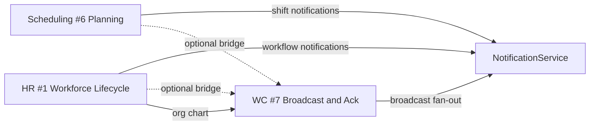

# Business Operations Reference Candidates

**Program:** Business Operations Architecture Council Ratification  
**Ratification date:** 2026-06-14  
**Status:** **APPROVED** — conditional reference candidates (not Reference Implementation)

**Authority:** [CERTIFICATION_LEDGER.md](../architecture/CERTIFICATION_LEDGER.md) §Certification levels; [MODULE_REFERENCE_PATTERNS_FROM_FILE_HUB.md](../guides/MODULE_REFERENCE_PATTERNS_FROM_FILE_HUB.md)

**Council record:** [BUSINESS_OPERATIONS_COUNCIL_RATIFICATION.md](./BUSINESS_OPERATIONS_COUNCIL_RATIFICATION.md) RD-BO-004

---

## Reference hierarchy (Business Operations)

| Tier | Name | BO status |
|------|------|-----------|
| **Level 4** | Reference Implementation | **Denied** — File Hub (`drive`) only |
| **Level 3** | Certified Reference Module | **Not yet** — requires major findings closure + promotion vote |
| **—** | **Reference Candidate** | **Three approved** (this document) |

Reference Candidates are **copy sources** for patterns within their domain. They are not platform-wide architectural law like Level 4 File Hub.

---

## Approved reference candidates

### #1 — HR: Workforce Lifecycle Reference Candidate

| Field | Value |
|-------|-------|
| Module id | `hr` |
| Designation | **Reference Candidate #1 — Workforce Lifecycle** |
| Certification | LEVEL 3 CERTIFIED WITH FINDINGS |
| Ratified | 2026-06-14 |

**Copy-worthy patterns:**

- Employee lifecycle services (`employeeManagementService`, import/terminate/delete)
- Org-chart symmetric lifecycle (hire → position → HR profile)
- Multi-entity V-Link (profile, PTO, attendance, onboarding)
- Scoped Global Trash with legal retention semantics
- HR ↔ Scheduling bridge (`hrScheduleService`, PTO calendar sync)
- Policy Dual resource types (`hr_employee`, `time_off_request`, etc.)
- Workflow notifications via `NotificationService` adapter

**Conditions for Reference Module promotion:**

| Requirement | Finding | Deadline |
|-------------|---------|----------|
| Operation matrix | F-HR-002 | 90 days |
| AI context service layer | F-HR-003 | 90 days |
| PE coverage complete or documented waiver | F-HR-001 | 90 days |

**Evidence:** [HR_CERTIFICATION_AUDIT.md](./HR_CERTIFICATION_AUDIT.md), [BUSINESS_OPERATIONS_REFERENCE_READINESS.md](./BUSINESS_OPERATIONS_REFERENCE_READINESS.md) §2

---

### #6 — Scheduling: Planning Reference Candidate

| Field | Value |
|-------|-------|
| Module id | `scheduling` |
| Designation | **Reference Candidate #6 — Planning** |
| Certification | LEVEL 3 CERTIFIED WITH FINDINGS |
| Ratified | 2026-06-14 |

**Copy-worthy patterns:**

- Schedule / shift domain split
- G09 manager publish facade (`publishBusinessSchedule`)
- Domain event taxonomy (20 `scheduling.*` types)
- `schedulingTrashService` + Global Trash handler
- V-Link entities (schedule, shift, swap)
- `schedulingNotificationService` adapter
- Optional WC bridge hook (publish → draft communication) without ownership transfer

**Conditions for Reference Module promotion:**

| Requirement | Finding | Deadline |
|-------------|---------|----------|
| AI context via service | F-SCH-004 | 90 days |
| PE on auxiliary admin routes | F-SCH-005 | 90 days |
| Operation matrix | F-SCH-006 | 90 days |
| Claim-shift activity + domain events | F-SCH-007 | 90 days |

**Evidence:** [SCHEDULING_CERTIFICATION_REEVALUATION.md](./SCHEDULING_CERTIFICATION_REEVALUATION.md), [BUSINESS_OPERATIONS_REFERENCE_READINESS.md](./BUSINESS_OPERATIONS_REFERENCE_READINESS.md) §3

---

### #7 — Workforce Communications: Broadcast & Acknowledgement Reference Candidate

| Field | Value |
|-------|-------|
| Module id | `workforce_comms` |
| Designation | **Reference Candidate #7 — Broadcast & Acknowledgement** |
| Certification | LEVEL 3 CERTIFIED |
| Ratified | 2026-06-14 |

**Copy-worthy patterns:**

- Audience materialization from org chart (`workforceAudienceService`)
- Publish lifecycle: `authorize → execute → emit activity → notify → read/ack`
- Acknowledgement compliance reporting (`workforceReportingService`)
- Campaign grouping and analytics
- 100% Policy Engine route coverage (BO trilogy benchmark)
- Optional cross-module bridges (`workforceBridgeService`, feature-flagged)
- Constitutional boundaries: no Chat; NotificationService delivery-only; no realtime claim

**Conditions for Reference Module promotion:**

| Requirement | Status |
|-------------|--------|
| Major findings | **None open** (F-WC-001..005 closed) |
| Advisory hygiene | F-WC-006..009 — track 90 days |
| Council promotion vote | Required when advisories closed or accepted |

**Evidence:** [WORKFORCE_COMMUNICATIONS_REFERENCE_CANDIDATE_RECOMMENDATION.md](./WORKFORCE_COMMUNICATIONS_REFERENCE_CANDIDATE_RECOMMENDATION.md)

---

## Cross-candidate integration map

**Invariant:** Bridges create optional WC drafts; HR and Scheduling retain domain ownership.

---

## Explicitly not reference candidates

| Item | Reason |
|------|--------|
| Business Workspace shell | L1 stabilizing — not L3 product |
| Analytics pseudo-module | Not started — out of BO trilogy scope |
| Level 4 for any BO module | Council denied per GD-BO-010 |

---

## Promotion governance

| From | To | Gate |
|------|-----|------|
| Reference Candidate | Certified Reference Module | Major findings closed + council vote |
| Certified Reference Module | Level 4 Reference Implementation | Architecture council + pattern guide contribution — **not in BO program scope** |

---

## Related

- [BUSINESS_OPERATIONS_FINDINGS_TRACKING_PLAN.md](./BUSINESS_OPERATIONS_FINDINGS_TRACKING_PLAN.md)
- [BUSINESS_OPERATIONS_COUNCIL_RATIFICATION.md](./BUSINESS_OPERATIONS_COUNCIL_RATIFICATION.md)
