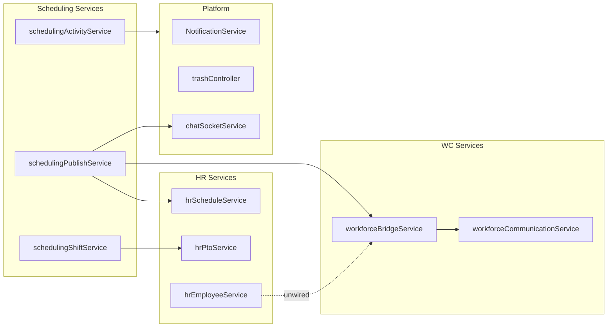

# Business Operations Service Boundary Analysis

**Program:** Business Operations Phase 0B — Domain Architecture Assessment  
**Date:** 2026-06-18  
**Reference:** Admin Portal [`ADMIN_PORTAL_SERVICE_DECOMPOSITION_BLUEPRINT.md`](../architecture/audits/ADMIN_PORTAL_SERVICE_DECOMPOSITION_BLUEPRINT.md), File Hub canonical services  
**Constraint:** Assessment only — no refactoring

**Parent:** [BUSINESS_OPERATIONS_REALITY_ASSESSMENT.md](./BUSINESS_OPERATIONS_REALITY_ASSESSMENT.md)

---

## 1. Executive summary

| Metric | Scheduling | Workforce Comms | HR | Domain |
|--------|------------|-----------------|-----|--------|
| Service files | 21 | 18 | 15 | 54 |
| Controller files | 8 | 5 | 2 + monolith | 15 |
| Fat controllers (Prisma) | 2 partial | 0 | 0 (monolith delegates) | 2 |
| Missing services | 1 (AI context) | 0 | 1 (AI context) | 2 |
| Duplicated logic | Low | Low | Medium (analytics paths) | Medium |
| Cross-domain coupling | `hrScheduleService`, bridge | `workforceBridgeService` | Same | 3 bridges |
| Ownership violations | AI context reads | None major | AI context reads | Bridge unwired |

**Headline:** Business Operations has **completed the File Hub decomposition pattern** at the scheduling service layer (post F-SCH-001 remediation). Remaining debt concentrates in **AI context controllers**, **partial Policy Engine route coverage**, and **cross-module bridge wiring**.

---

## 2. Scheduling module

### 2.1 Service inventory (canonical)

| Service | Responsibility | Pattern alignment |
|---------|----------------|-------------------|
| `schedulingScheduleService` | Schedule CRUD/lifecycle | File Hub entity service |
| `schedulingShiftService` | Shift CRUD/assignment/claim | File Hub entity service |
| `schedulingPublishService` | Publish facade + side effects | File Hub lifecycle |
| `schedulingAvailabilityService` | Availability windows | Entity service |
| `schedulingSwapService` | Swap workflow | Workflow service |
| `schedulingManagerService` | Team/manager operations | Role-scoped facade |
| `schedulingTemplateService` | Shift/schedule templates | Entity service |
| `schedulingStationService` | Stations | Entity service |
| `schedulingJobLocationService` | Job locations | Entity service |
| `schedulingPhilosophyService` | Labor planning strategies | Domain logic |
| `schedulingRecommendationService` | Config recommendations | Read service |
| `schedulingAIActionService` | AI generate/suggest | AI write service |
| `schedulingAdminToolsService` | AI orchestration | Admin tools facade |
| `schedulingActivityService` | Normalized activity | Platform pattern |
| `schedulingNotificationService` | Notifications | Platform pattern |
| `schedulingDomainEventService` | Domain events | Platform pattern |
| `schedulingTrashService` | Global trash | Platform pattern |
| `schedulingVlinkAccessService` | V_Link access | Platform pattern |
| `schedulingVlinkLifecycleService` | V_Link lifecycle | Platform pattern |
| `schedulingServiceShared` | Shared helpers | Utility |
| `schedulingControllerUtils` | HTTP mapping | Utility |

### 2.2 Controller assessment

| Controller | Handlers | Prisma calls | Verdict |
|------------|----------|--------------|---------|
| `schedulingAdminController` | ~35 | 0 (analytics stubs only) | **Thin** — delegates to services |
| `schedulingAdminToolsController` | 13 | **0** (F-SCH-001 closed) | **Thin** |
| `schedulingEmployeeController` | 11 | 0 | **Thin** |
| `schedulingTeamController` | 9 | 0 | **Thin** |
| `schedulingAiContextController` | 3 | **16 reads** | **Fat** — F-SCH-004 |
| `schedulingDashboardController` | 1 | **3 reads** | **Partial** — F-SCH-008 |
| `schedulingShared` | helpers | 0 | OK |

### 2.3 Fat controller / inline Prisma (open)

| Location | Calls | Remediation |
|----------|-------|-------------|
| `schedulingAiContextController.ts` | 16 | Extract `schedulingAiContextService` or visibility layer |
| `schedulingDashboardController.ts` | 3 | Extract `schedulingDashboardQueryService` |

### 2.4 Missing services

| Gap | Evidence | Priority |
|-----|----------|----------|
| AI context read service | Prisma in controller | P1 |
| Realtime adapter (optional) | Socket via `chatSocketService` directly; manifest `realtime` removed | P3 — current pattern acceptable if documented |
| Audit trail service | F-SCH-011 advisory | P3 |

### 2.5 Duplicated logic

| Pattern | Locations | Assessment |
|---------|-----------|------------|
| PTO conflict check | `schedulingShiftService`, AI suggest | Acceptable if centralized in shared helper — verify single function |
| Tenant scope validation | `schedulingServiceShared` | **Good** — DRY |
| Calendar sync side effects | `schedulingPublishService`, claim path | **Partial** — claim missing activity/events (F-SCH-007) |

### 2.6 Cross-domain coupling

| Dependency | Direction | Service | Risk |
|------------|-----------|---------|------|
| HR PTO | Scheduling → HR read | inline / service read | Low if read-only |
| Calendar sync | Scheduling → Calendar | `hrScheduleService` | Medium — naming/ownership |
| WC publish notice | Scheduling → WC | `workforceBridgeService` | Low — optional |
| Org chart positions | Scheduling → Platform | Prisma read in services | Low |

---

## 3. Workforce Communications module

### 3.1 Service inventory

| Service | Responsibility | Pattern alignment |
|---------|----------------|-------------------|
| `workforceCommunicationService` | Comm lifecycle | Entity + workflow |
| `workforceCampaignService` | Campaign grouping | Entity service |
| `workforceAudienceService` | Audience resolution | Domain-critical |
| `workforceAcknowledgementService` | Ack workflow | Workflow service |
| `workforceReadReceiptService` | Read tracking | Event service |
| `workforceAttachmentService` | Attachments | Storage facade |
| `workforceReportingService` | Reports | Analytics read |
| `workforceNotificationService` | Notifications | Platform pattern |
| `workforceActivityService` | Activity | Platform pattern |
| `workforceDomainEventService` | Domain events | Platform pattern |
| `workforceBridgeService` | Cross-module bridges | Integration |
| `workforceMigrationService` | Front-page migration | One-time ops |
| `workforceAiContextService` | AI context data | **Canonical** — reads in service |
| `workforceTrashService` | Global trash | Platform pattern |
| `workforceVlink*` | V_Link | Platform pattern |
| `workforceServiceShared` | Helpers | Utility |
| `workforceControllerUtils` | HTTP mapping | Utility |

### 3.2 Controller assessment

| Controller | Prisma | Verdict |
|------------|--------|---------|
| `workforceCommsAdminController` | 0 | **Thin** |
| `workforceCommsEmployeeController` | 0 | **Thin** |
| `workforceCommsAiContextController` | 0 — delegates to `workforceAiContextService` | **Canonical** (Calendar/WC pattern) |

**Workforce Comms is the strongest service boundary exemplar in the domain.**

### 3.3 Cross-domain coupling

| Dependency | Status |
|------------|--------|
| Scheduling publish → WC | Wired via bridge |
| HR policy → WC | **Unwired** (BO-F-D02) |
| Org chart → audience | Via `workforceAudienceService` |
| Storage → attachments | `workforceAttachmentService` |

---

## 4. HR module

### 4.1 Service inventory (primary)

| Service | Responsibility |
|---------|----------------|
| `hrEmployeeService` | Employee CRUD |
| `hrPtoService` | PTO workflow |
| `hrAttendanceService` | Attendance |
| `hrOnboardingService` | Onboarding |
| `hrScheduleService` | **Shared bridge** to calendar/scheduling |
| `hrAnalyticsService` | Analytics aggregation |
| `hrAnalyticsSupportService` | Analytics helpers |
| `hrAIActionService` | AI writes |
| `hrActivityService` | Activity |
| `hrNotificationService` (via patterns) | Notifications |
| `hrTrashService` | Global trash |
| `hrVlink*` | V_Link |
| `hrSettingsService` | Settings stubs |
| `hrServiceShared` | Shared + partial audit |

### 4.2 Controller assessment

| Controller | LOC | Prisma | Verdict |
|------------|-----|--------|---------|
| `hrController.ts` | ~2,242 | **0** — orchestrates services | **Large but thin** — F-HR-005 advisory |
| `hrAIContextController.ts` | — | **15 reads** | **Fat** — F-HR-003 |

### 4.3 Duplicated logic

| Pattern | Assessment |
|---------|------------|
| Analytics in controller vs service | Partially extracted — ongoing |
| Employee terminate + org chart | Must stay coordinated — document contract |
| CSV import parallel write | Org chart + HR — ownership risk (documented in HR org boundary) |

---

## 5. Cross-domain service map

---

## 6. Governance comparison (Admin Portal framework)

| Admin Portal finding class | BO domain equivalent | Status |
|----------------------------|---------------------|--------|
| Monolith service (`adminService` 4,658 LOC) | No domain monolith; HR controller large | **Better** |
| Fat route files with Prisma | AI context controllers | **Open** |
| API fragmentation (14 mounts) | 3 module mounts | **Better** |
| Missing operation matrix | Module matrices exist; audits path gap | **Partial** |
| Mock fallbacks | None in BO modules | **Better** |
| Debug pages in prod | Enterprise HR stubs (labeled) | **Acceptable** |

---

## 7. Recommended decomposition actions (planning)

| Priority | Action | Target | Package |
|----------|--------|--------|---------|
| P0 | Extract `schedulingAiContextService` | F-SCH-004 | BO-1A |
| P0 | Extract `hrAiContextService` / visibility | F-HR-003 | BO-1A |
| P1 | Wire claim path through activity + domain event helpers | F-SCH-007 | BO-1A |
| P1 | Complete PE on scheduling auxiliary routes | F-SCH-005 | BO-1A |
| P2 | Wire HR→WC bridge handlers | BO-F-D02 | BO-1C |
| P2 | Extract dashboard query service | F-SCH-008 | BO-1B |
| P3 | Optional `schedulingAuditService` | F-SCH-011 | Deferred |

---

## Related documents

- [BUSINESS_OPERATIONS_OWNERSHIP_MODEL.md](./BUSINESS_OPERATIONS_OWNERSHIP_MODEL.md)
- [SCHEDULING_ARCHITECTURE_AUDIT.md](./SCHEDULING_ARCHITECTURE_AUDIT.md) (Phase 0A baseline)
- [WORKFORCE_COMMUNICATIONS_SERVICE_ARCHITECTURE.md](./WORKFORCE_COMMUNICATIONS_SERVICE_ARCHITECTURE.md)
- [BUSINESS_OPERATIONS_FINDINGS_REGISTER.md](./BUSINESS_OPERATIONS_FINDINGS_REGISTER.md)
