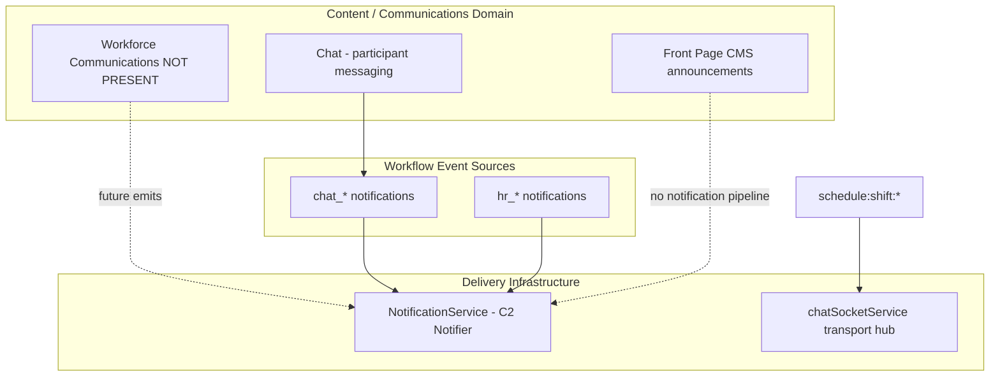

# Chat Communications Boundary Analysis

**Phase:** Business Operations Phase 0C — Discovery only  
**Status:** **Canonical communications boundary reference** for Business Operations  
**Last updated:** 2026-06-14  
**Amended:** 2026-06-14 — front-page FALSE POSITIVE row; see [WORKFORCE_COMMUNICATIONS_CONSTITUTIONAL_CLARIFICATION.md](./WORKFORCE_COMMUNICATIONS_CONSTITUTIONAL_CLARIFICATION.md)  
**Authority:** Complements [WORKFORCE_DOMAIN_BOUNDARY_ANALYSIS.md](./WORKFORCE_DOMAIN_BOUNDARY_ANALYSIS.md) (ownership) and [WORKFORCE_IDENTITY_ARCHITECTURE.md](./WORKFORCE_IDENTITY_ARCHITECTURE.md) (identity)  
**Related:** [WORKFORCE_AUDIENCE_ARCHITECTURE.md](./WORKFORCE_AUDIENCE_ARCHITECTURE.md), [WORKFORCE_COMMUNICATIONS_STRATEGIC_POSITIONING.md](./WORKFORCE_COMMUNICATIONS_STRATEGIC_POSITIONING.md)

---

## Executive summary

| Domain | Owns | Does not own |
|--------|------|--------------|
| **Chat** | Participant-scoped conversations, messages, threads, reactions, message read receipts, `chat_*` notification triggers | Workforce broadcasts, dept-targeted operational messaging, emergency alerts, compliance ack campaigns, shift operational comms |
| **Notifications** | Delivery infrastructure (persist, group, snooze, DND, in-app/email/push fan-out) — **C2 Notifier** | Message authoring, audience selection, campaign content, operational read-receipt campaigns |
| **Workflow notifications** (HR, etc.) | Domain events → alert rows for affected users | Broadcast campaigns, multi-audience operational messaging |
| **Realtime events** (scheduling sockets) | UI synchronization transport | Workforce message content or lifecycle |
| **Front-page announcements** | Static business CMS content | Workforce-scoped audience, ack, audit |
| **Workforce Communications** (future) | Operational message **content**, **audience**, **ack lifecycle**, campaign audit | Chat threads, notification transport, identity CRUD |

**Build inside Chat?** **No** — repository evidence shows different audience model, lifecycle, and product intent.

**Separate domain?** **Yes** — for operational workforce messaging (broadcasts, emergency, compliance ack, schedule operational campaigns).

---

## Scope statement

This document defines **what belongs in Chat vs Notifications vs future Workforce Communications**. It does **not**:

- Re-certify Chat (L3 reference)
- Re-audit Scheduling or HR interiors
- Re-open workforce identity ownership

Scheduling and HR are cited **only** for communication aspects (socket events, `hr_*` notifications).

---

## Three-way ownership model

**Key distinction:**

- **Notifications** = **how** alerts arrive (delivery pipe)
- **Chat** = **peer conversation content** (participant list audience)
- **Workforce Communications** (future) = **operational message content + org-chart audience + ack lifecycle**

---

## What Chat owns

| Capability | Evidence | Maturity |
|------------|----------|----------|
| Direct messaging (DIRECT) | `ConversationType`; `ChatLeftPanel.tsx` creates DIRECT when one participant | HIGH |
| Group messaging (GROUP) | Multi-participant conversations | HIGH |
| CHANNEL label | Enum + API accept `CHANNEL` | MEDIUM — **label only** |
| Messages, threads, reactions | `Message`, `Thread` models | HIGH |
| Message read receipts | `ReadReceipt` model; `chatMessageService.markMessageAsRead` | MEDIUM |
| File attachments in messages | `FileReference` | MEDIUM |
| Tenant scope | `dashboardId` on `Conversation` | MEDIUM |
| Chat notifications | `chat_message`, `chat_mention`, `chat_reaction` | MEDIUM |
| Onboarding deep-link | `OnboardingChatIntegration.tsx` — opens Chat for task discussion | MEDIUM |
| Realtime message fan-out | `chatRealtimeService`, `chatSocketService` chat events | HIGH |

**Chat audience model:** Explicit **participant list** (`ConversationParticipant.userId`). Not org-chart department resolution.

---

## What Chat does NOT own

| Capability | Why not | Evidence |
|------------|---------|----------|
| Business-wide workforce broadcasts | Requires org-chart audience (EP, Dept), not participant picker | No broadcast models |
| Department operational channels | CHANNEL has no `departmentId`, no auto-membership from org chart | `conversations.prisma` — no dept FK |
| Emergency alerts | No alert schema, no ack campaign | Grep: NOT PRESENT |
| Compliance acknowledgements | No required-reading workflow | NOT PRESENT |
| Shift operational messaging | Scheduling uses socket sync, not Chat messages | `chatSocketService` scheduling section |
| Workforce campaign audit | No campaign entity | NOT PRESENT |

---

## What Notifications owns

Per [AUTOMATION_CONSUMER_BOUNDARY.md](../architecture/AUTOMATION_CONSUMER_BOUNDARY.md) — Notifications is **C2 Notifier**:

| Capability | Evidence |
|------------|----------|
| Persist notification rows | `Notification` model |
| Per-channel delivery tracking (schema) | `NotificationDelivery` model |
| `createNotification` API | `notificationService.ts` |
| In-app Notification Center UX | `web/src/app/notifications/page.tsx` |
| Grouping, snooze, DND (product) | Notifications UX Reference #2 |
| Type-based routing | `handleNotification` switch; prefix inference for `hr_*` |

**Notifications does NOT own:**

- Composing workforce broadcast content
- Resolving department/manager-subtree audiences
- Operational read-receipt campaigns (distinct from notification mark-as-read)
- Chat message storage

**Classification:** **Delivery infrastructure**, not a communications product domain.

---

## What Workflow Notifications own (HR example)

| Aspect | Owner | Boundary |
|--------|-------|----------|
| **Event** | HR module (PTO approved, onboarding task, etc.) | Domain workflow |
| **Alert content** | HR controllers/services (title, body, `actionUrl`) | Single-recipient or small set from workflow |
| **Delivery** | `NotificationService` | Platform |
| **Campaign** | — | **Not** a workforce communication campaign |

**8 emitted `hr_*` types** (see [WORKFORCE_COMMUNICATIONS_OPERATION_MATRIX.md](./WORKFORCE_COMMUNICATIONS_OPERATION_MATRIX.md)). These are **workflow notifications**, not operational broadcasts.

**3 documented, not emitted:** `hr_attendance_exception_created`, `hr_attendance_policy_violation`, `hr_attendance_missing_punch`.

---

## What Realtime Events own (scheduling)

| Event | Transport | Purpose |
|-------|-----------|---------|
| `schedule:shift:created` | `chatSocketService.broadcastToSchedule` + `broadcastToBusiness` | UI cache invalidation |
| `schedule:shift:updated` | Same | UI sync |
| `schedule:shift:deleted` | Same | UI sync |
| `schedule:published` | `broadcastToBusiness` | UI sync |

**Evidence:** `chatSocketService.ts` L724–804; client handler `useSchedulingWebSocket.ts`.

**Not workforce communications because:**

- No message content authored for recipients
- No audience selection step — room membership only
- No read receipt or acknowledgement
- No notification center entry
- No campaign audit trail

---

## What Front-page Announcements own

| Aspect | Status |
|--------|--------|
| **Communication content** | Partial — title, body, priority, expiry |
| **Audience** | Business-wide implicit — **no** dept/EP targeting on announcement objects |
| **Acknowledgement** | NOT PRESENT |
| **Audit** | NOT PRESENT |
| **Notification fan-out** | NOT PRESENT |

**Closest surrogate** to workforce broadcasts, but **not** a Workforce Communications domain.

Widget-level `visibleToDepartments` filters **which widgets** a user sees — not announcement audience.

---

## What Workforce Communications would own (future — NOT PRESENT today)

| Capability | Target owner |
|------------|--------------|
| Workforce broadcasts (dept, role, business-wide) | Workforce Communications |
| Emergency / crisis alerts | Workforce Communications |
| Compliance / policy acknowledgement campaigns | Workforce Communications |
| Schedule-change **operational** messaging (distinct from UI sync) | Workforce Communications (content) + optional socket/notification delivery |
| Coverage-gap operational messaging | Workforce Communications |
| Campaign author → audience → delivery → read → ack → audit lifecycle | Workforce Communications |
| Audience resolution via org chart | Workforce Communications **consumer** of identity |

**Delivery:** Should **emit** to `NotificationService` and optionally realtime — not replace platform transport.

**Identity:** Must **consume** `EmployeePosition` + `Department` per [WORKFORCE_IDENTITY_ARCHITECTURE.md](./WORKFORCE_IDENTITY_ARCHITECTURE.md) — not duplicate.

---

## Extension decision: build inside Chat?

| Criterion | Chat | Workforce Comms need | Fit |
|-----------|------|-------------------|-----|
| Audience model | Participant list | Org-chart EP, Dept, hierarchy | **No** |
| Fan-out | Per conversation | Business/dept broadcast | **No** |
| Ack campaigns | Message read only | Required operational ack | **No** |
| Emergency | Not supported | Dedicated alert type | **No** |
| Audit | Message history | Campaign compliance audit | **No** |
| Product intent | Collaboration L3 | Operational coordination | **No** |

**Conclusion:** Repository evidence **does not support** building workforce operational communications inside Chat. Chat remains collaboration; future comms is a **separate domain** using platform delivery services.

---

## Tenancy and transport notes

### `chatSocketService` is shared transport — not Chat domain only

The service handles Chat, Drive, Calendar, Place, Todo, **and Scheduling** events. Naming is historical. Scheduling broadcasts **do not** imply Chat ownership.

### `dashboardId` vs `businessId`

Chat conversations scope to `dashboardId`. Workforce operational comms will likely scope to `businessId` + org-chart audiences — another structural mismatch with Chat as host.

---

## Gap inventory (communications-specific)

| Gap | Status |
|-----|--------|
| Dedicated Workforce Communications module | NOT PRESENT |
| `workforce_*` / `comms_*` notification types | NOT PRESENT |
| `scheduling_*` notification types | NOT PRESENT |
| Dept-targeted announcement content | NOT PRESENT |
| Emergency alert system | NOT PRESENT |
| Operational acknowledgement workflow | NOT PRESENT |
| Workforce read-receipt campaigns | NOT PRESENT |
| HR/scheduling manifest notification metadata | FAIL — gaps in `builtInModuleManifests.ts` |
| CHANNEL dept semantics | NOT PRESENT |

---

# FALSE POSITIVES

**Purpose:** Identify repository surfaces that **appear** to be Workforce Communications but are **not**. Prevents Phase 0D and future modernization from misclassifying delivery, workflow, or collaboration as communications products.

At completion, the following distinctions must be clear:

- **Chat ≠ Workforce Communications**
- **Notifications ≠ Workforce Communications**
- **Workflow Notifications ≠ Workforce Communications**
- **Realtime Events ≠ Workforce Communications**

---

## False positives catalog

| Surface | Why It Appears To Be Workforce Communications | Why It Is Not | Actual Owner |
|---------|-----------------------------------------------|---------------|--------------|
| **Chat CHANNEL conversations** | `ConversationType` includes `CHANNEL`; name suggests department or company channels; API accepts `CHANNEL` on create | No `departmentId` or org-chart binding on `Conversation`; UI creates DIRECT or GROUP from participant count (`ChatLeftPanel.tsx` L91) — **no CHANNEL creation flow**; server treats CHANNEL same as other types — no broadcast semantics; participants are explicit users, not dept-resolved | **Chat module** — conversation construct only |
| **Scheduling socket events** (`schedule:shift:*`, `schedule:published`) | Named "broadcast"; pushes shift data to all users in business/schedule rooms; feels like "shift communication" | Events carry shift payload for **client UI invalidation** (`useSchedulingWebSocket.ts`); no authored message, no audience selection, no ack, no notification row; comment in service: "SCHEDULING MODULE BROADCASTS" = transport | **Scheduling module** (event source) + **Platform** (`chatSocketService` transport) — **workflow synchronization** |
| **Notification Center** | Central inbox for workforce-related alerts; `hr_*` types cover PTO, attendance, onboarding | UI is **delivery** for domain workflow events; does not author campaigns; does not resolve org audiences; `NotificationService` is C2 Notifier per automation boundary; mark-as-read ≠ compliance acknowledgement | **Platform** — Notifications delivery infrastructure |
| **HR notifications** (PTO, attendance, onboarding) | Workforce-facing messages about employment events; titles/bodies describe operational changes | Single-user or workflow-derived alerts from HR controllers/services; triggered by approve/deny/complete actions — **not** multi-audience campaigns; no dept fan-out; types are `hr_*` workflow taxonomy | **HR module** (event source) → **Platform** Notifications (delivery) — **workflow notifications** |
| **Front-page announcements** (`companyAnnouncements`) | Admin posts company news; priority includes `urgent`; `AnnouncementsWidget` displays to employees — looks like broadcast | Stored as flat JSON on `BusinessFrontPageConfig` — business-wide only; **no** department/position audience on announcement records; **no** notification on publish; **no** read receipt or ack; **no** audit trail; widget `visibleToDepartments` applies to **widgets**, not announcement content | **Business front-page CMS** — Phase 1 Workforce Communications (broadcast seed); **not** Chat; **not** full domain |

> **Constitutional clarification (2026-06-14):** Front-page announcements are reclassified as **Phase 1 Workforce Communications** per [WORKFORCE_COMMUNICATIONS_CONSTITUTIONAL_CLARIFICATION.md](./WORKFORCE_COMMUNICATIONS_CONSTITUTIONAL_CLARIFICATION.md). They are the seed broadcast implementation, not equivalent to Chat. FALSE POSITIVE conclusions for **CHANNEL**, **scheduling sockets**, **Notification Center**, and **HR notifications** remain **unchanged**.
| **Chat read receipts** (`ReadReceipt`) | "Read receipt" is a workforce comms capability | Tied to `Message.id` and `userId` in Chat only; no link to operational campaigns, policies, or emergency alerts; no manager compliance dashboard | **Chat module** — collaboration read state |
| **Announcement `priority: urgent`** | UX implies emergency alert | Cosmetic field in CMS JSON; no escalation path, no override DND, no ack tracking, no dedicated emergency routes | **Business front-page CMS** — display metadata only |
| **OnboardingChatIntegration** | HR onboarding "communication" | Deep-link to create/open Chat DM for task discussion — collaboration hook | **HR module** (UI integration) + **Chat** (transport) |
| **`NotificationDelivery` model** | Suggests full multi-channel comms platform | Schema exists; limited runtime fan-out evidence in Phase 0C scope; rows are delivery attempts per notification, not campaign ownership | **Platform** — delivery tracking scaffold |

### Additional surfaces (repository discovery)

| Surface | Why It Appears To Be Workforce Communications | Why It Is Not | Actual Owner |
|---------|-----------------------------------------------|---------------|--------------|
| **Scheduling AI `coverage_status` context** | "Coverage" sounds like coverage **messaging** | Read-only AI context for planning — no message entity | **Scheduling module** — AI context |
| **`chatSocketService` name** | "Chat" in name implies all events are Chat domain | Shared Socket.IO hub for multiple modules (Drive, Calendar, Place, Scheduling, Chat) | **Platform** — realtime transport |

---

## Evidence index

| Topic | Primary paths |
|-------|---------------|
| Chat models | `prisma/modules/chat/conversations.prisma` |
| CHANNEL enum | `server/src/services/chat/chatTypes.ts` |
| UI conversation create | `web/src/app/chat/ChatLeftPanel.tsx` |
| Scheduling broadcasts | `server/src/services/chatSocketService.ts` L724–804 |
| WebSocket client | `web/src/hooks/useSchedulingWebSocket.ts` |
| Notifications | `server/src/services/notificationService.ts` |
| Notifier classification | `docs/architecture/AUTOMATION_CONSUMER_BOUNDARY.md` |
| HR notification emitters | `hrController.ts`, `hrOnboardingService.ts`, `hrAttendanceService.ts` |
| Front page | `FrontPageContentEditor.tsx`, `businessFrontPageService.ts` |
| Widget audience | `businessFrontPageService.getVisibleWidgets` |
| Manifest gaps | `builtInModuleManifests.ts` — hr/scheduling cases |
| Identity consumption target | `WORKFORCE_IDENTITY_ARCHITECTURE.md` |

---

## Document authority

This document is the **canonical communications boundary reference** for Business Operations. Phase 0D Strategic Architecture should cite this document for Chat/Notifications/Comms separation. Supersede only via explicit program revision with new repository evidence.
