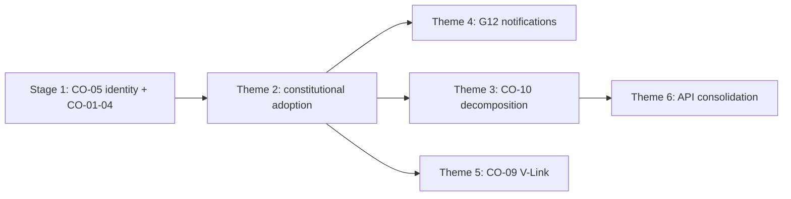

# HR Modernization Plan

**Program:** Business Operations Modernization Planning Program  
**Domain:** HR (`hr`)  
**Stage:** 2 — Scheduling + HR Modernization  
**Last updated:** 2026-06-14  
**Sources:** Phase 0B, [HR_ALIGNMENT_REQUIREMENTS.md](./HR_ALIGNMENT_REQUIREMENTS.md), [WORKFORCE_IDENTITY_ARCHITECTURE.md](./WORKFORCE_IDENTITY_ARCHITECTURE.md)  
**Ownership:** [WORKFORCE_DOMAIN_BOUNDARY_ANALYSIS.md](./WORKFORCE_DOMAIN_BOUNDARY_ANALYSIS.md)

---

## Purpose

Define the modernization strategy for the **HR** domain — workforce lifecycle pillar — using approved constitutional and alignment findings only.

**Invariant:** HR **extends** Org Chart and **never owns** workforce identity.

**No implementation detail. No code. No certifications.**

---

## Current posture

| Dimension | Status |
|-----------|--------|
| **Operational** | PTO, attendance, onboarding, analytics, AI — real persistence on `EmployeeHRProfile` |
| **Architectural** | Constitutional debt — no PE, activity, V-Link, Global Trash; Notifications partial; monolithic controller |
| **Identity** | Extends `EmployeePosition`; CSV import bypasses org-chart API |
| **Workspace** | WS-L1 hub (`HRLayout`) — functional |
| **AI** | PASS WITH FINDINGS — 3 providers, 4 actions |

**Overall:** Functional HR framework requiring **identity trust**, **constitutional adoption**, and **controller decomposition**.

---

## Prerequisites

HR modernization **must not begin** (domain-specific themes) until Stage 1 exit criteria are met. Identity trust (CO-05) is co-entry with Stage 1 — highest structural priority.

| Prerequisite | Gap / CO | Why |
|--------------|----------|-----|
| FALSE POSITIVE governance | G01 / CO-06 | HR workflow notifs ≠ WC |
| Identity trust | G02 / CO-05 | HR extends EP — must not bypass org chart |
| Activity pattern | G03 / CO-01 | PTO/attendance emit contract |
| Notification pattern | G04 / CO-02 | Complete `hr_*` manifest |
| PE pattern | G05 / CO-03 | Admin/manager authZ |
| Global Trash pattern | G06 / CO-04 | Profile/onboarding lifecycle |
| `hrScheduleService` contract | G07 / CO-07 | Bridge owner clarity |

**Stage 1 plan:** [SHARED_ALIGNMENT_MODERNIZATION_PLAN.md](./SHARED_ALIGNMENT_MODERNIZATION_PLAN.md)

---

## Target state

Per [BUSINESS_OPERATIONS_CAPABILITY_TARGET_STATE.md](./BUSINESS_OPERATIONS_CAPABILITY_TARGET_STATE.md):

| Capability | Current | Target |
|------------|---------|--------|
| **Workforce Identity consumption** | Partial — CSV bypass | Single EP write path via org chart |
| **PTO** | Partial | Full workflow + activity + manifest notifications + PE |
| **Attendance** | Partial — 3 notif types missing | Complete notification set; activity; Global Trash |
| **HR module** | Monolithic controller | Domain services; thin controllers |

**Reference bar:** L3 constitutional parity; Drive L4 service boundaries.

---

## Modernization themes

### Theme 1 — Identity trust (G02 / CO-05)

HR is primary consumer and **must not corrupt** org-chart identity.

| Issue (0B) | Modernization direction |
|------------|------------------------|
| CSV import bypasses org-chart API | Route through org-chart write path |
| Terminate vs org remove asymmetry | Lifecycle symmetry |
| Legacy `BusinessMember.department`/`title` | Deprecate for audience; org chart authoritative |

**Rule:** HR extends Org Chart — `EmployeeHRProfile` on `EmployeePosition` — HR does **not** own placement.

**Source:** [WORKFORCE_IDENTITY_ARCHITECTURE.md](./WORKFORCE_IDENTITY_ARCHITECTURE.md), [HR_ORG_CHART_BOUNDARY_ANALYSIS.md](./HR_ORG_CHART_BOUNDARY_ANALYSIS.md)

**Stage:** 1 (CO-05) — HR-specific identity work completes before Stage 2 domain themes

---

### Theme 2 — Constitutional service adoption (inherit Stage 1)

Consume shared BO patterns — do not invent HR-specific Activity, Notification, PE, or Trash infrastructure.

| Service | Adoption scope |
|---------|----------------|
| **Activity** | PTO approve/deny, attendance punch, onboarding steps, profile mutations |
| **Notifications** | Complete `hr_*` — including 3 attendance types |
| **Policy Engine** | PTO approve, attendance admin, profile admin |
| **Global Trash** | `EmployeeHRProfile`, onboarding templates — replace local `deletedAt`/`archivedAt` |

**Gaps:** G03–G06 · **COs:** CO-01–CO-04

---

### Theme 3 — Controller decomposition (G11 / CO-10)

Decompose monolithic `hrController.ts` (~50 handlers, ~77 Prisma calls).

| Current | Target |
|---------|--------|
| Single mega-controller | Domain services: PTO, attendance, onboarding, profiles, analytics |
| Mixed inline Prisma + partial services | Consistent service extraction |
| `hrAIContextController` separate | AI context remains separate pattern |

**Dependencies:** CO-01, CO-03

**Gap:** G11 · **CO:** CO-10 (parallel with Scheduling CO-10)

---

### Theme 4 — Notification completeness (G12)

HR has **partial** notifications — 8 types emitted; manifest gap; 3 attendance types documented but not sent.

| Item | Action |
|------|--------|
| Seed manifest `notifications` block | Complete per CO-02 pattern |
| 3 attendance notification types | Emit via `NotificationService` |
| Grouping map | Align with manifest |

**Dependencies:** G04 / CO-02 (manifest pattern in Stage 1)

**Gap:** G12 — HR-specific completion in Stage 2

**Guardrail:** HR workflow notifications ≠ Workforce Communications broadcasts.

---

### Theme 5 — V-Link registration (G13 / CO-09)

Register HR entity types for cross-module linking.

| Entity types | Link consumers |
|--------------|----------------|
| Employee HR profiles, PTO requests, attendance records | Scheduling, WC, Drive |

**Dependencies:** G06 / CO-04

**Gap:** G13 · **CO:** CO-09

---

### Theme 6 — API consolidation

Phase 0B finding: no general `web/src/api/hr.ts` — inline `fetch` in pages.

| Current | Target |
|---------|--------|
| `hrOnboarding.ts`, `hrAnalytics.ts` only | Unified typed HR API client |
| Inline fetch scattered in components | Proxy-consistent `/api/hr` client |

**Architectural theme** — supports service boundary clarity; not a constitutional gap but Stage 2 hygiene.

---

## Dependency order

| Order | Theme | Gap / CO |
|-------|-------|----------|
| 1 | Identity trust | G02 / CO-05 (Stage 1) |
| 2 | Constitutional adoption | G03–G06 / CO-01–04 |
| 3 | Notification completeness | G12 |
| 4 | Controller decomposition | G11 / CO-10 |
| 5 | V-Link registration | G13 / CO-09 |
| 6 | API consolidation | Architectural hygiene |

---

## FALSE POSITIVE guardrails

| Surface | HR role | Must not become |
|---------|---------|-----------------|
| PTO approved notification | Workflow alert | WC campaign |
| Onboarding notification | Workflow alert | Org broadcast |
| Attendance exception alert | Workflow alert | Compliance ack campaign |
| `hrScheduleService` | Calendar bridge owner | Scheduling domain owner |

---

## Org chart boundary (unchanged)

| Question | Answer |
|----------|--------|
| Does HR own identity? | **No** |
| Does Org Chart own identity? | **Yes** — `EmployeePosition` |
| Does HR extend Org Chart? | **Yes** — `EmployeeHRProfile` |
| Can HR create parallel employee store? | **No** |

---

## What HR modernization does NOT do

| Excluded | Rationale |
|----------|-----------|
| Own org structure | Org chart domain |
| Own shift planning | Scheduling domain |
| Own broadcast authoring | WC domain (Stage 3) |
| Merge with Scheduling | Model C |
| Complete enterprise stubs (200 JSON) | Product debt — out of constitutional scope |
| Certification award | Stage 5 readiness only |

---

## Stage assignment

**Primary stage:** 2 — Scheduling + HR Modernization (parallel with Scheduling)  
**Identity theme:** Stage 1 (CO-05)  
**Enables:** Stage 3 WC identity consumption; Stage 4 analytics

---

## Certification statement

**No certification awarded.** HR modernization plan is strategy only.
