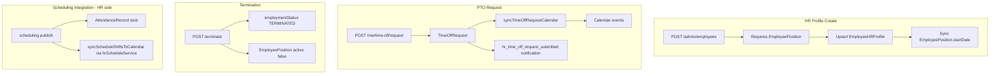

# HR Operation Matrix

**Module id:** `hr`  
**Phase:** Business Operations Phase 0B — Discovery only  
**Status:** Reality assessment (not certified)  
**Last updated:** 2026-06-14  
**Baseline:** [WORKFORCE_DOMAIN_BOUNDARY_ANALYSIS.md](./WORKFORCE_DOMAIN_BOUNDARY_ANALYSIS.md) (Phase 0A ownership — scheduling not re-audited)  
**Related:** [HR_ORG_CHART_BOUNDARY_ANALYSIS.md](./HR_ORG_CHART_BOUNDARY_ANALYSIS.md), [WORKFORCE_IDENTITY_ARCHITECTURE.md](./WORKFORCE_IDENTITY_ARCHITECTURE.md)

---

## Legend

| Symbol | Meaning |
|--------|---------|
| **C** | Compliant — implemented with expected behavior |
| **P** | Partial — works but wrong layer, stub, or incomplete side effects |
| **N** | Non-compliant or missing |
| **—** | Not applicable |

**Columns:** PE = Policy Engine; Act = normalized module activity; Ev = domain event; Ntf = notification; RT = realtime; AI = AI context/action

---

## Module identity (confirmed facts)

| Attribute | Value | Evidence |
|-----------|-------|----------|
| Module id | `hr` | `server/src/startup/seedHRModule.ts` |
| API mount | `/api/hr` | `server/src/index.ts` |
| Prisma source | `prisma/modules/hr/{core,attendance,onboarding}.prisma` | 12+ models |
| Tier gate | Business Advanced+ | `hrFeatureGating.ts` — `checkBusinessAdvancedOrHigher` |
| Workspace hub | `HRLayout` | `web/src/lib/businessWorkspaceContracts.ts` |
| Product intent | Extends org chart; time/people tracking | `prisma/modules/hr/README.md` |

**Confirmed:** HR is a **standalone built-in module** that **extends** org-chart `EmployeePosition` — it does not own org structure.

---

## User journeys (current reality)

### Admin

1. `/business/[id]/admin/hr` — feature cards by tier
2. Employee directory — list/create/update/soft-delete/terminate via `/api/hr/admin/employees`
3. CSV import/export — bulk hire path (writes org entities directly)
4. Onboarding — templates, journeys, document library (feature-gated)
5. Attendance — policies, overview (feature-gated)
6. Time-off — calendar and reports (admin)
7. Analytics — onboarding, attendance, time-off dashboards
8. Enterprise stubs — payroll, recruitment, performance, benefits (200 JSON)

### Manager

1. `/business/[id]/workspace/hr/team` — team employees, pending time-off approve, onboarding tasks, attendance exceptions

### Employee

1. `/business/[id]/workspace/hr/me` — profile, punch in/out, time-off request/balance, onboarding tasks
2. Pay stubs — stub JSON

---

## Data model and ownership boundaries

| Entity | Owner | Scoped by | Notes |
|--------|-------|-----------|-------|
| `EmployeeHRProfile` | hr | `businessId` + `employeePositionId` | 1:1 with `EmployeePosition` |
| `TimeOffRequest` | hr | `businessId` + `employeePositionId` | Calendar sync via `hrScheduleService` |
| `AttendanceRecord`, `AttendancePolicy`, `AttendanceException` | hr | `businessId` | |
| `AttendanceShiftTemplate`, `AttendanceShiftAssignment` | hr | `businessId` | **No API routes** |
| Onboarding models | hr | `businessId` | Journeys link to `EmployeeHRProfile` |
| `HRModuleSettings` | hr | `businessId` | Includes `scheduleCalendarId` |
| `ManagerApprovalHierarchy` | hr (schema) | — | **Unused at runtime** |
| `EmployeePosition`, `Position`, `Department`, `OrganizationalTier` | org chart (platform) | `businessId` | HR reads; CRUD via `/api/org-chart` |
| `BusinessMember` | business module | `businessId` | Legacy `title`/`department` strings |
| Calendar events (PTO, shifts) | calendar (sync target) | via `hrScheduleService` | Shared bridge |

---

## Master operation matrix

### Global middleware (all routes)

| Layer | Implementation | Status |
|-------|----------------|--------|
| Auth | `authenticateJWT` | C |
| Tier | `checkBusinessAdvancedOrHigher` | C |
| Module install | `checkHRModuleInstalled` | C |
| Policy Engine | — | N |

### Admin — employees

| Operation | Route | Controller | PE | Act | Ntf | Status | Notes |
|-----------|-------|------------|----|----|-----|--------|-------|
| List employees | `GET /admin/employees` | `getAdminEmployees` | N | P | — | P | Lists `EmployeePosition` + optional `hrProfile`; `auditLog` on mutations |
| Filter options | `GET /admin/employees/filter-options` | `getEmployeeFilterOptions` | N | N | — | P | Reads `Department`, `Position` |
| Get employee | `GET /admin/employees/:id` | `getAdminEmployee` | N | N | — | P | `:id` = `employeePositionId` |
| Create HR profile | `POST /admin/employees` | `createEmployee` | N | P | — | P | Requires existing `employeePositionId` |
| Update profile | `PUT /admin/employees/:id` | `updateEmployee` | N | P | — | P | |
| Soft delete profile | `DELETE /admin/employees/:id` | `deleteEmployee` | N | P | — | P | `deletedAt` on profile only |
| Terminate | `POST /admin/employees/:id/terminate` | `terminateEmployee` | N | P | — | P | HR profile + deactivate `EmployeePosition` |
| Audit logs | `GET /admin/employees/:id/audit-logs` | `getEmployeeAuditLogs` | N | N | — | P | `prisma.auditLog` — not module activity |
| Import CSV | `POST /admin/employees/import` | `importEmployeesCSV` | N | P | — | P | **Bypasses org-chart API** — creates Dept/Position/EP |
| Export CSV | `GET /admin/employees/export` | `exportEmployeesCSV` | N | N | — | P | |

### Admin — time-off

| Operation | Route | Status | Notes |
|-----------|-------|--------|-------|
| Calendar | `GET /admin/time-off/calendar` | C | Used by scheduling builder (read) |
| Reports | `GET /admin/time-off/reports` | P | |

### Admin — settings

| Operation | Route | Status | Notes |
|-----------|-------|--------|-------|
| Get settings | `GET /admin/settings` | P | Defaults; DB read commented stub |
| Update settings | `PUT /admin/settings` | N | Stub response |
| Feature availability | `GET /admin/features` | C | |

### Admin — analytics

| Operation | Route | Service | Status |
|-----------|-------|---------|--------|
| Onboarding analytics | `GET /admin/analytics/onboarding` | `hrAnalyticsService` | C |
| Attendance analytics | `GET /admin/analytics/attendance` | `hrAnalyticsService` | C |
| Time-off analytics | `GET /admin/analytics/time-off` | `hrAnalyticsService` | C |

### Admin — onboarding (feature-gated)

| Operation | Route | Status |
|-----------|-------|--------|
| Templates CRUD | `/admin/onboarding/templates*` | C |
| Document library | `GET /admin/onboarding/documents/library` | C |
| Journeys list/start | `/admin/onboarding/journeys*` | C |
| Complete task | `POST /admin/onboarding/tasks/:taskId/complete` | C |

### Admin — attendance (feature-gated)

| Operation | Route | Status | Notes |
|-----------|-------|--------|-------|
| Overview | `GET /admin/attendance/overview` | C | |
| Policies CRUD | `/admin/attendance/policies*` | C | |
| Shift templates (service only) | — | N | `hrAttendanceService` — no routes |

### Admin — enterprise stubs

| Operation | Route | Status |
|-----------|-------|--------|
| Payroll | `GET /admin/payroll` | N — 200 JSON stub |
| Recruitment | `GET /admin/recruitment` | N — 200 JSON stub |
| Performance | `GET /admin/performance` | N — 200 JSON stub |
| Benefits | `GET /admin/benefits` | N — 200 JSON stub |

### Manager — team

| Operation | Route | Status | Notes |
|-----------|-------|--------|-------|
| Team employees | `GET /team/employees` | C | Scoped via `Position.reportsToId` |
| Pending time-off | `GET /team/time-off/pending` | C | |
| Approve time-off | `POST /team/time-off/:id/approve` | C | Emits notifications + calendar sync |
| Team onboarding tasks | `/team/onboarding/tasks*` | C | |
| Attendance exceptions | `/team/attendance/exceptions*` | C | Resolve emits `hr_attendance_exception_resolved` |
| Time-off calendar | `GET /team/time-off/calendar` | C | |

### Employee — self

| Operation | Route | Status | Notes |
|-----------|-------|--------|-------|
| Own HR data | `GET /me` | P | Stub object if no `EmployeePosition` |
| Update own data | `PUT /me` | N | Stub |
| Punch in/out | `POST /me/attendance/punch-in\|out` | C | Feature-gated |
| Attendance records | `GET /me/attendance/records` | C | |
| Request time-off | `POST /me/time-off/request` | C | Route comment says stub; implementation persists |
| Balance | `GET /me/time-off/balance` | P | |
| List/cancel requests | `/me/time-off/requests`, cancel | C | |
| Onboarding self | `/me/onboarding/*` | C | |
| Pay stubs | `GET /me/pay-stubs` | N — 200 JSON stub |

### AI context

| Operation | Route | Status |
|-----------|-------|--------|
| Overview | `GET /ai/context/overview` | C |
| Headcount | `GET /ai/context/headcount` | C |
| Time-off | `GET /ai/context/time-off` | C |

### Widget

| Operation | Route | Status |
|-----------|-------|--------|
| Dashboard summary | `GET /dashboard-summary` | P |

---

## Data flows

---

## Module interactions

### Org chart (primary dependency)

| Integration | Direction | Evidence |
|-------------|-----------|----------|
| Employee assignment | Org chart owns | `employeeManagementService.assignEmployeeToPosition` — `/api/org-chart/employees/assign` |
| HR profile requires EP | HR reads org chart | `createEmployee` validates `employeePositionId` |
| Manager scope | HR reads org hierarchy | `resolveManagerContext` uses `Position.reportsToId` |
| CSV import bypass | HR writes org entities | `importEmployeesCSV` — direct Prisma |

### Scheduling (integration only — not re-audited)

| Integration | Direction | Evidence |
|-------------|-----------|----------|
| PTO conflict read | Scheduling → HR | Phase 0A — `schedulingAdminController` |
| Publish attendance stubs | Scheduling → HR | Phase 0A — `publishSchedule` |
| Calendar shift sync | Shared bridge | `hrScheduleService.syncScheduleShiftsToCalendar` |
| Time-off calendar in builder | Scheduling reads HR | `ScheduleBuilderVisual.tsx` → `/api/hr/admin/time-off/calendar` |

### Calendar

| Integration | Evidence |
|-------------|----------|
| PTO → events | `hrScheduleService.syncTimeOffRequestCalendar` |
| Business schedule calendar | `initializeHrScheduleForBusiness`, `HRModuleSettings.scheduleCalendarId` |
| Member sync on invite | `businessController` → `addUsersToScheduleCalendar` |

### Notifications

| Type | Sender | Status |
|------|--------|--------|
| `hr_time_off_request_submitted` | `hrController` | C |
| `hr_time_off_request_approved/denied` | `hrController` | C |
| `hr_time_off_balance_low` | `hrController` | C |
| `hr_onboarding_task_*` | `hrOnboardingService` | C |
| `hr_attendance_exception_resolved` | `hrAttendanceService` | C |
| `hr_attendance_exception_created` etc. | — | N — documented, not sent |

### AI

| Surface | Evidence |
|---------|----------|
| 3 context providers | `hrAIContextController.ts` |
| Actions | `ActionExecutor.executeHRAction`: time-off request/approve, clock in/out |
| `hrAIActionService` | `aiRequestTimeOff`, `aiApproveTimeOff` |

---

## Missing capabilities (confirmed)

- Enterprise modules (payroll, recruitment, performance, benefits) — JSON stubs
- `PUT /admin/settings`, `PUT /me` — stubs
- Attendance shift template/assignment API routes
- Normalized module activity events
- Policy Engine, V_Link, Global Trash
- Dedicated HR test suite
- `notifications` block in seed manifest
- Call-offs, timecards, overtime — no dedicated models (UNKNOWN)

---

## Evidence table

| Category | Path |
|----------|------|
| Schema | `prisma/modules/hr/core.prisma`, `attendance.prisma`, `onboarding.prisma`, `README.md` |
| Org chart schema | `prisma/modules/business/org-chart.prisma`, `business.prisma` |
| Routes | `server/src/routes/hr.ts` |
| Controller | `server/src/controllers/hrController.ts`, `hrAIContextController.ts` |
| Services | `server/src/services/hr{Onboarding,Attendance,Analytics,Schedule,AIAction}Service.ts` |
| Org chart services | `server/src/services/orgChartService.ts`, `employeeManagementService.ts` |
| Middleware | `server/src/middleware/hrPermissions.ts`, `hrFeatureGating.ts` |
| Frontend | `web/src/components/hr/` (25 files), `web/src/app/business/[id]/**/hr/**` |
| API clients | `web/src/api/hrOnboarding.ts`, `hrAnalytics.ts` |
| Module seed | `server/src/startup/seedHRModule.ts`, `registerBuiltInModules.ts` |
| Product context | `memory-bank/hrProductContext.md` |
| Phase 0A baseline | `docs/business-operations/WORKFORCE_DOMAIN_BOUNDARY_ANALYSIS.md` |

---

## Recommendations (discovery only)

1. Phase 0C should not duplicate identity questions — cite [WORKFORCE_IDENTITY_ARCHITECTURE.md](./WORKFORCE_IDENTITY_ARCHITECTURE.md).
2. Consolidate org-chart write paths before any HR modernization (CSV import bypass).
3. Formalize `hrScheduleService` as documented integration contract (Phase 0A shared row).
