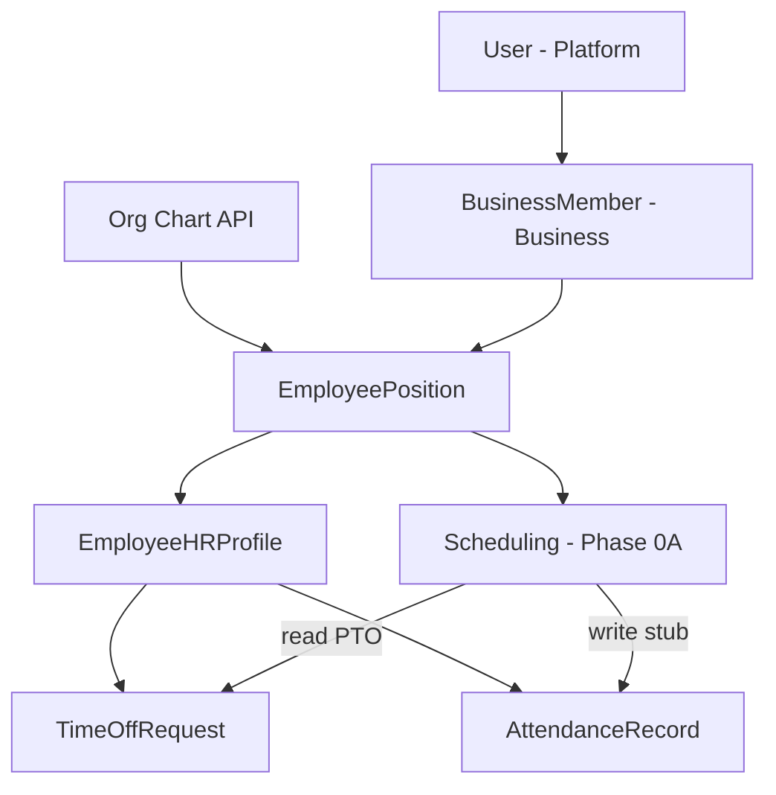

# HR ↔ Org Chart Boundary Analysis

**Phase:** Business Operations Phase 0B — Discovery only  
**Status:** Canonical HR ↔ Org Chart **ownership** reference  
**Last updated:** 2026-06-14  
**Companion:** [WORKFORCE_IDENTITY_ARCHITECTURE.md](./WORKFORCE_IDENTITY_ARCHITECTURE.md) (structural identity — not ownership per capability alone)  
**Baseline:** [WORKFORCE_DOMAIN_BOUNDARY_ANALYSIS.md](./WORKFORCE_DOMAIN_BOUNDARY_ANALYSIS.md) (Phase 0A — scheduling rows not re-opened)

---

## Executive summary

| Question | Evidence-based answer |
|----------|----------------------|
| Does HR extend Org Chart? | **Yes** — `EmployeeHRProfile` is 1:1 on `EmployeePosition` |
| Does Org Chart extend HR? | **No** — org chart has no dependency on HR models |
| Does HR own workforce identity? | **No** — `EmployeePosition` is the identity anchor |
| Does Org Chart own workforce identity? | **Yes** — placement in organizational structure |
| Duplication exists? | **Yes, partial** — parallel write paths, legacy fields, unused schema |

---

## Legend

| Classification | Meaning |
|----------------|---------|
| Org-chart-owned | Structure and `EmployeePosition` lifecycle (primary path) |
| HR-owned | HR profile and HR workflows on top of placement |
| Shared | Both modules read/write with explicit contract |
| Platform-owned | Business membership, `User` |
| Unknown | Insufficient evidence |

---

## Capability boundary matrix

| Capability | Current Owner | Current Implementation Location | Future Recommended Owner | Evidence | Notes |
|------------|---------------|--------------------------------|--------------------------|----------|-------|
| **Employee identity** | Org-chart-owned (platform) | `EmployeePosition`; `employeeManagementService` | Org chart | `org-chart.prisma`, `employeeManagementService.ts` | Workforce "who" = active placement |
| **Employee profile** | HR-owned | `EmployeeHRProfile`; `/api/hr/admin/employees` | HR | `core.prisma`, `hrController.createEmployee` | Optional until HR creates profile |
| **Department** | Org-chart-owned | `Department`; `/api/org-chart/departments` | Org chart | `business.prisma`, `orgChartService` | HR reads for filters only |
| **Position (job slot)** | Org-chart-owned | `Position`; `/api/org-chart/positions` | Org chart | `org-chart.prisma` | Includes scheduling fields on same model |
| **Reporting structure** | Org-chart-owned | `Position.reportsToId`; org chart visual | Org chart | `org-chart.prisma`, `OrgChartVisualView.tsx` | |
| **Manager relationship (runtime)** | Org-chart-owned | `resolveManagerContext` uses `reportsToId` | Org chart | `hrController.ts` L375–432 | `ManagerApprovalHierarchy` unused |
| **Employment status** | HR-owned | `EmploymentStatus` on `EmployeeHRProfile` | HR | `terminateEmployee` | Termination also deactivates EP |
| **Certifications** | Unknown | `OnboardingTaskType.TRAINING` enum only | Unknown | `onboarding.prisma` | No certifications registry |
| **Skills** | NOT PRESENT | — | Unknown | Grep: no skills model | |
| **PTO** | HR-owned | `TimeOffRequest`; `/me/time-off/*` | HR | `attendance.prisma` | Scheduling reads for conflict (Phase 0A Shared) |
| **Attendance** | HR-owned | `AttendanceRecord`, policies, exceptions | HR | `hrAttendanceService.ts` | Scheduling writes stubs on publish (Phase 0A Shared) |
| **Workforce records** | HR-owned | `EmployeeHRProfile` + audit logs | HR | `getEmployeeAuditLogs` | |
| **Personnel files** | Partial / Unknown | Onboarding document library; Drive integration | HR + Drive | `hrOnboardingService`, Drive list in controller | Not full personnel file system |
| **Scheduling references** | Scheduling-owned (consumer) | `ScheduleShift.employeePositionId` | Scheduling | Phase 0A — HR not re-audited | HR does not own shifts |

---

## Dependency direction

**Rule:** Org chart mutations that create `EmployeePosition` are **upstream** of HR. HR mutations do not create org structure (except CSV import bypass).

---

## Lifecycle ownership

| Lifecycle step | Owner | Primary path | HR involvement |
|----------------|-------|--------------|----------------|
| User creation | Platform / auth | Registration flows | Import may create `User` |
| Business membership | Business module | Invite/join | Required before org assign (`employeeManagementService` L109–118) |
| Department assignment | Org chart | Position.`departmentId` | Import bypass creates `Department` |
| Position definition | Org chart | `/api/org-chart/positions` | Import bypass creates `Position` |
| Employee assignment | Org chart | `POST /api/org-chart/employees/assign` | Does not create HR profile |
| Reporting hierarchy | Org chart | `reportsToId` on `Position` | Manager scope in HR reads this |
| HR profile creation | HR | `POST /api/hr/admin/employees` | Requires `employeePositionId` |
| Onboarding | HR | `startOnboardingJourney` | Links to `EmployeeHRProfile` |
| PTO / attendance | HR | `/me/*`, `/team/*` | Uses `employeePositionId` |
| Termination | HR | `POST .../terminate` | Sets HR status + deactivates EP |
| Removal from position | Org chart | `removeEmployeeFromPosition` | Does not update HR profile |
| Transfer | Org chart | `POST /api/org-chart/employees/transfer` | HR profile follows EP id — **UNKNOWN** if profile moves |

---

## Duplication and conflict analysis

| Issue | Type | Evidence | Risk |
|-------|------|----------|------|
| HR CSV import creates Dept/Position/EP | Parallel write path | `hrController.importEmployeesCSV` | **High** — bypasses org-chart API and permissions |
| `BusinessMember.department` string vs `Department` model | Duplicate field | `business.prisma` | **Medium** — filter/display drift |
| `BusinessMember.title` vs `Position.title` | Duplicate field | Same | **Medium** |
| `hireDate` vs `EmployeePosition.startDate` | Duplicate semantics | `createEmployee` syncs both | **Medium** — can diverge if only one path updates |
| Employee without HR profile | Valid state | Org assign without `createEmployee` | **Low** — by design |
| HR profile without org assign | Invalid | `createEmployee` requires EP | — |
| Terminate vs org remove | Asymmetric lifecycle | HR terminate vs `removeEmployeeFromPosition` | **Medium** |
| `ManagerApprovalHierarchy` vs `reportsToId` | Unused schema | `core.prisma` vs `resolveManagerContext` | **Low** — dead schema |
| Scheduling fields on `Position` | Cross-domain blur | `org-chart.prisma` L42–50 | **Low** — org design carries scheduling config |
| Org employee list includes non-position members | List semantics | `employeeManagementService` fake `member-*` ids | **Medium** — HR directory ≠ org list |

---

## Org Chart ↔ HR ↔ Scheduling (accepted integration)

Per Phase 0A (not re-audited):

| Integration | Boundary |
|-------------|----------|
| Scheduling reads PTO | HR-owned data, scheduling enforcement |
| Scheduling publish → attendance | HR-owned records, scheduling trigger |
| Calendar sync | `hrScheduleService` — shared (HR package name) |
| Identity key | `EmployeePosition.id` for all three |

---

## Strategic conclusions (evidence only)

1. **HR extends Org Chart** — confirmed by schema FK and README.
2. **Org Chart does not extend HR** — no HR FK on org models.
3. **Org Chart owns workforce identity** (`EmployeePosition`); **HR owns employment metadata** (`EmployeeHRProfile`).
4. **Duplication risks are real** — import bypass and legacy `BusinessMember` fields are the highest priority structural issues.
5. **Scheduling consumes identity** via `employeePositionId` — HR should not become identity hub for planning.

---

## Implications for Phase 0C

Workforce Communications should target **org-chart identity** (`EmployeePosition`, `Department`) for audience routing — not duplicate HR profile tables. See [WORKFORCE_IDENTITY_ARCHITECTURE.md](./WORKFORCE_IDENTITY_ARCHITECTURE.md) § Consumer Map.

---

## Evidence index

| Topic | Path |
|-------|------|
| HR schema philosophy | `prisma/modules/hr/README.md` |
| HR profile FK | `prisma/modules/hr/core.prisma` |
| Org chart models | `prisma/modules/business/org-chart.prisma` |
| Org chart routes | `server/src/routes/org-chart.ts` |
| Employee assign | `server/src/services/employeeManagementService.ts` |
| HR employee CRUD | `server/src/controllers/hrController.ts` |
| HR import | `hrController.importEmployeesCSV` |
| Manager context | `hrController.resolveManagerContext` |
| Org chart UI | `web/src/components/org-chart/EmployeeManager.tsx` |
| HR employees UI | `web/src/app/business/[id]/admin/hr/employees/page.tsx` |

---

## Document maintenance

- Does not replace [WORKFORCE_DOMAIN_BOUNDARY_ANALYSIS.md](./WORKFORCE_DOMAIN_BOUNDARY_ANALYSIS.md) for cross-module capability ownership.
- Pair with [WORKFORCE_IDENTITY_ARCHITECTURE.md](./WORKFORCE_IDENTITY_ARCHITECTURE.md) for identity stack questions.
