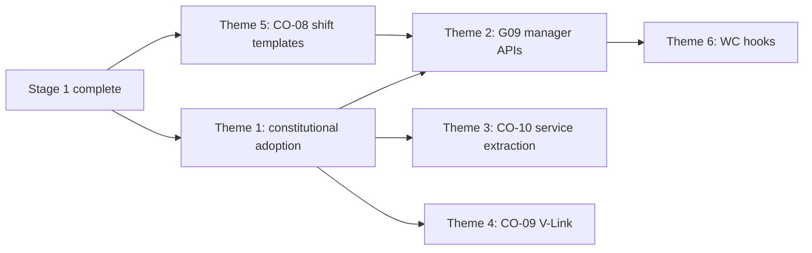

# Scheduling Modernization Plan

**Program:** Business Operations Modernization Planning Program  
**Domain:** Scheduling (`scheduling`)  
**Stage:** 2 — Scheduling + HR Modernization  
**Last updated:** 2026-06-14  
**Sources:** Phase 0A, [SCHEDULING_ALIGNMENT_REQUIREMENTS.md](./SCHEDULING_ALIGNMENT_REQUIREMENTS.md), [BUSINESS_OPERATIONS_STRATEGIC_ARCHITECTURE.md](./BUSINESS_OPERATIONS_STRATEGIC_ARCHITECTURE.md)  
**Ownership:** [WORKFORCE_DOMAIN_BOUNDARY_ANALYSIS.md](./WORKFORCE_DOMAIN_BOUNDARY_ANALYSIS.md)

---

## Purpose

Define the modernization strategy for the **Scheduling** domain — workforce planning pillar — using approved constitutional and alignment findings only.

**No implementation detail. No code. No certifications.**

---

## Current posture

| Dimension | Status |
|-----------|--------|
| **Operational** | Substantial — schedules, shifts, publish, availability, swaps, open-shift claim, visual builder, AI actions |
| **Architectural** | Constitutional debt — no PE, activity, notifications, V-Link, Global Trash; fat controllers; manager 501 stubs |
| **Workspace** | WS-L1 hub (`SchedulingLayout`) — functional |
| **Realtime** | PARTIAL — `join_schedule` with membership; UI sync only |
| **AI** | PASS WITH FINDINGS — 3 providers, 2 actions |

**Overall:** Operational product module requiring **constitutional adoption** and **manager workflow completion** before first-class status.

---

## Prerequisites

Scheduling modernization **must not begin** until Stage 1 exit criteria are met:

| Prerequisite | Gap / CO | Why |
|--------------|----------|-----|
| FALSE POSITIVE governance | G01 / CO-06 | Sockets must not become WC |
| Identity trust | G02 / CO-05 | Assign scope uses EP |
| Activity pattern | G03 / CO-01 | Publish/swap emit contract |
| Notification pattern | G04 / CO-02 | `scheduling_*` emitters |
| PE pattern | G05 / CO-03 | Manager/admin authZ |
| Global Trash pattern | G06 / CO-04 | Shift/schedule lifecycle |
| `hrScheduleService` contract | G07 / CO-07 | Calendar sync on publish |

**Stage 1 plan:** [SHARED_ALIGNMENT_MODERNIZATION_PLAN.md](./SHARED_ALIGNMENT_MODERNIZATION_PLAN.md)

---

## Target state

Per [BUSINESS_OPERATIONS_CAPABILITY_TARGET_STATE.md](./BUSINESS_OPERATIONS_CAPABILITY_TARGET_STATE.md):

| Capability | Current | Target |
|------------|---------|--------|
| **Scheduling** | Partial — manager 501 stubs | Admin + manager paths complete; constitutional alignment |
| **Shift Swaps** | Partial — admin list stub | Employee + manager flows; admin inbox functional |
| **Shift communications** | Socket sync only | Activity + notification emitters; WC integration hooks (not sockets) |

**Reference bar:** L3 parity (Chat, Calendar) for constitutional services; Drive L4 for service boundaries.

---

## Modernization themes

### Theme 1 — Constitutional service adoption (inherit Stage 1)

Consume shared BO patterns — do not invent Scheduling-specific Activity, Notification, PE, or Trash infrastructure.

| Service | Adoption scope |
|---------|----------------|
| **Activity** | Shift CRUD, publish, swap, availability, open-shift claim |
| **Notifications** | `scheduling_*` for publish, swap, assignment, open-shift |
| **Policy Engine** | Manager publish, swap approve, admin template CRUD |
| **Global Trash** | Schedules, shifts — replace hard delete and ARCHIVED-only |

**Gaps:** G03–G06 (resolved in Stage 1; consumed in Stage 2)  
**COs:** CO-01–CO-04

---

### Theme 2 — Manager workflow completion (G09)

Complete manager and admin stub endpoints identified in Phase 0A:

| Surface | Current | Target |
|---------|---------|--------|
| `publishTeamSchedule` | 501 | Functional manager publish |
| `getOpenShiftsForTeam` | 501 | Manager open-shift management |
| `assignEmployeeToShift` | 501 | Manager assignment |
| `getTeamAvailability` | 501 | Manager availability view |
| Shift template CRUD | 501 / empty | Template reuse |
| `getAllShiftSwapRequests` | Empty stub | Admin swap inbox |
| `updateEmployeeAvailabilityAdmin` | 501 | Admin availability edit |

**Dependencies:** G04 (publish notifications), G05 (manager PE), G07 (calendar sync), G08 (shift templates)

**Gap:** G09 — domain-specific, not a convergence initiative

---

### Theme 3 — Service extraction (G10 / CO-10)

Migrate ~144 direct Prisma calls from controllers to canonical scheduling service(s).

| Current | Target |
|---------|--------|
| Fat controllers across 6 files | Thin controllers |
| No `schedulingService` | Domain services: shifts, publish, availability, swaps |
| AI/philosophy/recommendation only | Full service layer per Drive L4 pattern |

**Dependencies:** CO-01 (activity emit in services), CO-03 (PE maps to services)

**Gap:** G10 · **CO:** CO-10 (parallel with HR decomposition)

---

### Theme 4 — V-Link registration (G13 / CO-09)

Register Scheduling entity types for cross-module linking.

| Entity types | Link consumers |
|--------------|----------------|
| Shifts, schedules, swap requests | HR, WC, Drive, Calendar |

**Dependencies:** G06 / CO-04 (trash lifecycle)

**Gap:** G13 · **CO:** CO-09

---

### Theme 5 — Shift-template alignment (G08 / CO-08)

Resolve `AttendanceShiftTemplate` (HR) vs `ShiftTemplate` (Scheduling) naming and conceptual collision before manager tooling completes.

**Dependencies:** None — can start early in Stage 2

**Gap:** G08 · **CO:** CO-08

---

### Theme 6 — Workforce Communications integration hooks

Scheduling provides **operational event hooks** for WC — not broadcast infrastructure.

| Hook | Mechanism | NOT this |
|------|-----------|----------|
| Schedule published | Activity event + `scheduling_*` notification | Socket broadcast as WC |
| Coverage change | Activity + optional WC consumer | Chat message |
| Open-shift assigned | Notification emitter | Realtime as comms |

**Guardrail:** Sockets remain **synchronization infrastructure**, not Workforce Communications.

**Source:** [CHAT_COMMUNICATIONS_BOUNDARY_ANALYSIS.md](./CHAT_COMMUNICATIONS_BOUNDARY_ANALYSIS.md)

---

## Dependency order

| Order | Theme | Gap / CO |
|-------|-------|----------|
| 1 | Constitutional adoption | G03–G06 / CO-01–04 (Stage 1) |
| 2 | Shift-template alignment | G08 / CO-08 |
| 3 | Manager workflow completion | G09 |
| 4 | Service extraction | G10 / CO-10 |
| 5 | V-Link registration | G13 / CO-09 |
| 6 | WC integration hooks | After G09 + CO-02 |

---

## FALSE POSITIVE guardrails

| Surface | Scheduling role | Must not become |
|---------|-----------------|-----------------|
| `schedule:*` socket events | UI invalidation / sync | Workforce broadcast |
| `join_schedule` rooms | Membership-proven sync | Org-wide comms channel |
| Publish workflow | Planning + emit hooks | WC campaign system |

---

## What Scheduling modernization does NOT do

| Excluded | Rationale |
|----------|-----------|
| Own workforce identity | Org chart owns EP |
| Own broadcast authoring | WC domain (Stage 3) |
| Expand sockets into messaging | Realtime ≠ WC |
| Merge with HR codebase | Model C |
| Complete labor analytics 501 trio | G18 — Stage 4 |
| Certification award | Stage 5 readiness only |

---

## Stage assignment

**Primary stage:** 2 — Scheduling + HR Modernization  
**Consumes:** Stage 1 (CO-01–07)  
**Enables:** Stage 3 WC publish hooks; Stage 4 analytics data

---

## Certification statement

**No certification awarded.** Scheduling modernization plan is strategy only.
