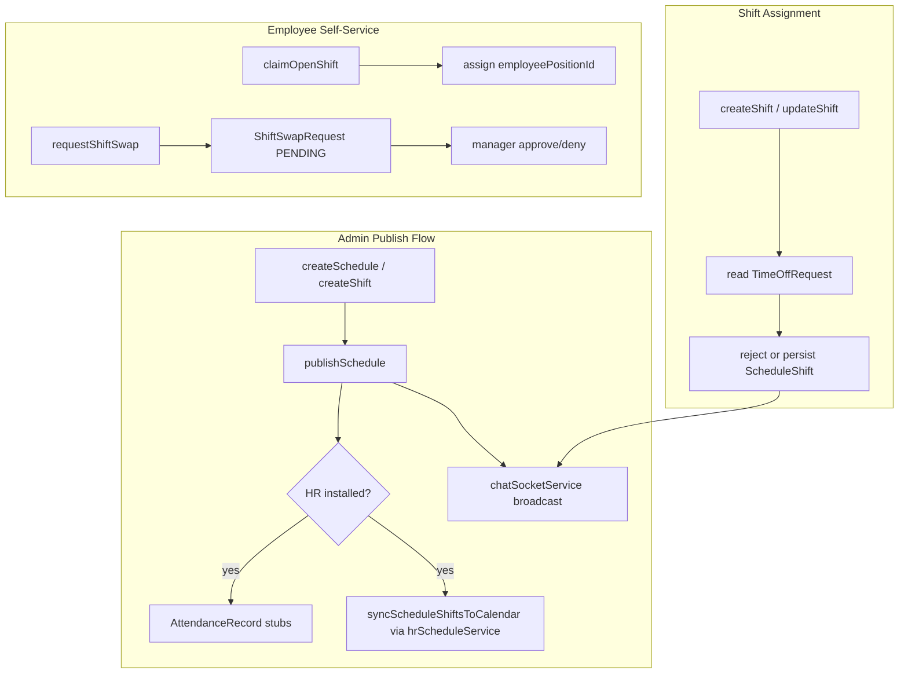

# Scheduling Operation Matrix

**Module id:** `scheduling`  
**Phase:** Business Operations Phase 0A — Discovery only  
**Status:** Reality assessment (not certified)  
**Last updated:** 2026-06-14  
**Related:** [SCHEDULING_ARCHITECTURE_AUDIT.md](./SCHEDULING_ARCHITECTURE_AUDIT.md), [WORKFORCE_DOMAIN_BOUNDARY_ANALYSIS.md](./WORKFORCE_DOMAIN_BOUNDARY_ANALYSIS.md)

---

## Legend

| Symbol | Meaning |
|--------|---------|
| **C** | Compliant — implemented at correct layer with expected side effects |
| **P** | Partial — works but wrong layer, stub, or incomplete side effects |
| **N** | Non-compliant or missing |
| **—** | Not applicable |

**Columns:** PE = Policy Engine; Act = normalized module activity; Ev = domain event; Ntf = notification; RT = realtime; AI = AI action/provider

---

## Module identity (confirmed facts)

| Attribute | Value | Evidence |
|-----------|-------|----------|
| Module id | `scheduling` | `server/src/startup/seedSchedulingModule.ts` |
| API mount | `/api/scheduling` | `server/src/index.ts` |
| Prisma source | `prisma/modules/scheduling/core.prisma` | 7 models |
| Workspace hub | `SchedulingLayout` | `web/src/components/scheduling/SchedulingLayout.tsx` |
| Business workspace | Switch-mounted | `web/src/lib/businessWorkspaceContracts.ts` |
| Product intent | Future planning (shifts) | `memory-bank/schedulingProductContext.md` |

**Confirmed:** Scheduling is a **standalone built-in module**, not an HR or Calendar extension.

---

## User journeys (current reality)

### Admin / schedule builder

1. Navigate `/business/[id]/workspace/scheduling` → `SchedulingLayout` (admin view)
2. Create schedule → add shifts via visual builder (`ScheduleBuilderVisual.tsx`)
3. Configure stations, job locations, schedule templates
4. Publish schedule → status `PUBLISHED`; optional HR attendance stubs + calendar sync
5. Manage swap approvals (admin path); list endpoint returns stub empty array

### Manager / team

1. Navigate team view (`SchedulingTeamContent.tsx`)
2. View team schedules (`GET /team/schedules` — **implemented**)
3. Approve/deny pending swaps (`GET /team/swaps/pending` — **implemented**)
4. Publish team schedule, assign open shifts, view team availability — **501 stubs**

### Employee / self-service

1. View own schedule (`GET /me/schedule`)
2. Manage availability (`/me/availability` CRUD)
3. Request/cancel shift swaps (`/me/shifts/:id/swap/request`, `/me/swap-requests/:id/cancel`)
4. Browse and claim open shifts (`/me/open-shifts`, `/me/shifts/:id/claim`)

### AI assist

1. In-module assistant (`SchedulingAIAssistant.tsx`)
2. `POST /ai/generate-schedule`, `POST /ai/suggest-assignments`
3. AI context: overview, coverage, conflicts

---

## Data model and ownership boundaries

| Entity | Owner module | Scoped by | Notes |
|--------|--------------|-----------|-------|
| `Schedule`, `ScheduleShift` | scheduling | `businessId` | No `trashedAt` |
| `EmployeeAvailability` | scheduling | `businessId` + `employeePositionId` | |
| `ShiftSwapRequest` | scheduling | `businessId` | |
| `ShiftTemplate`, `ScheduleTemplate` | scheduling | `businessId` | Shift template CRUD stubbed |
| `BusinessStation`, `JobLocation` | scheduling | `businessId` | |
| `EmployeePosition`, `Department`, `Position` | org chart (platform) | `businessId` | Scheduling reads; does not own |
| `TimeOffRequest` | hr | `businessId` | Scheduling reads for conflict checks |
| `AttendanceRecord` | hr | `businessId` | Created on publish when HR installed |
| Calendar events (published shifts) | calendar (sync target) | via `hrScheduleService` | HR-owned bridge service |

---

## Master operation matrix

### Admin — schedules

| Operation | Route | Controller | PE | Act | Ev | Ntf | RT | AI | Status | Notes |
|-----------|-------|------------|----|----|----|----|----|----|--------|-------|
| List schedules | `GET /admin/schedules` | `getSchedules` | N | N | N | N | — | — | P | Custom middleware; inline Prisma |
| Create schedule | `POST /admin/schedules` | `createSchedule` | N | N | N | N | — | — | P | Tenant scoped |
| Get schedule | `GET /admin/schedules/:id` | `getScheduleById` | N | N | N | N | — | — | P | |
| Update schedule | `PUT /admin/schedules/:id` | `updateSchedule` | N | N | N | N | — | — | P | |
| Delete schedule | `DELETE /admin/schedules/:id` | `deleteSchedule` | N | N | N | N | P | — | P | Hard delete; may broadcast |
| Publish schedule | `POST /admin/schedules/:id/publish` | `publishSchedule` | N | N | N | N | P | — | P | HR attendance stubs + calendar sync + socket |
| Clone schedule | — (not routed) | `cloneSchedule` | — | — | — | — | — | — | N | Function exists; no route |

### Admin — shifts

| Operation | Route | Controller | PE | Act | Ev | Ntf | RT | AI | Status | Notes |
|-----------|-------|------------|----|----|----|----|----|----|--------|-------|
| List shifts | `GET /admin/shifts` | `getShifts` | N | N | N | N | — | — | P | |
| Create shift | `POST /admin/shifts` | `createShift` | N | N | N | N | P | — | P | PTO conflict check reads HR |
| Get shift | `GET /admin/shifts/:id` | `getShiftById` | N | N | N | N | — | — | P | |
| Update shift | `PUT /admin/shifts/:id` | `updateShift` | N | N | N | N | P | — | P | PTO conflict check |
| Delete shift | `DELETE /admin/shifts/:id` | `deleteShift` | N | N | N | N | P | — | P | Hard delete |

### Admin — shift templates

| Operation | Route | Controller | Status | Notes |
|-----------|-------|------------|--------|-------|
| List shift templates | `GET /admin/templates` | `getShiftTemplates` | N | Returns `{ templates: [] }` always |
| CRUD shift templates | `POST/PUT/DELETE /admin/templates*` | various | N | All return **501** |

### Admin — schedule templates

| Operation | Route | Controller | Status | Notes |
|-----------|-------|------------|--------|-------|
| List/create/read/update/delete | `/admin/schedule-templates*` | schedule template handlers | C | Implemented |

### Admin — availability and swaps

| Operation | Route | Controller | Status | Notes |
|-----------|-------|------------|--------|-------|
| List all availability | `GET /admin/availability` | `getAllEmployeeAvailability` | P | Implemented |
| Update availability (admin) | `PUT /admin/availability/:id` | `updateEmployeeAvailabilityAdmin` | N | **501** |
| List all swaps | `GET /admin/swaps` | `getAllShiftSwapRequests` | N | Returns `{ swaps: [] }` stub |
| Approve/deny swap (admin) | `PUT /admin/swaps/:id/approve\|deny` | approve/deny handlers | P | Implemented; list stub breaks admin UX |

### Admin — stations and locations

| Operation | Route | Controller | Status |
|-----------|-------|------------|--------|
| Stations CRUD | `/admin/stations*` | `schedulingAdminToolsController` | C |
| Job locations CRUD | `/admin/job-locations*` | `schedulingAdminToolsController` | C |

### Admin — analytics (not routed)

| Operation | Controller | Status | Notes |
|-----------|------------|--------|-------|
| Labor cost analytics | `getLaborCostAnalytics` | N | **501**; not in `scheduling.ts` |
| Coverage analytics | `getCoverageAnalytics` | N | **501**; not routed |
| Compliance reports | `getComplianceReports` | N | **501**; not routed |

### Manager — team

| Operation | Route | Controller | Status | Notes |
|-----------|-------|------------|--------|-------|
| List team schedules | `GET /team/schedules` | `getTeamSchedules` | C | Direct-report filtering |
| Publish team schedule | `POST /team/schedules/:id/publish` | `publishTeamSchedule` | N | **501** |
| List open shifts (team) | `GET /team/shifts/open` | `getOpenShiftsForTeam` | N | **501** |
| Assign employee to shift | `POST /team/shifts/:id/assign` | `assignEmployeeToShift` | N | **501** |
| Team availability | `GET /team/availability` | `getTeamAvailability` | N | **501** |
| Pending swaps | `GET /team/swaps/pending` | `getPendingShiftSwapRequestsForTeam` | C | |
| Approve/deny swap | `PUT /team/swaps/:id/approve\|deny` | manager handlers | C | |

### Employee — self

| Operation | Route | Controller | Status |
|-----------|-------|------------|--------|
| Own schedule | `GET /me/schedule` | `getOwnSchedule` | C |
| Availability CRUD | `/me/availability*` | employee handlers | C |
| Request swap | `POST /me/shifts/:id/swap/request` | `requestShiftSwap` | C |
| List/cancel swaps | `/me/swaps`, `/me/swap-requests/:id/cancel` | employee handlers | C |
| Open shifts / claim | `/me/open-shifts`, `/me/shifts/:id/claim` | employee handlers | C |

### AI and context

| Operation | Route | Service/Controller | Status |
|-----------|-------|-------------------|--------|
| Generate schedule | `POST /ai/generate-schedule` | `schedulingAIActionService` | P |
| Suggest assignments | `POST /ai/suggest-assignments` | `schedulingAIActionService` | P |
| Context overview | `GET /ai/context/overview` | `schedulingAiContextController` | P |
| Context coverage | `GET /ai/context/coverage` | `schedulingAiContextController` | P |
| Context conflicts | `GET /ai/context/conflicts` | `schedulingAiContextController` | P |
| Recommendations | `GET /recommendations` | `schedulingRecommendationService` | P |
| Dashboard summary | `GET /dashboard-summary` | `schedulingDashboardController` | P |

---

## Data flows

---

## Module interactions

### HR overlap

| Integration | Direction | Evidence | Status |
|-------------|-----------|----------|--------|
| PTO conflict on shift assign | Scheduling reads HR | `schedulingAdminController.ts` `timeOffRequest` queries | P — implemented |
| PTO in availability UI | Scheduling reads HR | `AvailabilityManagement.tsx` → `/api/hr/me/time-off/requests` | P |
| Publish → attendance stubs | Scheduling writes HR | `publishSchedule` → `AttendanceRecord` | P — when HR installed |
| Calendar sync bridge | HR service used by scheduling | `hrScheduleService.syncScheduleShiftsToCalendar` | P — shared ownership |

### Calendar overlap

| Integration | Evidence | Status |
|-------------|----------|--------|
| Published shifts → calendar events | `hrScheduleService.ts` | P — HR-owned bridge |
| PTO → calendar events | `hrScheduleService.syncTimeOffRequestCalendar` | HR-owned |
| Recurrence / reminders | `calendarRecurrenceService`, `calendarSchedulerService` | Calendar-owned; scheduling does not own |

### Notifications overlap

| Finding | Evidence |
|---------|----------|
| No `scheduling_*` notification types | Grep: no `NotificationService` in scheduling controllers |
| Icon bucket only | `web/src/app/notifications/page.tsx` |
| No manifest `notifications` block | `seedSchedulingModule.ts` |

### Chat / realtime overlap

| Integration | Evidence | Status |
|-------------|----------|--------|
| Schedule room join | `chatSocketService.joinScheduleRoomIfMember` | P — membership proven |
| Shift CRUD broadcasts | `broadcastShiftCreated/Updated/Deleted` | P |
| Schedule published broadcast | `broadcastSchedulePublished` | P |
| Workforce messaging | — | N — realtime is UI sync, not comms product |

### Analytics overlap

| Surface | Evidence | Status |
|---------|----------|--------|
| Server analytics endpoints | 501 stubs in admin controller | N |
| Client-side stats in UI | `SchedulingAdminContent.tsx`, `SchedulingDashboard.tsx` | P — computed in UI |
| HR analytics | `hrAnalyticsService.ts`, HR analytics dashboards | HR-owned |

### AI overlap

| Surface | Evidence |
|---------|----------|
| Module registration | `registerBuiltInModules.ts` — 3 providers, 2 actions |
| Action executor | `ActionExecutor.executeSchedulingAction` |
| Provider selection | `moduleContextProviderSelection.ts` — `BUSINESS_SCOPED_MODULE_IDS` includes `scheduling` |
| HR time-off context | Separate `/api/hr/ai/context/time-off` |

### V_Link overlap

| Finding | Evidence |
|---------|----------|
| Not integrated | `docs/architecture/V_LINK.md` — hr, scheduling: Not integrated |
| No resolver | No `schedulingVlinkAccessService` |

---

## Missing capabilities (confirmed)

- Shift template CRUD (501)
- Manager team publish, open-shift assign, team availability (501)
- Admin swap listing (empty stub)
- Admin availability update (501)
- Labor/coverage/compliance analytics (501, not routed)
- `cloneSchedule` route
- Normalized activity events
- Notification types and emitters
- Global Trash (`trashedAt`)
- Policy Engine integration
- V_Link entity registration
- Shift bidding
- Dedicated coverage request workflow
- Workforce operational messaging

---

## Risks and unknowns

| Risk | Severity | Evidence |
|------|----------|----------|
| Docs/code drift | High | `schedulingProductContext.md` claims full functionality; stubs exist |
| Manager UI vs API mismatch | High | Team endpoints 501; `SchedulingTeamContent.tsx` may call them |
| Dual shift-template naming | Medium | HR `AttendanceShiftTemplate` vs Scheduling `ShiftTemplate` |
| `hrScheduleService` ownership | Medium | HR-named service bridges scheduling + calendar |
| Tenant isolation | Low | 1 integration test exists |
| Cross-business scheduling | Unknown | No evidence found |

---

## Evidence table

| Category | Path |
|----------|------|
| Schema | `prisma/modules/scheduling/core.prisma` |
| Business config | `prisma/modules/business/business.prisma` (`schedulingMode`, `schedulingStrategy`) |
| Routes | `server/src/routes/scheduling.ts` |
| Controllers | `server/src/controllers/scheduling/*.ts` |
| Services | `server/src/services/schedulingAIActionService.ts`, `schedulingPhilosophyService.ts`, `schedulingRecommendationService.ts` |
| HR bridge | `server/src/services/hrScheduleService.ts` |
| Middleware | `server/src/middleware/schedulingPermissions.ts`, `schedulingFeatureGating.ts` |
| Realtime | `server/src/services/chatSocketService.ts` |
| Module seed | `server/src/startup/seedSchedulingModule.ts` |
| AI registration | `server/src/startup/registerBuiltInModules.ts` |
| API client | `web/src/api/scheduling.ts` |
| Hooks | `web/src/hooks/useScheduling.ts`, `useSchedulingWebSocket.ts` |
| Components | `web/src/components/scheduling/*` (18 files) |
| Pages | `web/src/app/business/[id]/workspace/scheduling/page.tsx`, `me/page.tsx`, `team/page.tsx` |
| Workspace | `web/src/lib/businessWorkspaceContracts.ts`, `BusinessWorkspaceContent.tsx` |
| Widget | `web/src/components/widgets/SchedulingWidget.tsx` |
| Test | `server/src/routes/__tests__/scheduling-tenant-scope.integration.test.ts` |
| Product context | `memory-bank/schedulingProductContext.md` |
| Platform standards | `docs/architecture/VSSYL_PLATFORM_STANDARDS_AND_MODULE_CONTRACT.md` |

---

## Recommendations (discovery only — not implementation)

1. Phase 0B should validate HR-owned integration contracts (`hrScheduleService`, PTO, attendance) without re-auditing scheduling planning surfaces.
2. Treat manager-route 501 stubs as blocking gaps before any manager-workflow modernization planning.
3. Use [WORKFORCE_DOMAIN_BOUNDARY_ANALYSIS.md](./WORKFORCE_DOMAIN_BOUNDARY_ANALYSIS.md) as canonical ownership reference for cross-module capabilities.
