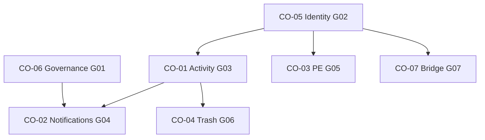

# Shared Alignment Modernization Plan

**Program:** Business Operations Modernization Planning Program  
**Status:** **First modernization initiative** — Stage 1  
**Last updated:** 2026-06-14  
**Gaps addressed:** G01–G07 (P0–P1)  
**Convergence COs:** CO-06, CO-05, CO-01, CO-02, CO-03, CO-04, CO-07  
**Master plan:** [BUSINESS_OPERATIONS_MODERNIZATION_MASTER_PLAN.md](./BUSINESS_OPERATIONS_MODERNIZATION_MASTER_PLAN.md)  
**Convergence detail:** [BUSINESS_OPERATIONS_CONVERGENCE_PROGRAM.md](./BUSINESS_OPERATIONS_CONVERGENCE_PROGRAM.md)

---

## Purpose

Define the **first modernization initiative** for Business Operations: **Shared Constitutional Alignment**. This program resolves G01–G07 before any Scheduling, HR, or Workforce Communications domain-specific modernization begins.

**Why first:** Without governance and identity trust (P0), domain work risks wrong architecture absorption and corrupt audience data. Without Activity, Notifications, Policy Engine, Global Trash, and bridge contracts (P1), each domain would invent parallel constitutional patterns — violating modernization principle #3 (inherit platform standards).

**No implementation detail. No code. No schema changes.**

---

## Program scope

| In scope | Out of scope |
|----------|--------------|
| G01–G07 constitutional resolution | G08–G18 |
| CO-06, CO-05, CO-01–04, CO-07 | CO-08–CO-12 (later stages) |
| Cross-domain consumption model | Implementation waves |
| Entry/exit criteria | Certification awards |
| Handoff to Stage 2 | Domain-specific manager APIs (G09) |

---

## Entry criteria

| Criterion | Status |
|-----------|--------|
| Phase 0A–0D discovery complete | ✅ |
| Constitutional clarification complete | ✅ |
| Constitutional alignment program complete | ✅ |
| G01–G18 ranked; CO-01–CO-12 defined | ✅ |
| Ownership, identity, boundaries final | ✅ — not re-opened |

---

## Exit criteria

Stage 1 is complete when all G01–G07 gaps are resolved at **constitutional level**:

| Gap | CO | Exit signal |
|-----|-----|-------------|
| G01 | CO-06 | FALSE POSITIVE governance adopted in BO design reviews; three-system model enforced |
| G02 | CO-05 | Single EP write path; CSV bypass eliminated; lifecycle symmetry; legacy member fields deprecated for audience |
| G03 | CO-01 | BO Activity envelope pattern defined; `authorize → execute → emit` contract for Scheduling, HR, future WC |
| G04 | CO-02 | BO notification manifest pattern; `scheduling_*`, complete `hr_*`, `workforce_*` naming convention established |
| G05 | CO-03 | PE registration pattern for BO write paths defined for Scheduling, HR, future WC |
| G06 | CO-04 | Global Trash alignment pattern for BO entities defined |
| G07 | CO-07 | `hrScheduleService` neutral contract documented |

**Handoff:** Stage 2 (Scheduling + HR Modernization) may begin when exit criteria satisfied.

---

## Initiative breakdown

### CO-06 — FALSE POSITIVE Governance (G01)

| Aspect | Detail |
|--------|--------|
| **Focus** | Adopt [BUSINESS_OPERATIONS_STRATEGIC_ARCHITECTURE.md](./BUSINESS_OPERATIONS_STRATEGIC_ARCHITECTURE.md) § FALSE POSITIVE GOVERNANCE |
| **Domains** | All BO |
| **Outcome** | Design reviews enforce: Chat ≠ WC; Notifications ≠ WC; Realtime ≠ WC; Workflow Notifications ≠ WC |
| **Order** | **First** — parallel with CO-05 |

**Risks if skipped:** Chat CHANNEL, scheduling sockets, Notification Center, or HR workflow notifs mistaken for full WC during Stages 2–3.

---

### CO-05 — Identity Trust Hardening (G02)

| Aspect | Detail |
|--------|--------|
| **Focus** | Org-chart-authoritative identity per [WORKFORCE_IDENTITY_ARCHITECTURE.md](./WORKFORCE_IDENTITY_ARCHITECTURE.md) |
| **Domains** | HR (primary), Scheduling, WC, Analytics |
| **Outcome** | Trustworthy `EmployeePosition` + `Department` consumption; no parallel roster |
| **Order** | **First** — parallel with CO-06 |

**Issues addressed (0B findings):** HR CSV import bypass; terminate vs remove asymmetry; legacy `BusinessMember.department`/`title`.

**Risks if skipped:** Audience resolver (Stage 3) built on corrupt identity; PE subjects unstable.

---

### CO-01 — Activity Envelope (G03)

| Aspect | Detail |
|--------|--------|
| **Focus** | `emitModuleActivityEvent` for all BO authorized write paths |
| **Domains** | Scheduling, HR, WC (future) |
| **Outcome** | Shared event taxonomy; success-only emission; activity vs analytics separated |
| **Order** | After CO-05 (G02) |

**Risks if skipped:** Cannot certify; audit/analytics blocked; CO-04 trash events lack foundation.

---

### CO-02 — Notification Standardization (G04)

| Aspect | Detail |
|--------|--------|
| **Focus** | Manifest `notifications` blocks; `[module]_[event]` emitters after authorized success |
| **Domains** | Scheduling (`scheduling_*`), HR (`hr_*`), WC (`workforce_*` pattern) |
| **Outcome** | Unified BO delivery contract; HR manifest gap closed; Scheduling gains emitter pattern |
| **Order** | After CO-01 (G03); after CO-06 (G01) |

**Note:** G12 (HR 3 attendance types) begins manifest pattern here; HR-specific completion in Stage 2.

**Risks if skipped:** Scheduling has zero notifications; WC has no fan-out path; G09 publish hooks lack delivery partner.

---

### CO-03 — Policy Engine Registration (G05)

| Aspect | Detail |
|--------|--------|
| **Focus** | Register BO write actions in PE; migrate from ad-hoc middleware |
| **Domains** | Scheduling, HR, WC (future) |
| **Outcome** | Cross-module authZ consistency; manager/admin writes PE-gated |
| **Order** | After CO-05 (G02); parallel with CO-01, CO-02, CO-04 |

**Risks if skipped:** AuthZ drift; G09 manager paths lack platform-aligned authorization.

---

### CO-04 — Global Trash Alignment (G06)

| Aspect | Detail |
|--------|--------|
| **Focus** | `trashedAt` + Global Trash API for BO entities |
| **Domains** | Scheduling, HR, WC (campaign handler pattern) |
| **Outcome** | Eliminate hard delete (Scheduling) and local `deletedAt` (HR); unified lifecycle |
| **Order** | After CO-01 (G03) |

**Risks if skipped:** Certification trash must-pass fails; G13 V-Link lifecycle misaligned.

---

### CO-07 — hrScheduleService Contract (G07)

| Aspect | Detail |
|--------|--------|
| **Focus** | Neutral bridge contract: owner, API, versioning, consumers |
| **Domains** | HR, Scheduling, Calendar |
| **Outcome** | Integration drift eliminated; HR-named ambiguity resolved |
| **Order** | After CO-05 (G02); parallel with CO-01–04 |

**Risks if skipped:** Calendar sync and manager publish paths unstable; Stage 2 G09 blocked.

---

## Dependency order within program

### Recommended program order (planning)

| Order | Initiative | Priority |
|-------|------------|----------|
| 1 | CO-06 + CO-05 | P0 (parallel) |
| 2 | CO-01 | P1 |
| 3 | CO-02 + CO-03 + CO-04 + CO-07 | P1 (parallel after CO-01 and CO-05) |

---

## Cross-domain consumption model

Stage 1 defines **patterns** that domains inherit in Stage 2 — not three independent implementations:

| Platform service | Pattern owner | Scheduling consumes | HR consumes | WC consumes (Stage 3) |
|------------------|---------------|--------------------|-------------|-----------------------|
| Activity | CO-01 | Shift, publish, swap events | PTO, attendance, onboarding events | Campaign, ack events |
| Notifications | CO-02 | `scheduling_*` | `hr_*` | `workforce_*` |
| Policy Engine | CO-03 | Manager/admin writes | Admin/manager writes | Author/send |
| Global Trash | CO-04 | Schedule, shift entities | Profile, onboarding entities | Campaign entities |
| Identity | CO-05 | EP for assign scope | EP for HR records | EP for audience |
| Bridge | CO-07 | Calendar sync consumer | Service owner (contract) | Publish hook consumer |

**Rule:** Domains **inherit** — they do not invent parallel Activity, Notification, PE, or Trash infrastructure.

---

## Risks if Stage 1 skipped or reordered

| Violation | Consequence |
|-----------|-------------|
| Skip CO-06 | WC absorbed into Chat/sockets during Stage 2–3 |
| Skip CO-05 | Audience resolver corrupt; identity untrusted |
| Domain work before CO-01–04 | Three parallel constitutional patterns; certification impossible |
| Skip CO-07 | Manager APIs and calendar sync drift |
| Stage 2 before Stage 1 exit | G09, CO-10, CO-11 built on unstable foundation |

---

## Relationship to Stage 2

| Stage 1 delivers | Stage 2 consumes |
|------------------|------------------|
| Activity pattern | CO-10 service extraction emit points |
| Notification pattern | G09 publish emitters |
| PE pattern | G09 manager authZ |
| Trash pattern | CO-09 V-Link lifecycle |
| Identity trust | CO-08 shift templates; audience prep |
| Bridge contract | G09 calendar-integrated publish |

**Stage 2 entry gate:** All G01–G07 exit criteria satisfied.

**Stage 2 programs:** CO-08, CO-09, CO-10, G09 per [SCHEDULING_MODERNIZATION_PLAN.md](./SCHEDULING_MODERNIZATION_PLAN.md) and [HR_MODERNIZATION_PLAN.md](./HR_MODERNIZATION_PLAN.md).

---

## Certification statement

**No certification awarded.** Shared alignment plan is Stage 1 modernization strategy only.

---

## Document authority

First initiative per [BUSINESS_OPERATIONS_MODERNIZATION_MASTER_PLAN.md](./BUSINESS_OPERATIONS_MODERNIZATION_MASTER_PLAN.md). G01–G07 rankings are final per alignment program — not re-opened.
