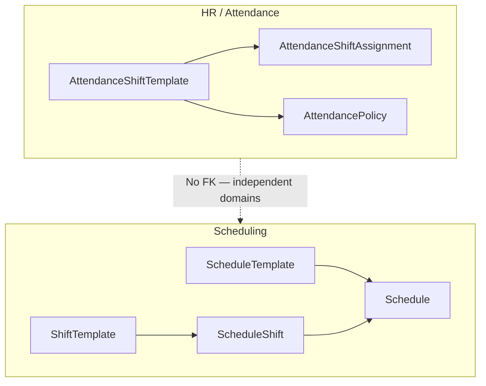

# Shift Template Domain Decision (CO-08 / G08)

**Status:** Accepted — Tier A resolution  
**Date:** 2026-06-15  
**Initiative:** CO-08 Shift Template Naming and Concept Alignment  
**Gap resolved:** G08  
**Related:** [HR_SCHEDULING_BOUNDARY_REVIEW.md](./HR_SCHEDULING_BOUNDARY_REVIEW.md) COL-4, [STAGE_2_ENGINEERING_BLUEPRINT.md](./STAGE_2_ENGINEERING_BLUEPRINT.md) Package 5A

---

## Decision summary

Vssyl maintains **three distinct template concepts** across HR and Scheduling. They are **not** merged, **not** linked by foreign key, and **not** stored in a unified template store.

| Concept | Prisma model | Canonical owner | Table |
|---------|--------------|-----------------|-------|
| Attendance expectation | `AttendanceShiftTemplate` | **HR / Attendance** | `attendance_shift_templates` |
| Shift planning pattern | `ShiftTemplate` | **Scheduling** | `shift_templates` |
| Schedule layout | `ScheduleTemplate` | **Scheduling** | `schedule_templates` |

**Tier A (this decision):** Product terminology, UX copy, and API documentation disambiguation.  
**Tier B (deferred):** Optional Prisma rename of `AttendanceShiftTemplate` — **not approved**; remains unnecessary while Tier A is in effect.

---

## 1. AttendanceShiftTemplate — HR ownership

### Responsibilities

- Define recurring **attendance expectations** (expected work windows) for employees
- Tie expectations to `AttendancePolicy` and `AttendanceShiftAssignment`
- Support attendance enforcement: punch validation, exception detection, policy violations
- Scoped by `businessId`; managed via `hrAttendanceService.ts` (service layer today)

### Non-responsibilities

- Does **not** create or publish work schedules
- Does **not** assign employees to operational shifts on a calendar
- Does **not** sync to Calendar module for workforce planning
- Does **not** replace Scheduling `ShiftTemplate` or `ScheduleTemplate`

### Example use cases

1. HR defines a recurring **attendance expectation** (Mon–Fri 8:00–16:00) for warehouse staff and links it to a geolocation attendance policy.
2. An employee is assigned an expectation via `AttendanceShiftAssignment`; punches outside the window generate attendance exceptions.
3. Manager reviews attendance exceptions — not schedule coverage gaps.

### API implications

- **No public REST routes** today ([HR_OPERATION_MATRIX.md](./HR_OPERATION_MATRIX.md))
- Internal service API: `listShiftTemplates`, `upsertShiftTemplate`, `archiveShiftTemplate` in `hrAttendanceService.ts` operate on `AttendanceShiftTemplate` — naming in code reflects legacy; **product term** is **Attendance Expectation Template**
- Future HR admin routes (if added) should use path segments that avoid `/shift-template` collision with Scheduling (e.g. `/attendance/expectation-templates`)

### UX terminology rules

| Context | Use | Avoid |
|---------|-----|-------|
| HR admin / attendance settings | **Attendance Expectation Template** | "Shift template", "Schedule template" |
| Help text / tooltips | "Expected work window for attendance tracking" | "Reusable shift", "Planning template" |
| Employee-facing (future) | "Your expected work hours" | "Your shift template" |

---

## 2. ShiftTemplate — Scheduling ownership

### Responsibilities

- Define reusable **shift planning patterns** (default start/end, break, days of week, position)
- Seed `ScheduleShift` rows when building or applying schedules
- Support manager/admin template CRUD at `/api/scheduling/admin/templates`
- Scoped by `businessId`

### Non-responsibilities

- Does **not** define attendance policy or punch expectations
- Does **not** replace HR `AttendanceShiftTemplate`
- Does **not** represent a full multi-day schedule layout (that is `ScheduleTemplate`)

### Example use cases

1. Scheduling admin creates a **Scheduling Shift Template** "Morning Retail" (08:00–14:00, MON–FRI, Front Counter position) and applies it when building shifts.
2. Manager assigns open shifts created from a shift template pattern during G09 manager workflows.
3. G09 `getShiftTemplates` returns planning patterns for schedule builder reuse.

### API implications

- Endpoints **unchanged** (Tier A): `GET/POST/PUT/DELETE /api/scheduling/admin/templates`
- Response shape maps to `ShiftTemplate` Prisma model
- Client types: `web/src/api/scheduling.ts` → `ShiftTemplate` interface
- Documentation must label these endpoints as **Scheduling shift templates** (planning), not attendance

### UX terminology rules

| Context | Use | Avoid |
|---------|-----|-------|
| Scheduling admin | **Scheduling Shift Template** | "Attendance template", bare "Shift template" when HR context possible |
| Schedule builder (when selecting template) | **Scheduling Shift Template** | "Template" alone |
| Error messages | "scheduling shift templates" | "templates" alone |

---

## 3. ScheduleTemplate — Scheduling ownership

### Responsibilities

- Define reusable **multi-day schedule layouts** (weekly/biweekly/custom duration)
- Store `templateData` including embedded **scheduling shift patterns** (position/station grid)
- Support create/apply flows at `/api/scheduling/admin/schedule-templates`
- Scoped by `businessId`

### Non-responsibilities

- Does **not** enforce attendance punches
- Does **not** map to HR `AttendanceShiftTemplate`
- Does **not** merge with `ShiftTemplate` table (may reference shift patterns in JSON, not FK)

### Example use cases

1. Admin builds a 7-day **Schedule Template** with shift patterns for each station, then applies it to generate a new `Schedule`.
2. Admin copies an existing schedule template to create a variant for holiday staffing.
3. `TemplateBuilderVisual` edits shift patterns **within** a schedule template.

### API implications

- Endpoints **unchanged**: `/api/scheduling/admin/schedule-templates` (+ `/:id`)
- Distinct from `/api/scheduling/admin/templates` (ShiftTemplate CRUD)
- Client types: `ScheduleTemplate` interface in `web/src/api/scheduling.ts`

### UX terminology rules

| Context | Use | Avoid |
|---------|-----|-------|
| Scheduling sidebar / admin | **Schedule Template** | "Template" alone, "Attendance template" |
| Nested grid cells | **Scheduling shift pattern** | "Shift template" (reserved for ShiftTemplate entity) |
| Modal titles | "Create Schedule Template" | "Create Template" |

---

## Cross-module boundaries

| Integration | Allowed | Not allowed |
|-------------|---------|-------------|
| Schedule published → attendance stub records | Via existing bridge patterns | Merging template tables |
| Time-off calendar overlay in schedule builder | HR PTO API read | Using `ShiftTemplate` for attendance policy |
| Shared `EmployeePosition` identity | Platform identity hub | Shared template store |

---

## Tier B migration — remains unnecessary

Prisma rename of `AttendanceShiftTemplate` → `AttendanceExpectationTemplate` is **not required** for G09, manager APIs, or certification while:

1. This decision record is authoritative
2. UX/API copy follows terminology rules above
3. No schema merge is attempted

Revisit Tier B only if integrator confusion persists after Tier A UX rollout.

---

## Implementation references

| Artifact | Purpose |
|----------|---------|
| `web/src/lib/workforceTemplateTerminology.ts` | Canonical UI label constants |
| `web/src/api/scheduling.ts` | API type documentation |
| `server/src/services/hrAttendanceService.ts` | HR attendance expectation service docs |
| `web/src/components/scheduling/SchedulingAdminContent.tsx` | Schedule template UX |
| `web/src/app/business/[id]/admin/hr/attendance/page.tsx` | HR attendance expectation callout |

---

## Verification checklist

- [x] Three concepts documented with owners
- [x] Responsibilities and non-responsibilities listed
- [x] Example use cases per concept
- [x] API implications documented without endpoint renames
- [x] UX terminology rules defined
- [x] Tier B explicitly deferred
- [x] No schema merge

**G08 status:** Addressed (Tier A).
