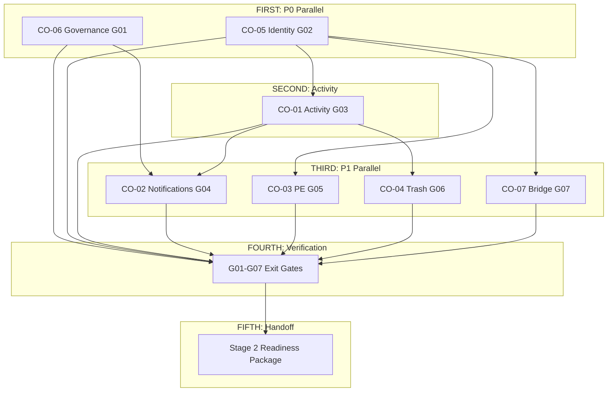

# Stage 1 Implementation Sequence

**Program:** Business Operations Stage 1 Implementation Planning  
**Status:** **Most important implementation sequence document**  
**Last updated:** 2026-06-14  
**Governing logic:** P0 → P1 alignment priorities  
**Master strategy:** [STAGE_1_SHARED_ALIGNMENT_IMPLEMENTATION_STRATEGY.md](./STAGE_1_SHARED_ALIGNMENT_IMPLEMENTATION_STRATEGY.md)

---

## Purpose

Answer: **What gets implemented first? Second? Third? Fourth? Fifth?**

Define dependency chain, entry criteria, exit criteria, and blocking rules for Stage 1 Shared Constitutional Alignment execution.

**This is an implementation sequence — not sprints, waves, or timelines.**

---

## The sequence

### First — P0 Governance + Identity (parallel allowed)

| CO | Gap | Work |
|----|-----|------|
| **CO-06** | G01 | FALSE POSITIVE governance adoption |
| **CO-05** | G02 | Identity trust hardening |

**Parallel execution:** ✅ CO-06 and CO-05 may run simultaneously.

**Rationale:**

| Reason | Detail |
|--------|--------|
| P0 priority | Alignment matrix ranks G01 and G02 as planning credibility gates |
| Architectural harm prevention | Without CO-06, Chat/sockets/notifs absorbed as WC during implementation |
| Identity corruption prevention | Without CO-05, audience, PE subjects, and bridge sync targets untrustworthy |
| No technical dependency | CO-06 is process; CO-05 is identity — independent workstreams |

**Plans:** [FALSE_POSITIVE_GOVERNANCE_IMPLEMENTATION_PLAN.md](./FALSE_POSITIVE_GOVERNANCE_IMPLEMENTATION_PLAN.md) · [IDENTITY_TRUST_HARDENING_PLAN.md](./IDENTITY_TRUST_HARDENING_PLAN.md)

**Track 1 exit:** Both CO-06 and CO-05 exit criteria satisfied.

---

### Second — Activity Foundation

| CO | Gap | Work |
|----|-----|------|
| **CO-01** | G03 | Activity standardization |

**Parallel execution:** ❌ CO-01 must complete before Track 3 platform constitutional programs.

**Rationale:**

| Reason | Detail |
|--------|--------|
| CO-02 dependency | Notifications emit after authorized success — same contract as activity |
| CO-04 dependency | Trash/restore requires activity events |
| Audit foundation | Analytics (Stage 4) and WC campaign audit (Stage 3) depend on G03 |
| Single taxonomy | BO event naming must exist before notification and trash event types finalize |

**Plan:** [ACTIVITY_STANDARDIZATION_PLAN.md](./ACTIVITY_STANDARDIZATION_PLAN.md)

**Track 2 exit:** CO-01 exit criteria (G03) satisfied.

---

### Third — Platform Constitutional Programs (parallel allowed)

| CO | Gap | Work |
|----|-----|------|
| **CO-02** | G04 | Notification standardization |
| **CO-03** | G05 | Policy Engine adoption |
| **CO-04** | G06 | Global Trash alignment |
| **CO-07** | G07 | hrScheduleService contract |

**Parallel execution:** ✅ All four may run simultaneously after Track 1 + Track 2 exit.

**Rationale:**

| Reason | Detail |
|--------|--------|
| Shared foundation ready | Identity (CO-05) and Activity (CO-01) provide stable base |
| Independent domains | Notifications, PE, Trash, and bridge contract are distinct workstreams |
| Convergence economics | One manifest pattern, one PE registration pass, one trash contract, one bridge doc |
| CO-02 needs CO-01 | Notifications after success — Track 2 gate enforced |
| CO-04 needs CO-01 | Trash activity events — Track 2 gate enforced |
| CO-03 needs CO-05 | PE subjects — Track 1 gate enforced |
| CO-07 needs CO-05 | Bridge sync targets — Track 1 gate enforced |

**Plans:** [NOTIFICATION_STANDARDIZATION_PLAN.md](./NOTIFICATION_STANDARDIZATION_PLAN.md) · [POLICY_ENGINE_ADOPTION_PLAN.md](./POLICY_ENGINE_ADOPTION_PLAN.md) · [GLOBAL_TRASH_ALIGNMENT_PLAN.md](./GLOBAL_TRASH_ALIGNMENT_PLAN.md) · [HRSCHEDULESERVICE_CONTRACT_PLAN.md](./HRSCHEDULESERVICE_CONTRACT_PLAN.md)

**Track 3 exit:** All four CO exit criteria satisfied.

---

### Fourth — Cross-Domain Verification

| Scope | Validation |
|-------|------------|
| **G01–G07 exit gates** | Each gap exit criterion verified per CO plan |
| **Shared platform readiness** | Activity, Notifications, PE, Trash patterns consistent across Scheduling + HR |
| **Consumption readiness** | Stage 2 domains can inherit patterns without inventing parallel infrastructure |
| **Risk register review** | Open risks assessed; mitigations confirmed or carry-forward documented |
| **FALSE POSITIVE audit** | WP-06.3 surrogate labeling pass |

**Rationale:**

| Reason | Detail |
|--------|--------|
| Exit gate integrity | Stage 2 must not begin on partial Stage 1 |
| Cross-CO consistency | Notification types reference activity events; trash references both |
| Risk closure | [STAGE_1_IMPLEMENTATION_RISK_REGISTER.md](./STAGE_1_IMPLEMENTATION_RISK_REGISTER.md) reviewed |

**Verification checklist:**

| # | Check | Source |
|---|-------|--------|
| 1 | G01 — governance checklist active | CO-06 exit |
| 2 | G02 — single EP write path | CO-05 exit |
| 3 | G03 — activity taxonomy + inventories | CO-01 exit |
| 4 | G04 — notification taxonomy + manifest spec | CO-02 exit |
| 5 | G05 — PE action inventories + dual specs | CO-03 exit |
| 6 | G06 — trash entity specs + handlers | CO-04 exit |
| 7 | G07 — bridge contract published | CO-07 exit |
| 8 | Cross-domain consumption model validated | Master strategy § Consumption |
| 9 | No boundary regression (Chat ≠ WC etc.) | CO-06 audit |
| 10 | Risk register reviewed | Risk register |

**Track 4 exit:** All ten checks pass. Stage 1 exit gate **OPEN**.

---

### Fifth — Stage 2 Handoff

| Deliverable | Recipient |
|-------------|-----------|
| Stage 1 exit sign-off record | BO program steward |
| Shared pattern reference package | Scheduling + HR modernization |
| Consumption readiness confirmation | Stage 2 leads |
| Deferred G08+ register | Stage 2 planning |
| Risk carry-forward list | Stage 2 risk review |

**Stage 2 scope (out of scope here):**

| Program | CO/Gap |
|---------|--------|
| Scheduling + HR Modernization | CO-08, CO-09, CO-10, G09 |
| Plans | [SCHEDULING_MODERNIZATION_PLAN.md](./SCHEDULING_MODERNIZATION_PLAN.md) · [HR_MODERNIZATION_PLAN.md](./HR_MODERNIZATION_PLAN.md) |

**Rationale:** Stage 2 domain work requires stable constitutional foundation — implementing G09 manager APIs or CO-10 service extraction before G01–G07 creates parallel patterns and certification debt.

**Track 5 exit:** Handoff package delivered. Stage 2 implementation planning may begin.

---

## Dependency chain

---

## Entry criteria (program level)

| Criterion | Status |
|-----------|--------|
| Discovery 0A–0C complete | ✅ |
| Alignment program complete (G01–G18 ranked) | ✅ |
| Modernization planning complete (five-stage model) | ✅ |
| Ownership, boundaries, Model C final | ✅ — not re-opened |
| Stage 1 implementation planning complete | ✅ — this program |
| Future implementation program authorized | Required before code execution |

---

## Exit criteria (program level)

Stage 1 implementation is **complete** when:

1. All CO-06 through CO-07 work packages delivered per CO plans
2. G01–G07 exit criteria verified in Track 4
3. Cross-domain verification checklist (10 items) passes
4. Stage 2 handoff package (Track 5) delivered
5. No Stage 2 work started prematurely

---

## Parallelization rules

| Track | Parallel? | Condition |
|-------|-----------|-----------|
| 1 (CO-06 + CO-05) | ✅ Yes | Independent workstreams |
| 2 (CO-01) | ❌ No | Sequential — blocks Track 3 |
| 3 (CO-02/03/04/07) | ✅ Yes | After Track 1 + 2 exit |
| 4 (Verification) | ❌ No | After all COs complete |
| 5 (Handoff) | ❌ No | After Track 4 pass |

---

## Blocking rules

| Blocked action | Until |
|--------------|-------|
| CO-01 start (recommended) | CO-05 substantially complete |
| CO-02, CO-04 start | CO-01 exit (G03) |
| CO-03, CO-07 start | CO-05 exit (G02) |
| Track 3 start | Track 1 + Track 2 exit |
| Track 4 start | All CO exit criteria met |
| Stage 2 implementation | Track 5 handoff complete |
| G08–G18 work | Stage 2+ authorization |
| WC module (CO-11) | Stage 3 — after Stage 1 + 2 |

---

## Risk of sequence violation

| Violation | Consequence | Mitigation |
|-----------|-------------|------------|
| Track 3 before Track 2 | Notifications/trash without activity contract | Enforce blocking rules |
| Track 3 before Track 1 | PE/bridge on untrusted identity | CO-05 gate |
| Skip CO-06 | WC boundary regression | Track 4 audit item 9 |
| Stage 2 before Track 5 | Manager APIs without platform patterns | Handoff gate |
| Partial CO completion | False Stage 1 exit | Track 4 ten-item checklist |

---

## Quick reference

| Order | Track | COs | Priority |
|-------|-------|-----|----------|
| **First** | P0 Governance + Identity | CO-06, CO-05 | P0 |
| **Second** | Activity Foundation | CO-01 | P1 |
| **Third** | Platform Constitutional | CO-02, CO-03, CO-04, CO-07 | P1 |
| **Fourth** | Cross-Domain Verification | G01–G07 | — |
| **Fifth** | Stage 2 Handoff | Readiness package | — |

---

## Certification statement

**No certification awarded.** Implementation sequence only.
