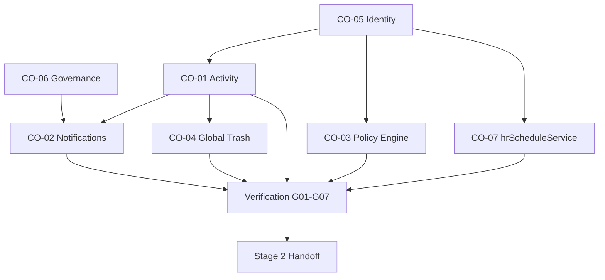

# Stage 1 Shared Alignment Implementation Strategy

**Program:** Business Operations Stage 1 Implementation Planning  
**Status:** Master implementation strategy — planning only  
**Last updated:** 2026-06-14  
**Gaps:** G01–G07 · **COs:** CO-06, CO-05, CO-01, CO-02, CO-03, CO-04, CO-07  
**Strategy source:** [SHARED_ALIGNMENT_MODERNIZATION_PLAN.md](./SHARED_ALIGNMENT_MODERNIZATION_PLAN.md)  
**Sequence:** [STAGE_1_IMPLEMENTATION_SEQUENCE.md](./STAGE_1_IMPLEMENTATION_SEQUENCE.md)  
**Risks:** [STAGE_1_IMPLEMENTATION_RISK_REGISTER.md](./STAGE_1_IMPLEMENTATION_RISK_REGISTER.md)

---

## Executive summary

Stage 1 converts **Shared Constitutional Alignment** from modernization strategy into an **executable implementation plan**. Seven convergence initiatives (CO-06 through CO-07, excluding Stage 2 CO-08) resolve G01–G07 before Scheduling or HR domain modernization begins.

**Execution model:** Five tracks — P0 governance + identity (parallel) → Activity foundation → four platform constitutional programs (parallel) → cross-domain verification → Stage 2 handoff. Patterns are built **once** at the BO shared layer; Scheduling, HR, and future Workforce Communications **consume**.

**No code, schema changes, implementation, or certifications in this program.**

---

## Execution philosophy

### 1. Pattern once, consume many

Stage 1 defines shared constitutional patterns — Activity envelope, notification manifest, Policy Engine registration, Global Trash lifecycle, identity trust, bridge contract — that all BO domains inherit. Domains must not invent parallel infrastructure.

### 2. Authorize → execute → emit

All BO write paths follow the module interoperability contract: authorization succeeds → mutation persists → `emitModuleActivityEvent` on success only. Failed or unauthorized actions never emit activity or notifications.

**Source:** `module-interoperability.mdc`, [BUSINESS_OPERATIONS_PLATFORM_SERVICES.md](./BUSINESS_OPERATIONS_PLATFORM_SERVICES.md)

### 3. Reference module alignment

Drive (L4), Chat (L3), and Calendar (L3) provide proven patterns. Stage 1 implementation adopts — not reinvents — `emitModuleActivityEvent`, Policy Dual, manifest `notifications`, and `trashedAt` + trash controller.

### 4. Phased tracks, not waves

Tracks are **dependency-ordered execution phases** with entry/exit criteria. Future implementation programs map work packages to delivery; this program does not assign sprints or timelines.

### 5. Boundary invariants preserved

Chat ≠ WC · Notifications ≠ WC · Realtime ≠ WC · Workflow Notifications ≠ WC — enforced from Track 1 (CO-06) through all subsequent work.

---

## Scope

| In scope | Out of scope |
|----------|--------------|
| G01–G07 | G08–G18 |
| CO-06, CO-05, CO-01, CO-02, CO-03, CO-04, CO-07 | CO-08–CO-12 |
| Cross-domain consumption model | Scheduling manager APIs (G09) |
| Work packages per CO | HR controller decomposition (G11) |
| Verification + Stage 2 handoff | WC establishment (CO-11) |
| Risk register | Analytics, certification |
| | Schema migrations (planned, not executed here) |

---

## Rollout model

```
Track 1 (FIRST):   CO-06 + CO-05          [P0, parallel]
Track 2 (SECOND):  CO-01                  [P1, after CO-05]
Track 3 (THIRD):   CO-02 + CO-03 + CO-04 + CO-07  [P1, parallel after CO-01]
Track 4 (FOURTH):  Cross-domain verification       [G01–G07 exit gates]
Track 5 (FIFTH):   Stage 2 handoff package         [Scheduling + HR readiness]
```

| Track | Purpose | Blocking |
|-------|---------|----------|
| 1 | Credibility + identity trust | Blocks all platform constitutional work |
| 2 | Activity foundation | Blocks CO-02, CO-04 |
| 3 | Platform constitutional completion | Blocks Stage 2 domain work |
| 4 | Exit gate validation | Blocks Stage 2 authorization |
| 5 | Handoff artifacts | Enables Stage 2 planning kickoff |

---

## Dependency order



---

## Risk management

Stage 1 risks are documented in [STAGE_1_IMPLEMENTATION_RISK_REGISTER.md](./STAGE_1_IMPLEMENTATION_RISK_REGISTER.md). Summary:

| Category | Top risks |
|----------|-----------|
| Sequence | Platform work before P0 gates; CO-02 before CO-01 |
| Identity | CSV migration complexity; lifecycle asymmetry |
| Boundaries | WC boundary regression during implementation |
| Scope | PE scope creep; notification taxonomy drift |
| Integration | hrScheduleService ownership ambiguity; Scheduling hidden dependencies |
| Consistency | Activity event inconsistency; trash lifecycle mismatch |

**Mitigation posture:** Enforce track gates; CO-06 design review checklist; shared taxonomy documents; contract-first for bridge; verification track before handoff.

---

## Cross-domain consumption model

| Platform service | Pattern owner (CO) | Scheduling consumes | HR consumes | WC consumes (future) |
|------------------|-------------------|--------------------|-------------|----------------------|
| Governance | CO-06 | Boundary rules | Boundary rules | Boundary rules |
| Identity | CO-05 | EP assign scope | EP records | Audience resolution |
| Activity | CO-01 | Shift, publish, swap | PTO, attendance, onboarding | Campaign, ack |
| Notifications | CO-02 | `scheduling_*` | `hr_*` | `workforce_*` |
| Policy Engine | CO-03 | Manager/admin writes | Admin/manager writes | Author/send |
| Global Trash | CO-04 | Schedule, shift | Profile, onboarding | Campaign |
| Bridge | CO-07 | Calendar sync consumer | Contract steward | Publish hook consumer |

---

## Stage 1 exit criteria (G01–G07)

| Gap | CO | Exit signal |
|-----|-----|-------------|
| G01 | CO-06 | FALSE POSITIVE governance adopted; design review checklist active |
| G02 | CO-05 | Single EP write path; CSV bypass eliminated; lifecycle symmetry |
| G03 | CO-01 | BO activity taxonomy + Scheduling/HR inventories complete |
| G04 | CO-02 | Manifest + taxonomy + emitter placement defined for all BO modules |
| G05 | CO-03 | PE registration pattern + action inventories complete |
| G06 | CO-04 | Trash lifecycle + entity handlers planned for Scheduling + HR |
| G07 | CO-07 | `hrScheduleService` neutral contract documented |

**Stage 2 blocked until all seven satisfied.**

---

## Handoff to Stage 2

When Track 5 completes, deliver:

| Artifact | Recipient |
|----------|-----------|
| Stage 1 exit sign-off record | BO program steward |
| Consumption readiness confirmation | Scheduling + HR modernization leads |
| Shared pattern reference package | CO-01–04, CO-07 pattern docs |
| Open risk carry-forward list | Stage 2 risk review |
| G08+ deferred items register | Stage 2 planning |

**Stage 2 programs (out of scope here):** CO-08, CO-09, CO-10, G09 per [SCHEDULING_MODERNIZATION_PLAN.md](./SCHEDULING_MODERNIZATION_PLAN.md) and [HR_MODERNIZATION_PLAN.md](./HR_MODERNIZATION_PLAN.md).

---

## CO implementation plan index

| CO | Gap | Document |
|----|-----|----------|
| CO-06 | G01 | [FALSE_POSITIVE_GOVERNANCE_IMPLEMENTATION_PLAN.md](./FALSE_POSITIVE_GOVERNANCE_IMPLEMENTATION_PLAN.md) |
| CO-05 | G02 | [IDENTITY_TRUST_HARDENING_PLAN.md](./IDENTITY_TRUST_HARDENING_PLAN.md) |
| CO-01 | G03 | [ACTIVITY_STANDARDIZATION_PLAN.md](./ACTIVITY_STANDARDIZATION_PLAN.md) |
| CO-02 | G04 | [NOTIFICATION_STANDARDIZATION_PLAN.md](./NOTIFICATION_STANDARDIZATION_PLAN.md) |
| CO-03 | G05 | [POLICY_ENGINE_ADOPTION_PLAN.md](./POLICY_ENGINE_ADOPTION_PLAN.md) |
| CO-04 | G06 | [GLOBAL_TRASH_ALIGNMENT_PLAN.md](./GLOBAL_TRASH_ALIGNMENT_PLAN.md) |
| CO-07 | G07 | [HRSCHEDULESERVICE_CONTRACT_PLAN.md](./HRSCHEDULESERVICE_CONTRACT_PLAN.md) |

---

## Document map

| # | Document | Role |
|---|----------|------|
| 1 | **This document** | Master strategy |
| 2–8 | CO implementation plans | Executable work per initiative |
| 9 | [STAGE_1_IMPLEMENTATION_SEQUENCE.md](./STAGE_1_IMPLEMENTATION_SEQUENCE.md) | First → fifth sequence |
| 10 | [STAGE_1_EXECUTIVE_SUMMARY.md](./STAGE_1_EXECUTIVE_SUMMARY.md) | 5-min entry |
| 11 | [STAGE_1_IMPLEMENTATION_RISK_REGISTER.md](./STAGE_1_IMPLEMENTATION_RISK_REGISTER.md) | Risk inventory |

---

## Certification statement

**No certification awarded.** Implementation strategy only.
