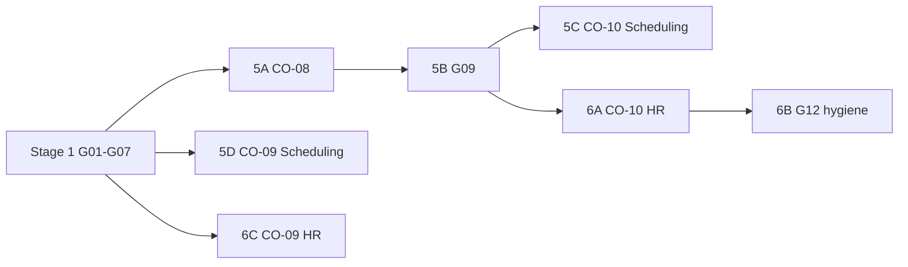

# Stage 2 Engineering Blueprint

**Program:** Business Operations Stage 2 Engineering Blueprint  
**Status:** Master implementation blueprint — no code, no implementation  
**Last updated:** 2026-06-15  
**Planning sources:** [STAGE_2_EXECUTION_READINESS.md](./STAGE_2_EXECUTION_READINESS.md), [SCHEDULING_MODERNIZATION_PLAN.md](./SCHEDULING_MODERNIZATION_PLAN.md), [HR_MODERNIZATION_PLAN.md](./HR_MODERNIZATION_PLAN.md), [BUSINESS_OPERATIONS_CONVERGENCE_PROGRAM.md](./BUSINESS_OPERATIONS_CONVERGENCE_PROGRAM.md)  
**File matrix:** [STAGE_2_FILE_TARGET_MATRIX.md](./STAGE_2_FILE_TARGET_MATRIX.md)  
**Stage 1 prerequisite:** G01–G07 PASS

---

## Purpose

Translate approved Stage 2 packages (5A–6C) into **concrete engineering scope**: files, services, routes, schemas, tests, migrations, and platform contracts to modify. Repository inspection authorized; no redesign of Stage 2 strategy decisions.

**Primary question answered:** Exactly what must change in the codebase to execute CO-08, G09, CO-10 (Scheduling + HR), and CO-09 (Scheduling + HR)?

**Explicitly out of scope:** Analytics 501 trio (G18 / Stage 4); WC module build (CO-11 / Stage 3); new architecture, governance, or discovery programs.

---

## Execution order

Aligned with [BUSINESS_OPERATIONS_MODERNIZATION_SEQUENCE.md](./BUSINESS_OPERATIONS_MODERNIZATION_SEQUENCE.md) and [SCHEDULING_MODERNIZATION_PLAN.md](./SCHEDULING_MODERNIZATION_PLAN.md):

| Order | Package | Initiative | Engineering focus |
|-------|---------|------------|-------------------|
| **1** | **5A** | CO-08 / G08 | Shift-template collision decision + UX/API disambiguation |
| **2** | **5B** | G09 | Manager/admin 501 stub completion |
| **3** | **5C ∥ 6A** | CO-10 / G10, G11 | Scheduling + HR service extraction (parallel tracks) |
| **4** | **5D ∥ 6C** | CO-09 / G13 | Scheduling + HR V-Link registration (parallel tracks) |
| **5** | **6B** | G12 remainder | HR API consolidation + notification hygiene (trails 6A) |

---

## Repositories / monorepo areas touched

| Area | Path | Packages |
|------|------|----------|
| **Prisma** | `prisma/modules/scheduling/`, `prisma/modules/hr/`, `prisma/modules/platform/vlink.prisma`, `prisma/migrations/` | 5A (optional), 5D, 6C |
| **Server — controllers** | `server/src/controllers/scheduling/*.ts`, `server/src/controllers/hrController.ts` | 5B, 5C, 6A |
| **Server — services** | `server/src/services/` | 5B, 5C, 6A, 5D, 6C |
| **Server — routes** | `server/src/routes/scheduling.ts`, `server/src/routes/hr.ts` | 5B |
| **Server — platform** | `server/src/platform/platformEntityRegistry.ts`, `server/src/startup/registerPlatformEntities.ts` | 5D, 6C |
| **Server — startup** | `server/src/startup/builtInModuleManifests.ts`, `registerBuiltInModules.ts` | 5D, 6C, 6B |
| **Web** | `web/src/api/scheduling.ts`, `web/src/hooks/useScheduling.ts`, `web/src/components/scheduling/`, HR pages | 5A, 5B, 6B |
| **Docs** | `docs/business-operations/` | 5A |
| **Tests** | `server/src/**/__tests__/` | All packages |

---

## Package 5A — CO-08 / G08: Shift-template collision resolution

### Purpose

Resolve the **naming and conceptual collision** between HR `AttendanceShiftTemplate` and Scheduling `ShiftTemplate` so G09 manager tooling, integrators, and UX copy do not conflate attendance expectations with schedule planning patterns.

Per [BUSINESS_OPERATIONS_CONVERGENCE_PROGRAM.md](./BUSINESS_OPERATIONS_CONVERGENCE_PROGRAM.md): decision record + naming/UX boundaries — **not** schema merge or unified template store.

### Gaps resolved

| Gap | Resolution |
|-----|------------|
| **G08** | Canonical owners documented; cross-module UX/API labels disambiguated |
| **G09 enablement** | Scheduling `ShiftTemplate` CRUD (5B) proceeds with unambiguous product language |

### Dependencies

| Dependency | Status |
|------------|--------|
| Stage 1 (G01–G07) | **Met** — no Stage 1 CO required for 5A |
| CO-07 (`hrScheduleService`) | Informational only — bridge unchanged |

### Entry criteria

- [STAGE_2_EXECUTION_READINESS.md](./STAGE_2_EXECUTION_READINESS.md) verdict B accepted
- [HR_SCHEDULING_BOUNDARY_REVIEW.md](./HR_SCHEDULING_BOUNDARY_REVIEW.md) COL-4 reviewed

### Exit criteria

- `CO08_SHIFT_TEMPLATE_DECISION.md` published with signed-off canonical owners
- UX/API copy uses distinct terms (see CO-08 deep section below)
- `HR_SCHEDULING_BOUNDARY_REVIEW.md` cross-linked; G08 marked addressed in alignment matrix
- **No** accidental schema merge or FK introduced between HR and Scheduling template models

### Risks

| Risk | Mitigation |
|------|------------|
| Optional Prisma rename (Tier B) breaks `hrAttendanceService` references | Default 5A is **Tier A doc + UX only**; Tier B behind explicit gate |
| Third concept confusion (`ScheduleTemplate`) | Decision record explicitly lists three distinct template types |
| G09 ships before 5A | Block 5B until decision record merged |

### Verification criteria

- Decision record answers canonical owner, migration path, affected files/APIs/tests (this blueprint § CO-08 deep)
- Manual UX review: Scheduling admin surfaces say **shift pattern** (or equivalent); HR attendance docs say **attendance expectation**
- `pnpm type-check` unchanged (Tier A); if Tier B: full test pass on `hrAttendanceService` suite

---

### CO-08 deep section — `AttendanceShiftTemplate` vs `ShiftTemplate`

**Repository evidence:** [HR_SCHEDULING_BOUNDARY_REVIEW.md](./HR_SCHEDULING_BOUNDARY_REVIEW.md) COL-4; `prisma/modules/hr/attendance.prisma`; `prisma/modules/scheduling/core.prisma`.

#### Three distinct concepts (not two)

| Concept | Prisma model | Table | Module | Purpose |
|---------|--------------|-------|--------|---------|
| **Attendance expectation** | `AttendanceShiftTemplate` | `attendance_shift_templates` | HR | Recurring expected work windows for attendance policy enforcement; `startMinutes`/`endMinutes`; links to `AttendancePolicy` and `AttendanceShiftAssignment` |
| **Shift planning pattern** | `ShiftTemplate` | `shift_templates` | Scheduling | Reusable shift defaults for `ScheduleShift` creation; `defaultStartTime`/`defaultEndTime` strings; links to `Position` |
| **Schedule layout** | `ScheduleTemplate` | `schedule_templates` | Scheduling | Multi-day schedule skeleton (distinct from CO-08 collision; already has working admin CRUD) |

**Data link:** No foreign key between `AttendanceShiftTemplate` and `ShiftTemplate`. Domains remain independent (Model C).

#### Canonical owners

| Model | Canonical owner | Consumer modules |
|-------|-----------------|------------------|
| `AttendanceShiftTemplate` | **HR / Attendance** | `hrAttendanceService.ts` (create/list/assign expectations); no REST routes per [HR_OPERATION_MATRIX.md](./HR_OPERATION_MATRIX.md) |
| `ShiftTemplate` | **Scheduling** | `schedulingAdminController.ts` stubs (~L1658–1675); routes `/api/scheduling/admin/templates`; `web/src/api/scheduling.ts` client |
| `ScheduleTemplate` | **Scheduling** | Implemented admin CRUD; `TemplateBuilderVisual.tsx` |

#### Migration path (two tiers)

| Tier | Scope | When |
|------|-------|------|
| **Tier A (default 5A)** | Decision record + UX/API/developer comments; product terms: **Attendance expectation** (HR) vs **Shift pattern** (Scheduling `ShiftTemplate`) vs **Schedule template** (`ScheduleTemplate`) | **Package 5A — mandatory** |
| **Tier B (optional gate)** | Prisma rename `AttendanceShiftTemplate` → `AttendanceExpectationTemplate` with `@@map("attendance_shift_templates")` preserving table name; update service/type references | Only if product signs off; **not** required for G09 |

**Explicitly excluded (convergence program):** Schema merge; unified template store; cross-module FK.

#### Affected files (Tier A)

| File | Change |
|------|--------|
| `docs/business-operations/CO08_SHIFT_TEMPLATE_DECISION.md` | **CREATE** — authoritative decision |
| `docs/business-operations/HR_SCHEDULING_BOUNDARY_REVIEW.md` | **DOC** — link decision; close open question #4 |
| `prisma/modules/hr/attendance.prisma` | **DOC** — model-level comment clarifying HR attendance domain |
| `prisma/modules/scheduling/core.prisma` | **DOC** — `ShiftTemplate` vs `ScheduleTemplate` comment |
| `server/src/services/hrAttendanceService.ts` | **DOC** — module header; internal naming guidance |
| `web/src/api/scheduling.ts` | **MODIFY** — JSDoc on `ShiftTemplate` interface; disambiguate from HR |
| `web/src/hooks/useScheduling.ts` | **MODIFY** — consumer-facing labels if exposed |
| `web/src/components/scheduling/SchedulingAdminContent.tsx` (or template UI) | **MODIFY** — admin copy uses "shift pattern" |

#### Affected files (Tier B — optional)

| File | Change |
|------|--------|
| `prisma/modules/hr/attendance.prisma` | **MIGRATE** — model rename |
| `prisma/schema.prisma` | **MIGRATE** — generated sync |
| `prisma/modules/business/business.prisma` | **MODIFY** — relation field rename |
| `server/src/services/hrAttendanceService.ts` | **MODIFY** — Prisma type references |
| All grep hits for `AttendanceShiftTemplate` (~8 server + prisma files) | **MODIFY** |

#### Affected APIs

| API | Owner | 5A action |
|-----|-------|-----------|
| `GET/POST/PUT/DELETE /api/scheduling/admin/templates` | Scheduling | Document as **shift pattern** endpoints (`ShiftTemplate`); 501 until 5B |
| `GET/POST /api/scheduling/admin/schedule-templates` | Scheduling | Document as **schedule template** (no CO-08 change) |
| HR attendance expectation CRUD | HR | **No REST today** — service-internal only; document in decision record |

#### Affected tests

| Test | Tier A | Tier B |
|------|--------|--------|
| `hrNotificationCompleteness.test.ts` | None | None |
| `hrAttendanceService` tests (if present) | None | Update mocks/types |
| `hrScheduleService.contract.test.ts` | None | None |
| New `co08-template-naming.contract.test.ts` (optional) | DOC compliance smoke | — |

**5A implementation-ready verdict:** Tier A is fully specified; engineering can start immediately after this blueprint without code ambiguity.

---

## Package 5B — G09: Scheduling manager API completion

### Purpose

Implement **501 and empty-stub** manager/admin scheduling endpoints so managers can publish team schedules, manage open shifts, assign employees, view team availability, administer shift patterns, list swap requests, and update employee availability.

### Gaps resolved

| Gap | Resolution |
|-----|------------|
| **G09** | All endpoints in [SCHEDULING_ALIGNMENT_REQUIREMENTS.md](./SCHEDULING_ALIGNMENT_REQUIREMENTS.md) manager/admin stub table functional |

### Dependencies

| Dependency | Package |
|------------|---------|
| CO-08 / G08 | **5A** — naming clarity for `ShiftTemplate` CRUD |
| CO-02 (notifications) | Stage 1 — `schedulingNotificationService.ts` |
| CO-03 (PE) | Stage 1 — `schedulingPolicyDual.ts`, route middleware |
| CO-07 (calendar bridge) | Stage 1 — `hrScheduleService.ts` for publish → calendar |

### Entry criteria

- Package 5A exit criteria met
- Stage 2 file matrix row ownership agreed

### Exit criteria

- No 501 responses on G09 endpoints (except analytics trio — out of scope)
- `getShiftTemplates` returns real data (not empty stub)
- `getAllShiftSwapRequests` returns scoped business data (not `{ swaps: [] }` stub)
- Publish/assign paths emit activity + notifications per Stage 1 patterns (`authorize → execute → emit`)
- Tenant scoping: `businessId` + `dashboardId` on all writes
- New integration tests pass for manager publish and template CRUD

### Risks

| Risk | Mitigation |
|------|------------|
| Publish path duplicates admin `publishSchedule` logic | Extract shared publish helper (precursor to 5C) or call existing admin path with manager authZ |
| Calendar sync regression | Reuse `hrScheduleService` bridge; extend contract test |
| PE gaps on new write paths | Map actions in `policyActions.ts` before route enable |

### Verification criteria

- Manual: manager publish → employees receive `scheduling_schedule_published`
- Automated: new `schedulingTeamController.g09.test.ts` + extend `scheduling-tenant-scope.integration.test.ts`
- `pnpm type-check` + targeted test suite green

### G09 endpoint inventory (authoritative)

| Handler | File | Route (approx.) | Current |
|---------|------|-----------------|---------|
| `publishTeamSchedule` | `schedulingTeamController.ts` | `PUT /team/schedules/:id/publish` | 501 |
| `getOpenShiftsForTeam` | `schedulingTeamController.ts` | `GET /team/shifts/open` | 501 |
| `assignEmployeeToShift` | `schedulingTeamController.ts` | `PUT /team/shifts/:id/assign` | 501 |
| `getTeamAvailability` | `schedulingTeamController.ts` | `GET /team/availability` | 501 |
| `getShiftTemplates` | `schedulingAdminController.ts` | `GET /admin/templates` | Empty list |
| `createShiftTemplate` | `schedulingAdminController.ts` | `POST /admin/templates` | 501 |
| `getShiftTemplateById` | `schedulingAdminController.ts` | `GET /admin/templates/:id` | 501 |
| `updateShiftTemplate` | `schedulingAdminController.ts` | `PUT /admin/templates/:id` | 501 |
| `deleteShiftTemplate` | `schedulingAdminController.ts` | `DELETE /admin/templates/:id` | 501 |
| `getAllShiftSwapRequests` | `schedulingAdminController.ts` | Admin swaps list route | Empty stub |
| `updateEmployeeAvailabilityAdmin` | `schedulingAdminController.ts` | Admin availability route | 501 |

**Out of scope:** `getLaborCostAnalytics`, `getCoverageAnalytics`, `getComplianceReports` (G18).

---

## Package 5C — CO-10 / G10: Scheduling service extraction

### Purpose

Extract ~144 direct Prisma calls from six scheduling controllers into canonical domain services; thin controllers to authZ + DTO mapping + service delegation per Drive L4 pattern.

### Gaps resolved

| Gap | Resolution |
|-----|------------|
| **G10** | Testable scheduling domain layer; controllers no longer own persistence |

### Dependencies

| Dependency | Status |
|------------|--------|
| CO-01 (activity in services) | Stage 1 — emit points move with extraction |
| CO-03 (PE → services) | Stage 1 — policy checks at service boundary |
| G09 (5B) | **Recommended first** — smaller refactor surface if stubs implemented once |

### Entry criteria

- G09 complete (recommended) or explicit parallel waiver
- Activity/notification emit inventory per controller documented

### Exit criteria

- New scheduling domain services own Prisma for their domains
- Controllers contain no direct `prisma.*` calls (except `schedulingAiContextController` read paths if deferred)
- Unit tests per new service
- No behavior regression on tenant scope integration test

### Risks

| Risk | Mitigation |
|------|------------|
| Big-bang refactor | Extract in domain order: templates → availability → swaps → shifts → publish |
| Activity emit dropped during move | Checklist per handler; extend `schedulingActivityService.test.ts` |
| `schedulingShared.ts` becomes junk drawer | Keep shared types/helpers only; no business logic |

### Verification criteria

- `rg 'prisma\.' server/src/controllers/scheduling/` → zero matches (target)
- New service test suites pass
- `scheduling-tenant-scope.integration.test.ts` extended

### Planned service files (CREATE)

| Service | Domain | Primary controller source |
|---------|--------|---------------------------|
| `schedulingTemplateService.ts` | `ShiftTemplate`, `ScheduleTemplate` | `schedulingAdminController.ts` |
| `schedulingAvailabilityService.ts` | `EmployeeAvailability` | Admin + team controllers |
| `schedulingSwapService.ts` | `ShiftSwapRequest` | Admin + team controllers |
| `schedulingShiftService.ts` | `ScheduleShift` CRUD, assignment | Admin, team, employee controllers |
| `schedulingScheduleService.ts` | `Schedule` lifecycle, publish | Admin + team controllers |

**Existing (MODIFY, do not replace):** `schedulingActivityService.ts`, `schedulingNotificationService.ts`, `schedulingTrashService.ts`, `schedulingPolicyDual.ts`.

---

## Package 5D — CO-09 / G13: Scheduling V-Link integration

### Purpose

Register Scheduling entity types in the platform entity registry and V-Link resolver/lifecycle so shifts, schedules, and swap requests are linkable cross-module (pattern: [TODO_PHASE2_TRASH_ENTITY_VLINK.md](../architecture/audits/TODO_PHASE2_TRASH_ENTITY_VLINK.md)).

### Gaps resolved

| Gap | Resolution |
|-----|------------|
| **G13** (Scheduling slice) | Scheduling entities resolvable via `vlinkEntityResolverService` |

### Dependencies

| Dependency | Status |
|------------|--------|
| CO-04 / G06 (trash lifecycle) | Stage 1 — `schedulingTrashService.ts` handlers for `schedule`, `shift`, `schedule_template` |

### Entry criteria

- Trash handlers stable (Stage 1 CO-04 verified)
- Entity type enumeration approved in blueprint matrix

### Exit criteria

- `registerSchedulingPlatformEntities()` called from `registerPlatformEntities.ts`
- `builtInModuleManifests.ts` scheduling `entities[]` block truthful
- `schedulingVlinkAccessService.ts` + `schedulingVlinkLifecycleService.ts` implemented
- `vlinkEntityResolverService.ts` delegates scheduling enum cases
- Permanent delete unlinks V-Link rows (todo/calendar pattern)
- Trashed entities fail closed for link access
- Tests: access, lifecycle, resolver, registry, manifest

### Risks

| Risk | Mitigation |
|------|------------|
| `VLinkEntityType` enum extension requires migration | Add `SCHEDULE`, `SCHEDULE_SHIFT`, `SHIFT_SWAP_REQUEST` (or document `MODULE_ENTITY` fallback — prefer dedicated enums per Todo pattern) |
| Over-registering entities | Phase 1: shift + schedule + swap only; defer templates |
| Cross-tenant link leak | Membership + `schedulingPolicyDual` before grant |

### Verification criteria

- `platformEntityRegistry.scheduling.test.ts` passes
- `vlinkEntityResolverService.scheduling.test.ts` passes
- Trashed shift cannot be linked (fail closed)

### Proposed platform entities (Scheduling)

| entityType | moduleId | vlinkEntityType | supportsTrash |
|------------|----------|-----------------|---------------|
| `shift` | `scheduling` | `SCHEDULE_SHIFT` (new enum) | true |
| `schedule` | `scheduling` | `SCHEDULE` (new enum) | true |
| `swap_request` | `scheduling` | `SHIFT_SWAP_REQUEST` (new enum) | false |

---

## Package 6A — CO-10 / G11: HR controller decomposition

### Purpose

Decompose monolithic `hrController.ts` (~50 handlers, ~77 Prisma calls) into domain services; thin controller to routing + authZ + delegation.

### Gaps resolved

| Gap | Resolution |
|-----|------------|
| **G11** | HR domain logic testable in services matching partial extraction already started |

### Dependencies

| Dependency | Status |
|------------|--------|
| CO-01, CO-03 | Stage 1 |
| CO-04 | Stage 1 — `hrTrashService.ts` already extracted for delete |

### Entry criteria

- Handler inventory mapped to target services (see matrix)
- No parallel identity changes (CO-05 closed)

### Exit criteria

- New HR domain services own Prisma for employees, PTO, settings
- `hrController.ts` reduced to thin delegation (onboarding/attendance already partial)
- `hrAIContextController` remains separate (existing pattern)
- Unit tests per new service
- `hrController.import.test.ts` updated if import path changes

### Risks

| Risk | Mitigation |
|------|------------|
| Partial extraction already exists | Extend `hrAttendanceService`, `hrOnboardingService` — do not duplicate |
| PTO + calendar sync complexity | Keep calendar calls in `hrScheduleService` / dedicated `hrPtoService` |
| Route handler name contract | Do not rename exported controller functions (`api-and-auth.mdc`) |

### Verification criteria

- `rg 'prisma\.' server/src/controllers/hrController.ts` → zero matches (target)
- Existing `hrNotificationCompleteness.test.ts`, `hrTrashService.test.ts` pass
- New `hrEmployeeService.test.ts`, `hrPtoService.test.ts` pass

### Planned service files (CREATE)

| Service | Domain | Source handlers (hrController) |
|---------|--------|--------------------------------|
| `hrEmployeeService.ts` | Employee CRUD, import, terminate, audit | `getAdminEmployees`, `createEmployee`, `updateEmployee`, `deleteEmployee`, `terminateEmployee`, import/export |
| `hrPtoService.ts` | Time-off requests, balances, calendar | `getTimeOffCalendar`, team approve/deny, me/* time-off paths |
| `hrSettingsService.ts` | HR module settings, features | `getHRSettings`, `updateHRSettings`, `getHRFeatureAvailability` |

**Existing (MODIFY):** `hrAttendanceService.ts`, `hrOnboardingService.ts`, `hrAnalyticsService.ts`, `hrTrashService.ts`, `hrActivityService.ts`, `hrScheduleService.ts`.

---

## Package 6B — G12 remainder: HR notification cleanup + API consolidation

### Purpose

Close **remaining** G12 hygiene after Stage 1 CO-02: verify attendance notification emitters, align manifest/grouping with runtime, consolidate scattered HR `fetch` calls into a typed API client.

### Gaps resolved

| Gap | Resolution |
|-----|------------|
| **G12** (remainder) | API client consolidation; manifest/runtime reconciliation |

### Dependencies

| Dependency | Status |
|------------|--------|
| CO-02 | Stage 1 — manifest + `hrAttendanceService` emitters largely done |

### Entry criteria

- 6A complete (recommended) — services stabilize API surface

### Exit criteria

- `web/src/api/hr.ts` provides typed wrappers for primary HR admin/team/me endpoints
- Inline `fetch('/api/hr/...')` in listed pages migrated to client (incremental OK)
- `builtInModuleManifests.ts` HR `notifications[]` matches runtime emitters
- `hrNotificationCompleteness.test.ts` remains green; extended if gaps found
- `web/src/app/notifications/page.tsx` grouping complete (likely already done)

### Risks

| Risk | Mitigation |
|------|------------|
| Large web diff | Migrate high-traffic pages first (`employees`, `team`, `me`) |
| Stale HR modernization plan | Treat CO-02 as authoritative for notification status |

### Verification criteria

- `hrNotificationCompleteness.test.ts` pass
- `builtInModuleManifests.hr.test.ts` (create if missing) manifest ↔ runtime
- No duplicate notification type strings

---

## Package 6C — CO-09 / G13: HR V-Link integration

### Purpose

Register HR entity types for V-Link resolution and lifecycle (employee profiles, time-off requests, attendance records) — parallel track to 5D.

### Gaps resolved

| Gap | Resolution |
|-----|------------|
| **G13** (HR slice) | HR entities linkable cross-module |

### Dependencies

| Dependency | Status |
|------------|--------|
| CO-04 | Stage 1 — `hrTrashService.ts` for `employee_profile` |

### Entry criteria

- Trash lifecycle stable for `employee_profile`
- Entity scope agreed (profiles + PTO + attendance record — not every HR row)

### Exit criteria

- `registerHRPlatformEntities()` in `registerPlatformEntities.ts`
- `hrVlinkAccessService.ts` + `hrVlinkLifecycleService.ts`
- Resolver cases in `vlinkEntityResolverService.ts`
- Manifest `entities[]` for HR
- Tests mirror Todo Phase 2 audit checklist

### Risks

| Risk | Mitigation |
|------|------------|
| PII exposure via links | Policy Engine + position membership before grant |
| `employee_profile` trash vs V-Link | Lifecycle on permanent delete only |

### Verification criteria

- Trashed `EmployeeHRProfile` fails link access
- Resolver tests pass for HR enum cases

### Proposed platform entities (HR)

| entityType | moduleId | vlinkEntityType | supportsTrash |
|------------|----------|-----------------|---------------|
| `employee_profile` | `hr` | `HR_EMPLOYEE_PROFILE` (new enum) | true |
| `time_off_request` | `hr` | `HR_TIME_OFF_REQUEST` (new enum) | false |
| `attendance_record` | `hr` | `HR_ATTENDANCE_RECORD` (new enum) | false |

---

## Migration scope

| Migration | Models / enums | Package | Risk |
|-----------|----------------|---------|------|
| **M1 — V-Link enum extension** | `VLinkEntityType` + new BO values | 5D, 6C | Medium |
| **M2 — Attendance model rename (optional)** | `AttendanceShiftTemplate` → `AttendanceExpectationTemplate` | 5A Tier B only | High |
| **None** | G09 endpoints, service extraction, Tier A CO-08 | 5A (default), 5B, 5C, 6A, 6B | — |

---

## Testing scope

| Package | New / extended tests (planned) | Type |
|---------|-------------------------------|------|
| 5A | Optional naming contract doc test | Unit |
| 5B | `schedulingTeamController.g09.test.ts`, `schedulingAdminController.templates.test.ts` | Unit + integration |
| 5C | `schedulingTemplateService.test.ts`, `schedulingScheduleService.test.ts`, `schedulingShiftService.test.ts`, `schedulingSwapService.test.ts`, `schedulingAvailabilityService.test.ts` | Unit |
| 5D | `schedulingVlinkAccessService.test.ts`, `schedulingVlinkLifecycleService.test.ts`, `vlinkEntityResolverService.scheduling.test.ts`, `platformEntityRegistry.scheduling.test.ts` | Unit |
| 6A | `hrEmployeeService.test.ts`, `hrPtoService.test.ts`, `hrSettingsService.test.ts` | Unit |
| 6B | `builtInModuleManifests.hr.test.ts`; extend `hrNotificationCompleteness.test.ts` | Unit |
| 6C | `hrVlinkAccessService.test.ts`, `hrVlinkLifecycleService.test.ts`, `vlinkEntityResolverService.hr.test.ts` | Unit |
| Cross | Extend `scheduling-tenant-scope.integration.test.ts` | Integration |

**Target:** 18–24 new/extended test files.

---

## Estimated scope summary

| Metric | Estimate |
|--------|----------|
| **Matrix rows** | 68 |
| **New server service files** | 12–14 |
| **Modified controllers** | 7 scheduling + 1 HR |
| **Web files** | 8–12 |
| **Migrations** | 1 required (V-Link enum); 1 optional (CO-08 Tier B) |
| **New tests** | 18–24 |
| **Docs (5A)** | 1 decision record |

---

## Platform contracts modified

| Contract | Mechanism | Package |
|----------|-----------|---------|
| Platform entity registry | `registerPlatformEntity` | 5D, 6C |
| V-Link resolver | `vlinkEntityResolverService.ts` | 5D, 6C |
| V-Link lifecycle | `*VlinkLifecycleService` on permanent delete | 5D, 6C |
| Module manifest entities | `builtInModuleManifests.ts` | 5D, 6C, 6B |
| Service boundary (L4) | Domain services replace controller Prisma | 5C, 6A |
| Cross-module naming | CO08 decision record | 5A |

---

## Certification statement

**No certification awarded.** Engineering blueprint only — no code or schema changes in this program.
