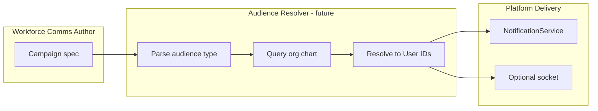

# Workforce Audience Architecture

**Phase:** Business Operations Phase 0C — Discovery only  
**Status:** **Canonical workforce audience reference** for communications and future Workforce Communications domain  
**Last updated:** 2026-06-14  
**Identity authority:** [WORKFORCE_IDENTITY_ARCHITECTURE.md](./WORKFORCE_IDENTITY_ARCHITECTURE.md) — do not re-derive identity stack  
**Ownership authority:** [WORKFORCE_DOMAIN_BOUNDARY_ANALYSIS.md](./WORKFORCE_DOMAIN_BOUNDARY_ANALYSIS.md)  
**Boundary companion:** [CHAT_COMMUNICATIONS_BOUNDARY_ANALYSIS.md](./CHAT_COMMUNICATIONS_BOUNDARY_ANALYSIS.md)  
**Related:** [WORKFORCE_COMMUNICATIONS_STRATEGIC_POSITIONING.md](./WORKFORCE_COMMUNICATIONS_STRATEGIC_POSITIONING.md)

---

## Executive summary

Workforce communication audiences should be resolved from **org-chart identity anchors** — primarily `EmployeePosition` and `Department` — not from parallel employee stores or Chat participant lists.

**Today:** Identity anchors **exist** and are consumed by HR and Scheduling. **No** communication surface consumes them for message audience targeting.

**Duplication risk:** Front-page announcements use implicit business-wide scope; Chat uses explicit participant lists; widget visibility uses department filters for **widgets only**.

---

## Audience design principle (target state)

```
Author (Workforce Communications)
        ↓
Audience resolver (consumes org chart — does not own identity)
        ↓
Resolved recipient set (User IDs from EmployeePosition)
        ↓
Delivery (Notifications / Realtime / optional Chat bridge)
        ↓
Read / Ack tracking (comms-owned campaign records)
```

**Rule:** Future Workforce Communications **reads** identity; Org Chart **writes** identity.

---

## Audience anchor matrix

| Audience type | Source of truth | Schema / API | Consumers today | Future comms consumer |
|---------------|-----------------|--------------|-----------------|----------------------|
| **Individual employee** | Org chart | `EmployeePosition` (user + position + active) | HR, Scheduling, Calendar sync, AI, Analytics | **Primary** — direct message target |
| **Department** | Org chart | `Department`; `Position.departmentId` | HR filters, scheduling `departmentId`, widget visibility | **Primary** — dept broadcast |
| **Position (job slot)** | Org chart | `Position` | Widget `visibleToPositions`; scheduling station fields | **Secondary** — role-based broadcast |
| **Organizational tier** | Org chart | `OrganizationalTier` | Widget `visibleToTiers`; permission defaults | **Secondary** — tier broadcast |
| **Manager subtree** | Org chart | `Position.reportsToId` → reporting graph | HR manager scope (`hrPermissions.ts`); scheduling manager direct reports | **Secondary** — manager cascade |
| **Business-wide** | Business context | `businessId` | Front-page announcements (implicit); socket `business_{id}` rooms | Emergency / all-hands |
| **Business role** | Business module | `BusinessMember.role` | Widget `visibleToRoles`; permissions | **Secondary** — admin/manager broadcasts |
| **Chat participants** | Chat module | `ConversationParticipant` | Chat only | **Not** workforce audience — collaboration |
| **Dashboard scope** | Workspace | `dashboardId` on Chat conversations | Chat | **Not** org-chart audience |

---

## Source of truth statements

Per [WORKFORCE_IDENTITY_ARCHITECTURE.md](./WORKFORCE_IDENTITY_ARCHITECTURE.md):

| Question | Answer |
|----------|--------|
| Who is an employee? | Person with active `EmployeePosition` in a business |
| Who owns placement? | Org chart |
| Who owns HR metadata? | HR (`EmployeeHRProfile`) — not audience authority |
| What should comms consume? | `EmployeePosition` + `Department` (+ `User` for delivery addressing) |

**An audience resolver must:**

1. Query org chart for EP/Dept/Position/tier/hierarchy
2. Map to `User.id` for delivery
3. Never create parallel `WorkforceEmployee` or duplicate dept tables

---

## Current consumer map (communications-relevant)

| Consumer | Audience mechanism | Org-chart anchored? | Workforce comms? |
|----------|-------------------|---------------------|------------------|
| **Front-page announcements** | Implicit all business members viewing page | **No** — no per-announcement audience | Surrogate only |
| **AnnouncementsWidget** | Same JSON; expiry filter | **No** | Surrogate only |
| **Front-page widgets** | `getVisibleWidgets` — roles, tiers, positions, **departments** | **Yes** — for widget visibility | Not announcement content |
| **Chat** | `ConversationParticipant` explicit list | **No** | Collaboration |
| **HR notifications** | `userId` from workflow context (requester, manager, employee) | **Partial** — derived from EP in controller logic | Workflow only |
| **Scheduling sockets** | Socket room `business_{id}`, `schedule_{id}` | **Partial** — membership-based | Sync only |
| **Notification Center** | Per `userId` inbox | N/A — delivery | Infrastructure |

---

## Department audience — deep dive

### What exists

| Mechanism | Location | Applies to |
|-----------|----------|------------|
| `Department` model | `org-chart.prisma` / `business.prisma` | Org structure |
| `Position.departmentId` | Org chart | Placement in dept |
| `getUserDepartments` | `businessFrontPageService.ts` | Resolves user's dept memberships for widget filter |
| `visibleToDepartments` | `BusinessFrontWidget` | **Widget** visibility only |
| Scheduling `departmentId` on shifts | Scheduling schema | Planning — Phase 0A baseline |
| HR employee filters by department | HR admin UI | Directory filter — not messaging |

### What does NOT exist

- Department-targeted **announcement** records
- Auto-resolved "all employees in Dept X" for message send
- Department **channel** in Chat bound to org chart

**Evidence:** `FrontPageContentEditor.tsx` announcement objects have `id`, `title`, `content`, `priority`, `createdAt`, `expiresAt` — **no** `departmentIds` or `audience` field.

---

## EmployeePosition audience — deep dive

### What exists

| Mechanism | Consumers |
|-----------|-----------|
| `EmployeePosition.id` FK | `EmployeeHRProfile`, `TimeOffRequest`, `AttendanceRecord`, `ScheduleShift` |
| `EmployeePosition.userId` | Links to `User` for delivery |
| `EmployeePosition.active` | Lifecycle gate |
| Manager scope via `reportsToId` | HR team routes, scheduling manager middleware |

### What does NOT exist

- Comms campaign → list of `employeePositionId` targets
- Broadcast resolver service

**Future comms should:** Accept audience spec `{ type: 'department', ids: [...] }` or `{ type: 'employee_positions', ids: [...] }` and resolve to users via org-chart queries — **not** store duplicate roster.

---

## Hierarchy audience — deep dive

| Mechanism | Evidence | Comms use today |
|-----------|----------|-----------------|
| `Position.reportsToId` | Org chart hierarchy | HR manager approvals; scheduling direct reports |
| `ManagerApprovalHierarchy` | HR schema | **Unused at runtime** — dead schema |
| Manager subtree query | `hrPermissions.ts`, `schedulingPermissions.ts` | Authorization — not messaging |

**Future:** Manager cascade broadcasts (e.g. "all direct and indirect reports") should use `reportsToId` graph from org chart — single resolver, not HR vs scheduling duplication.

---

## Duplication and drift risks

| Risk | Evidence | Severity | Comms impact |
|------|----------|----------|--------------|
| **Flat announcements vs dept model** | `companyAnnouncements` business-wide JSON | **High** | Wrong audience for dept ops messaging |
| **Chat participants vs EP roster** | Manual user picker | **High** | Ad-hoc groups ≠ workforce audience |
| **Widget dept filter ≠ content dept filter** | `visibleToDepartments` on widgets only | **Medium** | False sense of dept targeting |
| **Legacy `BusinessMember.department` string** | `business.prisma` | **Medium** | Must not use for comms audience — use org chart `Department` |
| **HR CSV import bypass** | Creates EP outside org-chart API | **High** | Audience resolver must read actual EP rows regardless of creation path |
| **CHANNEL type without dept binding** | Chat enum only | **Medium** | Teams may assume dept channels exist |

---

## Audience resolution flow (target — NOT PRESENT)



**Audience types (recommended taxonomy — planning only):**

| Type | Resolution query |
|------|------------------|
| `employee_position` | EP.id → userId |
| `department` | All active EP where position.departmentId IN (...) |
| `position` | All active EP where positionId IN (...) |
| `tier` | All active EP where position.tierId IN (...) |
| `manager_subtree` | EP under reporting graph from manager EP |
| `business` | All active EP for businessId |
| `business_role` | BusinessMember.role filter ∩ active EP users |

---

## What must NOT be audience sources

| Source | Why excluded |
|--------|--------------|
| Chat `ConversationParticipant` | Collaboration opt-in list |
| Notification `userId` alone | Delivery address, not audience spec |
| `companyAnnouncements` implicit viewers | Page viewers ≠ workforce roster |
| Socket room membership | Transport subscription |
| `BusinessMember.department` string | Legacy, not FK |

---

## Integration with delivery layers

| Layer | Role in audience chain |
|-------|------------------------|
| **Org chart** | Source of truth for resolver inputs |
| **Workforce Communications** (future) | Owns audience **spec** and campaign; runs resolver |
| **Notifications** | Receives resolved `userId[]` + content — delivers |
| **Chat** | Optional: post to DM/thread **after** resolver — not primary broadcast |
| **Realtime** | Optional: campaign push event — distinct from scheduling sync |

---

## Evidence index

| Topic | Paths |
|-------|-------|
| Identity stack | `WORKFORCE_IDENTITY_ARCHITECTURE.md` |
| EP / Dept models | `prisma/modules/business/org-chart.prisma` |
| Widget audience resolution | `businessFrontPageService.ts` `getVisibleWidgets` |
| Announcement schema (no audience) | `FrontPageContentEditor.tsx` |
| Chat participants | `conversations.prisma` `ConversationParticipant` |
| HR manager scope | `server/src/middleware/hrPermissions.ts` |
| Boundary / false positives | `CHAT_COMMUNICATIONS_BOUNDARY_ANALYSIS.md` |

---

## Strategic conclusions (evidence only)

| # | Question | Answer |
|---|----------|--------|
| 1 | What audience model should workforce comms use? | **`EmployeePosition` + `Department`** as primary anchors; Position, tier, hierarchy as secondary |
| 2 | Does any surface duplicate identity for audiences? | **Partial** — Chat participant lists and flat announcements bypass org-chart resolution |
| 3 | Is dept targeting implemented for messaging? | **No** — only widget visibility |
| 4 | Source of truth for audiences? | **Org chart** |
| 5 | Who should consume? | **Future Workforce Communications** resolver — NOT PRESENT today |

**No implementation recommendations beyond architectural intent.** Structural facts and target model only.

---

## Document authority

This document is the **canonical workforce audience architecture** reference. Future Workforce Communications modernization must cite this document for audience design. Identity structure remains authoritative in [WORKFORCE_IDENTITY_ARCHITECTURE.md](./WORKFORCE_IDENTITY_ARCHITECTURE.md).
