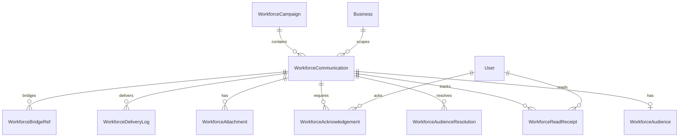

# Workforce Communications Data Model

**Program:** Workforce Communications Engineering Blueprint  
**Module id:** `workforce_comms`  
**Last updated:** 2026-06-14  
**Prisma location (planned):** `prisma/modules/workforce_comms/`

---

## 1. Design principles

1. **Tenant scope:** Every persisted row includes `businessId`; queries always filter by authorized business context.
2. **Identity consumption:** Audience resolution reads `EmployeePosition`, `Department`, `Position`, `BusinessMember` — no `WorkforceEmployee` parallel table.
3. **Snapshot at publish:** Audience resolution results are materialized at publish time for audit immutability.
4. **Soft delete:** User-facing deletes use `trashedAt`; integrate Global Trash.
5. **Lifecycle states:** Draft → Scheduled → Published → Expired → Trashed → Purged.

---

## 2. Entity inventory

| Entity | Purpose | Trash | V-Link |
|--------|---------|-------|--------|
| `WorkforceCommunication` | Core broadcast record (announcement, leadership, etc.) | Yes | Yes |
| `WorkforceCampaign` | Optional grouping / program container | Yes | Yes |
| `WorkforceAudience` | Audience specification (1:1 with communication at publish) | No (child) | No |
| `WorkforceAudienceResolution` | Materialized recipient rows at publish | No | No |
| `WorkforceReadReceipt` | Operational read tracking per user | No | No |
| `WorkforceAcknowledgement` | Required acknowledgement per user | No | No |
| `WorkforceAttachment` | File or link attachment metadata | Yes (cascade) | Optional link to Drive |
| `WorkforceDeliveryLog` | Notification fan-out audit row | No | No |
| `WorkforceBridgeRef` | Cross-module trigger reference (schedule, HR) | No | Yes |

---

## 3. Core entity — WorkforceCommunication

```prisma
// Conceptual — implementation uses prisma/modules/workforce_comms/core.prisma

model WorkforceCommunication {
  id                String   @id @default(uuid())
  businessId        String
  business          Business @relation(...)

  // Authorship
  createdById       String
  createdBy         User     @relation(...)
  publishedById     String?
  publishedAt       DateTime?

  // Content
  title             String
  body              String   // rich text / markdown; sanitized at API boundary
  summary           String?  // notification + list preview
  communicationType WorkforceCommunicationType
  priority          WorkforcePriority @default(NORMAL)

  // Lifecycle
  status            WorkforceCommunicationStatus @default(DRAFT)
  scheduledAt       DateTime?
  expiresAt         DateTime?
  requiresAck       Boolean  @default(false)
  requiresRead      Boolean  @default(true)

  // Surfaces
  showOnFrontPage   Boolean  @default(false)
  showInHubFeed     Boolean  @default(true)

  // Campaign link (optional)
  campaignId        String?
  campaign          WorkforceCampaign? @relation(...)

  // Phase 1 migration
  legacyFrontPageId String?  // maps old companyAnnouncements.id

  trashedAt         DateTime?
  createdAt         DateTime @default(now())
  updatedAt         DateTime @updatedAt

  audience          WorkforceAudience?
  resolutions       WorkforceAudienceResolution[]
  readReceipts      WorkforceReadReceipt[]
  acknowledgements  WorkforceAcknowledgement[]
  attachments       WorkforceAttachment[]
  deliveryLogs      WorkforceDeliveryLog[]
  bridgeRefs        WorkforceBridgeRef[]

  @@index([businessId, status])
  @@index([businessId, trashedAt])
  @@index([businessId, publishedAt])
  @@map("workforce_communications")
}
```

### Enums

```typescript
enum WorkforceCommunicationType {
  ANNOUNCEMENT           // general company news
  DEPARTMENT_BROADCAST   // dept-targeted
  LEADERSHIP_MESSAGE     // executive / leadership
  SCHEDULE_NOTICE        // schedule publish broadcast
  HR_BROADCAST           // HR-authored operational broadcast
  POLICY_COMPLIANCE      // policy update requiring ack
  EMERGENCY_ALERT        // Phase D — evaluate before enabling
}

enum WorkforceCommunicationStatus {
  DRAFT
  SCHEDULED
  PUBLISHED
  EXPIRED
  CANCELLED
}

enum WorkforcePriority {
  LOW
  NORMAL
  HIGH
  URGENT   // display + notification priority — NOT emergency system alone
}
```

---

## 4. WorkforceCampaign

Optional container for multi-communication programs (onboarding week, open enrollment, schedule rollout).

```prisma
model WorkforceCampaign {
  id          String   @id @default(uuid())
  businessId  String
  name        String
  description String?
  status      WorkforceCampaignStatus @default(DRAFT)
  startsAt    DateTime?
  endsAt      DateTime?
  createdById String
  trashedAt   DateTime?
  communications WorkforceCommunication[]

  @@unique([businessId, name])
  @@map("workforce_campaigns")
}

enum WorkforceCampaignStatus {
  DRAFT
  ACTIVE
  COMPLETED
  CANCELLED
}
```

---

## 5. WorkforceAudience

Audience **specification** — not resolved users. Stored as structured JSON + normalized columns for query.

```prisma
model WorkforceAudience {
  id              String   @id @default(uuid())
  communicationId String   @unique
  communication   WorkforceCommunication @relation(...)

  // Primary spec
  audienceType    WorkforceAudienceType
  spec            Json     // Prisma.InputJsonValue — typed at service layer

  // Denormalized for reporting (set at save)
  estimatedCount  Int?

  createdAt       DateTime @default(now())
  updatedAt       DateTime @updatedAt

  @@map("workforce_audiences")
}

enum WorkforceAudienceType {
  BUSINESS              // all active EP in business
  DEPARTMENT            // departmentIds[]
  EMPLOYEE_POSITION     // employeePositionIds[]
  POSITION              // positionIds[] (job slots)
  TIER                  // organizationalTierIds[]
  MANAGER_SUBTREE       // managerEmployeePositionId
  BUSINESS_ROLE         // ADMIN | MANAGER | MEMBER
  CUSTOM_GROUP          // explicit userIds[] — rare; audit-heavy
}
```

### Audience spec JSON shapes (service-validated)

| Type | `spec` shape |
|------|--------------|
| `BUSINESS` | `{ }` |
| `DEPARTMENT` | `{ departmentIds: string[] }` |
| `EMPLOYEE_POSITION` | `{ employeePositionIds: string[] }` |
| `POSITION` | `{ positionIds: string[] }` |
| `TIER` | `{ tierIds: string[] }` |
| `MANAGER_SUBTREE` | `{ managerEmployeePositionId: string, includeIndirect?: boolean }` |
| `BUSINESS_ROLE` | `{ roles: ('ADMIN'|'MANAGER'|'MEMBER')[] }` |
| `CUSTOM_GROUP` | `{ userIds: string[] }` |

**Resolver consumes** [WORKFORCE_AUDIENCE_ARCHITECTURE.md](./WORKFORCE_AUDIENCE_ARCHITECTURE.md) query table — no new identity system.

---

## 6. WorkforceAudienceResolution

Immutable snapshot at **publish** time.

```prisma
model WorkforceAudienceResolution {
  id                String   @id @default(uuid())
  communicationId   String
  communication     WorkforceCommunication @relation(...)
  userId            String
  employeePositionId String?
  resolvedAt        DateTime @default(now())
  resolutionVersion Int      @default(1)

  @@unique([communicationId, userId])
  @@index([communicationId])
  @@index([userId])
  @@map("workforce_audience_resolutions")
}
```

**Rule:** Read/ack/delivery metrics use resolution rows — not live org-chart re-query — for compliance audit.

---

## 7. WorkforceReadReceipt

```prisma
model WorkforceReadReceipt {
  id              String   @id @default(uuid())
  communicationId String
  userId          String
  readAt          DateTime @default(now())
  source          WorkforceEngagementSource @default(HUB)

  @@unique([communicationId, userId])
  @@map("workforce_read_receipts")
}

enum WorkforceEngagementSource {
  HUB
  FRONT_PAGE
  NOTIFICATION
  EMAIL
  MOBILE
}
```

**Distinct from Chat `ReadReceipt`** — operational workforce broadcast read state.

---

## 8. WorkforceAcknowledgement

```prisma
model WorkforceAcknowledgement {
  id              String   @id @default(uuid())
  communicationId String
  userId          String
  acknowledgedAt  DateTime @default(now())
  ipAddress       String?  // optional compliance metadata
  userAgent       String?

  @@unique([communicationId, userId])
  @@map("workforce_acknowledgements")
}
```

---

## 9. WorkforceAttachment

```prisma
model WorkforceAttachment {
  id              String   @id @default(uuid())
  communicationId String
  fileId          String?  // Drive file FK when attached from Drive
  label           String?
  url             String?  // external link
  mimeType        String?
  sortOrder       Int      @default(0)
  trashedAt       DateTime?

  @@index([communicationId])
  @@map("workforce_attachments")
}
```

---

## 10. WorkforceDeliveryLog

```prisma
model WorkforceDeliveryLog {
  id              String   @id @default(uuid())
  communicationId String
  userId          String
  notificationId  String?  // platform Notification row id
  channel         String   // in_app | email | push
  status          WorkforceDeliveryStatus
  attemptedAt     DateTime @default(now())
  deliveredAt     DateTime?

  @@index([communicationId])
  @@map("workforce_delivery_logs")
}

enum WorkforceDeliveryStatus {
  PENDING
  SENT
  FAILED
  SKIPPED
}
```

---

## 11. WorkforceBridgeRef

Links communications to triggering domain entities (does not own those entities).

```prisma
model WorkforceBridgeRef {
  id              String   @id @default(uuid())
  communicationId String
  sourceModuleId  String   // scheduling | hr
  sourceEntityType String  // schedule | shift_swap_request | etc.
  sourceEntityId  String
  bridgeKind      WorkforceBridgeKind

  @@index([sourceModuleId, sourceEntityId])
  @@map("workforce_bridge_refs")
}

enum WorkforceBridgeKind {
  SCHEDULE_PUBLISHED
  HR_POLICY_UPDATE
  MANUAL
}
```

---

## 12. Relationship diagram



---

## 13. Ownership matrix

| Data | Owner module | WC role |
|------|--------------|---------|
| `EmployeePosition` | Org chart | Read for resolver |
| `Department` | Org chart | Read for resolver |
| `Notification` rows | Platform | WC triggers via service |
| `companyAnnouncements` JSON | Business CMS (Phase 1) | Migrate → WC; deprecate |
| Chat `ReadReceipt` | Chat | Not used |
| Schedule publish event | Scheduling | Bridge ref only |

---

## 14. Lifecycle state machine

### Communication

```
DRAFT ──publish──► PUBLISHED ──expires──► EXPIRED
  │                    │
  │ schedule           └──trash──► trashedAt set
  ▼
SCHEDULED ──time──► PUBLISHED
```

**Publish side effects (service layer only):**

1. PE authorize
2. Resolve audience → `WorkforceAudienceResolution` rows
3. Update status + `publishedAt`
4. `workforceActivityService` + `workforceDomainEventService`
5. `workforceNotificationService` fan-out
6. Optional front-page cache invalidation

---

## 15. Migration from Phase 1

| Source field (`companyAnnouncements[]`) | Target field |
|---------------------------------------|--------------|
| `id` | `legacyFrontPageId` |
| `title` | `title` |
| `content` | `body` |
| `priority` | `priority` (mapped) |
| `createdAt` | `createdAt` |
| `expiresAt` | `expiresAt` |
| (none) | `audienceType: BUSINESS` |
| (none) | `status: PUBLISHED` if active |
| (none) | `showOnFrontPage: true` |

One-time `workforceMigrationService.importFrontPageAnnouncements(businessId)`.

---

## 16. Indexes and performance

- List queries: `(businessId, status, trashedAt, publishedAt DESC)`
- Employee feed: join `WorkforceAudienceResolution` where `userId = actor`
- Reporting: aggregate read/ack counts by `communicationId`
- Bounded AI context providers: max 50 rows per query

---

## Related

- [WORKFORCE_COMMUNICATIONS_SERVICE_ARCHITECTURE.md](./WORKFORCE_COMMUNICATIONS_SERVICE_ARCHITECTURE.md)
- [WORKFORCE_AUDIENCE_ARCHITECTURE.md](./WORKFORCE_AUDIENCE_ARCHITECTURE.md)
