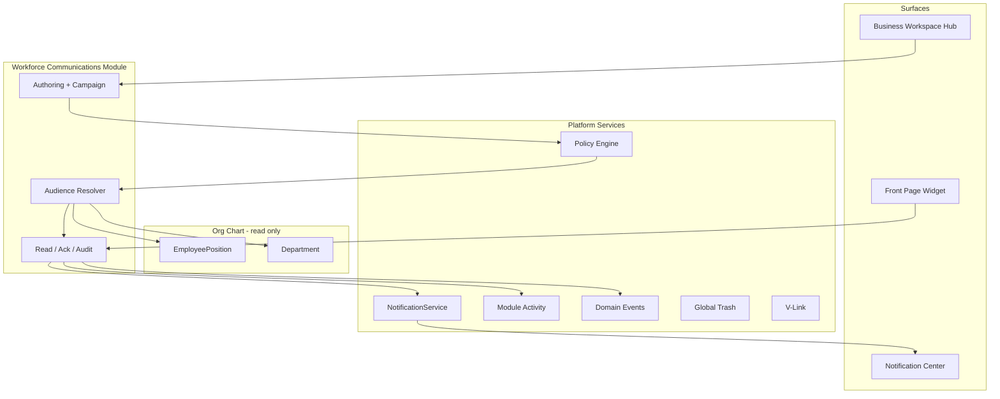

# Workforce Communications Engineering Blueprint

**Program:** Workforce Communications Engineering Blueprint  
**Status:** Authoritative build specification — no implementation  
**Last updated:** 2026-06-14  
**Module id:** `workforce_comms`  
**Product name:** Workforce Communications

**Binding decisions (do not re-open):** Chat boundaries, Notifications boundaries, identity architecture, audience architecture, Model C hybrid architecture, constitutional three-system classification per [WORKFORCE_COMMUNICATIONS_CONSTITUTIONAL_CLARIFICATION.md](./WORKFORCE_COMMUNICATIONS_CONSTITUTIONAL_CLARIFICATION.md).

---

## 1. Purpose

Define the **exact module architecture** engineering must build to elevate Workforce Communications from **Phase 1** (Business Front Page `companyAnnouncements` JSON) to a **first-class Vssyl module** with full broadcast lifecycle:

**Author → Audience (org-chart) → Delivery → Read → Ack → Audit**

This blueprint is implementation-ready documentation only. No code. No certification.

---

## 2. Primary answer — module architecture

Engineering builds a **standalone Business Operations module** (`workforce_comms`) that:

1. **Owns** broadcast content, audience specs, campaign lifecycle, read/ack state, and campaign audit
2. **Consumes** org-chart identity (`EmployeePosition`, `Department`, hierarchy) — never duplicates roster
3. **Emits** to platform **Notifications** (`workforce_*` types) after authorized publish
4. **Emits** normalized **module activity** and registered **domain events** on success only
5. **Registers** manifest, workspace hub, PE actions, V-Link entities, Global Trash handler
6. **Integrates** Front Page as a **read surface** (featured announcements widget) — not the authoring system of record
7. **Bridges** Scheduling and HR via **optional campaign templates** — does not absorb their workflow notifications



---

## 3. Module placement decision

### Recommended Business Workspace layout

```
Business Workspace
├── Front Page          (branding + featured announcement widget — consumer)
├── Dashboard
├── Workforce Communications   ← NEW dedicated hub
├── Scheduling
├── HR
├── Chat
├── Calendar
├── Drive
└── ...
```

### Rationale

| Factor | Decision |
|--------|----------|
| **Constitutional classification** | WC is a coordination pillar in Model C — peer to Scheduling and HR, not a Front Page sub-feature |
| **Lifecycle scope** | Authoring, audience, ack, reporting exceed branding CMS boundaries |
| **FALSE POSITIVE governance** | Front Page remains Phase 1 **seed**; full domain requires dedicated hub per [BUSINESS_OPERATIONS_STRATEGIC_ARCHITECTURE.md](./BUSINESS_OPERATIONS_STRATEGIC_ARCHITECTURE.md) |
| **Reference pattern** | Scheduling and HR use `BusinessWorkspaceContent` `case` + `*WorkspaceLanding` + `*Layout` |
| **Front Page relationship** | Widget **reads** published communications flagged `showOnFrontPage`; admin branding page **stops** owning announcement JSON as system of record after migration |

**Rejected:** WC nested under Front Page only — conflates branding CMS with broadcast domain.

---

## 4. Capability inventory (phased)

| Capability | Phase | Module owner | Notes |
|----------|-------|--------------|-------|
| Announcements | **A — Required** | WC | Evolves `companyAnnouncements` |
| Department announcements | **A — Required** | WC | Audience resolver `department` |
| Leadership messages | **A — Required** | WC | `communicationType: LEADERSHIP` |
| Schedule publication broadcasts | **B — Required** | WC bridge | Triggered by Scheduling publish hook; content owned by WC |
| HR broadcasts | **B — Required** | WC bridge | Template campaigns; does not replace `hr_*` workflow alerts |
| Audience targeting | **A — Required** | WC | Org-chart resolver |
| Notification fan-out | **A — Required** | WC → Platform | `workforce_*` emitters |
| Acknowledgements | **A — Required** | WC | Distinct from Chat `ReadReceipt` |
| Read tracking | **A — Required** | WC | Operational read receipts |
| Campaign reporting | **C — Required** | WC | Ack/read reach metrics |
| Emergency alerts | **D — Evaluate** | WC | Phase D spike; override UX; not `priority: urgent` alone |
| SMS escalation | **Future** | Platform + WC hook | Out of initial build |
| Email campaigns | **Future** | Platform + WC hook | Out of initial build |

---

## 5. Constitutional contract alignment

Per [VSSYL_PLATFORM_STANDARDS_AND_MODULE_CONTRACT.md](../architecture/VSSYL_PLATFORM_STANDARDS_AND_MODULE_CONTRACT.md):

| Contract area | WC implementation |
|---------------|-------------------|
| `authorize → execute → emit → notify` | PE on publish/send; activity + domain events after success; notification fan-out after publish |
| Tenant scoping | `businessId` on every row; `dashboardId` from business workspace context |
| Global Trash | `trashedAt` on `WorkforceCommunication`; handler registered |
| V-Link | Link communications to schedules, HR records, files, meetings |
| AI | `ModuleAIContext` + bounded context providers |
| Manifest truth | Capabilities reflect actual implementation |

---

## 6. Phase 1 evolution (not greenfield)

| Phase 1 today | Target |
|---------------|--------|
| `BusinessFrontPageConfig.companyAnnouncements` JSON | `WorkforceCommunication` rows |
| `FrontPageContentEditor` authoring | WC admin composer (branding page deprecates announcement CRUD) |
| Implicit business-wide audience | Explicit `WorkforceAudience` spec |
| Render-only delivery | Notifications + hub feed + optional front-page widget |
| No ack/audit | Full lifecycle |

Migration service imports historical JSON once; front-page widget reads API.

---

## 7. Boundary rules (enforced in architecture)

| Must not | Owner |
|----------|-------|
| Store broadcast content in Chat | Chat |
| Use Chat participants as audience | Chat |
| Build ack campaigns in Chat read receipts | Chat |
| Author campaigns in Notification Center | Notifications |
| Replace `hr_*` workflow notifications | HR |
| Replace `scheduling_*` shift alerts | Scheduling |
| Use scheduling sockets as message transport | Scheduling + platform realtime |
| Create parallel employee roster | Org chart |

---

## 8. Document map (this program)

| # | Document | Purpose |
|---|----------|---------|
| 1 | **This file** | Master blueprint |
| 2 | [WORKFORCE_COMMUNICATIONS_DATA_MODEL.md](./WORKFORCE_COMMUNICATIONS_DATA_MODEL.md) | Entities, relationships, lifecycle |
| 3 | [WORKFORCE_COMMUNICATIONS_SERVICE_ARCHITECTURE.md](./WORKFORCE_COMMUNICATIONS_SERVICE_ARCHITECTURE.md) | Service inventory |
| 4 | [WORKFORCE_COMMUNICATIONS_ROUTE_ARCHITECTURE.md](./WORKFORCE_COMMUNICATIONS_ROUTE_ARCHITECTURE.md) | REST, permissions, PE |
| 5 | [WORKFORCE_COMMUNICATIONS_UI_ARCHITECTURE.md](./WORKFORCE_COMMUNICATIONS_UI_ARCHITECTURE.md) | Pages, components, hub |
| 6 | [WORKFORCE_COMMUNICATIONS_NOTIFICATION_ARCHITECTURE.md](./WORKFORCE_COMMUNICATIONS_NOTIFICATION_ARCHITECTURE.md) | Fan-out model |
| 7 | [WORKFORCE_COMMUNICATIONS_ACTIVITY_AND_EVENTS.md](./WORKFORCE_COMMUNICATIONS_ACTIVITY_AND_EVENTS.md) | Activity + domain events |
| 8 | [WORKFORCE_COMMUNICATIONS_VLINK_ARCHITECTURE.md](./WORKFORCE_COMMUNICATIONS_VLINK_ARCHITECTURE.md) | V-Link model |
| 9 | [WORKFORCE_COMMUNICATIONS_FILE_TARGET_MATRIX.md](./WORKFORCE_COMMUNICATIONS_FILE_TARGET_MATRIX.md) | File-level build scope |
| 10 | [WORKFORCE_COMMUNICATIONS_EXECUTION_ROADMAP.md](./WORKFORCE_COMMUNICATIONS_EXECUTION_ROADMAP.md) | Build sequence |
| 11 | [WORKFORCE_COMMUNICATIONS_EXECUTIVE_SUMMARY.md](./WORKFORCE_COMMUNICATIONS_EXECUTIVE_SUMMARY.md) | Executive summary |

---

## 9. Reference module patterns applied

| Pattern | Source module | WC application |
|---------|---------------|----------------|
| Thin controllers | Scheduling 5C, HR 6A | `workforceComms*Controller.ts` — zero Prisma |
| `*Service` ownership | File Hub, Chat | All mutations in `workforce*Service.ts` |
| `*NotificationService` adapter | Scheduling, HR | `workforceNotificationService.ts` |
| `*ActivityService` adapter | Scheduling | `workforceActivityService.ts` |
| `*DomainEventService` | Scheduling remediation | `workforceDomainEventService.ts` |
| `*PolicyDual` | Scheduling, HR | `workforceCommsPolicyDual.ts` |
| `*TrashService` | Scheduling, HR | `workforceTrashService.ts` |
| V-Link access + lifecycle | HR 6C | `workforceVlink*Service.ts` |
| Workspace hub | All BO modules | `WorkforceCommsWorkspaceLanding.tsx` |
| Manifest registration | `builtInModuleManifests.ts` | `case 'workforce_comms'` |

---

## 10. Success criteria (build complete)

Engineering may consider WC **module-complete** (pre-certification) when:

- [ ] Module id registered; manifest truthful
- [ ] All Phase A capabilities shipped
- [ ] Phase 1 `companyAnnouncements` migrated or dual-read retired
- [ ] Audience resolver uses org-chart only
- [ ] Publish emits notifications + activity + domain events
- [ ] Ack and read tracking operational
- [ ] Hub renders in Business Workspace
- [ ] File target matrix rows implemented
- [ ] Test suites per matrix pass

**Certification is a separate program.**

---

## Document authority

Supersedes planning-only establishment docs for **implementation shape**. Does not amend Phase 0C boundary or identity documents.
