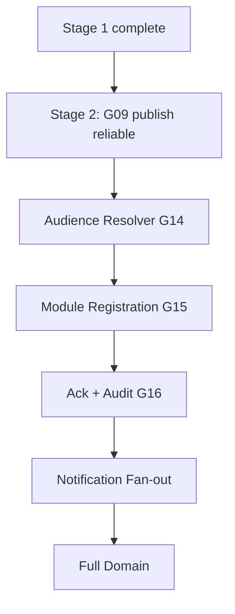

# Workforce Communications Establishment Plan

**Program:** Business Operations Modernization Planning Program  
**Domain:** Workforce Communications (future module)  
**Stage:** 3 — Workforce Communications Establishment  
**Last updated:** 2026-06-14  
**Sources:** Phase 0C, [WORKFORCE_COMMUNICATIONS_CONSTITUTIONAL_CLARIFICATION.md](./WORKFORCE_COMMUNICATIONS_CONSTITUTIONAL_CLARIFICATION.md), [WORKFORCE_COMMUNICATIONS_ESTABLISHMENT_REQUIREMENTS.md](./WORKFORCE_COMMUNICATIONS_ESTABLISHMENT_REQUIREMENTS.md)  
**Audience architecture:** [WORKFORCE_AUDIENCE_ARCHITECTURE.md](./WORKFORCE_AUDIENCE_ARCHITECTURE.md)

---

## Purpose

Define how **Workforce Communications** evolves from **Phase 1** (Business Front Page announcements) to a **full broadcast domain** — using approved findings only.

**Dual-axis classification (binding):**

| Axis | Status |
|------|--------|
| **Domain** | PARTIALLY PRESENT — Phase 1 |
| **Module** | NOT PRESENT |

**No implementation detail. No code. No certifications.**

---

## Phase 1 today

| Dimension | Current |
|-----------|---------|
| **Implementation host** | Business Front Page CMS (`companyAnnouncements`) |
| **Authoring** | `FrontPageContentEditor` via `businessFrontPageService` |
| **Audience** | Implicit business-wide — no per-announcement targeting |
| **Delivery** | Page/widget render only — no notification fan-out |
| **Lifecycle** | Author + render only — no ack, audit, read tracking |
| **Maturity** | LOW |

**Constitutional rule:** Phase 1 is broadcast **seed** — not Chat, not Notifications, not complete WC.

---

## Evolution philosophy

1. **Extend Phase 1** — evolve front-page implementation; do not assume greenfield-only
2. **Consume platform services** — Activity, Notifications, PE, Trash from Stage 1
3. **Consume org-chart identity** — audience resolver reads EP + Department; never creates parallel roster
4. **Preserve three-system model** — Chat / WC / Notifications boundaries unchanged

**Source:** [WORKFORCE_COMMUNICATIONS_CONSTITUTIONAL_CLARIFICATION.md](./WORKFORCE_COMMUNICATIONS_CONSTITUTIONAL_CLARIFICATION.md)

---

## Prerequisites

WC establishment **must not begin** until Stages 1–2 gates satisfied:

| Prerequisite | Stage | Gap / CO |
|--------------|-------|----------|
| FALSE POSITIVE governance | 1 | G01 / CO-06 |
| Identity trust | 1 | G02 / CO-05 |
| Activity pattern | 1 | G03 / CO-01 |
| Notification pattern (`workforce_*`) | 1 | G04 / CO-02 |
| PE author/send pattern | 1 | G05 / CO-03 |
| Global Trash pattern | 1 | G06 / CO-04 |
| Scheduling publish reliability | 2 | G09 |
| Bridge contract stable | 1 | G07 / CO-07 |

---

## Target state

Full **broadcast domain** per [WORKFORCE_AUDIENCE_ARCHITECTURE.md](./WORKFORCE_AUDIENCE_ARCHITECTURE.md):

```
Author (WC) → Audience resolver (org chart) → Resolved recipients
    → Delivery (Notifications emit) → Read/Ack (WC-owned) → Audit (Activity)
```

| Capability | Target owner | Platform relationship |
|------------|--------------|----------------------|
| Campaign authoring | WC | Not Chat, not Notifications |
| Audience resolution | WC (consumes org chart) | Not parallel employee store |
| Delivery fan-out | Notifications | WC emits `workforce_*` |
| Read / ack tracking | WC | Not Chat `ReadReceipt` |
| Campaign audit | WC + Activity | Normalized envelope |
| Module hub + manifest | WC | WS-L1 pattern |
| Emergency alerts | WC | Not `priority: urgent` display metadata |

---

## Establishment evolution model

```
Phase 1: Business Front Page
    (companyAnnouncements — implicit business-wide)
         ↓
Audience Resolver
    (EP, Department, tier, manager subtree — org-chart consumed)
         ↓
Module Registration
    (builtInModuleIds, manifest, permissions)
         ↓
Broadcast Hub
    (WorkforceCommsWorkspaceLanding, BusinessWorkspaceContent switch)
         ↓
Acknowledgement + Audit
    (campaign lifecycle, compliance ack — not Chat receipts)
         ↓
Notification Fan-out
    (workforce_* emitters after authorized publish)
         ↓
Full Workforce Communications Domain
    (dept broadcasts, operational hooks, target emergency path)
```

### Planning milestones (not sprints)

| Milestone | Gaps | CO |
|-----------|------|-----|
| **M1 — Audience on content** | G14 | CO-11 |
| **M2 — Module + hub** | G15 | CO-11 |
| **M3 — Ack + campaign audit** | G16 | CO-11 |
| **M4 — Fan-out + full lifecycle** | G04 consumption | CO-02 pattern |
| **M5 — Full domain** | G14–G16 complete | CO-11 |

---

## Establishment themes (CO-11)

### Theme 1 — Audience resolver (G14)

Resolve broadcast audiences from org-chart anchors — not Chat participants or parallel stores.

| Audience type | Source |
|---------------|--------|
| Individual employee | `EmployeePosition` |
| Department | `Department` + `Position.departmentId` |
| Manager subtree | `reportsToId` graph |
| Business-wide | `businessId` (emergency / all-hands) |

**Dependencies:** G02 (identity trust), G04 (notification addressing)

---

### Theme 2 — Module registration + hub (G15)

| Artifact | Target |
|----------|--------|
| Module id | Dedicated WC module in `builtInModuleIds` |
| Manifest | `aiContext`, `notifications` (`workforce_*`), permissions |
| Hub | `WorkforceCommsWorkspaceLanding` + `BusinessWorkspaceContent` switch |
| Routes/services | WC-owned campaign API surface |

**Dependencies:** G01–G06 (Stage 1), G14 (audience)

---

### Theme 3 — Acknowledgement + campaign audit (G16)

| Capability | Owner | Not |
|------------|-------|-----|
| Required reading / compliance ack | WC campaign records | Chat read receipts |
| Campaign history | WC + Activity envelope | Notification rows |
| Author → audience → delivery → ack trail | WC domain | Socket events |

**Dependencies:** G03 (activity), G14, G15

---

### Theme 4 — Notification fan-out

WC **authors** and **emits** `workforce_*` after authorized publish; Notifications **delivers**.

**Dependencies:** G04 / CO-02 (emitter pattern from Stage 1)

---

### Theme 5 — Policy Engine author/send hooks

PE gates campaign author and send by role + audience scope.

**Dependencies:** G05 / CO-03

---

### Theme 6 — Global Trash for campaigns

Campaign soft-delete via Global Trash contract when module established.

**Dependencies:** G06 / CO-04

---

### Theme 7 — Front-page evolution path

| Phase | Host | Transition |
|-------|------|------------|
| Phase 1 | Business front-page CMS | Current — preserve data path |
| Phase 2+ | WC module | Evolve `companyAnnouncements` into WC campaign model |
| Ongoing | Business module | Front page may render WC-sourced announcements |

**Not greenfield-only** — clarification binding.

---

## Integration hooks (consumers, not owners)

| Source domain | WC relationship |
|---------------|-------------------|
| **Scheduling** | Publish events → optional operational WC notices (after G09) |
| **HR** | Lifecycle events → WC may author org announcements; HR notifs remain workflow |
| **Org chart** | Audience resolver reads — never writes |
| **Notifications** | Delivery only |
| **Chat** | No absorption — optional deep-link bridge only |

---

## Boundary invariants (non-negotiable)

| Invariant | Enforcement |
|-----------|-------------|
| Chat ≠ Workforce Communications | No CHANNEL semantics for broadcasts |
| Notifications ≠ Workforce Communications | Emit only — Notifier delivers |
| Realtime ≠ Workforce Communications | No socket-based campaign delivery |
| Workflow Notifications ≠ Workforce Communications | HR PTO/onboarding alerts stay workflow |

**Source:** [CHAT_COMMUNICATIONS_BOUNDARY_ANALYSIS.md](./CHAT_COMMUNICATIONS_BOUNDARY_ANALYSIS.md)

---

## What is NOT required for establishment entry

| Item | Rationale |
|------|-----------|
| Full emergency alert system | Requires audience + ack + fan-out — named target, not Stage 3 entry |
| Full ack UX polish | Models required; UX depth can follow |
| WC realtime layer | Notifications primary |
| WC AI context | P3 enhancement |
| Chat integration for broadcasts | Chat ≠ WC |

---

## Dependency order



**Program:** CO-11 (Stage 3)

---

## Stage assignment

**Primary stage:** 3 — Workforce Communications Establishment  
**Program:** CO-11  
**Consumes:** Stages 1–2  
**Enables:** Stage 4 analytics (comms metrics optional); Stage 5 certification

---

## Certification statement

**No certification awarded.** WC establishment plan is strategy only. Module remains NOT PRESENT until CO-11 executed in future implementation program.
