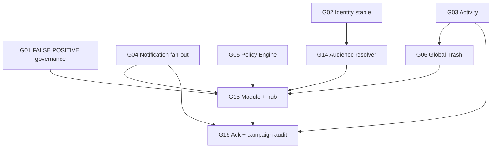

# Workforce Communications Establishment Requirements

**Program:** Business Operations Constitutional Alignment Program  
**Sources:** Phase 0C discovery + [WORKFORCE_COMMUNICATIONS_CONSTITUTIONAL_CLARIFICATION.md](./WORKFORCE_COMMUNICATIONS_CONSTITUTIONAL_CLARIFICATION.md) — no repository re-audit  
**Last updated:** 2026-06-14  
**Evidence:** [WORKFORCE_COMMUNICATIONS_ARCHITECTURE_AUDIT.md](./WORKFORCE_COMMUNICATIONS_ARCHITECTURE_AUDIT.md), [WORKFORCE_AUDIENCE_ARCHITECTURE.md](./WORKFORCE_AUDIENCE_ARCHITECTURE.md), [CHAT_COMMUNICATIONS_BOUNDARY_ANALYSIS.md](./CHAT_COMMUNICATIONS_BOUNDARY_ANALYSIS.md)  
**Master matrix:** [BUSINESS_OPERATIONS_CONSTITUTIONAL_ALIGNMENT.md](./BUSINESS_OPERATIONS_CONSTITUTIONAL_ALIGNMENT.md)

---

## Purpose

Define **minimum platform capabilities** that must exist before Workforce Communications can evolve beyond **Phase 1** (Business Front Page announcements) toward a first-class broadcast domain.

**This is not an implementation plan.** It names constitutional gates, not delivery waves.

---

## Current state (constitutional classification)

Per [WORKFORCE_COMMUNICATIONS_CONSTITUTIONAL_CLARIFICATION.md](./WORKFORCE_COMMUNICATIONS_CONSTITUTIONAL_CLARIFICATION.md):

| Axis | Classification |
|------|----------------|
| **Dedicated module** | NOT PRESENT |
| **Domain capability** | PARTIALLY PRESENT — Phase 1 |
| **Implementation host** | Business Front Page CMS (`companyAnnouncements`) |
| **Maturity** | LOW |

### Phase 1 lifecycle coverage

| Step | Status |
|------|--------|
| Author | ✓ — `FrontPageContentEditor` |
| Audience selection | ✗ — implicit business-wide |
| Delivery | ✓ — page/widget render only |
| Read receipt | ✗ |
| Acknowledgement | ✗ |
| Audit | ✗ |
| Notification fan-out | ✗ |

### Three-system model (binding)

| System | Role |
|--------|------|
| **Chat** | Conversation — people to people |
| **Workforce Communications** | Broadcast — organization to audience |
| **Notifications** | Delivery — domains emit; Notifier delivers |

**Ownership unchanged:** Org Chart (identity), HR (lifecycle), Scheduling (planning), Chat (collaboration), Notifications (delivery).

---

## What Phase 2+ requires (target domain)

Workforce Communications as a **full domain** requires:

| Capability | Owner | Platform relationship |
|------------|-------|----------------------|
| Campaign authoring | WC domain | Not Chat, not Notifications |
| Audience resolution | WC domain (consumes org chart) | Not parallel employee store |
| Delivery fan-out | Notifications platform | WC emits `workforce_*` after publish |
| Read / ack tracking | WC domain | Not Chat `ReadReceipt` |
| Campaign audit | WC domain + Activity platform | Normalized envelope |
| Emergency alerts | WC domain | Not `priority: urgent` display metadata alone |
| Module hub + manifest | WC domain | WS-L1 pattern |
| Policy Engine hooks | WC + platform PE | Author/send by role + audience |

---

## Minimum platform capabilities before evolving beyond Phase 1

These gates must be satisfied **before** Workforce Communications Phase 2 planning or implementation can proceed credibly. Mapped to modernization prerequisites and priority matrix gaps.

### Tier 0 — Governance (required immediately)

| Capability | Prerequisite | Gap ID | Why required |
|------------|--------------|--------|--------------|
| **FALSE POSITIVE governance** | P2 | G01 | Prevents Chat CHANNEL, scheduling sockets, Notification Center, and HR workflow notifs from being mistaken for full WC during evolution |
| **Dual-axis classification adoption** | Clarification doc | — | Phase 1 front page is broadcast seed, not Chat — guides evolution path |

**Gate:** No BO feature labeled "full workforce comms" without complete lifecycle. Phase 1 does not satisfy emergency, ack, or dept broadcast.

---

### Tier 1 — Identity foundation (blocking)

| Capability | Prerequisite | Gap ID | Why required |
|------------|--------------|--------|--------------|
| **Identity stable** | P1 | G02 | Audience resolver consumes `EmployeePosition` + `Department`; CSV bypass and lifecycle asymmetry corrupt recipient sets |
| **Single EP write path** | P1 | G02 | WC reads identity; Org Chart writes — no parallel roster |

**Source:** [WORKFORCE_IDENTITY_ARCHITECTURE.md](./WORKFORCE_IDENTITY_ARCHITECTURE.md), [WORKFORCE_AUDIENCE_ARCHITECTURE.md](./WORKFORCE_AUDIENCE_ARCHITECTURE.md)

**Gate:** Audience resolver cannot be implemented on untrusted identity.

---

### Tier 2 — Shared platform constitutional alignment (blocking for Phase 2)

| Capability | Prerequisite | Gap ID | Why required |
|------------|--------------|--------|--------------|
| **Activity integration** | P4 | G03 | Campaign publish, audience resolve, ack events need normalized `emitModuleActivityEvent` — success only |
| **Notification fan-out** | P5 | G04 | `workforce_*` (or `comms_*`) emitters after authorized publish; Notifications delivers |
| **Policy Engine hooks** | P6 | G05 | Author/send by role + audience scope — not ad-hoc admin checks only |
| **Global Trash** | P11 | G06 | Campaign soft-delete via platform trash contract |
| **V-Link** (target) | P11 | G13 | Cross-module links to campaigns from HR, Scheduling, Drive |

**Gate:** WC must consume platform services — not reimplement delivery, trash, or activity schema.

---

### Tier 3 — WC-specific establishment (Phase 2 gates)

| Capability | Prerequisite | Gap ID | Why required |
|------------|--------------|--------|--------------|
| **Audience resolver** | P3 | G14 | Org-chart broadcast audiences — EP, Dept, tier, manager subtree per audience architecture |
| **Module registration pattern** | P10 | G15 | Hub (`WorkforceCommsWorkspaceLanding`), manifest, `BusinessWorkspaceContent` switch, `builtInModuleIds` |
| **Acknowledgement tracking** | P10 | G16 | Compliance and required-reading lifecycle — not Chat read receipts |
| **Campaign audit models** | P10 | G16 | Author → audience → delivery → read → ack trail |

**Source:** [WORKFORCE_AUDIENCE_ARCHITECTURE.md](./WORKFORCE_AUDIENCE_ARCHITECTURE.md) — architecture exists; zero consumers today.

---

### Tier 4 — Integration hooks (after Tier 2–3)

| Hook | Source domain | WC relationship |
|------|---------------|-----------------|
| Schedule publish events | Scheduling | Operational messaging — Scheduling emits; WC may author coverage notices (not socket semantics) |
| HR lifecycle events | HR | Workflow vs broadcast — HR emits workflow; WC authors org announcements |
| Front page evolution | Business module | Phase 1 `companyAnnouncements` evolves into WC module — not greenfield-only |

**FALSE POSITIVE reminders (unchanged):**

| Surface | Verdict |
|---------|---------|
| Chat CHANNEL | Not WC |
| Scheduling `schedule:*` sockets | UI sync, not broadcast |
| Notification Center | Delivery inbox, not content |
| HR workflow notifications | Workflow alerts, not campaigns |
| Front page `priority: urgent` | Display metadata, not emergency system |

---

## Minimum platform capabilities summary table

| Capability | Required before Phase 2? | Blocks if missing? |
|------------|-------------------------|-------------------|
| FALSE POSITIVE governance | **Yes** | Wrong architecture absorption |
| Identity stable (P1) | **Yes** | Audience corruption |
| Audience resolver | **Yes** | No dept/hierarchy broadcasts |
| Notification fan-out | **Yes** | Page-only delivery insufficient |
| Activity integration | **Yes** | No campaign audit |
| Policy Engine hooks | **Yes** | AuthZ drift |
| Global Trash | **Yes** | Lifecycle contract fail |
| Module registration + hub | **Yes** | Module still NOT PRESENT |
| Acknowledgement tracking | **Yes** for compliance broadcasts | Partial Phase 2 without |
| V-Link | **Recommended** | Cross-module linking |
| Realtime | **No** — optional | Notifications primary |
| AI context | **No** — Phase 3+ | Not blocking Phase 2 gate |
| Full emergency system | **No** — named but not Phase 2 minimum | Requires audience + ack + fan-out first |
| Search | **No** — P3 | Enhancement |

---

## What is NOT required to **start** Phase 2 planning

These are target-state capabilities, not minimum gates:

| Capability | Rationale |
|------------|-----------|
| Full emergency alert system | Requires audience + ack + fan-out — gates named, not Phase 2 entry |
| Full ack UX polish | Ack models required; UX depth can follow |
| Dedicated WC realtime | Notification fan-out is primary delivery |
| WC AI context providers | AI is P3 enhancement |
| Greenfield-only WC | Evolution from front page Phase 1 is constitutional path |
| Chat integration for broadcasts | Chat ≠ WC — optional bridge only, not primary |

---

## Dependency order (WC establishment)

**Prerequisite chain from modernization doc:** P2 → P1 → P3/P4/P5/P6 → P10 (evolve front page → full domain).

---

## Phase 1 → Phase 2 evolution path (constitutional)

Per clarification final recommendation:

1. **Extend** front-page Phase 1 — do not assume greenfield-only
2. **Introduce** audience resolver on announcement content (not widget visibility only)
3. **Emit** `workforce_*` notifications on publish
4. **Register** dedicated module with hub and manifest
5. **Add** ack and campaign audit via activity + domain models
6. **Preserve** Chat, Notifications, and socket boundaries throughout

**Implementation host transition:** Business front-page CMS → dedicated WC module (module id, routes, services) while preserving `companyAnnouncements` data path during evolution.

---

## Platform services — WC current vs required

| Service | Phase 1 current | Phase 2+ required | Gap |
|---------|-----------------|-------------------|-----|
| Activity | NOT PRESENT | Emit on publish, ack | G03 |
| Notifications | NOT PRESENT | `workforce_*` emitters | G04 |
| Policy Engine | NOT PRESENT | Author/send PE actions | G05 |
| Realtime | NOT PRESENT | Optional | — |
| V-Link | NOT PRESENT | Campaign entities | G13 |
| Global Trash | NOT PRESENT | Campaign soft-delete | G06 |
| Audit | NOT PRESENT | Campaign lifecycle | G03, G16 |
| Search | NOT PRESENT | Optional P3 | — |
| AI | NOT PRESENT | Optional P3 | — |

---

## Readiness assessment

| Question | Verdict |
|----------|---------|
| WC Phase 1 understood? | **Yes** — front page broadcast seed |
| WC module present? | **No** |
| Minimum platform gates named? | **Yes** — this document |
| Ready for Phase 2 implementation? | **No** — P0–P1 and WC-specific P3 gates |
| Ready for Phase 2 **planning**? | **After** P0–P1 shared alignment |
| Ready for certification? | **No** |

---

## Certification statement

**No certification awarded.** Establishment requirements are planning documentation only. No implementation, schema changes, or modernization waves defined.
