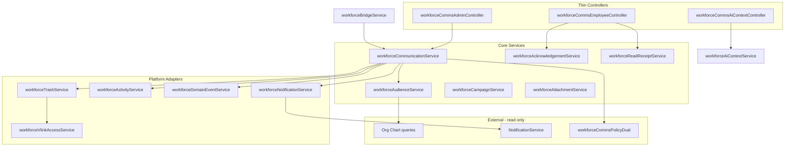

# Workforce Communications Service Architecture

**Program:** Workforce Communications Engineering Blueprint  
**Module id:** `workforce_comms`  
**Last updated:** 2026-06-14  
**Pattern authority:** File Hub `drive*Service`, Scheduling `scheduling*Service`, HR `hr*Service`

---

## 1. Service layer rules

1. **All Prisma** lives in services — controllers are thin (Scheduling 5C / HR 6A pattern).
2. **Order of operations:** `authorize (PE) → execute → emit activity → emit domain events → notify` — never emit on failed/unauthorized actions.
3. **Tenant scope:** Every query/mutation includes `businessId` from authorized context.
4. **Errors:** `WorkforceCommsWorkflowError` with HTTP status; `mapWorkforceCommsServiceError` in controller utils.

---

## 2. Service inventory

| Service | File | Responsibility |
|---------|------|----------------|
| **Core domain** | | |
| `workforceCommunicationService` | `workforceCommunicationService.ts` | CRUD, draft/schedule/publish/expire/cancel |
| `workforceAudienceService` | `workforceAudienceService.ts` | Audience spec validation, resolution, estimate count |
| `workforceCampaignService` | `workforceCampaignService.ts` | Campaign CRUD, attach communications, complete |
| `workforceAcknowledgementService` | `workforceAcknowledgementService.ts` | Record ack, list pending, compliance export |
| `workforceReadReceiptService` | `workforceReadReceiptService.ts` | Record read, idempotent upsert |
| `workforceAttachmentService` | `workforceAttachmentService.ts` | Attach Drive files / URLs |
| **Platform adapters** | | |
| `workforceNotificationService` | `workforceNotificationService.ts` | `NotificationService.createNotification` fan-out |
| `workforceActivityService` | `workforceActivityService.ts` | `emitModuleActivityEvent` normalized envelope |
| `workforceDomainEventService` | `workforceDomainEventService.ts` | Registered `workforce.*` domain events |
| `workforceTrashService` | `workforceTrashService.ts` | Soft trash, restore, purge; global trash handler |
| **V-Link** | | |
| `workforceVlinkAccessService` | `workforceVlinkAccessService.ts` | Fail-closed read through V-Link |
| `workforceVlinkLifecycleService` | `workforceVlinkLifecycleService.ts` | Unlink on purge |
| **Cross-cutting** | | |
| `workforceReportingService` | `workforceReportingService.ts` | Reach, ack rate, read rate aggregates |
| `workforceBridgeService` | `workforceBridgeService.ts` | Scheduling/HR publish hooks → draft communications |
| `workforceMigrationService` | `workforceMigrationService.ts` | Phase 1 `companyAnnouncements` import |
| `workforceAiContextService` | `workforceAiContextService.ts` | Bounded reads for AI providers (no controller Prisma) |
| **Shared** | | |
| `workforceServiceShared.ts` | Types, includes, `assertBusinessMember`, audience type guards |
| `workforceControllerUtils.ts` | `mapWorkforceCommsServiceError` |

---

## 3. Service interaction diagram



---

## 4. Core service contracts

### workforceCommunicationService

| Function | AuthZ | Side effects |
|----------|-------|--------------|
| `listCommunicationsForBusiness` | read | none |
| `getCommunicationById` | read | none |
| `createCommunicationDraft` | create | activity: created |
| `updateCommunicationDraft` | write | activity: updated |
| `scheduleCommunication` | write | activity: scheduled |
| `publishCommunication` | **publish** | resolve audience, activity, domain event, notifications |
| `cancelCommunication` | write | activity: cancelled |
| `expireCommunication` | system/job | activity: expired |

### workforceAudienceService

| Function | Purpose |
|----------|---------|
| `validateAudienceSpec` | Zod/type guard per `WorkforceAudienceType` |
| `estimateAudienceCount` | Preview count for composer UI |
| `resolveAudienceForPublish` | Materialize `WorkforceAudienceResolution[]` |
| `getResolvedUserIds` | Read snapshot for fan-out |

**Resolution queries (org-chart only):**

- `DEPARTMENT` → active EP where `position.departmentId IN (...)`
- `MANAGER_SUBTREE` → walk `Position.reportsToId` from manager EP
- `BUSINESS` → all active EP for `businessId`

### workforceAcknowledgementService

| Function | Rules |
|----------|-------|
| `acknowledgeCommunication` | User must be in resolution set; `requiresAck` true |
| `listPendingAcksForUser` | Business-scoped inbox |
| `getAckComplianceReport` | Admin reporting |

### workforceReadReceiptService

| Function | Rules |
|----------|-------|
| `recordRead` | Idempotent; user in resolution set |
| `getReadStatusForCommunication` | Admin metrics |

---

## 5. Platform adapter contracts

### workforceNotificationService

Mirrors `schedulingNotificationService.ts`:

| Type | Trigger |
|------|---------|
| `workforce_communication_published` | Publish |
| `workforce_ack_required` | Publish when `requiresAck` |
| `workforce_ack_reminder` | Scheduled job (future) |
| `workforce_campaign_completed` | Campaign close |

Uses `NotificationService.createNotification` — never owns inbox UX.

### workforceActivityService

| Action string | When |
|---------------|------|
| `workforce_communication_created` | Draft create |
| `workforce_communication_updated` | Draft update |
| `workforce_communication_published` | Publish |
| `workforce_communication_trashed` | Trash |
| `workforce_ack_completed` | User ack |
| `workforce_campaign_completed` | Campaign complete |

Normalized envelope per `moduleSpecs.md`.

### workforceDomainEventService

Wraps `domainEventEmitters` — see [WORKFORCE_COMMUNICATIONS_ACTIVITY_AND_EVENTS.md](./WORKFORCE_COMMUNICATIONS_ACTIVITY_AND_EVENTS.md).

### workforceTrashService

- `softTrashCommunication` / `restoreCommunication` / `purgeCommunication`
- Register in `registerGlobalTrashHandlers.ts`
- Unlink V-Link on purge via `workforceVlinkLifecycleService`

---

## 6. Bridge service (Scheduling / HR)

`workforceBridgeService` — **does not replace** domain workflow notifications.

| Hook | Input | Output |
|------|-------|--------|
| `onSchedulePublished` | `{ scheduleId, businessId, actorUserId }` | Optional auto-draft `SCHEDULE_NOTICE` or attach to campaign template |
| `onHrPolicyBroadcastRequested` | HR admin action | Draft `HR_BROADCAST` or `POLICY_COMPLIANCE` |

Scheduling continues `scheduling_*` shift notifications. WC adds **broadcast layer** when business enables template.

---

## 7. AI context service

`workforceAiContextService` — **all reads here**, not in controller:

| Provider endpoint | Returns |
|-------------------|---------|
| `/api/workforce-comms/ai/context/overview` | Published count, pending acks (bounded) |
| `/api/workforce-comms/ai/context/reach` | Campaign reach summary |

Registered in `registerBuiltInModules.ts` per `module-development.mdc`.

---

## 8. Shared utilities

### workforceServiceShared.ts

- `WORKFORCE_NOT_TRASHED = { trashedAt: null }`
- `COMMUNICATION_LIST_INCLUDE`, `COMMUNICATION_DETAIL_INCLUDE`
- `assertActiveBusinessMember(businessId, userId)`
- `assertCommunicationAccess(businessId, communicationId)`
- `WorkforceCommsWorkflowError`

### workforceControllerUtils.ts

Maps workflow, trash, policy, and validation errors to HTTP responses (copy `schedulingControllerUtils` shape).

---

## 9. Policy integration

Services call `evaluateWorkforceCommsPolicyDual` at mutation entry — routes also apply `checkWorkforceCommsPolicy` middleware (defense in depth).

See [WORKFORCE_COMMUNICATIONS_ROUTE_ARCHITECTURE.md](./WORKFORCE_COMMUNICATIONS_ROUTE_ARCHITECTURE.md).

---

## 10. Dependency graph (build order)

```
workforceServiceShared
    ↓
workforceAudienceService
    ↓
workforceCommunicationService ← workforceAttachmentService
    ↓
workforceActivityService + workforceDomainEventService + workforceNotificationService
    ↓
workforceAcknowledgementService + workforceReadReceiptService
    ↓
workforceCampaignService + workforceReportingService
    ↓
workforceTrashService + workforceVlink*
    ↓
workforceBridgeService + workforceMigrationService
```

---

## Related

- [WORKFORCE_COMMUNICATIONS_DATA_MODEL.md](./WORKFORCE_COMMUNICATIONS_DATA_MODEL.md)
- [WORKFORCE_COMMUNICATIONS_ROUTE_ARCHITECTURE.md](./WORKFORCE_COMMUNICATIONS_ROUTE_ARCHITECTURE.md)
