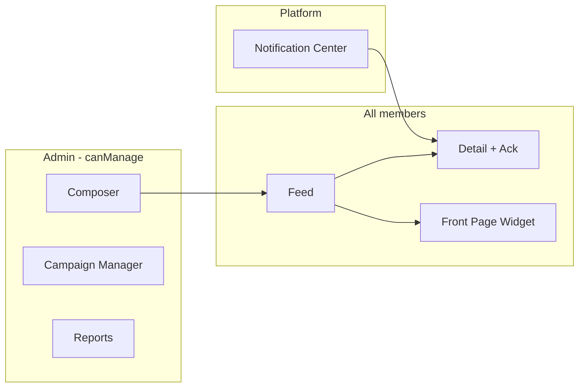

# Workforce Communications UI Architecture

**Program:** Workforce Communications Engineering Blueprint  
**Module id:** `workforce_comms`  
**Last updated:** 2026-06-14  
**UI standards:** `ui-standards.mdc` — Drive module icons, global font

---

## 1. Workspace placement

### BusinessWorkspaceContent switch

```typescript
// web/src/components/business/BusinessWorkspaceContent.tsx
case 'workforce_comms':
  return <WorkforceCommsLayout businessId={businessId} />;
```

### Module navigation

| Location | Label | Icon |
|----------|-------|------|
| `BrandedWorkDashboard` `getModuleIcon` | Megaphone / Radio (match Drive icon style) | `getModuleName` → "Workforce Communications" |
| Business sidebar module list | After Dashboard, before Scheduling | Order: strategic coordination pillar |

---

## 2. Layout hierarchy

```
WorkforceCommsLayout.tsx
├── WorkforceCommsWorkspaceLanding.tsx    (hub — required per module-development.mdc)
├── Admin surfaces (role-gated)
│   ├── WorkforceCommsAdminDashboard.tsx
│   ├── CommunicationComposer.tsx
│   ├── CommunicationList.tsx
│   ├── CampaignManager.tsx
│   └── CommunicationReport.tsx
└── Employee surfaces
    ├── WorkforceCommsFeed.tsx
    ├── CommunicationDetail.tsx
    └── PendingAckBanner.tsx
```

---

## 3. Pages and routes (web)

| Route | Component | Audience |
|-------|-----------|----------|
| `/business/[id]/workforce-comms` | `WorkforceCommsWorkspaceLanding` | All members |
| `/business/[id]/workforce-comms/feed` | `WorkforceCommsFeed` | All members |
| `/business/[id]/workforce-comms/communications/[commId]` | `CommunicationDetail` | Resolved audience |
| `/business/[id]/workforce-comms/admin` | `WorkforceCommsAdminDashboard` | Admin / canManage |
| `/business/[id]/workforce-comms/admin/compose` | `CommunicationComposer` | Admin |
| `/business/[id]/workforce-comms/admin/campaigns` | `CampaignManager` | Admin |
| `/business/[id]/workforce-comms/admin/reports/[commId]` | `CommunicationReport` | Admin |

Use Next.js app router under `web/src/app/business/[id]/workforce-comms/`.

---

## 4. Key components

### WorkforceCommsWorkspaceLanding (hub)

| Section | Content |
|---------|---------|
| Hero | "Workforce Communications" + quick actions |
| Pending acks card | Count + link (employee) |
| Recent announcements | Last 5 published |
| Admin CTA | "Compose announcement" (admin only) |
| Campaign summary | Active campaigns (admin) |

### CommunicationComposer

| Field | UI control |
|-------|------------|
| Title | Text input |
| Body | Rich text editor (shared platform component) |
| Type | Select: Announcement, Dept, Leadership, Policy, etc. |
| Priority | Select (not emergency — separate type for Phase D) |
| Audience | `AudiencePicker` component |
| Requires ack | Toggle |
| Expires | Date picker |
| Show on front page | Toggle |
| Attachments | Drive picker integration |
| Schedule / Publish | Primary actions with confirm modal |

### AudiencePicker

Consumes org-chart APIs (existing business/org-chart endpoints):

| Tab | Picker |
|-----|--------|
| Business-wide | Confirm all-hands |
| Department | Multi-select departments |
| Employees | EP search with user name |
| Manager subtree | Manager EP selector |
| Role | ADMIN / MANAGER / MEMBER checkboxes |

Shows **estimated recipient count** from `/audience/estimate`.

### WorkforceCommsFeed

- Card list: title, summary, priority badge, ack required indicator
- Filter: unread, pending ack
- Infinite scroll / pagination

### CommunicationDetail

- Full body render
- Attachment list
- Auto `recordRead` on view
- Ack button (sticky if `requiresAck`)
- Link to related schedule/HR entity via V-Link chip (if bridged)

### CommunicationReport (admin)

- Audience size (resolved count)
- Read rate / ack rate progress bars
- Export CSV (compliance)

### PendingAckBanner

- Global banner in Business Workspace when pending acks > 0
- Dismiss per session only — not permanent dismiss

---

## 5. Front Page integration

### AnnouncementsWidget (modify)

| Before | After |
|--------|-------|
| Reads `config.companyAnnouncements` JSON | `fetch('/api/workforce-comms/public/front-page?businessId=')` |
| Client-side expiry filter | Server returns active published only |
| No read tracking | Optional `recordRead` with `source: FRONT_PAGE` |

### FrontPageContentEditor (modify)

| Before | After |
|--------|-------|
| CRUD announcements inline | **Remove** announcement CRUD section |
| | Link: "Manage announcements in Workforce Communications →" |
| Branding fields remain | welcomeMessage, heroImage, widgets unchanged |

---

## 6. Notification Center integration

| Notification type | Deep link |
|-------------------|-----------|
| `workforce_communication_published` | `/business/[id]/workforce-comms/communications/[commId]` |
| `workforce_ack_required` | Same + highlight ack CTA |

Register metadata in `web/src/app/notifications/page.tsx` and `web/src/api/notifications.ts` per `NOTIFICATION_METADATA_GUIDE.md`.

---

## 7. Dashboard integration

Optional widget on business dashboard:

| Widget | Data |
|--------|------|
| `WorkforceCommsSummaryWidget` | Pending acks, latest announcement title |

Not required for Phase A — Phase C enhancement.

---

## 8. Admin surfaces vs employee surfaces



---

## 9. Accessibility and UX rules

- Ack button must be keyboard accessible; confirm ack in modal for policy compliance type
- `URGENT` priority uses distinct visual treatment — **not** full-screen emergency overlay until Phase D evaluated
- Empty states: link admin to composer when no communications
- Loading/error states use shared platform patterns

---

## 10. File inventory (web)

| File | CREATE/MODIFY |
|------|---------------|
| `web/src/components/workforce-comms/WorkforceCommsWorkspaceLanding.tsx` | CREATE |
| `web/src/components/workforce-comms/WorkforceCommsLayout.tsx` | CREATE |
| `web/src/components/workforce-comms/CommunicationComposer.tsx` | CREATE |
| `web/src/components/workforce-comms/AudiencePicker.tsx` | CREATE |
| `web/src/components/workforce-comms/WorkforceCommsFeed.tsx` | CREATE |
| `web/src/components/workforce-comms/CommunicationDetail.tsx` | CREATE |
| `web/src/components/workforce-comms/CommunicationReport.tsx` | CREATE |
| `web/src/components/workforce-comms/CampaignManager.tsx` | CREATE |
| `web/src/components/workforce-comms/PendingAckBanner.tsx` | CREATE |
| `web/src/components/business/BusinessWorkspaceContent.tsx` | MODIFY |
| `web/src/components/BrandedWorkDashboard.tsx` | MODIFY |
| `web/src/components/business/widgets/AnnouncementsWidget.tsx` | MODIFY |
| `web/src/components/business/FrontPageContentEditor.tsx` | MODIFY |
| `web/src/api/workforceComms.ts` | CREATE |
| `web/src/app/business/[id]/workforce-comms/**` | CREATE |

---

## Related

- [WORKFORCE_COMMUNICATIONS_ROUTE_ARCHITECTURE.md](./WORKFORCE_COMMUNICATIONS_ROUTE_ARCHITECTURE.md)
- [WORKFORCE_COMMUNICATIONS_NOTIFICATION_ARCHITECTURE.md](./WORKFORCE_COMMUNICATIONS_NOTIFICATION_ARCHITECTURE.md)
