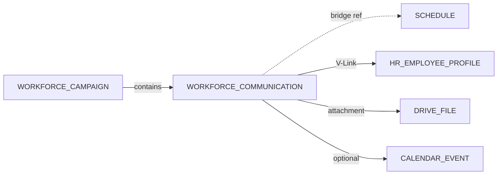

# Workforce Communications V-Link Architecture

**Program:** Workforce Communications Engineering Blueprint  
**Module id:** `workforce_comms`  
**Last updated:** 2026-06-14  
**Pattern:** HR 6C (`hrVlinkAccessService`, `hrVlinkLifecycleService`), Scheduling V-Link

---

## 1. V-Link role

V-Link lets users **relate** workforce communications to other platform entities without conflating ownership.

| Question | Answer |
|----------|--------|
| Can announcements be linked? | **Yes** — `WORKFORCE_COMMUNICATION` entity |
| Can campaigns be linked? | **Yes** — `WORKFORCE_CAMPAIGN` entity |
| Can acknowledgements be linked? | **No** — engagement record, not linkable product object |
| Can broadcasts attach to schedules? | **Yes** — via `WorkforceBridgeRef` + V-Link to `SCHEDULE` |
| Can broadcasts attach to HR records? | **Yes** — link to `HR_EMPLOYEE_PROFILE`, policy docs |
| Can broadcasts attach to files? | **Yes** — `WorkforceAttachment.fileId` + V-Link to Drive |
| Can broadcasts attach to meetings? | **Yes** — link to `CALENDAR_EVENT` when calendar bridge exists |

---

## 2. Platform entity registration

`server/src/platform/registerWorkforceCommsPlatformEntities.ts` (or extend `registerBuiltInModules`):

| entityType | vlinkEntityType | supportsTrash |
|------------|-----------------|---------------|
| `communication` | `WORKFORCE_COMMUNICATION` | true |
| `campaign` | `WORKFORCE_CAMPAIGN` | true |

**Not registered:** `acknowledgement`, `read_receipt`, `audience_resolution` — internal engagement rows.

### Manifest alignment

`builtInModuleManifests.ts` `case 'workforce_comms'` `entities[]` must match registry.

---

## 3. Prisma / migration

Add to `vlinkEntityType` enum (migration):

```sql
ALTER TYPE "VLinkEntityType" ADD VALUE 'WORKFORCE_COMMUNICATION';
ALTER TYPE "VLinkEntityType" ADD VALUE 'WORKFORCE_CAMPAIGN';
```

Mirror `prisma/migrations/20260616000000_hr_vlink_entity_types/migration.sql` pattern.

---

## 4. Access service

`workforceVlinkAccessService.ts`

| Function | Behavior |
|----------|----------|
| `resolveWorkforceCommunicationForVLink` | Load communication; fail if trashed |
| `resolveWorkforceCampaignForVLink` | Load campaign; fail if trashed |
| `assertVLinkReadAccess` | Business member + PE read |

**Fail-closed on trashed** — same as Scheduling/HR.

---

## 5. Lifecycle service

`workforceVlinkLifecycleService.ts`

| Event | Action |
|-------|--------|
| Communication purged | `unlinkCommunicationFromAllVLinks` |
| Campaign purged | `unlinkCampaignFromAllVLinks` |

Called from `workforceTrashService.permanentlyDelete*`.

---

## 6. Relationship model



### Supported link directions

| From | To | Use case |
|------|-----|----------|
| Communication | Schedule | "Schedule published" notice |
| Communication | Shift (via schedule) | Optional deep context |
| Communication | HR employee profile | Targeted leadership message context |
| Communication | Drive file | Policy PDF attachment |
| Communication | Calendar event | All-hands meeting link |
| Campaign | Multiple communications | Program container |
| Any V-Link | Chat conversation | **Optional** "Discuss" bridge — Chat owns thread |

### Unsupported

| Link | Why |
|------|-----|
| Communication → Chat as primary store | Boundary violation |
| Acknowledgement → anything | Not a linkable entity |
| Communication → Notification row | Delivery artifact |

---

## 7. AI visibility

`ModuleAIContext` registration:

```typescript
{
  moduleId: 'workforce_comms',
  contextProviders: [
    { path: '/api/workforce-comms/ai/context/overview', ... },
    { path: '/api/workforce-comms/ai/context/reach', ... },
  ],
  entities: ['communication', 'campaign'],
  keywords: ['announcement', 'broadcast', 'acknowledgement', 'campaign'],
}
```

V-Link gives AI cross-entity context ("this announcement relates to schedule X") via platform V-Link resolver — not custom joins in AI controller.

---

## 8. Resolver integration

Extend `vlinkEntityResolverService.ts`:

```typescript
case 'WORKFORCE_COMMUNICATION':
  return workforceVlinkAccessService.resolveWorkforceCommunicationForVLink(...);
case 'WORKFORCE_CAMPAIGN':
  return workforceVlinkAccessService.resolveWorkforceCampaignForVLink(...);
```

---

## 9. Tests

| File | Cases |
|------|-------|
| `workforceVlinkAccessService.test.ts` | Trashed fail-closed, business scope |
| `workforceVlinkLifecycleService.test.ts` | Unlink on purge |
| `vlinkEntityResolverService.workforce.test.ts` | Resolver registration |
| `platformEntityRegistry.workforce.test.ts` | Entity descriptors |

---

## Related

- [WORKFORCE_COMMUNICATIONS_DATA_MODEL.md](./WORKFORCE_COMMUNICATIONS_DATA_MODEL.md)
- [WORKFORCE_COMMUNICATIONS_FILE_TARGET_MATRIX.md](./WORKFORCE_COMMUNICATIONS_FILE_TARGET_MATRIX.md)
