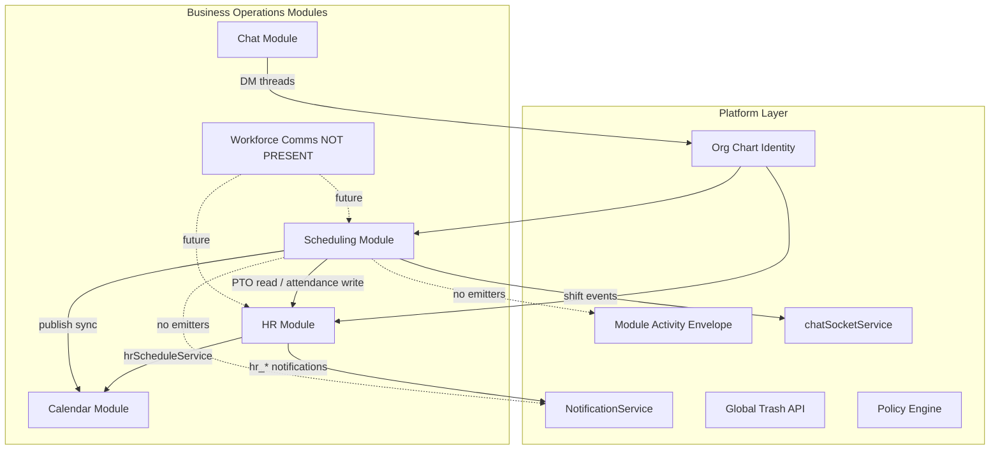

# Workforce Domain Boundary Analysis

**Phase:** Business Operations Phase 0A — Discovery only  
**Status:** Canonical ownership reference for Phase 0B (HR) and Phase 0C (Workforce Communications)  
**Last updated:** 2026-06-14  
**Authority:** This document is the **source of truth** for capability ownership across the Business Operations program until superseded by Phase 0B/0C assessments.  
**Related:** [SCHEDULING_OPERATION_MATRIX.md](./SCHEDULING_OPERATION_MATRIX.md), [SCHEDULING_STRATEGIC_POSITIONING.md](./SCHEDULING_STRATEGIC_POSITIONING.md)

---

## Executive summary

| Classification | Count (approx.) | Examples |
|----------------|-----------------|----------|
| Scheduling-owned | 14 | Schedule creation, shift assignment, availability |
| HR-owned | 16 | PTO, attendance, employee HR profiles |
| Calendar-owned | 5 | Recurrence, reminders, event storage |
| Workforce Communications-owned | 0 | **NOT PRESENT** as module |
| Shared | 12 | Org hierarchy, calendar sync, PTO conflict detection |
| Platform-owned | 8 | Notifications infra, activity envelope, org chart identity |
| Unknown | 10 | Shift bidding, certifications, call-offs, some analytics |

**Major collisions:** dual shift-template models, `hrScheduleService` calendar bridge, front-page announcements vs workforce broadcasts, scheduling realtime vs operational messaging.

---

## Legend

**Current Owner classification:**

| Value | Meaning |
|-------|---------|
| Scheduling-owned | `scheduling` module owns data and primary API |
| HR-owned | `hr` module owns data and primary API |
| Calendar-owned | `calendar` module owns data and primary API |
| Workforce Communications-owned | Future module — **NOT PRESENT** today |
| Shared | Multiple modules with explicit integration; no single owner |
| Platform-owned | Cross-cutting platform service or org-chart foundation |
| Unknown | Insufficient repository evidence |

---

## Workforce Planning

| Capability | Current Owner | Current Implementation Location | Adjacent Dependencies | Future Recommended Owner | Architectural Notes | Open Questions |
|------------|---------------|--------------------------------|----------------------|------------------------|---------------------|----------------|
| Schedule creation | Scheduling-owned | `Schedule` model; `POST /admin/schedules`; `SchedulingAdminContent.tsx` | Org chart `EmployeePosition`; business `businessId` | Scheduling-owned | Core planning entity | — |
| Shift assignment | Scheduling-owned | `ScheduleShift`; `createShift`/`updateShift`; visual builder | HR `TimeOffRequest` read for conflicts; org chart positions | Scheduling-owned | Conflict check is shared read | Should conflict rules live in shared policy? |
| Open shifts | Scheduling-owned | `isOpenShift` on `ScheduleShift`; `getOwnOpenShifts`, `claimOpenShift` | Employee position assignment | Scheduling-owned | Employee claim implemented | Manager `getOpenShiftsForTeam` is **501** |
| Shift claiming | Scheduling-owned | `POST /me/shifts/:id/claim` — `schedulingEmployeeController.ts` | `EmployeePosition` | Scheduling-owned | Implemented | — |
| Shift bidding | Unknown | NOT PRESENT — no models/routes for competitive bidding | — | Unknown | Distinct from open-shift claim | In scope for scheduling or marketplace? |
| Shift swaps | Scheduling-owned | `ShiftSwapRequest`; employee request + manager/admin approve/deny | Org chart direct reports for manager scope | Scheduling-owned | Admin list returns empty stub | Fix admin list stub |
| Coverage requests | Unknown | AI context `coverage_status` only; no request workflow | Scheduling shifts, availability | Unknown | No `CoverageRequest` model | Workflow owner: scheduling vs comms? |
| Availability management | Scheduling-owned | `EmployeeAvailability`; `/me/availability` CRUD; `AvailabilityManagement.tsx` | HR PTO displayed in UI (read) | Scheduling-owned | Admin update **501** | Should PTO block availability automatically? |
| Labor planning | Scheduling-owned | UI stats in `SchedulingAdminContent.tsx`; philosophy engine | Shifts, stations | Scheduling-owned | Mostly client-computed | Server analytics 501 |
| Labor forecasting | Scheduling-owned (stub) | `getLaborCostAnalytics` **501**; AI keywords only | — | Scheduling-owned or Platform analytics | Not implemented server-side | Analytics module vs scheduling? |
| Staffing ratios | Scheduling-owned (partial) | `minStaff`/`maxStaff` on shifts; station `isRequired` | `BusinessStation` model | Scheduling-owned | Schema supports; enforcement unclear | Automated enforcement unknown |
| Workforce optimization | Scheduling-owned (partial) | `schedulingPhilosophyService`, `schedulingAIActionService` | Availability, PTO reads | Scheduling-owned | AI-assisted only | Autonomy boundaries with HR? |

---

## Employee Management

| Capability | Current Owner | Current Implementation Location | Adjacent Dependencies | Future Recommended Owner | Architectural Notes | Open Questions |
|------------|---------------|--------------------------------|----------------------|------------------------|---------------------|----------------|
| Employee profiles | HR-owned | `EmployeeHRProfile` → `EmployeePosition`; `/api/hr/admin/employees` | Org chart | HR-owned | HR extends org chart; 1:1 with position | — |
| Employment status | HR-owned | `EmploymentStatus` enum; terminate flow in `hrController.ts` | Org chart | HR-owned | | |
| Job titles | Platform-owned | `Position.title` in `org-chart.prisma` | Org chart UI | Platform-owned (org chart) | Scheduling reads `Position` | — |
| Departments | Platform-owned | `Department` in `business.prisma`; org-chart UI | HR analytics grouping; shift `departmentId` | Platform-owned (org chart) | Scheduling references `departmentId` | Department-scoped module routing TODO in PermissionManager |
| Manager relationships | Platform-owned | Org chart hierarchy; `ManagerApprovalHierarchy` in HR | Scheduling manager direct-report scoping | Platform-owned | `schedulingPermissions.ts` uses direct reports | — |
| Org hierarchy | Platform-owned | `OrganizationalTier`, `Position`, `EmployeePosition`; `org-chart.ts` | HR, Scheduling consume | Platform-owned | **Identity hub** for workforce | — |
| Employee permissions | Platform-owned | `departmentPermissions`, business member roles; org-chart `PermissionManager.tsx` | Module access | Platform-owned | Scheduling uses `BusinessRole` + custom middleware | Policy Engine migration? |
| Certifications | Unknown | Onboarding enum `TRAINING` in `onboarding.prisma` only | HR onboarding | Unknown | No standalone certifications model | HR scope in 0B |
| Skills | Unknown | NOT PRESENT as workforce skills model | — | Unknown | | Future HR or scheduling? |
| Workforce records | HR-owned | `EmployeeHRProfile`, HR employee admin UI | Org chart | HR-owned | Scheduling does not duplicate employee records | — |

---

## Time Management

| Capability | Current Owner | Current Implementation Location | Adjacent Dependencies | Future Recommended Owner | Architectural Notes | Open Questions |
|------------|---------------|--------------------------------|----------------------|------------------------|---------------------|----------------|
| PTO requests | HR-owned | `TimeOffRequest`; `POST /me/time-off/request` | Calendar sync via `hrScheduleService` | HR-owned | | — |
| PTO approvals | HR-owned | `/team/time-off/:id/approve`; admin HR routes | Manager hierarchy | HR-owned | | — |
| PTO balances | HR-owned | `GET /me/time-off/balance` | HR settings | HR-owned | | Verify implementation depth in 0B |
| Attendance | HR-owned | `AttendanceRecord`, `hrAttendanceService.ts` | Scheduling publish stubs | HR-owned | Past-focused tracking | — |
| Call-offs | Unknown | NOT PRESENT as dedicated model | Attendance exceptions? | Unknown | No explicit call-off workflow | HR 0B scope |
| Clock-in / clock-out | HR-owned | `POST /me/attendance/clock-in`, `clock-out` | `AttendancePolicy` | HR-owned | | — |
| Timecards | Unknown | NOT PRESENT as named timecard entity | `AttendanceRecord` may partially cover | Unknown | | 0B to assess |
| Overtime tracking | Unknown | NOT PRESENT in grep/repo scan | — | Unknown | | Enterprise HR stub territory |
| Leave management | HR-owned | `TimeOffRequest` types (PTO, SICK, etc.) | Calendar | HR-owned | Overlaps PTO | — |

---

## Communications

| Capability | Current Owner | Current Implementation Location | Adjacent Dependencies | Future Recommended Owner | Architectural Notes | Open Questions |
|------------|---------------|--------------------------------|----------------------|------------------------|---------------------|----------------|
| Department announcements | Unknown | `BusinessFrontPageConfig.companyAnnouncements`; `FrontPageContentEditor.tsx` | Business front page only | Workforce Communications-owned (future) | **Not workforce-scoped**; static CMS JSON | Migrate vs extend front page? |
| Workforce broadcasts | NOT PRESENT | No models/routes | Notifications, Chat | Workforce Communications-owned (future) | Gap | New module vs Chat extension? |
| Emergency alerts | NOT PRESENT | No implementation in TS/Prisma | Notifications | Workforce Communications-owned (future) | Gap | |
| Shift communication | Unknown | Scheduling realtime (`schedule:shift:*`) — UI sync only | `chatSocketService` | Shared or Workforce Comms | **Not** operational messaging product | Realtime vs comms boundary |
| Coverage communication | NOT PRESENT | No workflow | Scheduling coverage AI context | Workforce Communications-owned (future) | | |
| Read receipts | NOT PRESENT | No workforce read receipt model | Chat has message read state | Unknown | Chat read ≠ workforce operational receipt | 0C scope |
| Operational messaging | NOT PRESENT | No dedicated system | Chat, notifications | Workforce Communications-owned (future) | | |
| Team messaging | Calendar-owned → **Chat-owned** | Chat module threads/DM; `OnboardingChatIntegration.tsx` deep-link | HR onboarding only | Chat-owned | Not department/workforce-scoped | Integrate with workforce comms? |

---

## Calendar & Scheduling Intersections

| Capability | Current Owner | Current Implementation Location | Adjacent Dependencies | Future Recommended Owner | Architectural Notes | Open Questions |
|------------|---------------|--------------------------------|----------------------|------------------------|---------------------|----------------|
| Published shifts (calendar events) | Shared | `publishSchedule` → `syncScheduleShiftsToCalendar` in `hrScheduleService.ts` | Calendar `Event` model | Shared | HR-named bridge service | Neutral bridge ownership? |
| Employee calendars | Calendar-owned | Calendar module personal/business calendars | HR schedule calendar bootstrap | Calendar-owned | `HRModuleSettings.scheduleCalendarId` | |
| Availability calendars | Scheduling-owned | `EmployeeAvailability` — not calendar events | — | Scheduling-owned | Distinct from calendar free/busy | Export to calendar? |
| PTO calendar visibility | Shared | `syncTimeOffRequestCalendar` in `hrScheduleService.ts` | Calendar + HR | Shared | HR owns PTO; calendar owns events | |
| Resource scheduling | Unknown | `JobLocation`, `BusinessStation` in scheduling; calendar resource calendars unclear | — | Unknown | May mean different things per module | Define in 0B/0C |
| Recurrence ownership | Calendar-owned | `calendarRecurrenceService` | — | Calendar-owned | Scheduling does not own recurrence | Synced shifts recurrence rules? |
| Reminder ownership | Calendar-owned | `calendarSchedulerService`, `calendarReminderService` | — | Calendar-owned | Shift reminders not evidenced in scheduling | Scheduling notifications future |

---

## AI & Intelligence

| Capability | Current Owner | Current Implementation Location | Adjacent Dependencies | Future Recommended Owner | Architectural Notes | Open Questions |
|------------|---------------|--------------------------------|----------------------|------------------------|---------------------|----------------|
| Schedule generation | Scheduling-owned | `schedulingAIActionService.aiGenerateSchedule`; `POST /ai/generate-schedule` | Philosophy engine, availability | Scheduling-owned | | |
| Workforce recommendations | Scheduling-owned | `schedulingRecommendationService`; `GET /recommendations` | Business industry → mode/strategy | Scheduling-owned | Config recommendations, not people | |
| Staffing optimization | Scheduling-owned (partial) | `schedulingPhilosophyService`; `suggest_assignments` action | Shifts, availability | Scheduling-owned | | |
| Coverage prediction | Scheduling-owned (partial) | `getCoverageStatusForAI` context provider | Shifts | Scheduling-owned | Read-only AI context | |
| Labor forecasting | Scheduling-owned (stub) | Analytics 501; AI context keywords | — | Unknown | Not implemented | |
| PTO conflict detection | Shared | Scheduling `createShift`/`updateShift` queries `timeOffRequest` | HR data | Shared | Scheduling enforces; HR owns PTO | Move to shared policy service? |
| Attendance anomaly detection | Unknown | HR attendance analytics partial; no anomaly service | `hrAnalyticsService` | Unknown | | 0B scope |
| Workforce analytics | HR-owned (partial) | `hrAnalyticsService`; attendance/time-off dashboards | Scheduling has 501 analytics | Shared or split | Overlapping analytics surfaces | Single analytics owner? |

---

## Platform Features

| Capability | Current Owner | Current Implementation Location | Adjacent Dependencies | Future Recommended Owner | Architectural Notes | Open Questions |
|------------|---------------|--------------------------------|----------------------|------------------------|---------------------|----------------|
| Notifications | Platform-owned (gap in scheduling/hr) | `NotificationService`; HR emits some `hr_*` types; scheduling emits **none** | Module manifests | Per-module emitters → platform | Scheduling has icon bucket only | `scheduling_*` types needed |
| Activity logging | Platform-owned (gap) | `emitModuleActivityEvent` pattern; **not used** by scheduling/hr | Module specs | Per-module → platform envelope | Constitutional gap | |
| Domain events | Platform-owned (gap) | `DOMAIN_EVENTS.md` patterns; scheduling does not emit | — | Per-module publishers | | |
| Realtime updates | Platform-owned | `chatSocketService` scheduling broadcasts | Scheduling controllers | Platform infra + module contracts | Membership-proven schedule rooms | |
| V-Link ownership | Platform-owned (not integrated) | `V_LINK.md` — hr, scheduling not integrated | Entity resolvers | Per-module when implemented | | Entity types for Schedule/Shift? |
| Global Trash ownership | Platform-owned (gap) | `/api/trash`; scheduling uses hard delete | — | Per-module handlers | No `trashedAt` on scheduling | |
| Audit history | HR-owned (partial) | `GET /admin/employees/:id/audit-logs` | — | HR + platform activity | Scheduling has no audit trail | Unified workforce audit? |
| Analytics ownership | Shared | HR analytics services; scheduling 501; platform `analytics` pseudo-module | — | Platform analytics vs module analytics | Triple overlap | |

---

## Cross-cutting integration map

---

## Known collisions

| Collision | Modules involved | Evidence | Risk |
|-----------|------------------|----------|------|
| Dual shift-template models | HR + Scheduling | `AttendanceShiftTemplate` vs `ShiftTemplate` | High — naming confusion |
| Calendar bridge in HR service | HR + Scheduling + Calendar | `hrScheduleService.ts` | Medium — ownership ambiguity |
| Front-page announcements vs workforce broadcasts | Business front page + future Comms | `FrontPageContentEditor.tsx` | Medium — wrong scope today |
| Scheduling realtime vs shift messaging | Scheduling + Chat | `chatSocketService` shift events | Medium — stakeholders may conflate |
| Client analytics vs server analytics | Scheduling UI + 501 APIs | `SchedulingAdminContent.tsx` | Medium — misleading maturity |
| Org-chart scheduling fields on `Position` | Org chart + Scheduling | `jobFunction`, `stationName` on `Position` | Low — blurs org design vs planning |

---

## Strategic model answer

> Is Vssyl ultimately building **A**, **B**, or **C**?

### A — Three independent modules (Scheduling, HR, Workforce Communications)

**Evidence for:** Distinct `scheduling` and `hr` module IDs, schemas, routes, manifests, and workspace hubs. Product docs explicitly separate planning vs tracking.

### B — Workforce Operations Platform (composed domains)

**Evidence for:** Shared `EmployeePosition` identity, `hrScheduleService` bridge, publish→attendance+calendar integration, platform realtime/notifications infrastructure, business workspace as operational shell.

### C — Hybrid: Independent modules + shared integration layer

**Evidence for:** Module separation exists today (A) but cross-cutting bridges and org-chart identity are mandatory (B). Workforce Communications module does not exist, preventing full B.

### Conclusion (evidence-based — not forced)

**Repository reality today aligns closest with C — Hybrid:**

- **Scheduling** and **HR** are independent modules with clear domain schemas.
- **Workforce Communications** is not a module — only front-page CMS announcements and Chat DMs.
- A **shared integration layer** (`EmployeePosition`, `hrScheduleService`, `chatSocketService`, future platform activity/notifications) connects domains without merging codebases.

Whether the product **ultimately** becomes B depends on Phase 0C (Workforce Communications) and whether a formal Workforce Operations program wrapper is adopted. **Insufficient evidence to mandate B today.**

---

## Implications for Phase 0B (HR Assessment)

**Validate (do not re-derive from scheduling audit):**

- All HR-owned and Shared rows in Time Management and Employee Management sections
- `hrScheduleService` implementation and ownership
- `AttendanceShiftTemplate` vs Scheduling `ShiftTemplate` collision
- HR notification types, activity emissions, constitutional compliance
- PTO balance implementation depth, call-offs, timecards, overtime (Unknown rows)
- HR analytics vs scheduling analytics overlap

**Accept from this document:**

- Scheduling reads PTO for conflict; scheduling writes attendance stubs on publish
- Org chart owns identity; HR extends with profiles

---

## Implications for Phase 0C (Workforce Communications Assessment)

**Own all Communications-group capabilities marked NOT PRESENT or Unknown:**

- Department broadcasts, workforce announcements, emergency alerts
- Shift/coverage operational messaging, read receipts
- Distinction: scheduling realtime **≠** workforce comms

**Resolve open questions:**

- New module vs Chat extension vs notifications-only fan-out
- Relationship to `BusinessFrontPageConfig.companyAnnouncements`
- Department targeting via org-chart `Department`
- Integration hooks from scheduling publish and coverage gaps

---

## Evidence index

| Domain | Primary paths |
|--------|---------------|
| Scheduling | `prisma/modules/scheduling/`, `server/src/routes/scheduling.ts`, `server/src/controllers/scheduling/`, `web/src/components/scheduling/` |
| HR | `prisma/modules/hr/`, `server/src/routes/hr.ts`, `server/src/services/hr*.ts`, `web/src/components/hr/` |
| Org chart | `prisma/modules/business/org-chart.prisma`, `server/src/routes/org-chart.ts` |
| Calendar bridge | `server/src/services/hrScheduleService.ts` |
| Calendar | `server/src/services/calendar*.ts`, `prisma/modules/calendar/` |
| Chat | `server/src/services/chatSocketService.ts`, `prisma/modules/chat/` |
| Front page | `web/src/components/business/FrontPageContentEditor.tsx`, `server/src/services/businessFrontPageService.ts` |
| Platform standards | `docs/architecture/VSSYL_PLATFORM_STANDARDS_AND_MODULE_CONTRACT.md`, `memory-bank/moduleSpecs.md` |
| V_Link | `docs/architecture/V_LINK.md` |
| Product intent | `memory-bank/schedulingProductContext.md`, `memory-bank/hrProductContext.md` |

---

## Document maintenance

- **Phase 0B** may extend HR-owned rows with deeper evidence; it should **not** contradict Scheduling-owned rows without new repo evidence.
- **Phase 0C** should populate Workforce Communications-owned rows or confirm NOT PRESENT.
- Supersede this document only via explicit Business Operations program revision.
