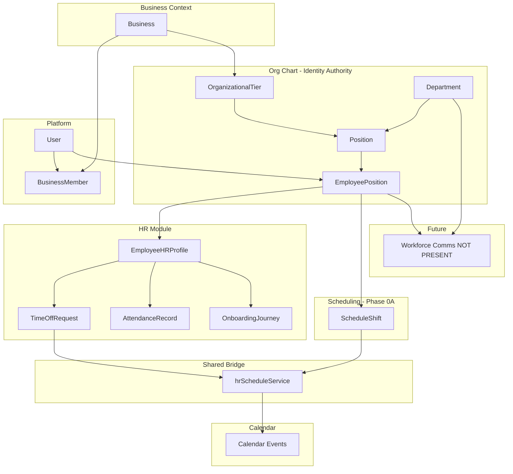

# Workforce Identity Architecture

**Phase:** Business Operations Phase 0B — Discovery only  
**Status:** Canonical **workforce identity structure** reference for HR, Scheduling, Workforce Communications (future), Calendar, Analytics, AI, and Business Operations Strategic Architecture  
**Last updated:** 2026-06-14  
**Companion:** [HR_ORG_CHART_BOUNDARY_ANALYSIS.md](./HR_ORG_CHART_BOUNDARY_ANALYSIS.md) (ownership per capability)  
**Baseline:** [WORKFORCE_DOMAIN_BOUNDARY_ANALYSIS.md](./WORKFORCE_DOMAIN_BOUNDARY_ANALYSIS.md) (Phase 0A capability ownership)

---

## Executive summary

### What is workforce identity in Vssyl?

Workforce identity is **not** a single table. It is a **layered stack**:

1. **Platform user** (`User`) — authentication identity  
2. **Business membership** (`BusinessMember`) — access to a business workspace  
3. **Workforce placement** (`EmployeePosition`) — **authoritative answer to "who is an employee here?"**  
4. **HR employment record** (`EmployeeHRProfile`) — optional extension with hire/status/HR workflows  

**An employee in workforce/scheduling/PTO terms is a person with an active `EmployeePosition` in a business.** HR profile enriches that placement but does not define it.

This model is **validated by repository evidence** — not assumed.

---

## Workforce identity stack (validated)

```
Platform User (User)
        ↓
Business Member (BusinessMember) — gate for business access
        ↓
Employee Position (EmployeePosition) ← WORKFORCE IDENTITY ANCHOR
        ↓
Employee HR Profile (EmployeeHRProfile) — optional HR extension
        ↓
HR feature records (TimeOffRequest, AttendanceRecord, OnboardingJourney, …)
```

**Source of truth statement:** `prisma/modules/hr/README.md` lines 74–84; `EmployeeHRProfile.employeePositionId` required unique FK (`core.prisma` L17–18).

---

## Identity ownership matrix

| Layer / entity | Owner | Source of truth | Consumers | Notes |
|----------------|-------|-----------------|-----------|-------|
| **User** | Platform (auth) | `User` table | All modules | Account login identity |
| **BusinessMember** | Business module | `business.prisma` | Permissions, invites, tier | `role`, legacy `title`/`department` strings |
| **OrganizationalTier** | Org chart (platform) | `org-chart.prisma` | Permission defaults | |
| **Department** | Org chart (platform) | `business.prisma` + org routes | HR filters, scheduling `departmentId`, future comms targeting | |
| **Position** | Org chart (platform) | `org-chart.prisma` | Assignment, scheduling station fields | Job slot in hierarchy |
| **EmployeePosition** | Org chart (platform) | `org-chart.prisma` | **HR, Scheduling, Calendar sync, AI, Analytics** | **Identity anchor** |
| **EmployeeHRProfile** | HR module | `hr/core.prisma` | HR UI, onboarding, audit | 1:1 extension; may not exist yet |
| **TimeOffRequest** | HR module | `hr/attendance.prisma` | HR, Scheduling (read), Calendar (sync) | FK `employeePositionId` |
| **AttendanceRecord** | HR module | `hr/attendance.prisma` | HR, Scheduling (write stub on publish) | FK `employeePositionId` |
| **ScheduleShift** | Scheduling module | `scheduling/core.prisma` | Scheduling, Calendar (sync) | References `employeePositionId` — Phase 0A |
| **Future comms audience** | NOT PRESENT | — | Should consume EP + Department | Phase 0C scope |

---

## Lifecycle ownership

| Step | Owner | Evidence | Dependencies |
|------|-------|----------|--------------|
| **User creation** | Platform / auth flows | User registration, import creates User in CSV | — |
| **Business membership creation** | Business module | Invite flows; `BusinessMember` | User must exist |
| **Department assignment** | Org chart | `orgChartService` department CRUD; Position.`departmentId` | Business |
| **Position assignment (definition)** | Org chart | `/api/org-chart/positions` | Tier, department |
| **Reporting hierarchy** | Org chart | `Position.reportsToId` | Position graph |
| **Employee assignment** | Org chart | `employeeManagementService.assignEmployeeToPosition`; requires active `BusinessMember` | User + Position |
| **HR profile creation** | HR | `createEmployee`; requires `employeePositionId` | EP must exist |
| **Employment lifecycle (active)** | HR + org chart | HR status on profile; EP.`active` | Both can diverge if only one updated |
| **Termination** | HR (primary) | `terminateEmployee` — HR status + EP deactivate | |
| **Removal from organization** | Org chart | `removeEmployeeFromPosition` — EP deactivate only | May leave HR profile active — asymmetry |
| **Transfer** | Org chart | `transferEmployee` | HR profile tied to EP id — transfer impact **UNKNOWN** without deeper audit |

---

## Consumer map

| Consumer | Read identity via | Write identity via | Ownership level |
|----------|-------------------|--------------------|-----------------|
| **HR** | `EmployeePosition` + `EmployeeHRProfile` | HR profile; terminate; import (bypass) | Extension + workflows |
| **Scheduling** | `employeePositionId` on shifts | Assigns shifts to EP | Consumer (Phase 0A) |
| **Calendar** | `EmployeePosition.user` via `hrScheduleService` | Creates events | Sync consumer |
| **Business Workspace** | `BusinessMember`, module install | — | Shell |
| **Notifications** | `userId` from EP/user | — | Delivery infra |
| **AI** | HR context providers; EP resolution in actions | HR actions (time-off, punch) | Read-heavy |
| **Analytics** | `employeePositionId` in aggregations | — | Derived |
| **Org chart UI** | Full structure + EP | Assign/transfer/remove | **Primary writer** |
| **Future Workforce Communications** | NOT PRESENT | — | Should read EP + Department |

---

## Duplication risk analysis

| Risk | Evidence | Severity |
|------|----------|----------|
| **HR CSV import bypasses org-chart API** | `importEmployeesCSV` creates User, Department, Position, EP, HR profile via direct Prisma | **High** |
| **Legacy `BusinessMember.department` / `title`** | `business.prisma` — not FK to org chart | **Medium** |
| **Hire date vs assignment date** | `EmployeeHRProfile.hireDate` vs `EmployeePosition.startDate`; synced on `createEmployee` only | **Medium** |
| **Termination vs org removal** | HR `terminateEmployee` vs `removeEmployeeFromPosition` — different fields updated | **Medium** |
| **`ManagerApprovalHierarchy` unused** | Schema in HR; runtime uses `reportsToId` | **Low** |
| **Org list vs HR directory semantics** | Org chart adds `member-{userId}` pseudo-rows; HR lists EP-based employees | **Medium** |
| **Scheduling config on `Position`** | Station/job fields on org chart model | **Low** — domain blur |
| **Dual shift-template naming** | HR `AttendanceShiftTemplate` vs Scheduling `ShiftTemplate` (Phase 0A) | **Medium** — not identity but workforce confusion |

---

## Identity dependency diagram



---

## Strategic conclusions (evidence only)

| # | Question | Answer |
|---|----------|--------|
| 1 | Does HR own workforce identity? | **No.** HR owns employment metadata on top of placement. |
| 2 | Does Org Chart own workforce identity? | **Yes.** `EmployeePosition` is the anchor for workforce modules. |
| 3 | Does HR extend Org Chart? | **Yes.** `EmployeeHRProfile` 1:1 required FK. |
| 4 | Does Org Chart extend HR? | **No.** No HR dependency in org-chart models. |
| 5 | Duplication risks? | **Yes, partial** — import bypass, legacy member fields, asymmetric terminate/remove. |
| 6 | What should future Workforce Communications consume? | **`EmployeePosition` + `Department` (+ `User` for delivery)** — not a parallel employee store. Read EP for audience; use notifications/Chat for transport. **NOT PRESENT today.** |

**No implementation recommendations.** Structural facts and risks only.

---

## Relationship to other documents

| Document | Role |
|----------|------|
| [WORKFORCE_DOMAIN_BOUNDARY_ANALYSIS.md](./WORKFORCE_DOMAIN_BOUNDARY_ANALYSIS.md) | Capability ownership across modules (Phase 0A) |
| [HR_ORG_CHART_BOUNDARY_ANALYSIS.md](./HR_ORG_CHART_BOUNDARY_ANALYSIS.md) | HR-specific ownership rows and lifecycle |
| [HR_STRATEGIC_POSITIONING.md](./HR_STRATEGIC_POSITIONING.md) | What HR should become |
| Phase 0C docs (future) | Communications consumption of this stack |

---

## Evidence index

| Layer | Primary paths |
|-------|---------------|
| User / membership | `prisma/modules/auth/`, `prisma/modules/business/business.prisma` |
| Org chart | `prisma/modules/business/org-chart.prisma`, `server/src/routes/org-chart.ts`, `employeeManagementService.ts` |
| HR extension | `prisma/modules/hr/core.prisma`, `hrController.ts` |
| Scheduling consumer | `prisma/modules/scheduling/core.prisma` (Phase 0A) |
| Calendar bridge | `server/src/services/hrScheduleService.ts` |
| Architecture README | `prisma/modules/hr/README.md` |

---

## Document authority

This document is the **canonical workforce identity structure** reference. Programs should cite it instead of re-deriving the User → Member → EP → HR stack.

Supersede only via explicit Business Operations program revision with new repository evidence.
