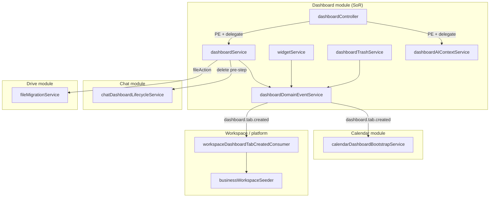

# Dashboard Module — Package 2 Service Boundary Report

**Program:** Dashboard Module Wave 3 — Package 2  
**Date:** 2026-06-21  
**Status:** Implementation complete

---

## 1. Boundary model (post–Package 2)



---

## 2. Service inventory (post–Package 2)

| Service | Canonical? | PE | Activity | Domain events |
|---------|------------|-----|----------|---------------|
| `dashboardService.ts` | **Yes** | Via controller | ✅ | ✅ tab created/deleted |
| `widgetService.ts` | **Yes** | Via controller | ✅ | ✅ widget added/removed |
| `dashboardTrashService.ts` | **Yes** | ✅ | ✅ | ✅ tab deleted (hard) |
| `dashboardActivityService.ts` | **Yes** | — | Emitter | — |
| `dashboardDomainEventService.ts` | **Yes** | — | After activity | Emitter |
| `dashboardAIContextService.ts` | **Yes** | Via controller | — | — |
| `dashboardPolicyDual.ts` | **Yes** | Dual helper | — | — |
| `sidebarCustomizationService.ts` | **Yes** | Via controller | ✅ | — |
| `calendarDashboardBootstrapService.ts` | **Yes** (Calendar) | — | — | Consumer |
| `chatDashboardLifecycleService.ts` | **Yes** (Chat) | — | — | Invoked by Dashboard |
| `dashboardAIContextController.ts` | **Thin** | ✅ | — | — |
| `dashboardController.ts` | **Thin** | ✅ | — | — |

---

## 3. Controller thinning (achieved)

| Controller | Before P2 | After P2 |
|------------|-----------|----------|
| `dashboardController` | Fat delete (file migration switch) | PE + `deleteDashboardWithFiles` |
| `dashboardAIContextController` | PE + Prisma | PE + `dashboardAIContextService` |
| `widgetController` | Thin | Unchanged |
| `sidebarController` | Thin | Unchanged |
| `trashController` | Delegates dashboard_tab | Unchanged (purge emits via trash service) |

---

## 4. Ownership matrix

| Data / behavior | Owner | Dashboard role |
|-----------------|-------|----------------|
| `Dashboard` row | Dashboard | SoR |
| `Widget` row | Dashboard | SoR |
| Sidebar preferences | Dashboard | SoR |
| Personal calendar bootstrap | **Calendar** | Emit `dashboard.tab.created`; subscriber provisions |
| Business workspace seed | **Workspace** | Subscriber calls `seedBusinessWorkspaceResources` |
| File migration on delete | **Drive** | `dashboardService` orchestrates via `fileMigrationService` |
| Conversation cleanup | **Chat** | `prepareDashboardTabDeletion` before row delete |
| AI context bounded reads | **Dashboard** (`dashboardAIContextService`) | No foreign-module Prisma in controller |
| AI cross-module aggregates | **Analytics capability (P3)** | A-02 stub only |
| Module activity | Platform | `dashboardActivityService` |
| Domain events | Platform bus | `dashboardDomainEventService` |

---

## 5. Create path decoupling (M2 + M3)

### Before

```
createDashboard ──┬──► prisma.calendar.create (M2 violation)
                  └──► seedBusinessWorkspaceResources (M3 violation)
```

### After

```
createDashboard ──► prisma.dashboard.create
                 ──► recordDashboardCreated (activity)
                 ──► recordDashboardTabCreatedDomainEvent
                           │
                           ├──► calendarDashboardTabCreatedConsumer (personal)
                           └──► workspaceDashboardTabCreatedConsumer (business)
```

Calendar and workspace work is **asynchronous via in-process domain event bus** (same process, ordered after successful create). Failures in subscribers are logged and do not roll back the dashboard row.

---

## 6. Delete path centralization (M8 + K2-03/K2-04)

### Before

```
dashboardController.deleteDashboard
  ├── fileMigrationService switch
  └── dashboardService.deleteDashboard
        └── conversation.deleteMany (Dashboard-owned Chat data)
```

### After

```
dashboardController.deleteDashboard
  └── dashboardService.deleteDashboardWithFiles
        ├── fileMigrationService (optional fileAction)
        └── dashboardService.deleteDashboard
              ├── widget.deleteMany
              ├── chatDashboardLifecycleService.prepareDashboardTabDeletion
              ├── dashboard.deleteMany
              ├── recordDashboardDeleted (activity)
              └── recordDashboardTabDeletedDomainEvent
```

**K2-04 note:** Conversation cleanup runs **synchronously before** dashboard row delete because `Conversation.dashboardId` is a foreign key. Ownership is Chat module; invocation point remains Dashboard delete orchestration.

---

## 7. AI context extraction (B3 server)

| Endpoint | Controller | Service |
|----------|------------|---------|
| A-01 overview | PE + delegate | `getDashboardOverviewContext` |
| A-02 quick-stats | PE + metadata stub | No Prisma (P3 facade) |
| A-03 widgets | PE + delegate | `getDashboardWidgetsContext` |

All dashboard-scoped Prisma reads for A-01/A-03 live in `dashboardAIContextService.ts`.

---

## 8. Violations closed

| ID | Violation | Closure evidence |
|----|-----------|------------------|
| **DASH-M2** | Calendar in `createDashboard` | Removed; Calendar subscriber |
| **DASH-M3** | Workspace seeder in `createDashboard` | Removed; Workspace subscriber |
| **DASH-M8** | Fat delete controller | `deleteDashboardWithFiles` |
| **DASH-B3 (server)** | Controller Prisma on AI paths | `dashboardAIContextService` |

---

## 9. Remaining boundary work (Package 3)

| Item | Owner |
|------|-------|
| A-02 real aggregates | Analytics capability / `dashboardAnalyticsFacade` |
| Client-side aggregate fetches | Web module consumers |
| **DASH-M4** operation matrix tests | Dashboard + platform test harness |
| Optional: merge trash into `dashboardService` | Engineering preference only — not required |

---

## 10. Readiness contribution

Service boundary alignment contributes **+2** readiness points vs Package 1 exit (~20–21 → **~22–23/27**).
