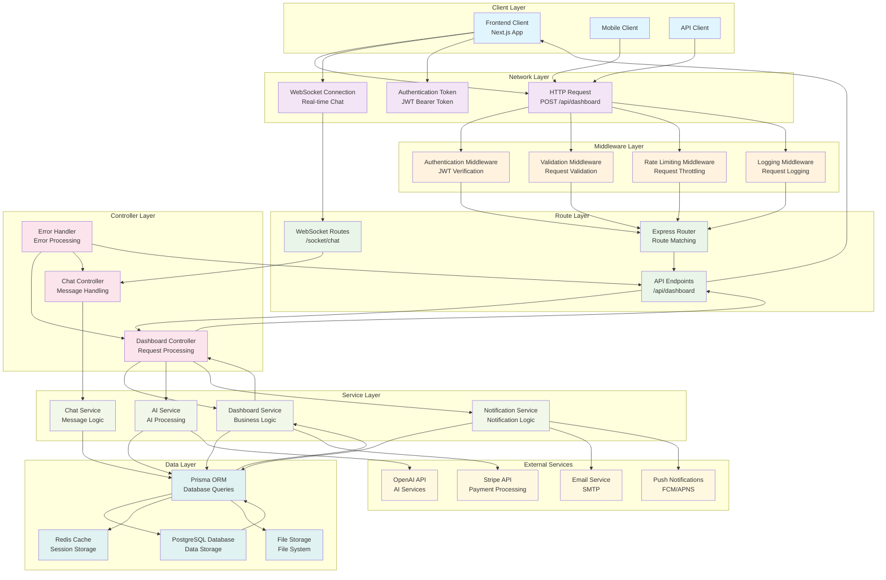
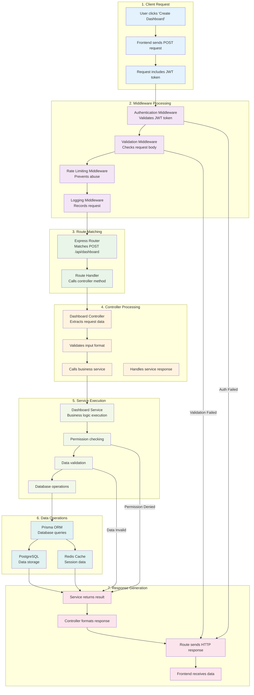
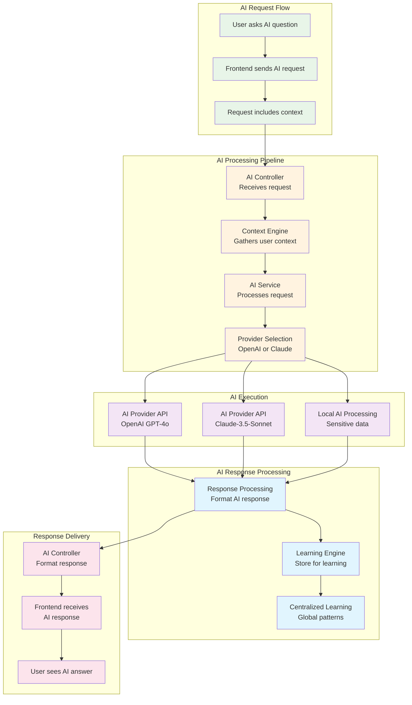
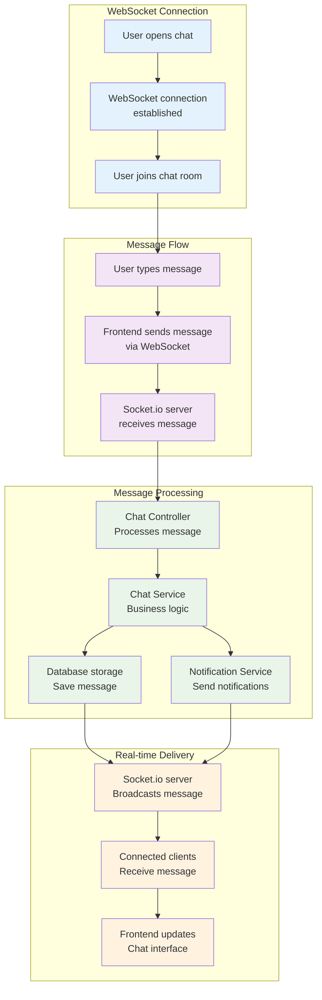
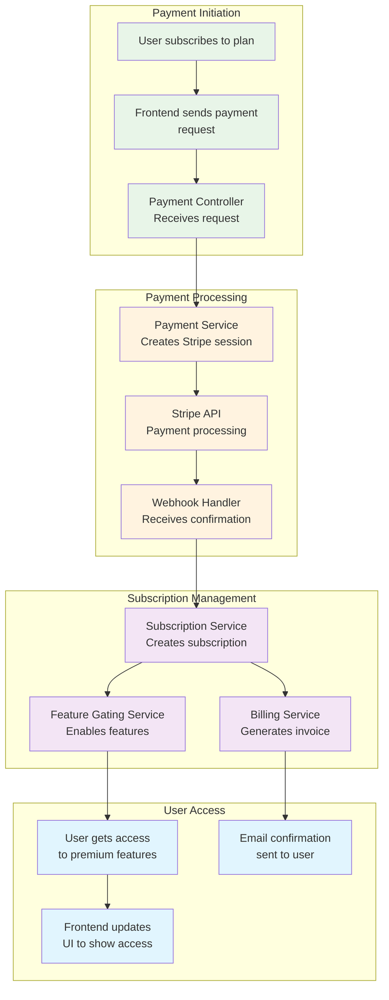
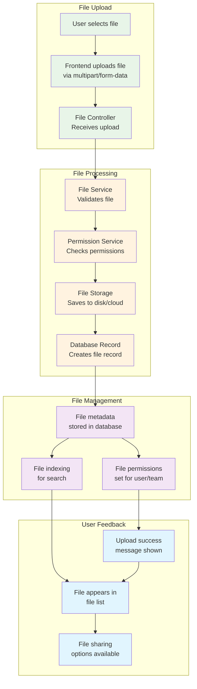

# Block-on-Block Architecture: Request Flow Chart

## 1. Complete Request Flow Chart



## 2. Detailed Request Processing Flow



## 3. AI Service Flow Chart



## 4. Real-time Communication Flow



## 5. Payment Processing Flow



## 6. File Upload Flow



## Key Flow Chart Insights

### **1. Request Flow Pattern**
Every request follows the same pattern:
```
Client → Middleware → Route → Controller → Service → Database → Response
```

### **2. Error Handling**
Errors can occur at any layer and are handled appropriately:
- **Middleware errors**: Authentication, validation failures
- **Controller errors**: Request processing issues
- **Service errors**: Business logic failures
- **Database errors**: Data operation failures

### **3. Real-time vs HTTP**
- **HTTP requests**: Traditional request/response for CRUD operations
- **WebSocket connections**: Real-time bidirectional communication for chat, notifications

### **4. External Service Integration**
- **Stripe**: Payment processing
- **AI Providers**: OpenAI, Claude for AI features
- **Email Services**: Transactional emails
- **Push Notifications**: Mobile notifications

### **5. Caching Strategy**
- **Redis**: Session data, temporary caching
- **Database**: Persistent data storage
- **File System**: File storage and retrieval

These flow charts show how your Block-on-Block platform handles different types of requests and maintains a clean, scalable architecture! 🚀
