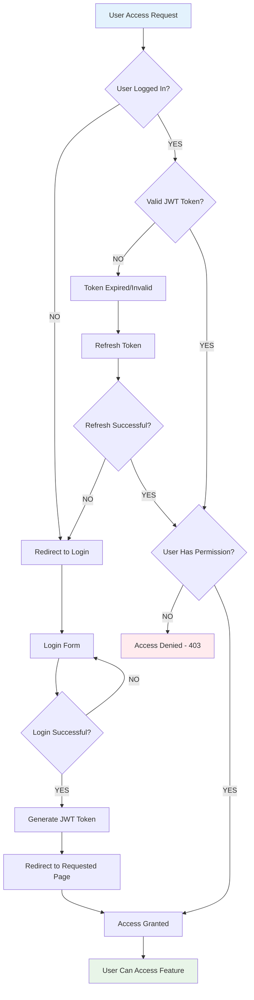
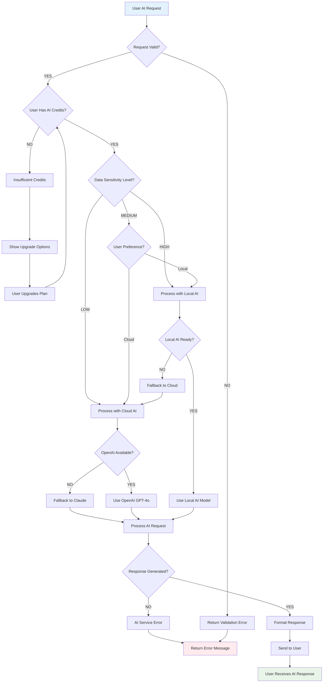
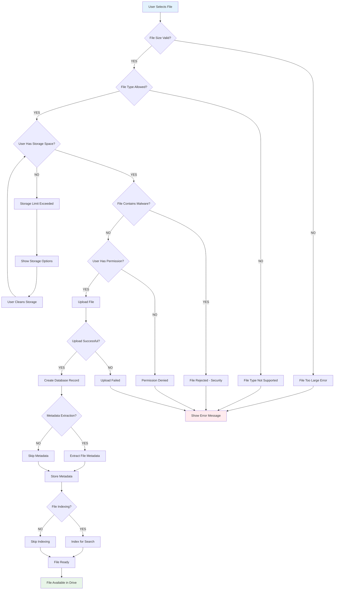
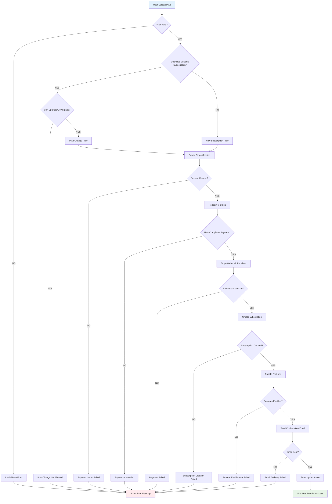
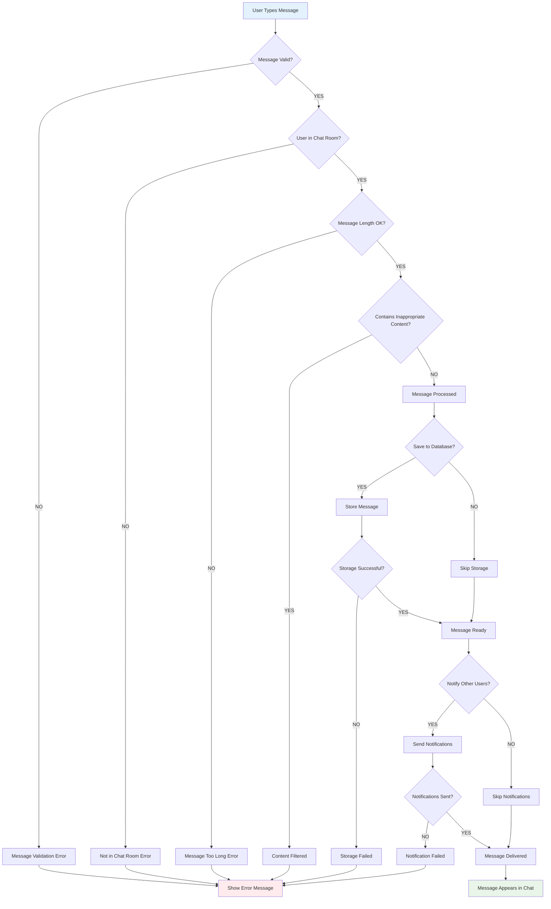
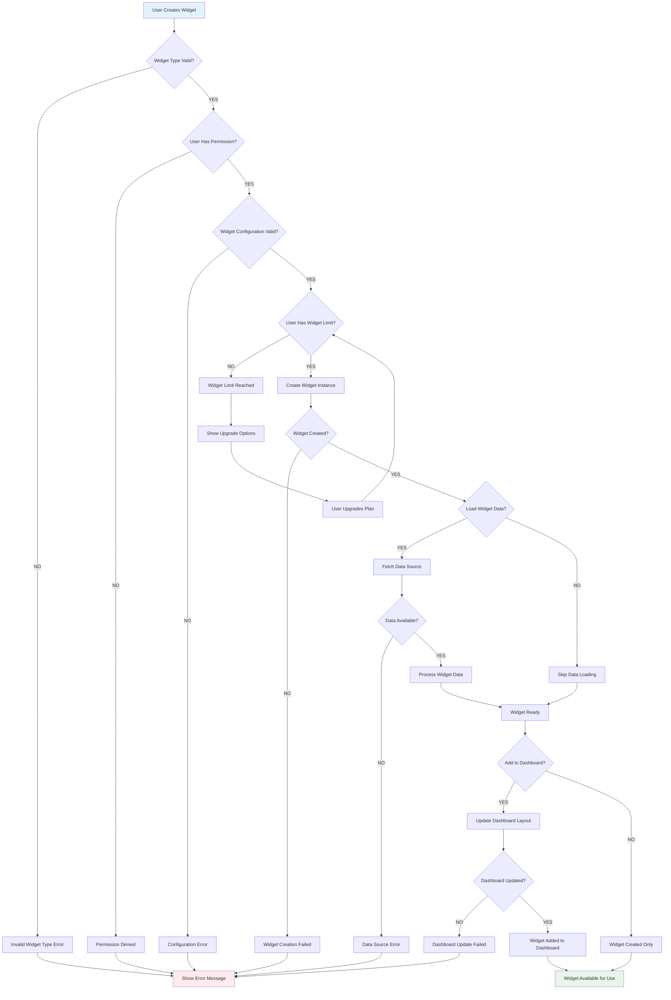
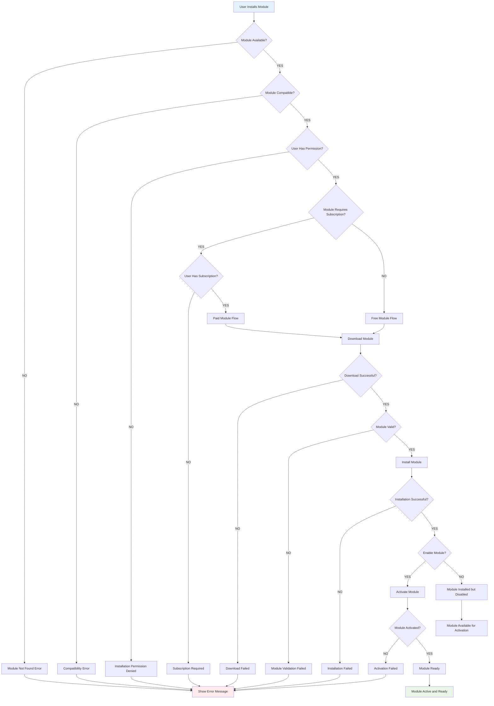
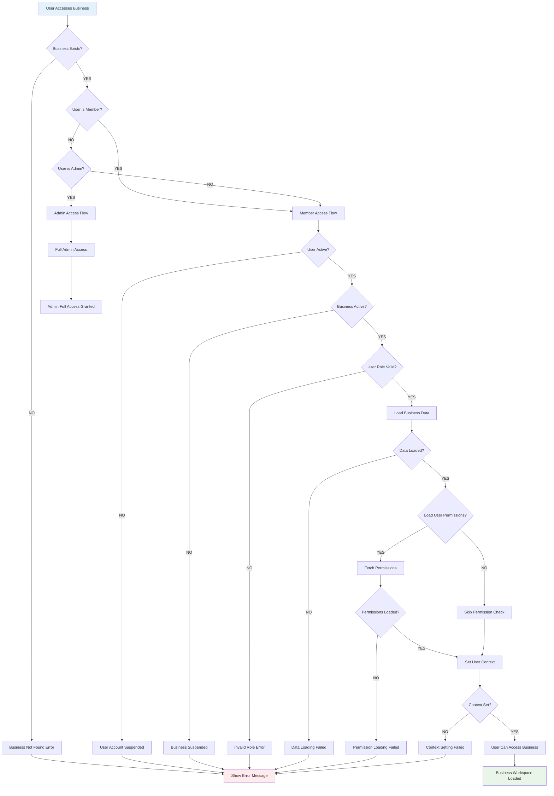

# Block-on-Block: Decision-Based Flow Charts

## 1. User Authentication & Access Flow

## 2. AI Request Processing Flow

## 3. File Upload & Processing Flow

## 4. Payment & Subscription Flow

## 5. Chat Message Processing Flow

## 6. Dashboard Widget Creation Flow

## 7. Module Installation Flow

## 8. Business Workspace Access Flow

## Key Decision Flow Insights

### **1. Error Handling Patterns**
- **Validation errors** at the start of each flow
- **Permission checks** before processing
- **Fallback mechanisms** for failed operations
- **User-friendly error messages** for all failure points

### **2. Success Paths**
- **Green endpoints** indicate successful completion
- **Blue decision points** show key choices
- **Red error paths** show failure scenarios
- **Clear flow direction** from start to finish

### **3. Business Logic Integration**
- **Subscription checks** for premium features
- **Permission validation** for security
- **Resource limits** for scalability
- **External service integration** for functionality

### **4. User Experience Flow**
- **Progressive enhancement** from basic to advanced features
- **Graceful degradation** when services fail
- **Clear feedback** at each decision point
- **Recovery options** when errors occur

These decision flow charts show the **exact paths** users take through your Block-on-Block platform, making it easy to understand the user experience and identify potential issues! 🎯
