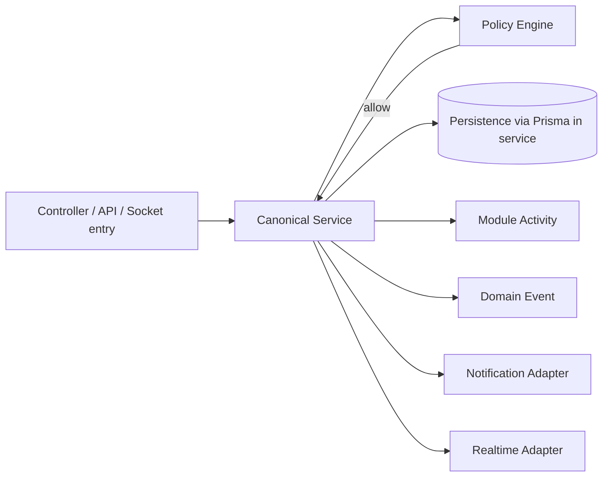
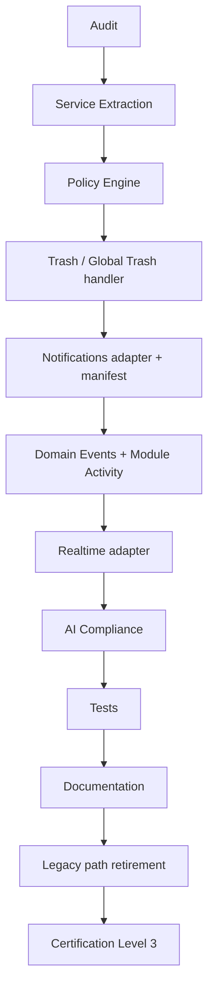

# Module Reference Patterns from File Hub

**Version:** 1.0.0  
**Last updated:** 2026-05-31  
**Status:** Active — mandatory reading for module modernization  
**Module id:** `drive` (product name: **File Hub**)

**Authority:** Implementation patterns extracted from FH-6 Reference Implementation. Constitutional requirements remain in [`VSSYL_PLATFORM_STANDARDS_AND_MODULE_CONTRACT.md`](../architecture/VSSYL_PLATFORM_STANDARDS_AND_MODULE_CONTRACT.md).

**Related:** [`CERTIFICATION_LEDGER.md`](../architecture/CERTIFICATION_LEDGER.md), [`PLATFORM_MODULE_MODERNIZATION_ROADMAP.md`](../plans/PLATFORM_MODULE_MODERNIZATION_ROADMAP.md), [`MODULE_DEVELOPMENT_GUIDE.md`](./MODULE_DEVELOPMENT_GUIDE.md), [`FILE_HUB_REFERENCE_IMPLEMENTATION_REVIEW.md`](../architecture/audits/FILE_HUB_REFERENCE_IMPLEMENTATION_REVIEW.md)

---

## Introduction

File Hub is the **first certified Vssyl module** at **Reference Implementation** level (see certification ledger). Before inventing new module architecture, **copy these patterns**.

This guide is a **pattern catalog**, not a feature spec. It answers: “How did File Hub satisfy the Runtime Kernel without drift?”

**Rules of use:**

1. **Copy before inventing** — new services should mirror naming and responsibility splits (`{module}{Concern}Service.ts`).
2. **Constitutional law wins** — if a pattern here conflicts with Platform Standards, Standards prevail.
3. **Document equivalents** — if a module must diverge (e.g. Analytics pseudo-module), record rationale in the module audit.

---

## Pattern 1 — Canonical Service Boundary

### Flow



### Responsibility ownership

| Layer | Owns | Must NOT own |
|-------|------|--------------|
| **Controller / route** | HTTP parsing, `req.user`, DTO validation, call service, status codes | Business rules, Prisma, events, notifications |
| **Canonical service** | Authorization prelude, transactions, persistence, side-effect ordering | HTTP response shaping |
| **Policy Engine** | Allow/deny for action + resource | Persistence |
| **Notification adapter** | Recipients, payload, self-suppress | Authorization |
| **Realtime adapter** | Channel fan-out | Authorization |
| **Domain event emitter** | Taxonomy-compliant payload | HTTP |

### Mutation order (inside service, after PE allow)

1. Validate inputs and tenancy (`dashboardId`, `businessId`, `householdId` as applicable)  
2. Persist (transaction)  
3. `emitModuleActivityEvent` (success only)  
4. `emitDomainEvent`  
5. Notification adapter  
6. Realtime adapter  
7. V_Link lifecycle (on delete/trash if applicable)  
8. Storage cleanup (async where appropriate)

### File Hub examples

| Concern | Service |
|---------|---------|
| Delete / trash / restore | `server/src/services/driveDeleteService.ts` |
| Upload / create file | `server/src/services/driveUploadService.ts` |
| Share / permissions | `server/src/services/driveFileShareService.ts` |
| Browse / search / AI reads | `server/src/services/driveVisibilityService.ts` |

### Anti-patterns

- Controller calls `prisma.*.create/update/delete` then emits events in catch-all `try/finally`.
- AI tool calls Prisma directly (`toolExecutor` task/file create — **forbidden**).
- Socket handler mutates DB without service + PE.
- Domain event subscriber mutates authoritative state (except idempotent derived writes).

---

## Pattern 2 — Thin Controllers

### Belongs in controllers

- Extract authenticated user; return 401 if missing.
- Parse and validate request body/query (Zod, express-validator, or typed guards).
- Map service result to HTTP response / error codes.
- Delegate all branching business logic to services.

### Does NOT belong in controllers

| Forbidden | Why |
|-----------|-----|
| `prisma.*` | §16 — bypasses PE, events, audit |
| Business rules (ownership, share semantics) | Untestable; duplicated in AI/socket paths |
| `NotificationService.createNotification` | Belongs in `*NotificationService` |
| `emitModuleActivityEvent` / `emitDomainEvent` | Belongs in canonical service after successful mutation |
| V_Link unlink logic | Belongs in `*VlinkLifecycleService` |

### File Hub evidence

- FH-6: `fileController.ts` / `folderController.ts` delegate delete/share/upload to services.
- **Anti-example (do not copy):** `chatController.ts` (~1,663 lines, ~41 Prisma calls) — modernization target.

### Acceptance check

> Count `prisma.` imports in controller file. Target: **zero** for mutation paths.

---

## Pattern 3 — Canonical Delete Lifecycle

### Sequence

```
Policy Engine (evaluate*PolicyDual)
  → Canonical delete service
  → Database (trashedAt soft trash OR hard delete)
  → Module Activity
  → Domain Event
  → Notification adapter
  → Realtime adapter
  → V_Link lifecycle (restrict on soft trash; unlink on hard delete)
  → Storage cleanup (hard delete / empty trash)
```

### File Hub reference

`server/src/services/driveDeleteService.ts`:

- `softTrashDriveItem` — sets `trashedAt`, notifies collaborators, broadcasts realtime  
- `restoreDriveItem` — clears `trashedAt`, restore notifications  
- `permanentlyDeleteDriveItem` — hard delete + `unlinkDriveEntityFromAllVLinks`  
- `emptyDriveTrash` — owner empty-trash with PE

Imports illustrate side-effect ordering: PE → persist → activity → domain event → notification helpers → realtime → V_Link lifecycle.

### Global Trash integration

- Service implements **module operations**; platform **`trashController`** orchestrates cross-module trash UI.
- Register handler in `server/src/startup/registerGlobalTrashHandlers.ts` (drive template).

### Anti-patterns

- Module-only `/api/{module}/trash` endpoints without Global Trash handler (deprecated drive wrappers — do not add new ones).
- Hard delete without V_Link unlink when entity was linkable.
- Emitting activity/events before DB commit succeeds.

---

## Pattern 4 — Visibility Service Pattern

### Model

Reads must compose three lenses:

1. **Owned** — user/dashboard scope  
2. **Shared** — explicit grants (file permissions, conversation membership, calendar ACLs, etc.)  
3. **Policy Engine** — fail-closed filter on each candidate row for `*_READ` actions  

### Why not raw Prisma in controllers?

- AI context providers and search will **over-fetch** and leak rows.
- Business vs personal context requires consistent `dashboardId` + `businessId` scoping.
- PE rollout stays centralized in one service API (`listAccessible*`, `validateAccessible*Ids`).

### File Hub reference

`server/src/services/driveVisibilityService.ts`:

- `listAccessibleDriveFiles` — browse + AI grounding  
- `validateAccessibleFileIds` — batch ID checks for tools  
- Uses `evaluateDrivePolicyDual` per item where required (FH-4 search parity)

### Module template

```typescript
// Naming convention (illustrative)
export async function listAccessibleChatConversations(input: { userId: string; dashboardId: string }) { ... }
export async function validateAccessibleConversationIds(input: { userId: string; ids: string[] }) { ... }
```

### Anti-patterns

- `prisma.conversation.findMany({ where: { participantIds: { has: userId } } })` in controller without PE.
- Search endpoint returning all rows in dashboard without permission filter.

---

## Pattern 5 — Global Trash Pattern

### Principles

- **Global Trash is platform infrastructure** (`server/src/controllers/trashController.ts`).
- Modules **participate** via registered handlers; modules **do not own** a parallel trash system.
- Field standard: **`trashedAt`** (not module-specific `deletedAt`).

### Registration checklist

1. Implement in delete service: `softTrash`, `restore`, `permanentDelete`, `emptyModuleTrash`.  
2. Call `registerGlobalTrashModuleHandler({ moduleId, moduleName, supportedTypes, ... })` at startup.  
3. Declare `trash: true` in manifest only when handler exists.  
4. Module trash **views** filter platform trash API by `moduleId` — not separate persistence.

### File Hub reference

- Handler: `server/src/startup/registerGlobalTrashHandlers.ts` (module `drive`, types `file`, `folder`)  
- Visibility-aware trashed list: `driveVisibilityService` + Global Trash list API  

### Anti-patterns

- Notes-style historical `deletedAt` only (migrate to `trashedAt` + handler).  
- Manifest `trash: true` with no handler (current gap: chat, calendar, todo, notes).

---

## Pattern 6 — Notification Adapter Pattern

### Responsibilities (`driveNotificationService.ts`)

| Responsibility | Detail |
|----------------|--------|
| **Recipient calculation** | Owner + collaborators with share/membership; exclude actor when appropriate |
| **Self-notify suppression** | Never notify user of their own benign action unless product requires |
| **Payload generation** | Stable `data` shape for `notifications/page.tsx` deep links |
| **NotificationService integration** | Only `NotificationService.createNotification` — not raw DB notification rows |

### Types

- Prefix: `[module]_[event]` (e.g. `drive_permission`, `drive_item_restored`, `drive_item_deleted`).  
- Manifest: full `notifications[]` metadata in `builtInModuleManifests.ts` (drive is complete; chat is not).

### File Hub reference

`server/src/services/driveNotificationService.ts` — imported by `driveDeleteService` for trash/restore/delete paths.

### Anti-patterns

- Controller calls `NotificationService` directly.  
- Manifest declares `notifications: true` with empty `notifications[]` array.  
- Notifying all dashboard members instead of collaborators.

---

## Pattern 7 — Domain Event Pattern

### Ownership

| Rule | Detail |
|------|--------|
| **Emit from** | Canonical services only, after successful mutation |
| **Register in** | `server/src/events/domainEventRegistry.ts` |
| **Emit via** | `server/src/events/domainEventEmitters.ts` helpers |
| **Never emit from** | Controllers, AI executors, UI, raw socket handlers |

### Naming

- Taxonomy: `{module}.{entity}.{verb}` — e.g. `file.deleted`, `chat.message.sent`, `calendar.event.created`.  
- Add registry entry **before** emitter ships.

### Lifecycle

- Soft trash → event reflects trash, not delete.  
- Hard delete → distinct event; subscribers may archive analytics.  
- Failed PE → **no event**.

### File Hub coverage

Full file/folder lifecycle in registry; emitters wired from delete/share/upload services (see FH reference review).

### Anti-patterns

- Emitting in controller “for logging” on failed transactions.  
- Using domain events as module activity feed substitute (feeds use module activity envelope).

---

## Pattern 8 — Module Activity Pattern

### Requirements

- Use `emitModuleActivityEvent` from `server/src/services/moduleActivityService.ts`.  
- Emit **only after successful** authorized mutations (same transaction boundary as domain events).  
- Normalized envelope per `memory-bank/moduleSpecs.md`.  
- **Activity ≠ analytics** — do not store partner analytics in activity log.

### Relationship to domain events

| Mechanism | Audience | Purpose |
|-----------|----------|---------|
| **Module Activity** | User-visible feeds, AI ambient context | What the user did in module UX |
| **Domain Events** | Platform subscribers, automation | Cross-module reactions |

Both may fire for one mutation; payloads differ.

### File Hub state

- **Writes:** normalized (FH-4/6).  
- **Reads:** some endpoints still merge legacy `prisma.activity` (platform-wide P2 — not a license to skip write normalization).

### Common mistakes

- Emitting on 403/404 paths.  
- Controller-only activity without service migration.  
- Duplicating full message body in activity when reference ID suffices.

---

## Pattern 9 — Realtime Pattern

### Layering

```
Canonical Service
  → Realtime Adapter (driveRealtimeService)
  → Socket Layer (chatSocketService.broadcastDriveEvent)
```

### Rules

- **Sockets transport; services decide.** Socket layer does not run PE or Prisma mutations.  
- Fan-out to **owner + collaborators** who passed visibility rules.  
- Realtime must match manifest `realtime: true`.

### File Hub reference

- `server/src/services/driveRealtimeService.ts`  
- Transport: `server/src/services/chatSocketService.ts` (`broadcastDriveEvent`)  

### Anti-patterns

- Socket `on('message')` handler that creates DB rows without calling `chatMessageService`.  
- Broadcasting to room without membership verification (tenant leak risk).

---

## Pattern 10 — Policy Engine Pattern

### PolicyDual approach

File Hub uses **dual enforcement** during PE rollout:

- `server/src/auth/drivePolicyDual.ts` — `evaluateDrivePolicyDual`  
- Legacy permission helpers + PE `authorize()` for same action  
- **Blocked** if either layer denies (fail closed)

### Migration strategy (per module)

1. Inventory privileged actions (create, update, delete, share, trash, restore).  
2. Add actions to `server/src/auth/policyActions.ts` and handlers in `policyEngine.ts`.  
3. Implement `{module}PolicyDual.ts`.  
4. Call dual evaluator at **start** of each canonical service mutation.  
5. Remove legacy-only checks from controllers once parity tests pass.

### Authorization lifecycle

```
authenticate → build PolicyInput → authorize / evaluate*PolicyDual
  → deny: return 403, no side effects
  → allow: service mutation pipeline
```

### File Hub evidence

- Mutations in `driveDeleteService`, `driveUploadService`, `driveFileShareService` call `evaluateDrivePolicyDual` before persist.

### Anti-patterns

- New routes with only `if (role === 'ADMIN')` in controller.  
- PE check after Prisma write.  
- Org-chart middleware as sole gate for module routes (parallel model — adapt to PE per §0).

---

## Pattern 11 — V_Link Pattern

### Components

| Component | File Hub service | Role |
|-----------|------------------|------|
| **Access** | `driveVlinkAccessService.ts` | Resolver delegation; membership ≠ content access; `canRead` / `canWrite` |
| **Lifecycle** | `driveVlinkLifecycleService.ts` | Unlink on hard delete; degraded state on soft trash |

### Delete integration

- Soft trash → link may show **restricted** in V_Link UI.  
- Hard delete / permanent delete → `unlinkDriveEntityFromAllVLinks` (and folder tree variant).

### Restore integration

- Restore from trash → access service re-evaluates; links may become accessible again without re-creating links.

### Module adoption checklist

1. Register entity types in `platformEntityRegistry.ts` + manifest `entities[]`.  
2. Wire `vlinkEntityResolverService` to module access adapter.  
3. Do not declare `vlink: true` until resolver works (enum wider than resolver is a platform risk).

### Reference audit

[`FILE_HUB_VLINK_COMPLIANCE.md`](../architecture/audits/FILE_HUB_VLINK_COMPLIANCE.md)

---

## Pattern 12 — AI Compliance Pattern

### Rule

```
AI orchestrator / tools / ActionExecutor
  → Canonical Service
  → NEVER direct Prisma for domain mutations
```

### Rationale

- AI **inherits** user permissions via PE inside services.  
- AI does **not** bypass architecture for “convenience.”  
- Same path for HTTP and AI ensures one audit trail.

### File Hub examples

| Path | Implementation |
|------|----------------|
| Read files | `driveVisibilityService` in context providers |
| Upload / save | `driveUploadService.createDriveFile` |
| Share tool | `share_file` → `driveFileShareService` |

### Known violations to fix platform-wide

- `server/src/ai/tools/toolExecutor.ts` — direct `prisma.task.create`  
- `server/src/ai/core/ActionExecutor.ts` — embedded Prisma per module  

### Anti-patterns

- New AI tool that accepts raw SQL or unscoped `prisma.findMany`.  
- Context provider returning rows not passed through visibility service.

---

## Pattern 13 — Platform Entity Pattern

### Registration

1. **`platformEntityRegistry.ts`** — `PlatformEntityDescriptor` (type, moduleId, trash/search/vlink flags).  
2. **Manifest `entities[]`** — display names, `vlinkEntityType`, capability flags.  
3. **V_Link** — `vlinkEntityType` aligns with resolver.

### File Hub example (`builtInModuleManifests.ts` case `drive`)

```typescript
entities: [
  { type: 'file', displayName: 'File', vlinkEntityType: 'FILE', supportsTrash: true, supportsSearch: true },
  { type: 'folder', displayName: 'Folder', vlinkEntityType: 'FOLDER', supportsTrash: true, supportsSearch: true },
],
```

### Capability alignment

Entity capabilities must match manifest `capabilities` object (trash, search, vlink).

See [`PLATFORM_ENTITY_MODEL.md`](../architecture/PLATFORM_ENTITY_MODEL.md).

---

## Pattern 14 — Capability Matrix Pattern

### Authoring manifests

Source: `server/src/startup/builtInModuleManifests.ts` — **drive** is the reference shape:

- `permissions[]` — coarse module permissions  
- `capabilities` — `read`, `write`, `ai`, `vlink`, `trash`, `realtime`, `notifications`, `search`, `businessWorkspace`, `globalActivity`  
- `routes[]` — workspace navigation  
- `entities[]` — when linkable/trashable  
- `notifications[]` — when `notifications: true`  

### Validation rules

| Declaration | Requires |
|-------------|----------|
| `trash: true` | Global Trash handler + `trashedAt` |
| `vlink: true` | Access + lifecycle services + resolver |
| `realtime: true` | Realtime adapter + safe socket fan-out |
| `notifications: true` | `notifications[]` metadata + adapter |
| `ai: true` | Context providers + service-backed writes |
| `search: true` | Permission-aware search/provider |

### Reconcile on startup

`registerBuiltInModulesOnStartup` should upsert full manifest (Platform Standards §30) — avoid `seed*Module.ts` drift.

---

## Pattern 15 — Module Certification Pattern

End-to-end process for Wave modules (see [`CERTIFICATION_LEDGER.md`](../architecture/CERTIFICATION_LEDGER.md)).



| Step | Outputs |
|------|---------|
| **Audit** | `{MODULE}_CONSTITUTIONAL_AUDIT.md`, operation matrix |
| **Service extraction** | `{module}*Service.ts`, thin controllers |
| **Policy Engine** | `{module}PolicyDual.ts`, tests for deny paths |
| **Trash** | Handler in `registerGlobalTrashHandlers.ts` |
| **Notifications** | `{module}NotificationService.ts`, manifest block |
| **Events** | Registry entries + service emitters |
| **AI compliance** | Tools/executor route through services |
| **Tests** | Service unit + integration tests |
| **Documentation** | Audit linked in certification ledger |
| **Certification** | Ledger matrix row → Level 3 |

**Level 4 (Reference Implementation)** — only after Level 3 + architecture council review (File Hub FH-6 model).

---

## Quick reference — File Hub file map

| Pattern | Primary files |
|---------|---------------|
| Service boundary | `driveDeleteService.ts`, `driveUploadService.ts`, `driveFileShareService.ts` |
| Visibility | `driveVisibilityService.ts` |
| Notifications | `driveNotificationService.ts` |
| Realtime | `driveRealtimeService.ts`, `chatSocketService.ts` |
| V_Link | `driveVlinkAccessService.ts`, `driveVlinkLifecycleService.ts` |
| PE | `drivePolicyDual.ts`, `policyEngine.ts` |
| Trash registration | `registerGlobalTrashHandlers.ts` |
| Manifest | `builtInModuleManifests.ts` (`case 'drive'`) |
| Entity registry | `platformEntityRegistry.ts` |

---

## Document maintenance

| Trigger | Action |
|---------|--------|
| File Hub architectural change | Update affected pattern section |
| New pattern from another Level 4 module | Add pattern with approval |
| Conflicting Platform Standards update | Align guide; Standards win |

---

*Copy these patterns before inventing new module architecture.*
