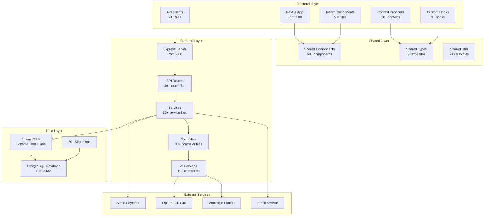
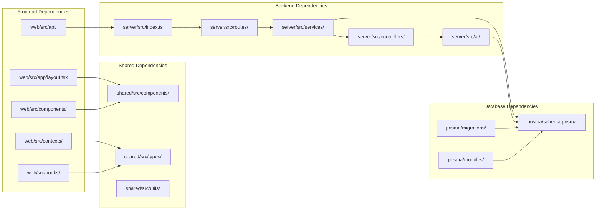
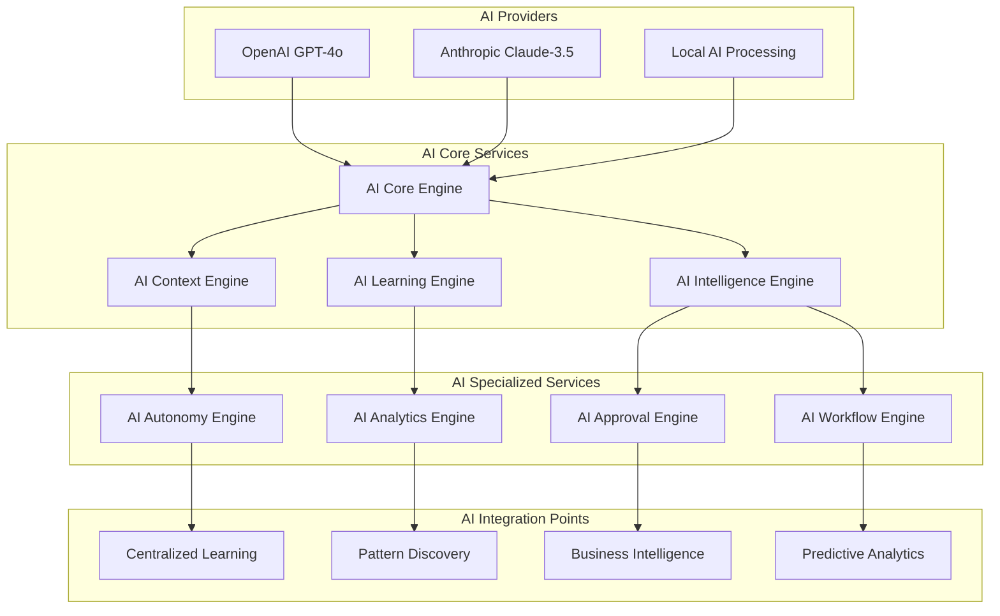
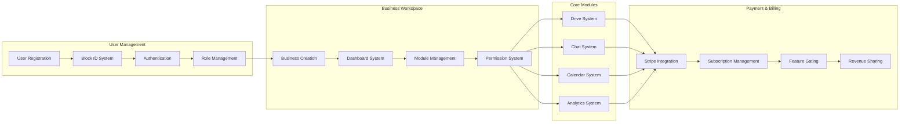
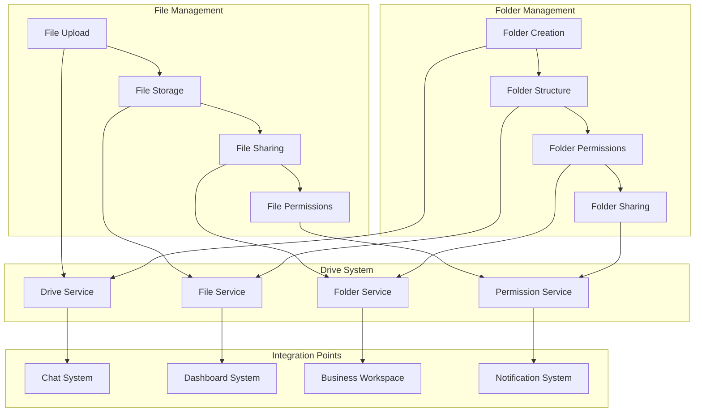
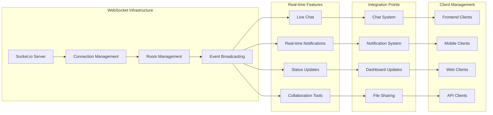
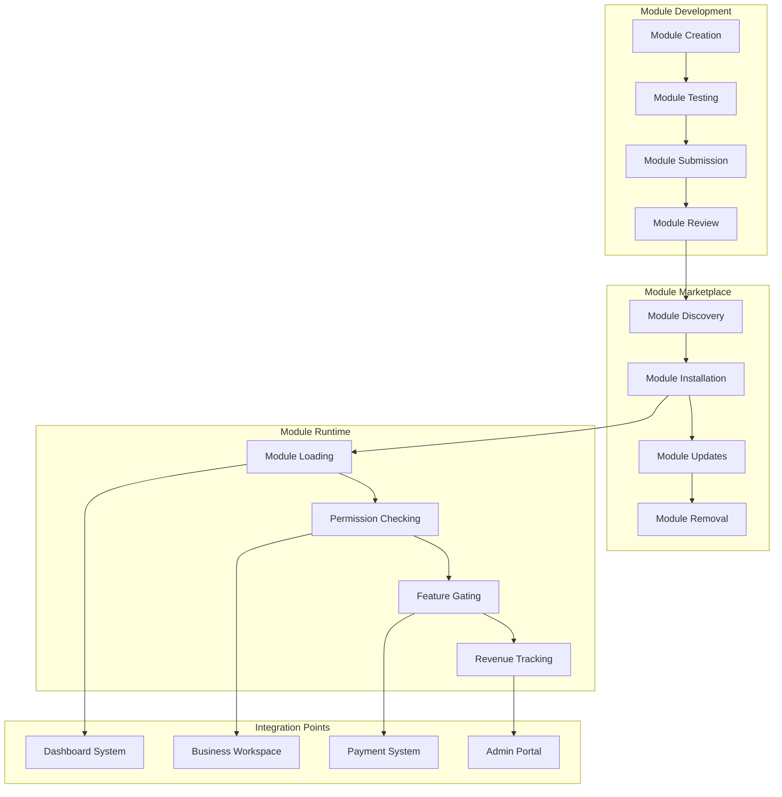
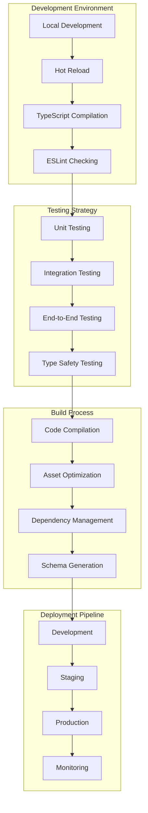
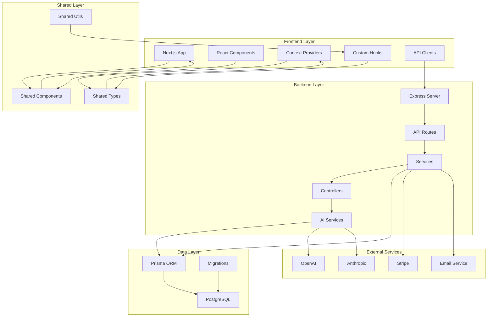

# Block-on-Block System Architecture: Visual Diagrams

## 1. High-Level System Architecture

## 2. File Dependencies & Connections

## 3. AI System Architecture

## 4. Business System Architecture

## 5. File System Architecture

## 6. Real-time Communication Architecture

## 7. Module System Architecture

## 8. Security & Compliance Architecture

```mermaid
graph LR
    subgraph "Authentication"
        A1[NextAuth.js]
        A2[JWT Tokens]
        A3[OAuth Providers]
        A4[Multi-Factor Auth]
    end
    
    subgraph "Authorization"
        B1[Role-Based Access]
        B2[Permission System]
        B3[Feature Gating]
        B4[Module Permissions]
    end
    
    subgraph "Data Protection"
        C1[Data Encryption]
        C2[Input Validation]
        C3[SQL Injection Prevention]
        C4[XSS Protection]
    end
    
    subgraph "Compliance"
        D1[GDPR Compliance]
        D2[Audit Logging]
        D3[Data Retention]
        D4[Privacy Controls]
    end
    
    A1 --> A2
    A2 --> A3
    A3 --> A4
    
    A4 --> B1
    B1 --> B2
    B2 --> B3
    B3 --> B4
    
    B4 --> C1
    C1 --> C2
    C2 --> C3
    C3 --> C4
    
    C4 --> D1
    D1 --> D2
    D2 --> D3
    D3 --> D4
```

## 9. Development Workflow Architecture

## 10. Complete System Integration Map

## Key Architectural Principles

### 1. **Separation of Concerns**
- Frontend, Backend, and Shared layers are clearly separated
- Each layer has specific responsibilities and dependencies
- Clean interfaces between layers

### 2. **Modular Design**
- AI services are organized into logical domains
- Business logic is separated into focused services
- Components are reusable across the application

### 3. **Type Safety**
- 100% TypeScript implementation
- Shared types ensure consistency across layers
- Compile-time error detection

### 4. **Real-time Capabilities**
- WebSocket infrastructure for live updates
- Event-driven architecture for scalability
- Efficient connection management

### 5. **Security First**
- JWT-based authentication
- Role-based access control
- Comprehensive audit logging
- Privacy and compliance features

### 6. **Scalability**
- Stateless API design
- Horizontal scaling support
- Efficient database queries
- CDN integration for static assets

This architecture provides a solid foundation for a comprehensive digital workspace platform that can scale from individual users to enterprise organizations while maintaining security, performance, and maintainability.
